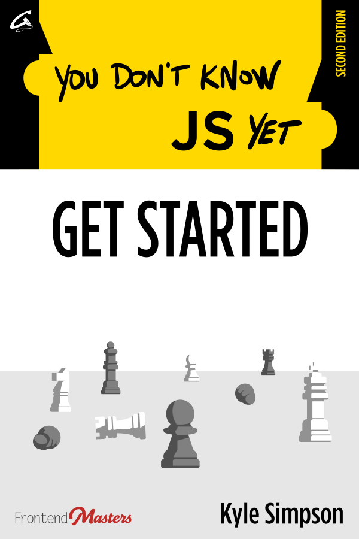
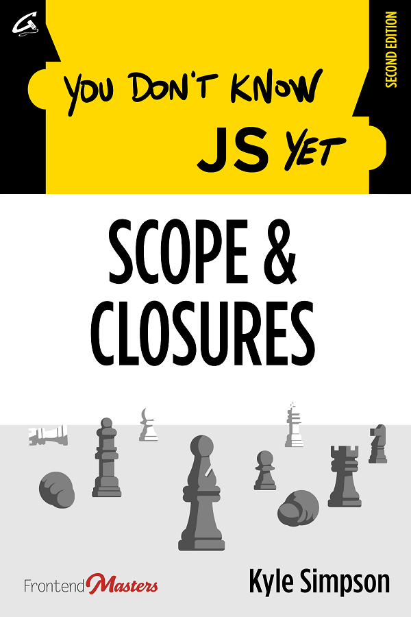

# You Don't Know JS Yet (book series) - 2nd Edition
<!-- what a wonderful books :: Fahmy -->
::what a wonderful books :: Fahmy << Fahmy >>
This is a series of books diving deep into the core mechanisms of the JavaScript language. This is the **second edition** of the book series:

&nbsp;&nbsp;
&nbsp;&nbsp;

**To read more about the motivations and perspective behind this book series, check out the [Preface](preface.md).**

If you're looking for the previous **first edition** books, [they can be found here](https://github.com/getify/You-Dont-Know-JS/blob/1st-ed/README.md).

## Titles

I recommend reading the **second edition** books in this order:

* [Get Started](get-started/README.md) | [Buy on Leanpub](https://leanpub.com/ydkjsy-get-started) | [Buy on Amazon](https://www.amazon.com/dp/B084BNMN7T)
* [Scope & Closures](scope-closures/README.md) | [Buy on Leanpub](https://leanpub.com/ydkjsy-scope-closures) | [Buy on Amazon](https://www.amazon.com/dp/B08634PZ3N)
* "The Unbooks" (ebook) | [Buy on Leanpub](https://leanpub.com/ydkjsy-unbooks) | [Buy on Amazon](https://www.amazon.com/dp/B0F7H1DN5S)
  * [Objects & Classes](objects-classes/README.md) (draft stable)
  * [Types & Grammar](types-grammar/README.md) (rough draft)
  * ~~Sync & Async (canceled)~~
  * ~~ES.Next & Beyond (canceled)~~

If you're looking for the previous **first edition** books, [they can be found here](https://github.com/getify/You-Dont-Know-JS/blob/1st-ed/README.md).

## Publishing

As always, you'll be able to read these books online here entirely for free.

This edition of the books is being self-published through [GetiPub](https://geti.pub) publishing. The published books will be made available for sale through normal book retail sources.

If you'd like to contribute financially towards the effort (or any of my other OSS efforts) aside from purchasing the published books, please consider these options:

* [Github Sponsorship](https://github.com/users/getify/sponsorship)
* [Patreon](https://www.patreon.com/getify)
* [Paypal](https://www.paypal.me/getify)

## Contributions

This book series is now complete, and is **not open to further contributions**.

Thank you to those who've been part of the 11 years journey of this book series.

## Thank You To These Wonderful Sponsors

**The first two books of the second edition** are exclusively sponsored by **[Frontend Masters](https://frontendmasters.com/?code=simpson)**.

Frontend Masters is the gold standard for top-of-the-line expert training material in frontend-oriented software development. With over 150 courses on all things frontend, this should be your first and only stop for quality video training on HTML, CSS, JS, and related technologies.

**Note:** I teach [all my workshops](https://frontendmasters.com/teachers/kyle-simpson?code=simpson) exclusively through Frontend Masters. If you like this book content, please check out my video training courses.

I want to extend a warm and deep thanks to Marc Grabanski and the entire Frontend Masters team, not only for their excellent work with the video training platform, but for their unwavering support of me and of the "You Don't Know JS" books!

----

## License & Copyright

The materials herein are all &copy; 2019-2025 Kyle Simpson.

 This work is licensed under a <a rel="license" href="http://creativecommons.org/licenses/by-nc-nd/4.0/">Creative Commons Attribution-NonCommercial-NoDerivs 4.0 Unported License</a>.
