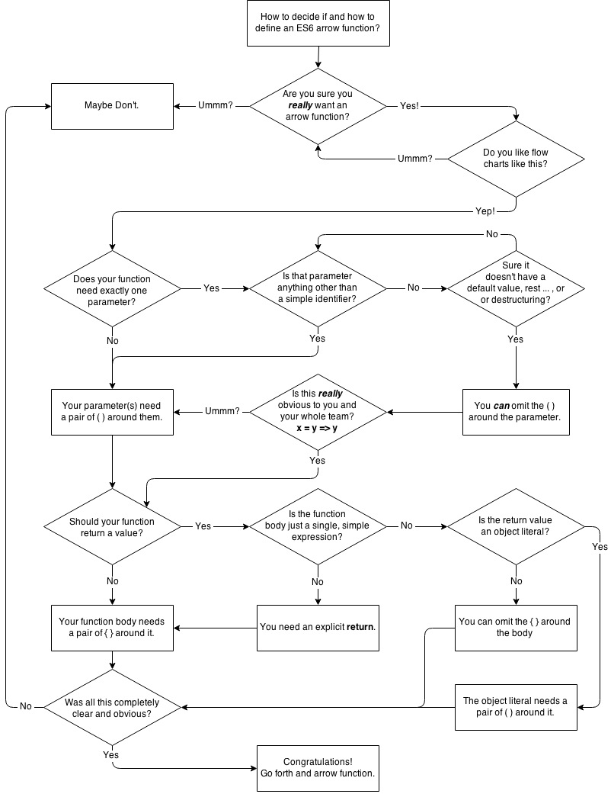

# You Don't Know JS: ES6 & Beyond
# Chapter 2: Syntax

If you've been writing JS for any length of time, odds are the syntax is pretty familiar to you. There are certainly many quirks, but overall it's a fairly reasonable and straightforward syntax that draws many similarities from other languages.

However, ES6 adds quite a few new syntactic forms that take some getting used to. In this chapter, we'll tour through them to find out what's in store.

**Tip:** At the time of this writing, some of the features discussed in this book have been implemented in various browsers (Firefox, Chrome, etc.), but some have only been partially implemented and many others have not been implemented at all. Your experience may be mixed trying these examples directly. If so, try them out with transpilers, as most of these features are covered by those tools. ES6Fiddle (http://www.es6fiddle.net/) is a great, easy-to-use playground for trying out ES6, as is the online REPL for the Babel transpiler (http://babeljs.io/repl/).

## Block-Scoped Declarations

You're probably aware that the fundamental unit of variable scoping in JavaScript has always been the `function`. If you needed to create a block of scope, the most prevalent way to do so other than a regular function declaration was the immediately invoked function expression (IIFE). For example:

```js
var a = 2;

(function IIFE(){
	var a = 3;
	console.log( a );	// 3
})();

console.log( a );		// 2
```

### `let` Declarations

However, we can now create declarations that are bound to any block, called (unsurprisingly) *block scoping*. This means all we need is a pair of `{ .. }` to create a scope. Instead of using `var`, which always declares variables attached to the enclosing function (or global, if top level) scope, use `let`:

```js
var a = 2;

{
	let a = 3;
	console.log( a );	// 3
}

console.log( a );		// 2
```

It's not very common or idiomatic thus far in JS to use a standalone `{ .. }` block, but it's always been valid. And developers from other languages that have *block scoping* will readily recognize that pattern.

I believe this is the best way to create block-scoped variables, with a dedicated `{ .. }` block. Moreover, you should always put the `let` declaration(s) at the very top of that block. If you have more than one to declare, I'd recommend using just one `let`.

Stylistically, I even prefer to put the `let` on the same line as the opening `{`, to make it clearer that this block is only for the purpose of declaring the scope for those variables.

```js
{	let a = 2, b, c;
	// ..
}
```

Now, that's going to look strange and it's not likely going to match the recommendations given in most other ES6 literature. But I have reasons for my madness.

There's another experimental (not standardized) form of the `let` declaration called the `let`-block, which looks like:

```js
let (a = 2, b, c) {
	// ..
}
```

That form is what I call *explicit* block scoping, whereas the `let ..` declaration form that mirrors `var` is more *implicit*, as it kind of hijacks whatever `{ .. }` pair it's found in. Generally developers find *explicit* mechanisms a bit more preferable than *implicit* mechanisms, and I claim this is one of those cases.

If you compare the previous two snippet forms, they're very similar, and in my opinion both qualify stylistically as *explicit* block scoping. Unfortunately, the `let (..) { .. }` form, the most *explicit* of the options, was not adopted in ES6. That may be revisited post-ES6, but for now the former option is our best bet, I think.

To reinforce the *implicit* nature of `let ..` declarations, consider these usages:

```js
let a = 2;

if (a > 1) {
	let b = a * 3;
	console.log( b );		// 6

	for (let i = a; i <= b; i++) {
		let j = i + 10;
		console.log( j );
	}
	// 12 13 14 15 16

	let c = a + b;
	console.log( c );		// 8
}
```

Quick quiz without looking back at that snippet: which variable(s) exist only inside the `if` statement, and which variable(s) exist only inside the `for` loop?

The answers: the `if` statement contains `b` and `c` block-scoped variables, and the `for` loop contains `i` and `j` block-scoped variables.

Did you have to think about it for a moment? Does it surprise you that `i` isn't added to the enclosing `if` statement scope? That mental pause and questioning -- I call it a "mental tax" -- comes from the fact that this `let` mechanism is not only new to us, but it's also *implicit*.

There's also hazard in the `let c = ..` declaration appearing so far down in the scope. Unlike traditional `var`-declared variables, which are attached to the entire enclosing function scope regardless of where they appear, `let` declarations attach to the block scope but are not initialized until they appear in the block.

Accessing a `let`-declared variable earlier than its `let ..` declaration/initialization causes an error, whereas with `var` declarations the ordering doesn't matter (except stylistically).

Consider:

```js
{
	console.log( a );	// undefined
	console.log( b );	// ReferenceError!

	var a;
	let b;
}
```

**Warning:** This `ReferenceError` from accessing too-early `let`-declared references is technically called a *Temporal Dead Zone (TDZ)* error -- you're accessing a variable that's been declared but not yet initialized. This will not be the only time we see TDZ errors -- they crop up in several places in ES6. Also, note that "initialized" doesn't require explicitly assigning a value in your code, as `let b;` is totally valid. A variable that's not given an assignment at declaration time is assumed to have been assigned the `undefined` value, so `let b;` is the same as `let b = undefined;`. Explicit assignment or not, you cannot access `b` until the `let b` statement is run.

One last gotcha: `typeof` behaves differently with TDZ variables than it does with undeclared (or declared!) variables. For example:

```js
{
	// `a` is not declared
	if (typeof a === "undefined") {
		console.log( "cool" );
	}

	// `b` is declared, but in its TDZ
	if (typeof b === "undefined") {		// ReferenceError!
		// ..
	}

	// ..

	let b;
}
```

The `a` is not declared, so `typeof` is the only safe way to check for its existence or not. But `typeof b` throws the TDZ error because farther down in the code there happens to be a `let b` declaration. Oops.

Now it should be clearer why I insist that `let` declarations should all be at the top of their scope. That totally avoids the accidental errors of accessing too early. It also makes it more *explicit* when you look at the start of a block, any block, what variables it contains.

Your blocks (`if` statements, `while` loops, etc.) don't have to share their original behavior with scoping behavior.

This explicitness on your part, which is up to you to maintain with discipline, will save you lots of refactor headaches and footguns down the line.

**Note:** For more information on `let` and block scoping, see Chapter 3 of the *Scope & Closures* title of this series.

#### `let` + `for`

The only exception I'd make to the preference for the *explicit* form of `let` declaration blocking is a `let` that appears in the header of a `for` loop. The reason may seem nuanced, but I believe it to be one of the more important ES6 features.

Consider:

```js
var funcs = [];

for (let i = 0; i < 5; i++) {
	funcs.push( function(){
		console.log( i );
	} );
}

funcs[3]();		// 3
```

The `let i` in the `for` header declares an `i` not just for the `for` loop itself, but it redeclares a new `i` for each iteration of the loop. That means that closures created inside the loop iteration close over those per-iteration variables the way you'd expect.

If you tried that same snippet but with `var i` in the `for` loop header, you'd get `5` instead of `3`, because there'd only be one `i` in the outer scope that was closed over, instead of a new `i` for each iteration's function to close over.

You could also have accomplished the same thing slightly more verbosely:

```js
var funcs = [];

for (var i = 0; i < 5; i++) {
	let j = i;
	funcs.push( function(){
		console.log( j );
	} );
}

funcs[3]();		// 3
```

Here, we forcibly create a new `j` for each iteration, and then the closure works the same way. I prefer the former approach; that extra special capability is why I endorse the `for (let .. ) ..` form. It could be argued it's somewhat more *implicit*, but it's *explicit* enough, and useful enough, for my tastes.

`let` also works the same way with `for..in` and `for..of` loops (see "`for..of` Loops").

### `const` Declarations

There's one other form of block-scoped declaration to consider: the `const`, which creates *constants*.

What exactly is a constant? It's a variable that's read-only after its initial value is set. Consider:

```js
{
	const a = 2;
	console.log( a );	// 2

	a = 3;				// TypeError!
}
```

You are not allowed to change the value the variable holds once it's been set, at declaration time. A `const` declaration must have an explicit initialization. If you wanted a *constant* with the `undefined` value, you'd have to declare `const a = undefined` to get it.

Constants are not a restriction on the value itself, but on the variable's assignment of that value. In other words, the value is not frozen or immutable because of `const`, just the assignment of it. If the value is complex, such as an object or array, the contents of the value can still be modified:

```js
{
	const a = [1,2,3];
	a.push( 4 );
	console.log( a );		// [1,2,3,4]

	a = 42;					// TypeError!
}
```

The `a` variable doesn't actually hold a constant array; rather, it holds a constant reference to the array. The array itself is freely mutable.

**Warning:** Assigning an object or array as a constant means that value will not be able to be garbage collected until that constant's lexical scope goes away, as the reference to the value can never be unset. That may be desirable, but be careful if it's not your intent!

Essentially, `const` declarations enforce what we've stylistically signaled with our code for years, where we declared a variable name of all uppercase letters and assigned it some literal value that we took care never to change. There's no enforcement on a `var` assignment, but there is now with a `const` assignment, which can help you catch unintended changes.

`const` *can* be used with variable declarations of `for`, `for..in`, and `for..of` loops (see "`for..of` Loops"). However, an error will be thrown if there's any attempt to reassign, such as the typical `i++` clause of a `for` loop.

#### `const` Or Not

There's some rumored assumptions that a `const` could be more optimizable by the JS engine in certain scenarios than a `let` or `var` would be. Theoretically, the engine more easily knows the variable's value/type will never change, so it can eliminate some possible tracking.

Whether `const` really helps here or this is just our own fantasies and intuitions, the much more important decision to make is if you intend constant behavior or not. Remember: one of the most important roles for source code is to communicate clearly, not only to you, but your future self and other code collaborators, what your intent is.

Some developers prefer to start out every variable declaration as a `const` and then relax a declaration back to a `let` if it becomes necessary for its value to change in the code. This is an interesting perspective, but it's not clear that it genuinely improves the readability or reason-ability of code.

It's not really a *protection*, as many believe, because any later developer who wants to change a value of a `const` can just blindly change `const` to `let` on the declaration. At best, it protects accidental change. But again, other than our intuitions and sensibilities, there doesn't appear to be objective and clear measure of what constitutes "accidents" or prevention thereof. Similar mindsets exist around type enforcement.

My advice: to avoid potentially confusing code, only use `const` for variables that you're intentionally and obviously signaling will not change. In other words, don't *rely on* `const` for code behavior, but instead use it as a tool for signaling intent, when intent can be signaled clearly.

### Block-scoped Functions

Starting with ES6, function declarations that occur inside of blocks are now specified to be scoped to that block. Prior to ES6, the specification did not call for this, but many implementations did it anyway. So now the specification meets reality.

Consider:

```js
{
	foo();					// works!

	function foo() {
		// ..
	}
}

foo();						// ReferenceError
```

The `foo()` function is declared inside the `{ .. }` block, and as of ES6 is block-scoped there. So it's not available outside that block. But also note that it is "hoisted" within the block, as opposed to `let` declarations, which suffer the TDZ error trap mentioned earlier.

Block-scoping of function declarations could be a problem if you've ever written code like this before, and relied on the old legacy non-block-scoped behavior:

```js
if (something) {
	function foo() {
		console.log( "1" );
	}
}
else {
	function foo() {
		console.log( "2" );
	}
}

foo();		// ??
```

In pre-ES6 environments, `foo()` would print `"2"` regardless of the value of `something`, because both function declarations were hoisted out of the blocks, and the second one always wins.

In ES6, that last line throws a `ReferenceError`.

## Spread/Rest

ES6 introduces a new `...` operator that's typically referred to as the *spread* or *rest* operator, depending on where/how it's used. Let's take a look:

```js
function foo(x,y,z) {
	console.log( x, y, z );
}

foo( ...[1,2,3] );				// 1 2 3
```

When `...` is used in front of an array (actually, any *iterable*, which we cover in Chapter 3), it acts to "spread" it out into its individual values.

You'll typically see that usage as is shown in that previous snippet, when spreading out an array as a set of arguments to a function call. In this usage, `...` acts to give us a simpler syntactic replacement for the `apply(..)` method, which we would typically have used pre-ES6 as:

```js
foo.apply( null, [1,2,3] );		// 1 2 3
```

But `...` can be used to spread out/expand a value in other contexts as well, such as inside another array declaration:

```js
var a = [2,3,4];
var b = [ 1, ...a, 5 ];

console.log( b );					// [1,2,3,4,5]
```

In this usage, `...` is basically replacing `concat(..)`, as it behaves like `[1].concat( a, [5] )` here.

The other common usage of `...` can be seen as essentially the opposite; instead of spreading a value out, the `...` *gathers* a set of values together into an array. Consider:

```js
function foo(x, y, ...z) {
	console.log( x, y, z );
}

foo( 1, 2, 3, 4, 5 );			// 1 2 [3,4,5]
```

The `...z` in this snippet is essentially saying: "gather the *rest* of the arguments (if any) into an array called `z`." Because `x` was assigned `1`, and `y` was assigned `2`, the rest of the arguments `3`, `4`, and `5` were gathered into `z`.

Of course, if you don't have any named parameters, the `...` gathers all arguments:

```js
function foo(...args) {
	console.log( args );
}

foo( 1, 2, 3, 4, 5);			// [1,2,3,4,5]
```

**Note:** The `...args` in the `foo(..)` function declaration is usually called "rest parameters," because you're collecting the rest of the parameters. I prefer "gather," because it's more descriptive of what it does rather than what it contains.

The best part about this usage is that it provides a very solid alternative to using the long-since-deprecated `arguments` array -- actually, it's not really an array, but an array-like object. Because `args` (or whatever you call it -- a lot of people prefer `r` or `rest`) is a real array, we can get rid of lots of silly pre-ES6 tricks we jumped through to make `arguments` into something we can treat as an array.

Consider:

```js
// doing things the new ES6 way
function foo(...args) {
	// `args` is already a real array

	// discard first element in `args`
	args.shift();

	// pass along all of `args` as arguments
	// to `console.log(..)`
	console.log( ...args );
}

// doing things the old-school pre-ES6 way
function bar() {
	// turn `arguments` into a real array
	var args = Array.prototype.slice.call( arguments );

	// add some elements on the end
	args.push( 4, 5 );

	// filter out odd numbers
	args = args.filter( function(v){
		return v % 2 == 0;
	} );

	// pass along all of `args` as arguments
	// to `foo(..)`
	foo.apply( null, args );
}

bar( 0, 1, 2, 3 );					// 2 4
```

The `...args` in the `foo(..)` function declaration gathers arguments, and the `...args` in the `console.log(..)` call spreads them out. That's a good illustration of the symmetric but opposite uses of the `...` operator.

Besides the `...` usage in a function declaration, there's another case where `...` is used for gathering values, and we'll look at it in the "Too Many, Too Few, Just Enough" section later in this chapter.

## Default Parameter Values

Perhaps one of the most common idioms in JavaScript relates to setting a default value for a function parameter. The way we've done this for years should look quite familiar:

```js
function foo(x,y) {
	x = x || 11;
	y = y || 31;

	console.log( x + y );
}

foo();				// 42
foo( 5, 6 );		// 11
foo( 5 );			// 36
foo( null, 6 );		// 17
```

Of course, if you've used this pattern before, you know that it's both helpful and a little bit dangerous, if for example you need to be able to pass in what would otherwise be considered a falsy value for one of the parameters. Consider:

```js
foo( 0, 42 );		// 53 <-- Oops, not 42
```

Why? Because the `0` is falsy, and so the `x || 11` results in `11`, not the directly passed in `0`.

To fix this gotcha, some people will instead write the check more verbosely like this:

```js
function foo(x,y) {
	x = (x !== undefined) ? x : 11;
	y = (y !== undefined) ? y : 31;

	console.log( x + y );
}

foo( 0, 42 );			// 42
foo( undefined, 6 );	// 17
```

Of course, that means that any value except `undefined` can be directly passed in. However, `undefined` will be assumed to signal, "I didn't pass this in." That works great unless you actually need to be able to pass `undefined` in.

In that case, you could test to see if the argument is actually omitted, by it actually not being present in the `arguments` array, perhaps like this:

```js
function foo(x,y) {
	x = (0 in arguments) ? x : 11;
	y = (1 in arguments) ? y : 31;

	console.log( x + y );
}

foo( 5 );				// 36
foo( 5, undefined );	// NaN
```

But how would you omit the first `x` argument without the ability to pass in any kind of value (not even `undefined`) that signals "I'm omitting this argument"?

`foo(,5)` is tempting, but it's invalid syntax. `foo.apply(null,[,5])` seems like it should do the trick, but `apply(..)`'s quirks here mean that the arguments are treated as `[undefined,5]`, which of course doesn't omit.

If you investigate further, you'll find you can only omit arguments on the end (i.e., righthand side) by simply passing fewer arguments than "expected," but you cannot omit arguments in the middle or at the beginning of the arguments list. It's just not possible.

There's a principle applied to JavaScript's design here that is important to remember: `undefined` means *missing*. That is, there's no difference between `undefined` and *missing*, at least as far as function arguments go.

**Note:** There are, confusingly, other places in JS where this particular design principle doesn't apply, such as for arrays with empty slots. See the *Types & Grammar* title of this series for more information.

With all this in mind, we can now examine a nice helpful syntax added as of ES6 to streamline the assignment of default values to missing arguments:

```js
function foo(x = 11, y = 31) {
	console.log( x + y );
}

foo();					// 42
foo( 5, 6 );			// 11
foo( 0, 42 );			// 42

foo( 5 );				// 36
foo( 5, undefined );	// 36 <-- `undefined` is missing
foo( 5, null );			// 5  <-- null coerces to `0`

foo( undefined, 6 );	// 17 <-- `undefined` is missing
foo( null, 6 );			// 6  <-- null coerces to `0`
```

Notice the results and how they imply both subtle differences and similarities to the earlier approaches.

`x = 11` in a function declaration is more like `x !== undefined ? x : 11` than the much more common idiom `x || 11`, so you'll need to be careful in converting your pre-ES6 code to this ES6 default parameter value syntax.

**Note:** A rest/gather parameter (see "Spread/Rest") cannot have a default value. So, while `function foo(...vals=[1,2,3]) {` might seem an intriguing capability, it's not valid syntax. You'll need to continue to apply that sort of logic manually if necessary.

### Default Value Expressions

Function default values can be more than just simple values like `31`; they can be any valid expression, even a function call:

```js
function bar(val) {
	console.log( "bar called!" );
	return y + val;
}

function foo(x = y + 3, z = bar( x )) {
	console.log( x, z );
}

var y = 5;
foo();								// "bar called"
									// 8 13
foo( 10 );							// "bar called"
									// 10 15
y = 6;
foo( undefined, 10 );				// 9 10
```

As you can see, the default value expressions are lazily evaluated, meaning they're only run if and when they're needed -- that is, when a parameter's argument is omitted or is `undefined`.

It's a subtle detail, but the formal parameters in a function declaration are in their own scope (think of it as a scope bubble wrapped around just the `( .. )` of the function declaration), not in the function body's scope. That means a reference to an identifier in a default value expression first matches the formal parameters' scope before looking to an outer scope. See the *Scope & Closures* title of this series for more information.

Consider:

```js
var w = 1, z = 2;

function foo( x = w + 1, y = x + 1, z = z + 1 ) {
	console.log( x, y, z );
}

foo();					// ReferenceError
```

The `w` in the `w + 1` default value expression looks for `w` in the formal parameters' scope, but does not find it, so the outer scope's `w` is used. Next, The `x` in the `x + 1` default value expression finds `x` in the formal parameters' scope, and luckily `x` has already been initialized, so the assignment to `y` works fine.

However, the `z` in `z + 1` finds `z` as a not-yet-initialized-at-that-moment parameter variable, so it never tries to find the `z` from the outer scope.

As we mentioned in the "`let` Declarations" section earlier in this chapter, ES6 has a TDZ, which prevents a variable from being accessed in its uninitialized state. As such, the `z + 1` default value expression throws a TDZ `ReferenceError` error.

Though it's not necessarily a good idea for code clarity, a default value expression can even be an inline function expression call -- commonly referred to as an immediately invoked function expression (IIFE):

```js
function foo( x =
	(function(v){ return v + 11; })( 31 )
) {
	console.log( x );
}

foo();			// 42
```

There will very rarely be any cases where an IIFE (or any other executed inline function expression) will be appropriate for default value expressions. If you find yourself tempted to do this, take a step back and reevaluate!

**Warning:** If the IIFE had tried to access the `x` identifier and had not declared its own `x`, this would also have been a TDZ error, just as discussed before.

The default value expression in the previous snippet is an IIFE in that in the sense that it's a function that's executed right inline, via `(31)`. If we had left that part off, the default value assigned to `x` would have just been a function reference itself, perhaps like a default callback. There will probably be cases where that pattern will be quite useful, such as:

```js
function ajax(url, cb = function(){}) {
	// ..
}

ajax( "http://some.url.1" );
```

In this case, we essentially want to default `cb` to be a no-op empty function call if not otherwise specified. The function expression is just a function reference, not a function call itself (no invoking `()` on the end of it), which accomplishes that goal.

Since the early days of JS, there's been a little-known but useful quirk available to us: `Function.prototype` is itself an empty no-op function. So, the declaration could have been `cb = Function.prototype` and saved the inline function expression creation.

## Destructuring

ES6 introduces a new syntactic feature called *destructuring*, which may be a little less confusing if you instead think of it as *structured assignment*. To understand this meaning, consider:

```js
function foo() {
	return [1,2,3];
}

var tmp = foo(),
	a = tmp[0], b = tmp[1], c = tmp[2];

console.log( a, b, c );				// 1 2 3
```

As you can see, we created a manual assignment of the values in the array that `foo()` returns to individual variables `a`, `b`, and `c`, and to do so we (unfortunately) needed the `tmp` variable.

Similarly, we can do the following with objects:

```js
function bar() {
	return {
		x: 4,
		y: 5,
		z: 6
	};
}

var tmp = bar(),
	x = tmp.x, y = tmp.y, z = tmp.z;

console.log( x, y, z );				// 4 5 6
```

The `tmp.x` property value is assigned to the `x` variable, and likewise for `tmp.y` to `y` and `tmp.z` to `z`.

Manually assigning indexed values from an array or properties from an object can be thought of as *structured assignment*. ES6 adds a dedicated syntax for *destructuring*, specifically *array destructuring* and *object destructuring*. This syntax eliminates the need for the `tmp` variable in the previous snippets, making them much cleaner. Consider:

```js
var [ a, b, c ] = foo();
var { x: x, y: y, z: z } = bar();

console.log( a, b, c );				// 1 2 3
console.log( x, y, z );				// 4 5 6
```

You're likely more accustomed to seeing syntax like `[a,b,c]` on the righthand side of an `=` assignment, as the value being assigned.

Destructuring symmetrically flips that pattern, so that `[a,b,c]` on the lefthand side of the `=` assignment is treated as a kind of "pattern" for decomposing the righthand side array value into separate variable assignments.

Similarly, `{ x: x, y: y, z: z }` specifies a "pattern" to decompose the object value from `bar()` into separate variable assignments.

### Object Property Assignment Pattern

Let's dig into that `{ x: x, .. }` syntax from the previous snippet. If the property name being matched is the same as the variable you want to declare, you can actually shorten the syntax:

```js
var { x, y, z } = bar();

console.log( x, y, z );				// 4 5 6
```

Pretty cool, right?

But is `{ x, .. }` leaving off the `x: ` part or leaving off the `: x` part? We're actually leaving off the `x: ` part when we use the shorter syntax. That may not seem like an important detail, but you'll understand its importance in just a moment.

If you can write the shorter form, why would you ever write out the longer form? Because that longer form actually allows you to assign a property to a different variable name, which can sometimes be quite useful:

```js
var { x: bam, y: baz, z: bap } = bar();

console.log( bam, baz, bap );		// 4 5 6
console.log( x, y, z );				// ReferenceError
```

There's a subtle but super-important quirk to understand about this variation of the object destructuring form. To illustrate why it can be a gotcha you need to be careful of, let's consider the "pattern" of how normal object literals are specified:

```js
var X = 10, Y = 20;

var o = { a: X, b: Y };

console.log( o.a, o.b );			// 10 20
```

In `{ a: X, b: Y }`, we know that `a` is the object property, and `X` is the source value that gets assigned to it. In other words, the syntactic pattern is `target: source`, or more obviously, `property-alias: value`. We intuitively understand this because it's the same as `=` assignment, where the pattern is `target = source`.

However, when you use object destructuring assignment -- that is, putting the `{ .. }` object literal-looking syntax on the lefthand side of the `=` operator -- you invert that `target: source` pattern.

Recall:

```js
var { x: bam, y: baz, z: bap } = bar();
```

The syntactic pattern here is `source: target` (or `value: variable-alias`). `x: bam` means the `x` property is the source value and `bam` is the target variable to assign to. In other words, object literals are `target <-- source`, and object destructuring assignments are `source --> target`. See how that's flipped?

There's another way to think about this syntax though, which may help ease the confusion. Consider:

```js
var aa = 10, bb = 20;

var o = { x: aa, y: bb };
var     { x: AA, y: BB } = o;

console.log( AA, BB );				// 10 20
```

In the `{ x: aa, y: bb }` line, the `x` and `y` represent the object properties. In the `{ x: AA, y: BB }` line, the `x` and the `y` *also* represent the object properties.

Recall how earlier I asserted that `{ x, .. }` was leaving off the `x: ` part? In those two lines, if you erase the `x: ` and `y: ` parts in that snippet, you're left only with `aa, bb` and `AA, BB`, which in effect -- only conceptually, not actually -- are assignments from `aa` to `AA` and from `bb` to `BB`.

So, that symmetry may help to explain why the syntactic pattern was intentionally flipped for this ES6 feature.

**Note:** I would have preferred the syntax to be `{ AA: x , BB: y }` for the destructuring assignment, as that would have preserved consistency of the more familiar `target: source` pattern for both usages. Alas, I'm having to train my brain for the inversion, as some readers may also have to do.

### Not Just Declarations

So far, we've used destructuring assignment with `var` declarations (of course, they could also use `let` and `const`), but destructuring is a general assignment operation, not just a declaration.

Consider:

```js
var a, b, c, x, y, z;

[a,b,c] = foo();
( { x, y, z } = bar() );

console.log( a, b, c );				// 1 2 3
console.log( x, y, z );				// 4 5 6
```

The variables can already be declared, and then the destructuring only does assignments, exactly as we've already seen.

**Note:** For the object destructuring form specifically, when leaving off a `var`/`let`/`const` declarator, we had to surround the whole assignment expression in `( )`, because otherwise the `{ .. }` on the lefthand side as the first element in the statement is taken to be a block statement instead of an object.

In fact, the assignment expressions (`a`, `y`, etc.) don't actually need to be just variable identifiers. Anything that's a valid assignment expression is allowed. For example:

```js
var o = {};

[o.a, o.b, o.c] = foo();
( { x: o.x, y: o.y, z: o.z } = bar() );

console.log( o.a, o.b, o.c );		// 1 2 3
console.log( o.x, o.y, o.z );		// 4 5 6
```

You can even use computed property expressions in the destructuring. Consider:

```js
var which = "x",
	o = {};

( { [which]: o[which] } = bar() );

console.log( o.x );					// 4
```

The `[which]:` part is the computed property, which results in `x` -- the property to destructure from the object in question as the source of the assignment. The `o[which]` part is just a normal object key reference, which equates to `o.x` as the target of the assignment.

You can use the general assignments to create object mappings/transformations, such as:

```js
var o1 = { a: 1, b: 2, c: 3 },
	o2 = {};

( { a: o2.x, b: o2.y, c: o2.z } = o1 );

console.log( o2.x, o2.y, o2.z );	// 1 2 3
```

Or you can map an object to an array, such as:

```js
var o1 = { a: 1, b: 2, c: 3 },
	a2 = [];

( { a: a2[0], b: a2[1], c: a2[2] } = o1 );

console.log( a2 );					// [1,2,3]
```

Or the other way around:

```js
var a1 = [ 1, 2, 3 ],
	o2 = {};

[ o2.a, o2.b, o2.c ] = a1;

console.log( o2.a, o2.b, o2.c );	// 1 2 3
```

Or you could reorder one array to another:

```js
var a1 = [ 1, 2, 3 ],
	a2 = [];

[ a2[2], a2[0], a2[1] ] = a1;

console.log( a2 );					// [2,3,1]
```

You can even solve the traditional "swap two variables" task without a temporary variable:

```js
var x = 10, y = 20;

[ y, x ] = [ x, y ];

console.log( x, y );				// 20 10
```

**Warning:** Be careful: you shouldn't mix in declaration with assignment unless you want all of the assignment expressions *also* to be treated as declarations. Otherwise, you'll get syntax errors. That's why in the earlier example I had to do `var a2 = []` separately from the `[ a2[0], .. ] = ..` destructuring assignment. It wouldn't make any sense to try `var [ a2[0], .. ] = ..`, because `a2[0]` isn't a valid declaration identifier; it also obviously couldn't implicitly create a `var a2 = []` declaration to use.

### Repeated Assignments

The object destructuring form allows a source property (holding any value type) to be listed multiple times. For example:

```js
var { a: X, a: Y } = { a: 1 };

X;	// 1
Y;	// 1
```

That also means you can both destructure a sub-object/array property and also capture the sub-object/array's value itself. Consider:

```js
var { a: { x: X, x: Y }, a } = { a: { x: 1 } };

X;	// 1
Y;	// 1
a;	// { x: 1 }

( { a: X, a: Y, a: [ Z ] } = { a: [ 1 ] } );

X.push( 2 );
Y[0] = 10;

X;	// [10,2]
Y;	// [10,2]
Z;	// 1
```

A word of caution about destructuring: it may be tempting to list destructuring assignments all on a single line as has been done thus far in our discussion. However, it's a much better idea to spread destructuring assignment patterns over multiple lines, using proper indentation -- much like you would in JSON or with an object literal value -- for readability sake.

```js
// harder to read:
var { a: { b: [ c, d ], e: { f } }, g } = obj;

// better:
var {
	a: {
		b: [ c, d ],
		e: { f }
	},
	g
} = obj;
```

Remember: **the purpose of destructuring is not just less typing, but more declarative readability.**

#### Destructuring Assignment Expressions

The assignment expression with object or array destructuring has as its completion value the full righthand object/array value. Consider:

```js
var o = { a:1, b:2, c:3 },
	a, b, c, p;

p = { a, b, c } = o;

console.log( a, b, c );			// 1 2 3
p === o;						// true
```

In the previous snippet, `p` was assigned the `o` object reference, not one of the `a`, `b`, or `c` values. The same is true of array destructuring:

```js
var o = [1,2,3],
	a, b, c, p;

p = [ a, b, c ] = o;

console.log( a, b, c );			// 1 2 3
p === o;						// true
```

By carrying the object/array value through as the completion, you can chain destructuring assignment expressions together:

```js
var o = { a:1, b:2, c:3 },
	p = [4,5,6],
	a, b, c, x, y, z;

( {a} = {b,c} = o );
[x,y] = [z] = p;

console.log( a, b, c );			// 1 2 3
console.log( x, y, z );			// 4 5 4
```

### Too Many, Too Few, Just Enough

With both array destructuring assignment and object destructuring assignment, you do not have to assign all the values that are present. For example:

```js
var [,b] = foo();
var { x, z } = bar();

console.log( b, x, z );				// 2 4 6
```

The `1` and `3` values that came back from `foo()` are discarded, as is the `5` value from `bar()`.

Similarly, if you try to assign more values than are present in the value you're destructuring/decomposing, you get graceful fallback to `undefined`, as you'd expect:

```js
var [,,c,d] = foo();
var { w, z } = bar();

console.log( c, z );				// 3 6
console.log( d, w );				// undefined undefined
```

This behavior follows symmetrically from the earlier stated "`undefined` is missing" principle.

We examined the `...` operator earlier in this chapter, and saw that it can sometimes be used to spread an array value out into its separate values, and sometimes it can be used to do the opposite: to gather a set of values together into an array.

In addition to the gather/rest usage in function declarations, `...` can perform the same behavior in destructuring assignments. To illustrate, let's recall a snippet from earlier in this chapter:

```js
var a = [2,3,4];
var b = [ 1, ...a, 5 ];

console.log( b );					// [1,2,3,4,5]
```

Here we see that `...a` is spreading `a` out, because it appears in the array `[ .. ]` value position. If `...a` appears in an array destructuring position, it performs the gather behavior:

```js
var a = [2,3,4];
var [ b, ...c ] = a;

console.log( b, c );				// 2 [3,4]
```

The `var [ .. ] = a` destructuring assignment spreads `a` out to be assigned to the pattern described inside the `[ .. ]`. The first part names `b` for the first value in `a` (`2`). But then `...c` gathers the rest of the values (`3` and `4`) into an array and calls it `c`.

**Note:** We've seen how `...` works with arrays, but what about with objects? It's not an ES6 feature, but see Chapter 8 for discussion of a possible "beyond ES6" feature where `...` works with spreading or gathering objects.

### Default Value Assignment

Both forms of destructuring can offer a default value option for an assignment, using the `=` syntax similar to the default function argument values discussed earlier.

Consider:

```js
var [ a = 3, b = 6, c = 9, d = 12 ] = foo();
var { x = 5, y = 10, z = 15, w = 20 } = bar();

console.log( a, b, c, d );			// 1 2 3 12
console.log( x, y, z, w );			// 4 5 6 20
```

You can combine the default value assignment with the alternative assignment expression syntax covered earlier. For example:

```js
var { x, y, z, w: WW = 20 } = bar();

console.log( x, y, z, WW );			// 4 5 6 20
```

Be careful about confusing yourself (or other developers who read your code) if you use an object or array as the default value in a destructuring. You can create some really hard to understand code:

```js
var x = 200, y = 300, z = 100;
var o1 = { x: { y: 42 }, z: { y: z } };

( { y: x = { y: y } } = o1 );
( { z: y = { y: z } } = o1 );
( { x: z = { y: x } } = o1 );
```

Can you tell from that snippet what values `x`, `y`, and `z` have at the end? Takes a moment of pondering, I would imagine. I'll end the suspense:

```js
console.log( x.y, y.y, z.y );		// 300 100 42
```

The takeaway here: destructuring is great and can be very useful, but it's also a sharp sword that can cause injury (to someone's brain) if used unwisely.

### Nested Destructuring

If the values you're destructuring have nested objects or arrays, you can destructure those nested values as well:

```js
var a1 = [ 1, [2, 3, 4], 5 ];
var o1 = { x: { y: { z: 6 } } };

var [ a, [ b, c, d ], e ] = a1;
var { x: { y: { z: w } } } = o1;

console.log( a, b, c, d, e );		// 1 2 3 4 5
console.log( w );					// 6
```

Nested destructuring can be a simple way to flatten out object namespaces. For example:

```js
var App = {
	model: {
		User: function(){ .. }
	}
};

// instead of:
// var User = App.model.User;

var { model: { User } } = App;
```

### Destructuring Parameters

In the following snippet, can you spot the assignment?

```js
function foo(x) {
	console.log( x );
}

foo( 42 );
```

The assignment is kinda hidden: `42` (the argument) is assigned to `x` (the parameter) when `foo(42)` is executed. If parameter/argument pairing is an assignment, then it stands to reason that it's an assignment that could be destructured, right? Of course!

Consider array destructuring for parameters:

```js
function foo( [ x, y ] ) {
	console.log( x, y );
}

foo( [ 1, 2 ] );					// 1 2
foo( [ 1 ] );						// 1 undefined
foo( [] );							// undefined undefined
```

Object destructuring for parameters works, too:

```js
function foo( { x, y } ) {
	console.log( x, y );
}

foo( { y: 1, x: 2 } );				// 2 1
foo( { y: 42 } );					// undefined 42
foo( {} );							// undefined undefined
```

This technique is an approximation of named arguments (a long requested feature for JS!), in that the properties on the object map to the destructured parameters of the same names. That also means that we get optional parameters (in any position) for free, as you can see leaving off the `x` "parameter" worked as we'd expect.

Of course, all the previously discussed variations of destructuring are available to us with parameter destructuring, including nested destructuring, default values, and more. Destructuring also mixes fine with other ES6 function parameter capabilities, like default parameter values and rest/gather parameters.

Consider these quick illustrations (certainly not exhaustive of the possible variations):

```js
function f1([ x=2, y=3, z ]) { .. }
function f2([ x, y, ...z], w) { .. }
function f3([ x, y, ...z], ...w) { .. }

function f4({ x: X, y }) { .. }
function f5({ x: X = 10, y = 20 }) { .. }
function f6({ x = 10 } = {}, { y } = { y: 10 }) { .. }
```

Let's take one example from this snippet and examine it, for illustration purposes:

```js
function f3([ x, y, ...z], ...w) {
	console.log( x, y, z, w );
}

f3( [] );							// undefined undefined [] []
f3( [1,2,3,4], 5, 6 );				// 1 2 [3,4] [5,6]
```

There are two `...` operators in use here, and they're both gathering values in arrays (`z` and `w`), though `...z` gathers from the rest of the values left over in the first array argument, while `...w` gathers from the rest of the main arguments left over after the first.

#### Destructuring Defaults + Parameter Defaults

There's one subtle point you should be particularly careful to notice -- the difference in behavior between a destructuring default value and a function parameter default value. For example:

```js
function f6({ x = 10 } = {}, { y } = { y: 10 }) {
	console.log( x, y );
}

f6();								// 10 10
```

At first, it would seem that we've declared a default value of `10` for both the `x` and `y` parameters, but in two different ways. However, these two different approaches will behave differently in certain cases, and the difference is awfully subtle.

Consider:

```js
f6( {}, {} );						// 10 undefined
```

Wait, why did that happen? It's pretty clear that named parameter `x` is defaulting to `10` if not passed as a property of that same name in the first argument's object.

But what about `y` being `undefined`? The `{ y: 10 }` value is an object as a function parameter default value, not a destructuring default value. As such, it only applies if the second argument is not passed at all, or is passed as `undefined`.

In the previous snippet, we *are* passing a second argument (`{}`), so the default `{ y: 10 }` value is not used, and the `{ y }` destructuring occurs against the passed in `{}` empty object value.

Now, compare `{ y } = { y: 10 }` to `{ x = 10 } = {}`.

For the `x`'s form usage, if the first function argument is omitted or `undefined`, the `{}` empty object default applies. Then, whatever value is in the first argument position -- either the default `{}` or whatever you passed in -- is destructured with the `{ x = 10 }`, which checks to see if an `x` property is found, and if not found (or `undefined`), the `10` default value is applied to the `x` named parameter.

Deep breath. Read back over those last few paragraphs a couple of times. Let's review via code:

```js
function f6({ x = 10 } = {}, { y } = { y: 10 }) {
	console.log( x, y );
}

f6();								// 10 10
f6( undefined, undefined );			// 10 10
f6( {}, undefined );				// 10 10

f6( {}, {} );						// 10 undefined
f6( undefined, {} );				// 10 undefined

f6( { x: 2 }, { y: 3 } );			// 2 3
```

It would generally seem that the defaulting behavior of the `x` parameter is probably the more desirable and sensible case compared to that of `y`. As such, it's important to understand why and how `{ x = 10 } = {}` form is different from `{ y } = { y: 10 }` form.

If that's still a bit fuzzy, go back and read it again, and play with this yourself. Your future self will thank you for taking the time to get this very subtle gotcha nuance detail straight.

#### Nested Defaults: Destructured and Restructured

Although it may at first be difficult to grasp, an interesting idiom emerges for setting defaults for a nested object's properties: using object destructuring along with what I'd call *restructuring*.

Consider a set of defaults in a nested object structure, like the following:

```js
// taken from: http://es-discourse.com/t/partial-default-arguments/120/7

var defaults = {
	options: {
		remove: true,
		enable: false,
		instance: {}
	},
	log: {
		warn: true,
		error: true
	}
};
```

Now, let's say that you have an object called `config`, which has some of these applied, but perhaps not all, and you'd like to set all the defaults into this object in the missing spots, but not override specific settings already present:

```js
var config = {
	options: {
		remove: false,
		instance: null
	}
};
```

You can of course do so manually, as you might have done in the past:

```js
config.options = config.options || {};
config.options.remove = (config.options.remove !== undefined) ?
	config.options.remove : defaults.options.remove;
config.options.enable = (config.options.enable !== undefined) ?
	config.options.enable : defaults.options.enable;
...
```

Yuck.

Others may prefer the assign-overwrite approach to this task. You might be tempted by the ES6 `Object.assign(..)` utility (see Chapter 6) to clone the properties first from `defaults` and then overwritten with the cloned properties from `config`, as so:

```js
config = Object.assign( {}, defaults, config );
```

That looks way nicer, huh? But there's a major problem! `Object.assign(..)` is shallow, which means when it copies `defaults.options`, it just copies that object reference, not deep cloning that object's properties to a `config.options` object. `Object.assign(..)` would need to be applied (sort of "recursively") at all levels of your object's tree to get the deep cloning you're expecting.

**Note:** Many JS utility libraries/frameworks provide their own option for deep cloning of an object, but those approaches and their gotchas are beyond our scope to discuss here.

So let's examine if ES6 object destructuring with defaults can help at all:

```js
config.options = config.options || {};
config.log = config.log || {};
({
	options: {
		remove: config.options.remove = defaults.options.remove,
		enable: config.options.enable = defaults.options.enable,
		instance: config.options.instance = defaults.options.instance
	} = {},
	log: {
		warn: config.log.warn = defaults.log.warn,
		error: config.log.error = defaults.log.error
	} = {}
} = config);
```

Not as nice as the false promise of `Object.assign(..)` (being that it's shallow only), but it's better than the manual approach by a fair bit, I think. It is still unfortunately verbose and repetitive, though.

The previous snippet's approach works because I'm hacking the destructuring and defaults mechanism to do the property `=== undefined` checks and assignment decisions for me. It's a trick in that I'm destructuring `config` (see the `= config` at the end of the snippet), but I'm reassigning all the destructured values right back into `config`, with the `config.options.enable` assignment references.

Still too much, though. Let's see if we can make anything better.

The following trick works best if you know that all the various properties you're destructuring are uniquely named. You can still do it even if that's not the case, but it's not as nice -- you'll have to do the destructuring in stages, or create unique local variables as temporary aliases.

If we fully destructure all the properties into top-level variables, we can then immediately restructure to reconstitute the original nested object structure.

But all those temporary variables hanging around would pollute scope. So, let's use block scoping (see "Block-Scoped Declarations" earlier in this chapter) with a general `{ }` enclosing block:

```js
// merge `defaults` into `config`
{
	// destructure (with default value assignments)
	let {
		options: {
			remove = defaults.options.remove,
			enable = defaults.options.enable,
			instance = defaults.options.instance
		} = {},
		log: {
			warn = defaults.log.warn,
			error = defaults.log.error
		} = {}
	} = config;

	// restructure
	config = {
		options: { remove, enable, instance },
		log: { warn, error }
	};
}
```

That seems a fair bit nicer, huh?

**Note:** You could also accomplish the scope enclosure with an arrow IIFE instead of the general `{ }` block and `let` declarations. Your destructuring assignments/defaults would be in the parameter list and your restructuring would be the `return` statement in the function body.

The `{ warn, error }` syntax in the restructuring part may look new to you; that's called "concise properties" and we cover it in the next section!

## Object Literal Extensions

ES6 adds a number of important convenience extensions to the humble `{ .. }` object literal.

### Concise Properties

You're certainly familiar with declaring object literals in this form:

```js
var x = 2, y = 3,
	o = {
		x: x,
		y: y
	};
```

If it's always felt redundant to say `x: x` all over, there's good news. If you need to define a property that is the same name as a lexical identifier, you can shorten it from `x: x` to `x`. Consider:

```js
var x = 2, y = 3,
	o = {
		x,
		y
	};
```

### Concise Methods

In a similar spirit to concise properties we just examined, functions attached to properties in object literals also have a concise form, for convenience.

The old way:

```js
var o = {
	x: function(){
		// ..
	},
	y: function(){
		// ..
	}
}
```

And as of ES6:

```js
var o = {
	x() {
		// ..
	},
	y() {
		// ..
	}
}
```

**Warning:** While `x() { .. }` seems to just be shorthand for `x: function(){ .. }`, concise methods have special behaviors that their older counterparts don't; specifically, the allowance for `super` (see "Object `super`" later in this chapter).

Generators (see Chapter 4) also have a concise method form:

```js
var o = {
	*foo() { .. }
};
```

#### Concisely Unnamed

While that convenience shorthand is quite attractive, there's a subtle gotcha to be aware of. To illustrate, let's examine pre-ES6 code like the following, which you might try to refactor to use concise methods:

```js
function runSomething(o) {
	var x = Math.random(),
		y = Math.random();

	return o.something( x, y );
}

runSomething( {
	something: function something(x,y) {
		if (x > y) {
			// recursively call with `x`
			// and `y` swapped
			return something( y, x );
		}

		return y - x;
	}
} );
```

This obviously silly code just generates two random numbers and subtracts the smaller from the bigger. But what's important here isn't what it does, but rather how it's defined. Let's focus on the object literal and function definition, as we see here:

```js
runSomething( {
	something: function something(x,y) {
		// ..
	}
} );
```

Why do we say both `something:` and `function something`? Isn't that redundant? Actually, no, both are needed for different purposes. The property `something` is how we can call `o.something(..)`, sort of like its public name. But the second `something` is a lexical name to refer to the function from inside itself, for recursion purposes.

Can you see why the line `return something(y,x)` needs the name `something` to refer to the function? There's no lexical name for the object, such that it could have said `return o.something(y,x)` or something of that sort.

That's actually a pretty common practice when the object literal does have an identifying name, such as:

```js
var controller = {
	makeRequest: function(..){
		// ..
		controller.makeRequest(..);
	}
};
```

Is this a good idea? Perhaps, perhaps not. You're assuming that the name `controller` will always point to the object in question. But it very well may not -- the `makeRequest(..)` function doesn't control the outer code and so can't force that to be the case. This could come back to bite you.

Others prefer to use `this` to define such things:

```js
var controller = {
	makeRequest: function(..){
		// ..
		this.makeRequest(..);
	}
};
```

That looks fine, and should work if you always invoke the method as `controller.makeRequest(..)`. But you now have a `this` binding gotcha if you do something like:

```js
btn.addEventListener( "click", controller.makeRequest, false );
```

Of course, you can solve that by passing `controller.makeRequest.bind(controller)` as the handler reference to bind the event to. But yuck -- it isn't very appealing.

Or what if your inner `this.makeRequest(..)` call needs to be made from a nested function? You'll have another `this` binding hazard, which people will often solve with the hacky `var self = this`, such as:

```js
var controller = {
	makeRequest: function(..){
		var self = this;

		btn.addEventListener( "click", function(){
			// ..
			self.makeRequest(..);
		}, false );
	}
};
```

More yuck.

**Note:** For more information on `this` binding rules and gotchas, see Chapters 1-2 of the *this & Object Prototypes* title of this series.

OK, what does all this have to do with concise methods? Recall our `something(..)` method definition:

```js
runSomething( {
	something: function something(x,y) {
		// ..
	}
} );
```

The second `something` here provides a super convenient lexical identifier that will always point to the function itself, giving us the perfect reference for recursion, event binding/unbinding, and so on -- no messing around with `this` or trying to use an untrustable object reference.

Great!

So, now we try to refactor that function reference to this ES6 concise method form:

```js
runSomething( {
	something(x,y) {
		if (x > y) {
			return something( y, x );
		}

		return y - x;
	}
} );
```

Seems fine at first glance, except this code will break. The `return something(..)` call will not find a `something` identifier, so you'll get a `ReferenceError`. Oops. But why?

The above ES6 snippet is interpreted as meaning:

```js
runSomething( {
	something: function(x,y){
		if (x > y) {
			return something( y, x );
		}

		return y - x;
	}
} );
```

Look closely. Do you see the problem? The concise method definition implies `something: function(x,y)`. See how the second `something` we were relying on has been omitted? In other words, concise methods imply anonymous function expressions.

Yeah, yuck.

**Note:** You may be tempted to think that `=>` arrow functions are a good solution here, but they're equally insufficient, as they're also anonymous function expressions. We'll cover them in "Arrow Functions" later in this chapter.

The partially redeeming news is that our `something(x,y)` concise method won't be totally anonymous. See "Function Names" in Chapter 7 for information about ES6 function name inference rules. That won't help us for our recursion, but it helps with debugging at least.

So what are we left to conclude about concise methods? They're short and sweet, and a nice convenience. But you should only use them if you're never going to need them to do recursion or event binding/unbinding. Otherwise, stick to your old-school `something: function something(..)` method definitions.

A lot of your methods are probably going to benefit from concise method definitions, so that's great news! Just be careful of the few where there's an un-naming hazard.

#### ES5 Getter/Setter

Technically, ES5 defined getter/setter literals forms, but they didn't seem to get used much, mostly due to the lack of transpilers to handle that new syntax (the only major new syntax added in ES5, really). So while it's not a new ES6 feature, we'll briefly refresh on that form, as it's probably going to be much more useful with ES6 going forward.

Consider:

```js
var o = {
	__id: 10,
	get id() { return this.__id++; },
	set id(v) { this.__id = v; }
}

o.id;			// 10
o.id;			// 11
o.id = 20;
o.id;			// 20

// and:
o.__id;			// 21
o.__id;			// 21 -- still!
```

These getter and setter literal forms are also present in classes; see Chapter 3.

**Warning:** It may not be obvious, but the setter literal must have exactly one declared parameter; omitting it or listing others is illegal syntax. The single required parameter *can* use destructuring and defaults (e.g., `set id({ id: v = 0 }) { .. }`), but the gather/rest `...` is not allowed (`set id(...v) { .. }`).

### Computed Property Names

You've probably been in a situation like the following snippet, where you have one or more property names that come from some sort of expression and thus can't be put into the object literal:

```js
var prefix = "user_";

var o = {
	baz: function(..){ .. }
};

o[ prefix + "foo" ] = function(..){ .. };
o[ prefix + "bar" ] = function(..){ .. };
..
```

ES6 adds a syntax to the object literal definition which allows you to specify an expression that should be computed, whose result is the property name assigned. Consider:

```js
var prefix = "user_";

var o = {
	baz: function(..){ .. },
	[ prefix + "foo" ]: function(..){ .. },
	[ prefix + "bar" ]: function(..){ .. }
	..
};
```

Any valid expression can appear inside the `[ .. ]` that sits in the property name position of the object literal definition.

Probably the most common use of computed property names will be with `Symbol`s (which we cover in "Symbols" later in this chapter), such as:

```js
var o = {
	[Symbol.toStringTag]: "really cool thing",
	..
};
```

`Symbol.toStringTag` is a special built-in value, which we evaluate with the `[ .. ]` syntax, so we can assign the `"really cool thing"` value to the special property name.

Computed property names can also appear as the name of a concise method or a concise generator:

```js
var o = {
	["f" + "oo"]() { .. }	// computed concise method
	*["b" + "ar"]() { .. }	// computed concise generator
};
```

### Setting `[[Prototype]]`

We won't cover prototypes in detail here, so for more information, see the *this & Object Prototypes* title of this series.

Sometimes it will be helpful to assign the `[[Prototype]]` of an object at the same time you're declaring its object literal. The following has been a nonstandard extension in many JS engines for a while, but is standardized as of ES6:

```js
var o1 = {
	// ..
};

var o2 = {
	__proto__: o1,
	// ..
};
```

`o2` is declared with a normal object literal, but it's also `[[Prototype]]`-linked to `o1`. The `__proto__` property name here can also be a string `"__proto__"`, but note that it *cannot* be the result of a computed property name (see the previous section).

`__proto__` is controversial, to say the least. It's a decades-old proprietary extension to JS that is finally standardized, somewhat begrudgingly it seems, in ES6. Many developers feel it shouldn't ever be used. In fact, it's in "Annex B" of ES6, which is the section that lists things JS feels it has to standardize for compatibility reasons only.

**Warning:** Though I'm narrowly endorsing `__proto__` as a key in an object literal definition, I definitely do not endorse using it in its object property form, like `o.__proto__`. That form is both a getter and setter (again for compatibility reasons), but there are definitely better options. See the *this & Object Prototypes* title of this series for more information.

For setting the `[[Prototype]]` of an existing object, you can use the ES6 utility `Object.setPrototypeOf(..)`. Consider:

```js
var o1 = {
	// ..
};

var o2 = {
	// ..
};

Object.setPrototypeOf( o2, o1 );
```

**Note:** We'll discuss `Object` again in Chapter 6. "`Object.setPrototypeOf(..)` Static Function" provides additional details on `Object.setPrototypeOf(..)`. Also see "`Object.assign(..)` Static Function" for another form that relates `o2` prototypically to `o1`.

### Object `super`

`super` is typically thought of as being only related to classes. However, due to JS's classless-objects-with-prototypes nature, `super` is equally effective, and nearly the same in behavior, with plain objects' concise methods.

Consider:

```js
var o1 = {
	foo() {
		console.log( "o1:foo" );
	}
};

var o2 = {
	foo() {
		super.foo();
		console.log( "o2:foo" );
	}
};

Object.setPrototypeOf( o2, o1 );

o2.foo();		// o1:foo
				// o2:foo
```

**Warning:** `super` is only allowed in concise methods, not regular function expression properties. It also is only allowed in `super.XXX` form (for property/method access), not in `super()` form.

The `super` reference in the `o2.foo()` method is locked statically to `o2`, and specifically to the `[[Prototype]]` of `o2`. `super` here would basically be `Object.getPrototypeOf(o2)` -- resolves to `o1` of course -- which is how it finds and calls `o1.foo()`.

For complete details on `super`, see "Classes" in Chapter 3.

## Template Literals

At the very outset of this section, I'm going to have to call out the name of this ES6 feature as being awfully... misleading, depending on your experiences with what the word *template* means.

Many developers think of templates as being reusable renderable pieces of text, such as the capability provided by most template engines (Mustache, Handlebars, etc.). ES6's use of the word *template* would imply something similar, like a way to declare inline template literals that can be re-rendered. However, that's not at all the right way to think about this feature.

So, before we go on, I'm renaming to what it should have been called: *interpolated string literals* (or *interpoliterals* for short).

You're already well aware of declaring string literals with `"` or `'` delimiters, and you also know that these are not *smart strings* (as some languages have), where the contents would be parsed for interpolation expressions.

However, ES6 introduces a new type of string literal, using the `` ` `` backtick as the delimiter. These string literals allow basic string interpolation expressions to be embedded, which are then automatically parsed and evaluated.

Here's the old pre-ES6 way:

```js
var name = "Kyle";

var greeting = "Hello " + name + "!";

console.log( greeting );			// "Hello Kyle!"
console.log( typeof greeting );		// "string"
```

Now, consider the new ES6 way:

```js
var name = "Kyle";

var greeting = `Hello ${name}!`;

console.log( greeting );			// "Hello Kyle!"
console.log( typeof greeting );		// "string"
```

As you can see, we used the `` `..` `` around a series of characters, which are interpreted as a string literal, but any expressions of the form `${..}` are parsed and evaluated inline immediately. The fancy term for such parsing and evaluating is *interpolation* (much more accurate than templating).

The result of the interpolated string literal expression is just a plain old normal string, assigned to the `greeting` variable.

**Warning:** `typeof greeting == "string"` illustrates why it's important not to think of these entities as special template values, as you cannot assign the unevaluated form of the literal to something and reuse it. The `` `..` `` string literal is more like an IIFE in the sense that it's automatically evaluated inline. The result of a `` `..` `` string literal is, simply, just a string.

One really nice benefit of interpolated string literals is they are allowed to split across multiple lines:

```js
var text =
`Now is the time for all good men
to come to the aid of their
country!`;

console.log( text );
// Now is the time for all good men
// to come to the aid of their
// country!
```

The line breaks (newlines) in the interpolated string literal were preserved in the string value.

Unless appearing as explicit escape sequences in the literal value, the value of the `\r` carriage return character (code point `U+000D`) or the value of the `\r\n` carriage return + line feed sequence (code points `U+000D` and `U+000A`) are both normalized to a `\n` line feed character (code point `U+000A`). Don't worry though; this normalization is rare and would likely only happen if copy-pasting text into your JS file.

### Interpolated Expressions

Any valid expression is allowed to appear inside `${..}` in an interpolated string literal, including function calls, inline function expression calls, and even other interpolated string literals!

Consider:

```js
function upper(s) {
	return s.toUpperCase();
}

var who = "reader";

var text =
`A very ${upper( "warm" )} welcome
to all of you ${upper( `${who}s` )}!`;

console.log( text );
// A very WARM welcome
// to all of you READERS!
```

Here, the inner `` `${who}s` `` interpolated string literal was a little bit nicer convenience for us when combining the `who` variable with the `"s"` string, as opposed to `who + "s"`. There will be cases that nesting interpolated string literals is helpful, but be wary if you find yourself doing that kind of thing often, or if you find yourself nesting several levels deep.

If that's the case, the odds are good that your string value production could benefit from some abstractions.

**Warning:** As a word of caution, be very careful about the readability of your code with such new found power. Just like with default value expressions and destructuring assignment expressions, just because you *can* do something doesn't mean you *should* do it. Never go so overboard with new ES6 tricks that your code becomes more clever than you or your other team members.

#### Expression Scope

One quick note about the scope that is used to resolve variables in expressions. I mentioned earlier that an interpolated string literal is kind of like an IIFE, and it turns out thinking about it like that explains the scoping behavior as well.

Consider:

```js
function foo(str) {
	var name = "foo";
	console.log( str );
}

function bar() {
	var name = "bar";
	foo( `Hello from ${name}!` );
}

var name = "global";

bar();					// "Hello from bar!"
```

At the moment the `` `..` `` string literal is expressed, inside the `bar()` function, the scope available to it finds `bar()`'s `name` variable with value `"bar"`. Neither the global `name` nor `foo(..)`'s `name` matter. In other words, an interpolated string literal is just lexically scoped where it appears, not dynamically scoped in any way.

### Tagged Template Literals

Again, renaming the feature for sanity sake: *tagged string literals*.

To be honest, this is one of the cooler tricks that ES6 offers. It may seem a little strange, and perhaps not all that generally practical at first. But once you've spent some time with it, tagged string literals may just surprise you in their usefulness.

For example:

```js
function foo(strings, ...values) {
	console.log( strings );
	console.log( values );
}

var desc = "awesome";

foo`Everything is ${desc}!`;
// [ "Everything is ", "!"]
// [ "awesome" ]
```

Let's take a moment to consider what's happening in the previous snippet. First, the most jarring thing that jumps out is ``foo`Everything...`;``. That doesn't look like anything we've seen before. What is it?

It's essentially a special kind of function call that doesn't need the `( .. )`. The *tag* -- the `foo` part before the `` `..` `` string literal -- is a function value that should be called. Actually, it can be any expression that results in a function, even a function call that returns another function, like:

```js
function bar() {
	return function foo(strings, ...values) {
		console.log( strings );
		console.log( values );
	}
}

var desc = "awesome";

bar()`Everything is ${desc}!`;
// [ "Everything is ", "!"]
// [ "awesome" ]
```

But what gets passed to the `foo(..)` function when invoked as a tag for a string literal?

The first argument -- we called it `strings` -- is an array of all the plain strings (the stuff between any interpolated expressions). We get two values in the `strings` array: `"Everything is "` and `"!"`.

For convenience sake in our example, we then gather up all subsequent arguments into an array called `values` using the `...` gather/rest operator (see the "Spread/Rest" section earlier in this chapter), though you could of course have left them as individual named parameters following the `strings` parameter.

The argument(s) gathered into our `values` array are the results of the already-evaluated interpolation expressions found in the string literal. So obviously the only element in `values` in our example is `"awesome"`.

You can think of these two arrays as: the values in `values` are the separators if you were to splice them in between the values in `strings`, and then if you joined everything together, you'd get the complete interpolated string value.

A tagged string literal is like a processing step after the interpolation expressions are evaluated but before the final string value is compiled, allowing you more control over generating the string from the literal.

Typically, the string literal tag function (`foo(..)` in the previous snippets) should compute an appropriate string value and return it, so that you can use the tagged string literal as a value just like untagged string literals:

```js
function tag(strings, ...values) {
	return strings.reduce( function(s,v,idx){
		return s + (idx > 0 ? values[idx-1] : "") + v;
	}, "" );
}

var desc = "awesome";

var text = tag`Everything is ${desc}!`;

console.log( text );			// Everything is awesome!
```

In this snippet, `tag(..)` is a pass-through operation, in that it doesn't perform any special modifications, but just uses `reduce(..)` to loop over and splice/interleave `strings` and `values` together the same way an untagged string literal would have done.

So what are some practical uses? There are many advanced ones that are beyond our scope to discuss here. But here's a simple idea that formats numbers as U.S. dollars (sort of like basic localization):

```js
function dollabillsyall(strings, ...values) {
	return strings.reduce( function(s,v,idx){
		if (idx > 0) {
			if (typeof values[idx-1] == "number") {
				// look, also using interpolated
				// string literals!
				s += `$${values[idx-1].toFixed( 2 )}`;
			}
			else {
				s += values[idx-1];
			}
		}

		return s + v;
	}, "" );
}

var amt1 = 11.99,
	amt2 = amt1 * 1.08,
	name = "Kyle";

var text = dollabillsyall
`Thanks for your purchase, ${name}! Your
product cost was ${amt1}, which with tax
comes out to ${amt2}.`

console.log( text );
// Thanks for your purchase, Kyle! Your
// product cost was $11.99, which with tax
// comes out to $12.95.
```

If a `number` value is encountered in the `values` array, we put `"$"` in front of it and format it to two decimal places with `toFixed(2)`. Otherwise, we let the value pass-through untouched.

#### Raw Strings

In the previous snippets, our tag functions receive the first argument we called `strings`, which is an array. But there's an additional bit of data included: the raw unprocessed versions of all the strings. You can access those raw string values using the `.raw` property, like this:

```js
function showraw(strings, ...values) {
	console.log( strings );
	console.log( strings.raw );
}

showraw`Hello\nWorld`;
// [ "Hello
// World" ]
// [ "Hello\nWorld" ]
```

The raw version of the value preserves the raw escaped `\n` sequence (the `\` and the `n` are separate characters), while the processed version considers it a single newline character. However, the earlier mentioned line-ending normalization is applied to both values.

ES6 comes with a built-in function that can be used as a string literal tag: `String.raw(..)`. It simply passes through the raw versions of the `strings` values:

```js
console.log( `Hello\nWorld` );
// Hello
// World

console.log( String.raw`Hello\nWorld` );
// Hello\nWorld

String.raw`Hello\nWorld`.length;
// 12
```

Other uses for string literal tags included special processing for internationalization, localization, and more!

## Arrow Functions

We've touched on `this` binding complications with functions earlier in this chapter, and they're covered at length in the *this & Object Prototypes* title of this series. It's important to understand the frustrations that `this`-based programming with normal functions brings, because that is the primary motivation for the new ES6 `=>` arrow function feature.

Let's first illustrate what an arrow function looks like, as compared to normal functions:

```js
function foo(x,y) {
	return x + y;
}

// versus

var foo = (x,y) => x + y;
```

The arrow function definition consists of a parameter list (of zero or more parameters, and surrounding `( .. )` if there's not exactly one parameter), followed by the `=>` marker, followed by a function body.

So, in the previous snippet, the arrow function is just the `(x,y) => x + y` part, and that function reference happens to be assigned to the variable `foo`.

The body only needs to be enclosed by `{ .. }` if there's more than one expression, or if the body consists of a non-expression statement. If there's only one expression, and you omit the surrounding `{ .. }`, there's an implied `return` in front of the expression, as illustrated in the previous snippet.

Here's some other arrow function variations to consider:

```js
var f1 = () => 12;
var f2 = x => x * 2;
var f3 = (x,y) => {
	var z = x * 2 + y;
	y++;
	x *= 3;
	return (x + y + z) / 2;
};
```

Arrow functions are *always* function expressions; there is no arrow function declaration. It also should be clear that they are anonymous function expressions -- they have no named reference for the purposes of recursion or event binding/unbinding -- though "Function Names" in Chapter 7 will describe ES6's function name inference rules for debugging purposes.

**Note:** All the capabilities of normal function parameters are available to arrow functions, including default values, destructuring, rest parameters, and so on.

Arrow functions have a nice, shorter syntax, which makes them on the surface very attractive for writing terser code. Indeed, nearly all literature on ES6 (other than the titles in this series) seems to immediately and exclusively adopt the arrow function as "the new function."

It is telling that nearly all examples in discussion of arrow functions are short single statement utilities, such as those passed as callbacks to various utilities. For example:

```js
var a = [1,2,3,4,5];

a = a.map( v => v * 2 );

console.log( a );				// [2,4,6,8,10]
```

In those cases, where you have such inline function expressions, and they fit the pattern of computing a quick calculation in a single statement and returning that result, arrow functions indeed look to be an attractive and lightweight alternative to the more verbose `function` keyword and syntax.

Most people tend to *ooh and aah* at nice terse examples like that, as I imagine you just did!

However, I would caution you that it would seem to me somewhat a misapplication of this feature to use arrow function syntax with otherwise normal, multistatement functions, especially those that would otherwise be naturally expressed as function declarations.

Recall the `dollabillsyall(..)` string literal tag function from earlier in this chapter -- let's change it to use `=>` syntax:

```js
var dollabillsyall = (strings, ...values) =>
	strings.reduce( (s,v,idx) => {
		if (idx > 0) {
			if (typeof values[idx-1] == "number") {
				// look, also using interpolated
				// string literals!
				s += `$${values[idx-1].toFixed( 2 )}`;
			}
			else {
				s += values[idx-1];
			}
		}

		return s + v;
	}, "" );
```

In this example,  the only modifications I made were the removal of `function`, `return`, and some `{ .. }`, and then the insertion of `=>` and a `var`. Is this a significant improvement in the readability of the code? Meh.

I'd actually argue that the lack of `return` and outer `{ .. }` partially obscures the fact that the `reduce(..)` call is the only statement in the `dollabillsyall(..)` function and that its result is the intended result of the call. Also, the trained eye that is so used to hunting for the word `function` in code to find scope boundaries now needs to look for the `=>` marker, which can definitely be harder to find in the thick of the code.

While not a hard-and-fast rule, I'd say that the readability gains from `=>` arrow function conversion are inversely proportional to the length of the function being converted. The longer the function, the less `=>` helps; the shorter the function, the more `=>` can shine.

I think it's probably more sensible and reasonable to adopt `=>` for the places in code where you do need short inline function expressions, but leave your normal-length main functions as is.

### Not Just Shorter Syntax, But `this`

Most of the popular attention toward `=>` has been on saving those precious keystrokes by dropping `function`, `return`, and `{ .. }` from your code.

But there's a big detail we've skipped over so far. I said at the beginning of the section that `=>` functions are closely related to `this` binding behavior. In fact, `=>` arrow functions are *primarily designed* to alter `this` behavior in a specific way, solving a particular and common pain point with `this`-aware coding.

The saving of keystrokes is a red herring, a misleading sideshow at best.

Let's revisit another example from earlier in this chapter:

```js
var controller = {
	makeRequest: function(..){
		var self = this;

		btn.addEventListener( "click", function(){
			// ..
			self.makeRequest(..);
		}, false );
	}
};
```

We used the `var self = this` hack, and then referenced `self.makeRequest(..)`, because inside the callback function we're passing to `addEventListener(..)`, the `this` binding will not be the same as it is in `makeRequest(..)` itself. In other words, because `this` bindings are dynamic, we fall back to the predictability of lexical scope via the `self` variable.

Herein we finally can see the primary design characteristic of `=>` arrow functions. Inside arrow functions, the `this` binding is not dynamic, but is instead lexical. In the previous snippet, if we used an arrow function for the callback, `this` will be predictably what we wanted it to be.

Consider:

```js
var controller = {
	makeRequest: function(..){
		btn.addEventListener( "click", () => {
			// ..
			this.makeRequest(..);
		}, false );
	}
};
```

Lexical `this` in the arrow function callback in the previous snippet now points to the same value as in the enclosing `makeRequest(..)` function. In other words, `=>` is a syntactic stand-in for `var self = this`.

In cases where `var self = this` (or, alternatively, a function `.bind(this)` call) would normally be helpful, `=>` arrow functions are a nicer alternative operating on the same prinicple. Sounds great, right?

Not quite so simple.

If `=>` replaces `var self = this` or `.bind(this)` and it helps, guess what happens if you use `=>` with a `this`-aware function that *doesn't* need `var self = this` to work? You might be able to guess that it's going to mess things up. Yeah.

Consider:

```js
var controller = {
	makeRequest: (..) => {
		// ..
		this.helper(..);
	},
	helper: (..) => {
		// ..
	}
};

controller.makeRequest(..);
```

Although we invoke as `controller.makeRequest(..)`, the `this.helper` reference fails, because `this` here doesn't point to `controller` as it normally would. Where does it point? It lexically inherits `this` from the surrounding scope. In this previous snippet, that's the global scope, where `this` points to the global object. Ugh.

In addition to lexical `this`, arrow functions also have lexical `arguments` -- they don't have their own `arguments` array but instead inherit from their parent -- as well as lexical `super` and `new.target` (see "Classes" in Chapter 3).

So now we can conclude a more nuanced set of rules for when `=>` is appropriate and not:

* If you have a short, single-statement inline function expression, where the only statement is a `return` of some computed value, *and* that function doesn't already make a `this` reference inside it, *and* there's no self-reference (recursion, event binding/unbinding), *and* you don't reasonably expect the function to ever be that way, you can probably safely refactor it to be an `=>` arrow function.
* If you have an inner function expression that's relying on a `var self = this` hack or a `.bind(this)` call on it in the enclosing function to ensure proper `this` binding, that inner function expression can probably safely become an `=>` arrow function.
* If you have an inner function expression that's relying on something like `var args = Array.prototype.slice.call(arguments)` in the enclosing function to make a lexical copy of `arguments`, that inner function expression can probably safely become an `=>` arrow function.
* For everything else -- normal function declarations, longer multistatement function expressions, functions that need a lexical name identifier self-reference (recursion, etc.), and any other function that doesn't fit the previous characteristics -- you should probably avoid `=>` function syntax.

Bottom line: `=>` is about lexical binding of `this`, `arguments`, and `super`. These are intentional features designed to fix some common problems, not bugs, quirks, or mistakes in ES6.

Don't believe any hype that `=>` is primarily, or even mostly, about fewer keystrokes. Whether you save keystrokes or waste them, you should know exactly what you are intentionally doing with every character typed.

**Tip:** If you have a function that for any of these articulated reasons is not a good match for an `=>` arrow function, but it's being declared as part of an object literal, recall from "Concise Methods" earlier in this chapter that there's another option for shorter function syntax.

If you prefer a visual decision chart for how/why to pick an arrow function:



## `for..of` Loops

Joining the `for` and `for..in` loops from the JavaScript we're all familiar with, ES6 adds a `for..of` loop, which loops over the set of values produced by an *iterator*.

The value you loop over with `for..of` must be an *iterable*, or it must be a value which can be coerced/boxed to an object (see the *Types & Grammar* title of this series) that is an iterable. An iterable is simply an object that is able to produce an iterator, which the loop then uses.

Let's compare `for..of` to `for..in` to illustrate the difference:

```js
var a = ["a","b","c","d","e"];

for (var idx in a) {
	console.log( idx );
}
// 0 1 2 3 4

for (var val of a) {
	console.log( val );
}
// "a" "b" "c" "d" "e"
```

As you can see, `for..in` loops over the keys/indexes in the `a` array, while `for..of` loops over the values in `a`.

Here's the pre-ES6 version of the `for..of` from that previous snippet:

```js
var a = ["a","b","c","d","e"],
	k = Object.keys( a );

for (var val, i = 0; i < k.length; i++) {
	val = a[ k[i] ];
	console.log( val );
}
// "a" "b" "c" "d" "e"
```

And here's the ES6 but non-`for..of` equivalent, which also gives a glimpse at manually iterating an iterator (see "Iterators" in Chapter 3):

```js
var a = ["a","b","c","d","e"];

for (var val, ret, it = a[Symbol.iterator]();
	(ret = it.next()) && !ret.done;
) {
	val = ret.value;
	console.log( val );
}
// "a" "b" "c" "d" "e"
```

Under the covers, the `for..of` loop asks the iterable for an iterator (using the built-in `Symbol.iterator`; see "Well-Known Symbols" in Chapter 7), then it repeatedly calls the iterator and assigns its produced value to the loop iteration variable.

Standard built-in values in JavaScript that are by default iterables (or provide them) include:

* Arrays
* Strings
* Generators (see Chapter 3)
* Collections / TypedArrays (see Chapter 5)

**Warning:** Plain objects are not by default suitable for `for..of` looping. That's because they don't have a default iterator, which is intentional, not a mistake. However, we won't go any further into those nuanced reasonings here. In "Iterators" in Chapter 3, we'll see how to define iterators for our own objects, which lets `for..of` loop over any object to get a set of values we define.

Here's how to loop over the characters in a primitive string:

```js
for (var c of "hello") {
	console.log( c );
}
// "h" "e" "l" "l" "o"
```

The `"hello"` primitive string value is coerced/boxed to the `String` object wrapper equivalent, which is an iterable by default.

In `for (XYZ of ABC)..`, the `XYZ` clause can either be an assignment expression or a declaration, identical to that same clause in `for` and `for..in` loops. So you can do stuff like this:

```js
var o = {};

for (o.a of [1,2,3]) {
	console.log( o.a );
}
// 1 2 3

for ({x: o.a} of [ {x: 1}, {x: 2}, {x: 3} ]) {
  console.log( o.a );
}
// 1 2 3
```

`for..of` loops can be prematurely stopped, just like other loops, with `break`, `continue`, `return` (if in a function), and thrown exceptions. In any of these cases, the iterator's `return(..)` function is automatically called (if one exists) to let the iterator perform cleanup tasks, if necessary.

**Note:** See "Iterators" in Chapter 3 for more complete coverage on iterables and iterators.

## Regular Expressions

Let's face it: regular expressions haven't changed much in JS in a long time. So it's a great thing that they've finally learned a couple of new tricks in ES6. We'll briefly cover the additions here, but the overall topic of regular expressions is so dense that you'll need to turn to chapters/books dedicated to it (of which there are many!) if you need a refresher.

### Unicode Flag

We'll cover the topic of Unicode in more detail in "Unicode" later in this chapter. Here, we'll just look briefly at the new `u` flag for ES6+ regular expressions, which turns on Unicode matching for that expression.

JavaScript strings are typically interpreted as sequences of 16-bit characters, which correspond to the characters in the *Basic Multilingual Plane (BMP)* (http://en.wikipedia.org/wiki/Plane_%28Unicode%29). But there are many UTF-16 characters that fall outside this range, and so strings may have these multibyte characters in them.

Prior to ES6, regular expressions could only match based on BMP characters, which means that those extended characters were treated as two separate characters for matching purposes. This is often not ideal.

So, as of ES6, the `u` flag tells a regular expression to process a string with the interpretation of Unicode (UTF-16) characters, such that such an extended character will be matched as a single entity.

**Warning:** Despite the name implication, "UTF-16" doesn't strictly mean 16 bits. Modern Unicode uses 21 bits, and standards like UTF-8 and UTF-16 refer roughly to how many bits are used in the representation of a character.

An example (straight from the ES6 specification): 𝄞 (the musical symbol G-clef) is Unicode point U+1D11E (0x1D11E).

If this character appears in a regular expression pattern (like `/𝄞/`), the standard BMP interpretation would be that it's two separate characters (0xD834 and 0xDD1E) to match with. But the new ES6 Unicode-aware mode means that `/𝄞/u` (or the escaped Unicode form `/\u{1D11E}/u`) will match `"𝄞"` in a string as a single matched character.

You might be wondering why this matters? In non-Unicode BMP mode, the pattern is treated as two separate characters, but would still find the match in a string with the `"𝄞"` character in it, as you can see if you try:

```js
/𝄞/.test( "𝄞-clef" );			// true
```

The length of the match is what matters. For example:

```js
/^.-clef/ .test( "𝄞-clef" );		// false
/^.-clef/u.test( "𝄞-clef" );		// true
```

The `^.-clef` in the pattern says to match only a single character at the beginning before the normal `"-clef"` text. In standard BMP mode, the match fails (two characters), but with `u` Unicode mode flagged on, the match succeeds (one character).

It's also important to note that `u` makes quantifiers like `+` and `*` apply to the entire Unicode code point as a single character, not just the *lower surrogate* (aka rightmost half of the symbol) of the character. The same goes for Unicode characters appearing in character classes, like `/[💩-💫]/u`.

**Note:** There's plenty more nitty-gritty details about `u` behavior in regular expressions, which Mathias Bynens (https://twitter.com/mathias) has written extensively about (https://mathiasbynens.be/notes/es6-unicode-regex).

### Sticky Flag

Another flag mode added to ES6 regular expressions is `y`, which is often called "sticky mode." *Sticky* essentially means the regular expression has a virtual anchor at its beginning that keeps it rooted to matching at only the position indicated by the regular expression's `lastIndex` property.

To illustrate, let's consider two regular expressions, the first without sticky mode and the second with:

```js
var re1 = /foo/,
	str = "++foo++";

re1.lastIndex;			// 0
re1.test( str );		// true
re1.lastIndex;			// 0 -- not updated

re1.lastIndex = 4;
re1.test( str );		// true -- ignored `lastIndex`
re1.lastIndex;			// 4 -- not updated
```

Three things to observe about this snippet:

* `test(..)` doesn't pay any attention to `lastIndex`'s value, and always just performs its match from the beginning of the input string.
* Because our pattern does not have a `^` start-of-input anchor, the search for `"foo"` is free to move ahead through the whole string looking for a match.
* `lastIndex` is not updated by `test(..)`.

Now, let's try a sticky mode regular expression:

```js
var re2 = /foo/y,		// <-- notice the `y` sticky flag
	str = "++foo++";

re2.lastIndex;			// 0
re2.test( str );		// false -- "foo" not found at `0`
re2.lastIndex;			// 0

re2.lastIndex = 2;
re2.test( str );		// true
re2.lastIndex;			// 5 -- updated to after previous match

re2.test( str );		// false
re2.lastIndex;			// 0 -- reset after previous match failure
```

And so our new observations about sticky mode:

* `test(..)` uses `lastIndex` as the exact and only position in `str` to look to make a match. There is no moving ahead to look for the match -- it's either there at the `lastIndex` position or not.
* If a match is made, `test(..)` updates `lastIndex` to point to the character immediately following the match. If a match fails, `test(..)` resets `lastIndex` back to `0`.

Normal non-sticky patterns that aren't otherwise `^`-rooted to the start-of-input are free to move ahead in the input string looking for a match. But sticky mode restricts the pattern to matching just at the position of `lastIndex`.

As I suggested at the beginning of this section, another way of looking at this is that `y` implies a virtual anchor at the beginning of the pattern that is relative (aka constrains the start of the match) to exactly the `lastIndex` position.

**Warning:** In previous literature on the topic, it has alternatively been asserted that this behavior is like `y` implying a `^` (start-of-input) anchor in the pattern. This is inaccurate. We'll explain in further detail in "Anchored Sticky" later.

#### Sticky Positioning

It may seem strangely limiting that to use `y` for repeated matches, you have to manually ensure `lastIndex` is in the exact right position, as it has no move-ahead capability for matching.

Here's one possible scenario: if you know that the match you care about is always going to be at a position that's a multiple of a number (e.g., `0`, `10`, `20`, etc.), you can just construct a limited pattern matching what you care about, but then manually set `lastIndex` each time before match to those fixed positions.

Consider:

```js
var re = /f../y,
	str = "foo       far       fad";

str.match( re );		// ["foo"]

re.lastIndex = 10;
str.match( re );		// ["far"]

re.lastIndex = 20;
str.match( re );		// ["fad"]
```

However, if you're parsing a string that isn't formatted in fixed positions like that, figuring out what to set `lastIndex` to before each match is likely going to be untenable.

There's a saving nuance to consider here. `y` requires that `lastIndex` be in the exact position for a match to occur. But it doesn't strictly require that *you* manually set `lastIndex`.

Instead, you can construct your expressions in such a way that they capture in each main match everything before and after the thing you care about, up to right before the next thing you'll care to match.

Because `lastIndex` will set to the next character beyond the end of a match, if you've matched everything up to that point, `lastIndex` will always be in the correct position for the `y` pattern to start from the next time.

**Warning:** If you can't predict the structure of the input string in a sufficiently patterned way like that, this technique may not be suitable and you may not be able to use `y`.

Having structured string input is likely the most practical scenario where `y` will be capable of performing repeated matching throughout a string. Consider:

```js
var re = /\d+\.\s(.*?)(?:\s|$)/y
	str = "1. foo 2. bar 3. baz";

str.match( re );		// [ "1. foo ", "foo" ]

re.lastIndex;			// 7 -- correct position!
str.match( re );		// [ "2. bar ", "bar" ]

re.lastIndex;			// 14 -- correct position!
str.match( re );		// ["3. baz", "baz"]
```

This works because I knew something ahead of time about the structure of the input string: there is always a numeral prefix like `"1. "` before the desired match (`"foo"`, etc.), and either a space after it, or the end of the string (`$` anchor). So the regular expression I constructed captures all of that in each main match, and then I use a matching group `( )` so that the stuff I really care about is separated out for convenience.

After the first match (`"1. foo "`), the `lastIndex` is `7`, which is already the position needed to start the next match, for `"2. bar "`, and so on.

If you're going to use `y` sticky mode for repeated matches, you'll probably want to look for opportunities to have `lastIndex` automatically positioned as we've just demonstrated.

#### Sticky Versus Global

Some readers may be aware that you can emulate something like this `lastIndex`-relative matching with the `g` global match flag and the `exec(..)` method, as so:

```js
var re = /o+./g,		// <-- look, `g`!
	str = "foot book more";

re.exec( str );			// ["oot"]
re.lastIndex;			// 4

re.exec( str );			// ["ook"]
re.lastIndex;			// 9

re.exec( str );			// ["or"]
re.lastIndex;			// 13

re.exec( str );			// null -- no more matches!
re.lastIndex;			// 0 -- starts over now!
```

While it's true that `g` pattern matches with `exec(..)` start their matching from `lastIndex`'s current value, and also update `lastIndex` after each match (or failure), this is not the same thing as `y`'s behavior.

Notice in the previous snippet that `"ook"`, located at position `6`, was matched and found by the second `exec(..)` call, even though at the time, `lastIndex` was `4` (from the end of the previous match). Why? Because as we said earlier, non-sticky matches are free to move ahead in their matching. A sticky mode expression would have failed here, because it would not be allowed to move ahead.

In addition to perhaps undesired move-ahead matching behavior, another downside to just using `g` instead of `y` is that `g` changes the behavior of some matching methods, like `str.match(re)`.

Consider:

```js
var re = /o+./g,		// <-- look, `g`!
	str = "foot book more";

str.match( re );		// ["oot","ook","or"]
```

See how all the matches were returned at once? Sometimes that's OK, but sometimes that's not what you want.

The `y` sticky flag will give you one-at-a-time progressive matching with utilities like `test(..)` and `match(..)`. Just make sure the `lastIndex` is always in the right position for each match!

#### Anchored Sticky

As we warned earlier, it's inaccurate to think of sticky mode as implying a pattern starts with `^`. The `^` anchor has a distinct meaning in regular expressions, which is *not altered* by sticky mode. `^` is an anchor that *always* refers to the beginning of the input, and *is not* in any way relative to `lastIndex`.

Besides poor/inaccurate documentation on this topic, the confusion is unfortunately strengthened further because an older pre-ES6 experiment with sticky mode in Firefox *did* make `^` relative to `lastIndex`, so that behavior has been around for years.

ES6 elected not to do it that way. `^` in a pattern means start-of-input absolutely and only.

As a consequence, a pattern like `/^foo/y` will always and only find a `"foo"` match at the beginning of a string, *if it's allowed to match there*. If `lastIndex` is not `0`, the match will fail. Consider:

```js
var re = /^foo/y,
	str = "foo";

re.test( str );			// true
re.test( str );			// false
re.lastIndex;			// 0 -- reset after failure

re.lastIndex = 1;
re.test( str );			// false -- failed for positioning
re.lastIndex;			// 0 -- reset after failure
```

Bottom line: `y` plus `^` plus `lastIndex > 0` is an incompatible combination that will always cause a failed match.

**Note:** While `y` does not alter the meaning of `^` in any way, the `m` multiline mode *does*, such that `^` means start-of-input *or* start of text after a newline. So, if you combine `y` and `m` flags together for a pattern, you can find multiple `^`-rooted matches in a string. But remember: because it's `y` sticky, you'll have to make sure `lastIndex` is pointing at the correct new line position (likely by matching to the end of the line) each subsequent time, or no subsequent matches will be made.

### Regular Expression `flags`

Prior to ES6, if you wanted to examine a regular expression object to see what flags it had applied, you needed to parse them out -- ironically, probably with another regular expression -- from the content of the `source` property, such as:

```js
var re = /foo/ig;

re.toString();			// "/foo/ig"

var flags = re.toString().match( /\/([gim]*)$/ )[1];

flags;					// "ig"
```

As of ES6, you can now get these values directly, with the new `flags` property:

```js
var re = /foo/ig;

re.flags;				// "gi"
```

It's a small nuance, but the ES6 specification calls for the expression's flags to be listed in this order: `"gimuy"`, regardless of what order the original pattern was specified with. That's the reason for the difference between `/ig` and `"gi"`.

No, the order of flags specified or listed doesn't matter.

Another tweak from ES6 is that the `RegExp(..)` constructor is now `flags`-aware if you pass it an existing regular expression:

```js
var re1 = /foo*/y;
re1.source;							// "foo*"
re1.flags;							// "y"

var re2 = new RegExp( re1 );
re2.source;							// "foo*"
re2.flags;							// "y"

var re3 = new RegExp( re1, "ig" );
re3.source;							// "foo*"
re3.flags;							// "gi"
```

Prior to ES6, the `re3` construction would throw an error, but as of ES6 you can override the flags when duplicating.

## Number Literal Extensions

Prior to ES5, number literals looked like the following -- the octal form was not officially specified, only allowed as an extension that browsers had come to de facto agreement on:

```js
var dec = 42,
	oct = 052,
	hex = 0x2a;
```

**Note:** Though you are specifying a number in different bases, the number's mathematic value is what is stored, and the default output interpretation is always base-10. The three variables in the previous snippet all have the `42` value stored in them.

To further illustrate that `052` was a nonstandard form extension, consider:

```js
Number( "42" );				// 42
Number( "052" );			// 52
Number( "0x2a" );			// 42
```

ES5 continued to permit the browser-extended octal form (including such inconsistencies), except that in strict mode, the octal literal (`052`) form is disallowed. This restriction was done mainly because many developers had the habit (from other languages) of seemingly innocuously prefixing otherwise base-10 numbers with `0`'s for code alignment purposes, and then running into the accidental fact that they'd changed the number value entirely!

ES6 continues the legacy of changes/variations to how number literals outside base-10 numbers can be represented. There's now an official octal form, an amended hexadecimal form, and a brand-new binary form. For web compatibility reasons, the old octal `052` form will continue to be legal (though unspecified) in non-strict mode, but should really never be used anymore.

Here are the new ES6 number literal forms:

```js
var dec = 42,
	oct = 0o52,			// or `0O52` :(
	hex = 0x2a,			// or `0X2a` :/
	bin = 0b101010;		// or `0B101010` :/
```

The only decimal form allowed is base-10. Octal, hexadecimal, and binary are all integer forms.

And the string representations of these forms are all able to be coerced/converted to their number equivalent:

```js
Number( "42" );			// 42
Number( "0o52" );		// 42
Number( "0x2a" );		// 42
Number( "0b101010" );	// 42
```

Though not strictly new to ES6, it's a little-known fact that you can actually go the opposite direction of conversion (well, sort of):

```js
var a = 42;

a.toString();			// "42" -- also `a.toString( 10 )`
a.toString( 8 );		// "52"
a.toString( 16 );		// "2a"
a.toString( 2 );		// "101010"
```

In fact, you can represent a number this way in any base from `2` to `36`, though it'd be rare that you'd go outside the standard bases: 2, 8, 10, and 16.

## Unicode

Let me just say that this section is not an exhaustive everything-you-ever-wanted-to-know-about-Unicode resource. I want to cover what you need to know that's *changing* for Unicode in ES6, but we won't go much deeper than that. Mathias Bynens (http://twitter.com/mathias) has written/spoken extensively and brilliantly about JS and Unicode (see https://mathiasbynens.be/notes/javascript-unicode and http://fluentconf.com/javascript-html-2015/public/content/2015/02/18-javascript-loves-unicode).

The Unicode characters that range from `0x0000` to `0xFFFF` contain all the standard printed characters (in various languages) that you're likely to have seen or interacted with. This group of characters is called the *Basic Multilingual Plane (BMP)*. The BMP even contains fun symbols like this cool snowman: ☃ (U+2603).

There are lots of other extended Unicode characters beyond this BMP set, which range up to `0x10FFFF`. These symbols are often referred to as *astral* symbols, as that's the name given to the set of 16 *planes* (e.g., layers/groupings) of characters beyond the BMP. Examples of astral symbols include 𝄞 (U+1D11E) and 💩 (U+1F4A9).

Prior to ES6, JavaScript strings could specify Unicode characters using Unicode escaping, such as:

```js
var snowman = "\u2603";
console.log( snowman );			// "☃"
```

However, the `\uXXXX` Unicode escaping only supports four hexadecimal characters, so you can only represent the BMP set of characters in this way. To represent an astral character using Unicode escaping prior to ES6, you need to use a *surrogate pair* -- basically two specially calculated Unicode-escaped characters side by side, which JS interprets together as a single astral character:

```js
var gclef = "\uD834\uDD1E";
console.log( gclef );			// "𝄞"
```

As of ES6, we now have a new form for Unicode escaping (in strings and regular expressions), called Unicode *code point escaping*:

```js
var gclef = "\u{1D11E}";
console.log( gclef );			// "𝄞"
```

As you can see, the difference is the presence of the `{ }` in the escape sequence, which allows it to contain any number of hexadecimal characters. Because you only need six to represent the highest possible code point value in Unicode (i.e., 0x10FFFF), this is sufficient.

### Unicode-Aware String Operations

By default, JavaScript string operations and methods are not sensitive to astral symbols in string values. So, they treat each BMP character individually, even the two surrogate halves that make up an otherwise single astral character. Consider:

```js
var snowman = "☃";
snowman.length;					// 1

var gclef = "𝄞";
gclef.length;					// 2
```

So, how do we accurately calculate the length of such a string? In this scenario, the following trick will work:

```js
var gclef = "𝄞";

[...gclef].length;				// 1
Array.from( gclef ).length;		// 1
```

Recall from the "`for..of` Loops" section earlier in this chapter that ES6 strings have built-in iterators. This iterator happens to be Unicode-aware, meaning it will automatically output an astral symbol as a single value. We take advantage of that using the `...` spread operator in an array literal, which creates an array of the string's symbols. Then we just inspect the length of that resultant array. ES6's `Array.from(..)` does basically the same thing as `[...XYZ]`, but we'll cover that utility in detail in Chapter 6.

**Warning:** It should be noted that constructing and exhausting an iterator just to get the length of a string is quite expensive on performance, relatively speaking, compared to what a theoretically optimized native utility/property would do.

Unfortunately, the full answer is not as simple or straightforward. In addition to the surrogate pairs (which the string iterator takes care of), there are special Unicode code points that behave in other special ways, which is much harder to account for. For example, there's a set of code points that modify the previous adjacent character, known as *Combining Diacritical Marks*.

Consider these two string outputs:

```js
console.log( s1 );				// "é"
console.log( s2 );				// "é"
```

They look the same, but they're not! Here's how we created `s1` and `s2`:

```js
var s1 = "\xE9",
	s2 = "e\u0301";
```

As you can probably guess, our previous `length` trick doesn't work with `s2`:

```js
[...s1].length;					// 1
[...s2].length;					// 2
```

So what can we do? In this case, we can perform a *Unicode normalization* on the value before inquiring about its length, using the ES6 `String#normalize(..)` utility (which we'll cover more in Chapter 6):

```js
var s1 = "\xE9",
	s2 = "e\u0301";

s1.normalize().length;			// 1
s2.normalize().length;			// 1

s1 === s2;						// false
s1 === s2.normalize();			// true
```

Essentially, `normalize(..)` takes a sequence like `"e\u0301"` and normalizes it to `"\xE9"`. Normalization can even combine multiple adjacent combining marks if there's a suitable Unicode character they combine to:

```js
var s1 = "o\u0302\u0300",
	s2 = s1.normalize(),
	s3 = "ồ";

s1.length;						// 3
s2.length;						// 1
s3.length;						// 1

s2 === s3;						// true
```

Unfortunately, normalization isn't fully perfect here, either. If you have multiple combining marks modifying a single character, you may not get the length count you'd expect, because there may not be a single defined normalized character that represents the combination of all the marks. For example:

```js
var s1 = "e\u0301\u0330";

console.log( s1 );				// "ḛ́"

s1.normalize().length;			// 2
```

The further you go down this rabbit hole, the more you realize that it's difficult to get one precise definition for "length." What we see visually rendered as a single character -- more precisely called a *grapheme* -- doesn't always strictly relate to a single "character" in the program processing sense.

**Tip:** If you want to see just how deep this rabbit hole goes, check out the "Grapheme Cluster Boundaries" algorithm (http://www.Unicode.org/reports/tr29/#Grapheme_Cluster_Boundaries).

### Character Positioning

Similar to length complications, what does it actually mean to ask, "what is the character at position 2?" The naive pre-ES6 answer comes from `charAt(..)`, which will not respect the atomicity of an astral character, nor will it take into account combining marks.

Consider:

```js
var s1 = "abc\u0301d",
	s2 = "ab\u0107d",
	s3 = "ab\u{1d49e}d";

console.log( s1 );				// "abćd"
console.log( s2 );				// "abćd"
console.log( s3 );				// "ab𝒞d"

s1.charAt( 2 );					// "c"
s2.charAt( 2 );					// "ć"
s3.charAt( 2 );					// "" <-- unprintable surrogate
s3.charAt( 3 );					// "" <-- unprintable surrogate
```

So, is ES6 giving us a Unicode-aware version of `charAt(..)`? Unfortunately, no. At the time of this writing, there's a proposal for such a utility that's under consideration for post-ES6.

But with what we explored in the previous section (and of course with the limitations noted thereof!), we can hack an ES6 answer:

```js
var s1 = "abc\u0301d",
	s2 = "ab\u0107d",
	s3 = "ab\u{1d49e}d";

[...s1.normalize()][2];			// "ć"
[...s2.normalize()][2];			// "ć"
[...s3.normalize()][2];			// "𝒞"
```

**Warning:** Reminder of an earlier warning: constructing and exhausting an iterator each time you want to get at a single character is... not very ideal, performance wise. Let's hope we get a built-in and optimized utility for this soon, post-ES6.

What about a Unicode-aware version of the `charCodeAt(..)` utility? ES6 gives us `codePointAt(..)`:

```js
var s1 = "abc\u0301d",
	s2 = "ab\u0107d",
	s3 = "ab\u{1d49e}d";

s1.normalize().codePointAt( 2 ).toString( 16 );
// "107"

s2.normalize().codePointAt( 2 ).toString( 16 );
// "107"

s3.normalize().codePointAt( 2 ).toString( 16 );
// "1d49e"
```

What about the other direction? A Unicode-aware version of `String.fromCharCode(..)` is ES6's `String.fromCodePoint(..)`:

```js
String.fromCodePoint( 0x107 );		// "ć"

String.fromCodePoint( 0x1d49e );	// "𝒞"
```

So wait, can we just combine `String.fromCodePoint(..)` and `codePointAt(..)` to get a better version of a Unicode-aware `charAt(..)` from earlier? Yep!

```js
var s1 = "abc\u0301d",
	s2 = "ab\u0107d",
	s3 = "ab\u{1d49e}d";

String.fromCodePoint( s1.normalize().codePointAt( 2 ) );
// "ć"

String.fromCodePoint( s2.normalize().codePointAt( 2 ) );
// "ć"

String.fromCodePoint( s3.normalize().codePointAt( 2 ) );
// "𝒞"
```

There's quite a few other string methods we haven't addressed here, including `toUpperCase()`, `toLowerCase()`, `substring(..)`, `indexOf(..)`, `slice(..)`, and a dozen others. None of these have been changed or augmented for full Unicode awareness, so you should be very careful -- probably just avoid them! -- when working with strings containing astral symbols.

There are also several string methods that use regular expressions for their behavior, like `replace(..)` and `match(..)`. Thankfully, ES6 brings Unicode awareness to regular expressions, as we covered in "Unicode Flag" earlier in this chapter.

OK, there we have it! JavaScript's Unicode string support is significantly better over pre-ES6 (though still not perfect) with the various additions we've just covered.

### Unicode Identifier Names

Unicode can also be used in identifier names (variables, properties, etc.). Prior to ES6, you could do this with Unicode-escapes, like:

```js
var \u03A9 = 42;

// same as: var Ω = 42;
```

As of ES6, you can also use the earlier explained code point escape syntax:

```js
var \u{2B400} = 42;

// same as: var 𫐀 = 42;
```

There's a complex set of rules around exactly which Unicode characters are allowed. Furthermore, some are allowed only if they're not the first character of the identifier name.

**Note:** Mathias Bynens has a great post (https://mathiasbynens.be/notes/javascript-identifiers-es6) on all the nitty-gritty details.

The reasons for using such unusual characters in identifier names are rather rare and academic. You typically won't be best served by writing code that relies on these esoteric capabilities.

## Symbols

With ES6, for the first time in quite a while, a new primitive type has been added to JavaScript: the `symbol`. Unlike the other primitive types, however, symbols don't have a literal form.

Here's how you create a symbol:

```js
var sym = Symbol( "some optional description" );

typeof sym;		// "symbol"
```

Some things to note:

* You cannot and should not use `new` with `Symbol(..)`. It's not a constructor, nor are you producing an object.
* The parameter passed to `Symbol(..)` is optional. If passed, it should be a string that gives a friendly description for the symbol's purpose.
* The `typeof` output is a new value (`"symbol"`) that is the primary way to identify a symbol.

The description, if provided, is solely used for the stringification representation of the symbol:

```js
sym.toString();		// "Symbol(some optional description)"
```

Similar to how primitive string values are not instances of `String`, symbols are also not instances of `Symbol`. If, for some reason, you want to construct a boxed wrapper object form of a symbol value, you can do the following:

```js
sym instanceof Symbol;		// false

var symObj = Object( sym );
symObj instanceof Symbol;	// true

symObj.valueOf() === sym;	// true
```

**Note:** `symObj` in this snippet is interchangeable with `sym`; either form can be used in all places symbols are utilized. There's not much reason to use the boxed wrapper object form (`symObj`) instead of the primitive form (`sym`). Keeping with similar advice for other primitives, it's probably best to prefer `sym` over `symObj`.

The internal value of a symbol itself -- referred to as its `name` -- is hidden from the code and cannot be obtained. You can think of this symbol value as an automatically generated, unique (within your application) string value.

But if the value is hidden and unobtainable, what's the point of having a symbol at all?

The main point of a symbol is to create a string-like value that can't collide with any other value. So, for example, consider using a symbol as a constant representing an event name:

```js
const EVT_LOGIN = Symbol( "event.login" );
```

You'd then use `EVT_LOGIN` in place of a generic string literal like `"event.login"`:

```js
evthub.listen( EVT_LOGIN, function(data){
	// ..
} );
```

The benefit here is that `EVT_LOGIN` holds a value that cannot be duplicated (accidentally or otherwise) by any other value, so it is impossible for there to be any confusion of which event is being dispatched or handled.

**Note:** Under the covers, the `evthub` utility assumed in the previous snippet would almost certainly be using the symbol value from the `EVT_LOGIN` argument directly as the property/key in some internal object (hash) that tracks event handlers. If `evthub` instead needed to use the symbol value as a real string, it would need to explicitly coerce with `String(..)` or `toString()`, as implicit string coercion of symbols is not allowed.

You may use a symbol directly as a property name/key in an object, such as a special property that you want to treat as hidden or meta in usage. It's important to know that although you intend to treat it as such, it is not *actually* a hidden or untouchable property.

Consider this module that implements the *singleton* pattern behavior -- that is, it only allows itself to be created once:

```js
const INSTANCE = Symbol( "instance" );

function HappyFace() {
	if (HappyFace[INSTANCE]) return HappyFace[INSTANCE];

	function smile() { .. }

	return HappyFace[INSTANCE] = {
		smile: smile
	};
}

var me = HappyFace(),
	you = HappyFace();

me === you;			// true
```

The `INSTANCE` symbol value here is a special, almost hidden, meta-like property stored statically on the `HappyFace()` function object.

It could alternatively have been a plain old property like `__instance`, and the behavior would have been identical. The usage of a symbol simply improves the metaprogramming style, keeping this `INSTANCE` property set apart from any other normal properties.

### Symbol Registry

One mild downside to using symbols as in the last few examples is that the `EVT_LOGIN` and `INSTANCE` variables had to be stored in an outer scope (perhaps even the global scope), or otherwise somehow stored in a publicly available location, so that all parts of the code that need to use the symbols can access them.

To aid in organizing code with access to these symbols, you can create symbol values with the *global symbol registry*. For example:

```js
const EVT_LOGIN = Symbol.for( "event.login" );

console.log( EVT_LOGIN );		// Symbol(event.login)
```

And:

```js
function HappyFace() {
	const INSTANCE = Symbol.for( "instance" );

	if (HappyFace[INSTANCE]) return HappyFace[INSTANCE];

	// ..

	return HappyFace[INSTANCE] = { .. };
}
```

`Symbol.for(..)` looks in the global symbol registry to see if a symbol is already stored with the provided description text, and returns it if so. If not, it creates one to return. In other words, the global symbol registry treats symbol values, by description text, as singletons themselves.

But that also means that any part of your application can retrieve the symbol from the registry using `Symbol.for(..)`, as long as the matching description name is used.

Ironically, symbols are basically intended to replace the use of *magic strings* (arbitrary string values given special meaning) in your application. But you precisely use *magic* description string values to uniquely identify/locate them in the global symbol registry!

To avoid accidental collisions, you'll probably want to make your symbol descriptions quite unique. One easy way of doing that is to include prefix/context/namespacing information in them.

For example, consider a utility such as the following:

```js
function extractValues(str) {
	var key = Symbol.for( "extractValues.parse" ),
		re = extractValues[key] ||
			/[^=&]+?=([^&]+?)(?=&|$)/g,
		values = [], match;

	while (match = re.exec( str )) {
		values.push( match[1] );
	}

	return values;
}
```

We use the magic string value `"extractValues.parse"` because it's quite unlikely that any other symbol in the registry would ever collide with that description.

If a user of this utility wants to override the parsing regular expression, they can also use the symbol registry:

```js
extractValues[Symbol.for( "extractValues.parse" )] =
	/..some pattern../g;

extractValues( "..some string.." );
```

Aside from the assistance the symbol registry provides in globally storing these values, everything we're seeing here could have been done by just actually using the magic string `"extractValues.parse"` as the key, rather than the symbol. The improvements exist at the metaprogramming level more than the functional level.

You may have occasion to use a symbol value that has been stored in the registry to look up what description text (key) it's stored under. For example, you may need to signal to another part of your application how to locate a symbol in the registry because you cannot pass the symbol value itself.

You can retrieve a registered symbol's description text (key) using `Symbol.keyFor(..)`:

```js
var s = Symbol.for( "something cool" );

var desc = Symbol.keyFor( s );
console.log( desc );			// "something cool"

// get the symbol from the registry again
var s2 = Symbol.for( desc );

s2 === s;						// true
```

### Symbols as Object Properties

If a symbol is used as a property/key of an object, it's stored in a special way so that the property will not show up in a normal enumeration of the object's properties:

```js
var o = {
	foo: 42,
	[ Symbol( "bar" ) ]: "hello world",
	baz: true
};

Object.getOwnPropertyNames( o );	// [ "foo","baz" ]
```

To retrieve an object's symbol properties:

```js
Object.getOwnPropertySymbols( o );	// [ Symbol(bar) ]
```

This makes it clear that a property symbol is not actually hidden or inaccessible, as you can always see it in the `Object.getOwnPropertySymbols(..)` list.

#### Built-In Symbols

ES6 comes with a number of predefined built-in symbols that expose various meta behaviors on JavaScript object values. However, these symbols are *not* registered in the global symbol registry, as one might expect.

Instead, they're stored as properties on the `Symbol` function object. For example, in the "`for..of`" section earlier in this chapter, we introduced the `Symbol.iterator` value:

```js
var a = [1,2,3];

a[Symbol.iterator];			// native function
```

The specification uses the `@@` prefix notation to refer to the built-in symbols, the most common ones being: `@@iterator`, `@@toStringTag`, `@@toPrimitive`. Several others are defined as well, though they probably won't be used as often.

**Note:** See "Well Known Symbols" in Chapter 7 for detailed information about how these built-in symbols are used for meta programming purposes.

## Review

ES6 adds a heap of new syntax forms to JavaScript, so there's plenty to learn!

Most of these are designed to ease the pain points of common programming idioms, such as setting default values to function parameters and gathering the "rest" of the parameters into an array. Destructuring is a powerful tool for more concisely expressing assignments of values from arrays and nested objects.

While features like `=>` arrow functions appear to also be all about shorter and nicer-looking syntax, they actually have very specific behaviors that you should intentionally use only in appropriate situations.

Expanded Unicode support, new tricks for regular expressions, and even a new primitive `symbol` type round out the syntactic evolution of ES6.
