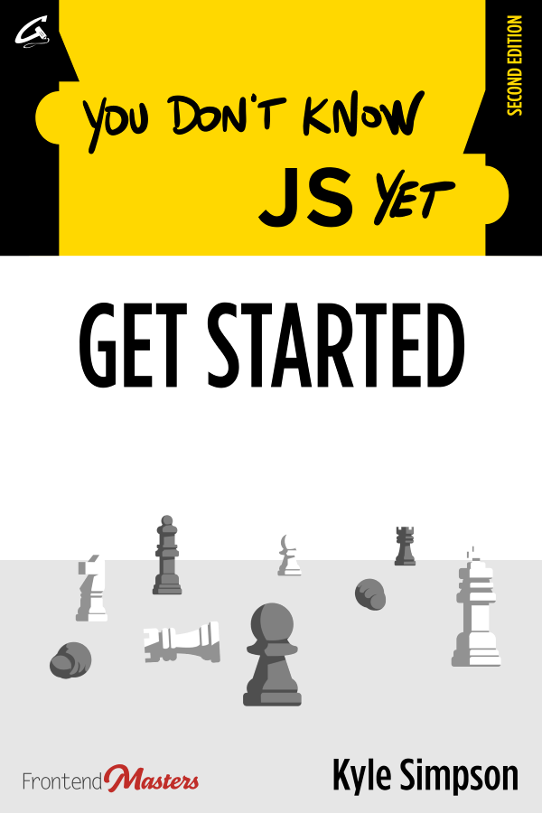

# 你并不了解 JavaScript：入门 - 第二版

---

**[从 Leanpub 上购买电子书/PDF](https://leanpub.com/ydkjsy-get-started)**

---

[目录](toc.md)

-   [前言](foreword.md) (由 [Brian Holt](https://twitter.com/holtbt) 撰写)
-   [序](../preface.md)
-   [第一章：什么是 JavaScript？](ch1.md)
-   [第二章：JS 概观](ch2.md)
-   [第三章：寻根究底](ch3.md)
-   [第四章：大局观](ch4.md)
-   [附录 A：欲穷千里目，更上一层楼](apA.md)
-   [附录 B：温故而知新](apB.md)
