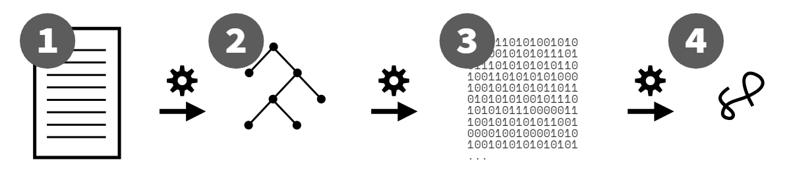

# You Don't Know JS Yet: Get Started - 2nd Edition
# Chapter 1: What *Is* JavaScript?

You don't know JS, yet. Neither do I, not fully anyway. None of us do. But we can all start getting to know JS better.

In this first chapter of the first book of the *You Don't Know JS Yet* (YDKJSY) series, we will take some time to build a foundation to move forward on. We need to start by covering a variety of important background housekeeping details, clearing up some myths and misconceptions about what the language really is (and isn't!).

This is valuable insight into the identity and process of how JS is organized and maintained; all JS developers should understand it. If you want to get to know JS, this is how to *get started* taking the first steps in that journey.

## About This Book

I emphasize the word journey because *knowing JS* is not a destination, it's a direction. No matter how much time you spend with the language, you will always be able to find something else to learn and understand a little better. So don't look at this book as something to rush through for a quick achievement. Instead, patience and persistence are best as you take these first few steps.

Following this background chapter, the rest of the book lays out a high-level map of what you will find as you dig into and study JS with the YDKJSY books.

In particular, Chapter 4 identifies three main pillars around which the JS language is organized: scope/closures, prototypes/objects, and types/coercion. JS is a broad and sophisticated language, with many features and capabilities. But all of JS is founded on these three foundational pillars.

Keep in mind that even though this book is titled "Get Started," it's **not intended as a beginner/intro book**. This book's main job is to get you ready for studying JS deeply throughout the rest of the series; it's written assuming you already have familiarity with JS over at least several months experience before moving on in YDKJSY. So to get the most out of *Get Started*, make sure you spend plenty of time writing JS code to build up your experience.

Even if you've already written a lot of JS before, this book should not be skimmed over or skipped; take your time to fully process the material here. **A good start always depends on a solid first step.**

## What's With That Name?

The name JavaScript is probably the most mistaken and misunderstood programming language name.

Is this language related to Java? Is it only the script form for Java? Is it only for writing scripts and not real programs?

The truth is, the name JavaScript is an artifact of marketing shenanigans. When Brendan Eich first conceived of the language, he code-named it Mocha. Internally at Netscape, the brand LiveScript was used. But when it came time to publicly name the language, "JavaScript" won the vote.

Why? Because this language was originally designed to appeal to an audience of mostly Java programmers, and because the word "script" was popular at the time to refer to lightweight programs. These lightweight "scripts" would be the first ones to embed inside of pages on this new thing called the web!

In other words, JavaScript was a marketing ploy to try to position this language as a palatable alternative to writing the heavier and more well-known Java of the day. It could just as easily have been called "WebJava," for that matter.

There are some superficial resemblances between JavaScript's code and Java code. Those similarities don't particularly come from shared development, but from both languages targeting developers with assumed syntax expectations from C (and to an extent, C++).

For example, we use the `{` to begin a block of code and the `}` to end that block of code, just like C/C++ and Java. We also use the `;` to punctuate the end of a statement.

In some ways, legal relationships run even deeper than the syntax. Oracle (via Sun), the company that still owns and runs Java, also owns the official trademark for the name "JavaScript" (via Netscape). This trademark is almost never enforced, and likely couldn't be at this point.

For these reasons, some have suggested we use JS instead of JavaScript. That is a very common shorthand, if not a good candidate for an official language branding itself. Indeed, these books use JS almost exclusively to refer to the language.

Further distancing the language from the Oracle-owned trademark, the official name of the language specified by TC39 and formalized by the ECMA standards body is **ECMAScript**. And indeed, since 2016, the official language name has also been suffixed by the revision year; as of this writing, that's ECMAScript 2019, or otherwise abbreviated ES2019.

In other words, the JavaScript/JS that runs in your browser or in Node.js, is *an* implementation of the ES2019 standard.

| NOTE: |
| :--- |
| Don't use terms like "JS6" or "ES8" to refer to the language. Some do, but those terms only serve to perpetuate confusion. "ES20xx" or just "JS" are what you should stick to. |

Whether you call it JavaScript, JS, ECMAScript, or ES2019, it's most definitely not a variant of the Java language!

> "Java is to JavaScript as ham is to hamster." --Jeremy Keith, 2009

## Language Specification

I mentioned TC39, the technical steering committee that manages JS. Their primary task is managing the official specification for the language. They meet regularly to vote on any agreed changes, which they then submit to ECMA, the standards organization.

JS's syntax and behavior are defined in the ES specification.

ES2019 happens to be the 10th major numbered specification/revision since JS's inception in 1995, so in the specification's official URL as hosted by ECMA, you'll find "10.0":

https://www.ecma-international.org/ecma-262/10.0/

The TC39 committee is comprised of between 50 and about 100 different people from a broad section of web-invested companies, such as browser makers (Mozilla, Google, Apple) and device makers (Samsung, etc). All members of the committee are volunteers, though many of them are employees of these companies and so may receive compensation in part for their duties on the committee.

TC39 meets generally about every other month, usually for about three days, to review work done by members since the last meeting, discuss issues, and vote on proposals. Meeting locations rotate among member companies willing to host.

All TC39 proposals progress through a five-stage process—of course, since we're programmers, it's 0-based!—Stage 0 through Stage 4. You can read more about the Stage process here: https://tc39.es/process-document/

Stage 0 means roughly, someone on TC39 thinks it's a worthy idea and plans to champion and work on it. That means lots of ideas that non-TC39 members "propose," through informal means such as social media or blog posts, are really "pre-stage 0." You have to get a TC39 member to champion a proposal for it to be considered "Stage 0" officially.

Once a proposal reaches "Stage 4" status, it is eligible to be included in the next yearly revision of the language. It can take anywhere from several months to a few years for a proposal to work its way through these stages.

All proposals are managed in the open, on TC39's Github repository: https://github.com/tc39/proposals

Anyone, whether on TC39 or not, is welcome to participate in these public discussions and the processes for working on the proposals. However, only TC39 members can attend meetings and vote on the proposals and changes. So in effect, the voice of a TC39 member carries a lot of weight in where JS will go.

Contrary to some established and frustratingly perpetuated myth, there are *not* multiple versions of JavaScript in the wild. There's just **one JS**, the official standard as maintained by TC39 and ECMA.

Back in the early 2000s, when Microsoft maintained a forked and reverse-engineered (and not entirely compatible) version of JS called "JScript," there were legitimately "multiple versions" of JS. But those days are long gone. It's outdated and inaccurate to make such claims about JS today.

All major browsers and device makers have committed to keeping their JS implementations compliant with this one central specification. Of course, engines implement features at different times. But it should never be the case that the v8 engine (Chrome's JS engine) implements a specified feature differently or incompatibly as compared to the SpiderMonkey engine (Mozilla's JS engine).

That means you can learn **one JS**, and rely on that same JS everywhere.

### The Web Rules Everything About (JS)

While the array of environments that run JS is constantly expanding (from browsers, to servers (Node.js), to robots, to lightbulbs, to...), the one environment that rules JS is the web. In other words, how JS is implemented for web browsers is, in all practicality, the only reality that matters.

For the most part, the JS defined in the specification and the JS that runs in browser-based JS engines is the same. But there are some differences that must be considered.

Sometimes the JS specification will dictate some new or refined behavior, and yet that won't exactly match with how it works in browser-based JS engines. Such a mismatch is historical: JS engines have had 20+ years of observable behaviors around corner cases of features that have come to be relied on by web content. As such, sometimes the JS engines will refuse to conform to a specification-dictated change because it would break that web content.

In these cases, often TC39 will backtrack and simply choose to conform the specification to the reality of the web. For example, TC39 planned to add a `contains(..)` method for Arrays, but it was found that this name conflicted with old JS frameworks still in use on some sites, so they changed the name to a non-conflicting `includes(..)`. The same happened with a comedic/tragic JS *community crisis* dubbed "smooshgate," where the planned `flatten(..)` method was eventually renamed `flat(..)`.

But occasionally, TC39 will decide the specification should stick firm on some point even though it is unlikely that browser-based JS engines will ever conform.

The solution? Appendix B, "Additional ECMAScript Features for Web Browsers".[^specApB] The JS specification includes this appendix to detail out any known mismatches between the official JS specification and the reality of JS on the web. In other words, these are exceptions that are allowed *only* for web JS; other JS environments must stick to the letter of the law.

Section B.1 and B.2 cover *additions* to JS (syntax and APIs) that web JS includes, again for historical reasons, but which TC39 does not plan to formally specify in the core of JS. Examples include `0`-prefixed octal literals, the global `escape(..)` / `unescape(..)` utilities, String "helpers" like `anchor(..)` and `blink()`, and the RegExp `compile(..)` method.

Section B.3 includes some conflicts where code may run in both web and non-web JS engines, but where the behavior *could* be observably different, resulting in different outcomes. Most of the listed changes involve situations that are labeled as early errors when code is running in strict mode.

Appendix B *gotchas* aren't encountered very often, but it's still a good idea to avoid these constructs to be future safe. Wherever possible, adhere to the JS specification and don't rely on behavior that's only applicable in certain JS engine environments.

### Not All (Web) JS...

Is this code a JS program?

```js
alert("Hello, JS!");
```

Depends on how you look at things. The `alert(..)` function shown here is not included in the JS specification, but it *is* in all web JS environments. Yet, you won't find it in Appendix B, so what gives?

Various JS environments (like browser JS engines, Node.js, etc.) add APIs into the global scope of your JS programs that give you environment-specific capabilities, like being able to pop an alert-style box in the user's browser.

In fact, a wide range of JS-looking APIs, like `fetch(..)`, `getCurrentLocation(..)`, and `getUserMedia(..)`, are all web APIs that look like JS. In Node.js, we can access hundreds of API methods from various built-in modules, like `fs.write(..)`.

Another common example is `console.log(..)` (and all the other `console.*` methods!). These are not specified in JS, but because of their universal utility are defined by pretty much every JS environment, according to a roughly agreed consensus.

So `alert(..)` and `console.log(..)` are not defined by JS. But they *look* like JS. They are functions and object methods and they obey JS syntax rules. The behaviors behind them are controlled by the environment running the JS engine, but on the surface they definitely have to abide by JS to be able to play in the JS playground.

Most of the cross-browser differences people complain about with "JS is so inconsistent!" claims are actually due to differences in how those environment behaviors work, not in how the JS itself works.

So an `alert(..)` call *is* JS, but `alert` itself is really just a guest, not part of the official JS specification.

### It's Not Always JS

Using the console/REPL (Read-Evaluate-Print-Loop) in your browser's Developer Tools (or Node) feels like a pretty straightforward JS environment at first glance. But it's not, really.

Developer Tools are... tools for developers. Their primary purpose is to make life easier for developers. They prioritize DX (Developer Experience). It is *not* a goal of such tools to accurately and purely reflect all nuances of strict-spec JS behavior. As such, there's many quirks that may act as "gotchas" if you're treating the console as a *pure* JS environment.

This convenience is a good thing, by the way! I'm glad Developer Tools make developers' lives easier! I'm glad we have nice UX charms like auto-complete of variables/properties, etc. I'm just pointing out that we can't and shouldn't expect such tools to *always* adhere strictly to the way JS programs are handled, because that's not the purpose of these tools.

Since such tools vary in behavior from browser to browser, and since they change (sometimes rather frequently), I'm not going to "hardcode" any of the specific details into this text, thereby ensuring this book text is outdated quickly.

But I'll just hint at some examples of quirks that have been true at various points in different JS console environments, to reinforce my point about not assuming native JS behavior while using them:

* Whether a `var` or `function` declaration in the top-level "global scope" of the console actually creates a real global variable (and mirrored `window` property, and vice versa!).

* What happens with multiple `let` and `const` declarations in the top-level "global scope."

* Whether `"use strict";` on one line-entry (pressing `<enter>` after) enables strict mode for the rest of that console session, the way it would on the first line of a .js file, as well as whether you can use `"use strict";` beyond the "first line" and still get strict mode turned on for that session.

* How non-strict mode `this` default-binding works for function calls, and whether the "global object" used will contain expected global variables.

* How hoisting (see Book 2, *Scope & Closures*) works across multiple line entries.

* ...several others

The developer console is not trying to pretend to be a JS compiler that handles your entered code exactly the same way the JS engine handles a .js file. It's trying to make it easy for you to quickly enter a few lines of code and see the results immediately. These are entirely different use cases, and as such, it's unreasonable to expect one tool to handle both equally.

Don't trust what behavior you see in a developer console as representing *exact* to-the-letter JS semantics; for that, read the specification. Instead, think of the console as a "JS-friendly" environment. That's useful in its own right.

## Many Faces

The term "paradigm" in programming language context refers to a broad (almost universal) mindset and approach to structuring code. Within a paradigm, there are myriad variations of style and form that distinguish programs, including countless different libraries and frameworks that leave their unique signature on any given code.

But no matter what a program's individual style may be, the big picture divisions around paradigms are almost always evident at first glance of any program.

Typical paradigm-level code categories include procedural, object-oriented (OO/classes), and functional (FP):

* Procedural style organizes code in a top-down, linear progression through a pre-determined set of operations, usually collected together in related units called procedures.

* OO style organizes code by collecting logic and data together into units called classes.

* FP style organizes code into functions (pure computations as opposed to procedures), and the adaptations of those functions as values.

Paradigms are neither right nor wrong. They're orientations that guide and mold how programmers approach problems and solutions, how they structure and maintain their code.

Some languages are heavily slanted toward one paradigm—C is procedural, Java/C++ are almost entirely class oriented, and Haskell is FP through and through.

But many languages also support code patterns that can come from, and even mix and match from, different paradigms. So called "multi-paradigm languages" offer ultimate flexibility. In some cases, a single program can even have two or more expressions of these paradigms sitting side by side.

JavaScript is most definitely a multi-paradigm language. You can write procedural, class-oriented, or FP-style code, and you can make those decisions on a line-by-line basis instead of being forced into an all-or-nothing choice.

## Backwards & Forwards

One of the most foundational principles that guides JavaScript is preservation of *backwards compatibility*. Many are confused by the implications of this term, and often confuse it with a related but different term: *forwards compatibility*.

Let's set the record straight.

Backwards compatibility means that once something is accepted as valid JS, there will not be a future change to the language that causes that code to become invalid JS. Code written in 1995—however primitive or limited it may have been!—should still work today. As TC39 members often proclaim, "we don't break the web!"

The idea is that JS developers can write code with confidence that their code won't stop working unpredictably because a browser update is released. This makes the decision to choose JS for a program a more wise and safe investment, for years into the future.

That "guarantee" is no small thing. Maintaining backwards compatibility, stretched out across almost 25 years of the language's history, creates an enormous burden and a whole slew of unique challenges. You'd be hard pressed to find many other examples in computing of such a commitment to backwards compatibility.

The costs of sticking to this principle should not be casually dismissed. It necessarily creates a very high bar to including changing or extending the language; any decision becomes effectively permanent, mistakes and all. Once it's in JS, it can't be taken out because it might break programs, even if we'd really, really like to remove it!

There are some small exceptions to this rule. JS has had some backwards-incompatible changes, but TC39 is extremely cautious in doing so. They study existing code on the web (via browser data gathering) to estimate the impact of such breakage, and browsers ultimately decide and vote on whether they're willing to take the heat from users for a very small-scale breakage weighed against the benefits of fixing or improving some aspect of the language for many more sites (and users).

These kinds of changes are rare, and are almost always in corner cases of usage that are unlikely to be observably breaking in many sites.

Compare *backwards compatibility* to its counterpart, *forwards compatibility*. Being forwards-compatible means that including a new addition to the language in a program would not cause that program to break if it were run in an older JS engine. **JS is not forwards-compatible**, despite many wishing such, and even incorrectly believing the myth that it is.

HTML and CSS, by contrast, are forwards-compatible but not backwards-compatible. If you dug up some HTML or CSS written back in 1995, it's entirely possible it would not work (or work the same) today. But, if you use a new feature from 2019 in a browser from 2010, the page isn't "broken" -- the unrecognized CSS/HTML is skipped over, while the rest of the CSS/HTML would be processed accordingly.

It may seem desirable for forwards-compatibility to be included in programming language design, but it's generally impractical to do so. Markup (HTML) or styling (CSS) are declarative in nature, so it's much easier to "skip over" unrecognized declarations with minimal impact to other recognized declarations.

But chaos and non-determinism would ensue if a programming language engine selectively skipped statements (or even expressions!) that it didn't understand, as it's impossible to ensure that a subsequent part of the program wasn't expecting the skipped-over part to have been processed.

Though JS isn't, and can't be, forwards-compatible, it's critical to recognize JS's backwards compatibility, including the enduring benefits to the web and the constraints and difficulties it places on JS as a result.

### Jumping the Gaps

Since JS is not forwards-compatible, it means that there is always the potential for a gap between code that you can write that's valid JS, and the oldest engine that your site or application needs to support. If you run a program that uses an ES2019 feature in an engine from 2016, you're very likely to see the program break and crash.

If the feature is a new syntax, the program will in general completely fail to compile and run, usually throwing a syntax error. If the feature is an API (such as ES6's `Object.is(..)`), the program may run up to a point but then throw a runtime exception and stop once it encounters the reference to the unknown API.

Does this mean JS developers should always lag behind the pace of progress, using only code that is on the trailing edge of the oldest JS engine environments they need to support? No!

But it does mean that JS developers need to take special care to address this gap.

For new and incompatible syntax, the solution is transpiling. Transpiling is a contrived and community-invented term to describe using a tool to convert the source code of a program from one form to another (but still as textual source code). Typically, forwards-compatibility problems related to syntax are solved by using a transpiler (the most common one being Babel (https://babeljs.io)) to convert from that newer JS syntax version to an equivalent older syntax.

For example, a developer may write a snippet of code like:

```js
if (something) {
    let x = 3;
    console.log(x);
}
else {
    let x = 4;
    console.log(x);
}
```

This is how the code would look in the source code tree for that application. But when producing the file(s) to deploy to the public website, the Babel transpiler might convert that code to look like this:

```js
var x$0, x$1;
if (something) {
    x$0 = 3;
    console.log(x$0);
}
else {
    x$1 = 4;
    console.log(x$1);
}
```

The original snippet relied on `let` to create block-scoped `x` variables in both the `if` and `else` clauses which did not interfere with each other. An equivalent program (with minimal re-working) that Babel can produce just chooses to name two different variables with unique names, producing the same non-interference outcome.

| NOTE: |
| :--- |
| The `let` keyword was added in ES6 (in 2015). The preceding example of transpiling would only need to apply if an application needed to run in a pre-ES6 supporting JS environment. The example here is just for simplicity of illustration. When ES6 was new, the need for such a transpilation was quite prevalent, but in 2020 it's much less common to need to support pre-ES6 environments. The "target" used for transpiliation is thus a sliding window that shifts upward only as decisions are made for a site/application to stop supporting some old browser/engine. |

You may wonder: why go to the trouble of using a tool to convert from a newer syntax version to an older one? Couldn't we just write the two variables and skip using the `let` keyword? The reason is, it's strongly recommended that developers use the latest version of JS so that their code is clean and communicates its ideas most effectively.

Developers should focus on writing the clean, new syntax forms, and let the tools take care of producing a forwards-compatible version of that code that is suitable to deploy and run on the oldest-supported JS engine environments.

### Filling the Gaps

If the forwards-compatibility issue is not related to new syntax, but rather to a missing API method that was only recently added, the most common solution is to provide a definition for that missing API method that stands in and acts as if the older environment had already had it natively defined. This pattern is called a polyfill (aka "shim").

Consider this code:

```js
// getSomeRecords() returns us a promise for some
// data it will fetch
var pr = getSomeRecords();

// show the UI spinner while we get the data
startSpinner();

pr
.then(renderRecords)   // render if successful
.catch(showError)      // show an error if not
.finally(hideSpinner)  // always hide the spinner
```

This code uses an ES2019 feature, the `finally(..)` method on the promise prototype. If this code were used in a pre-ES2019 environment, the `finally(..)` method would not exist, and an error would occur.

A polyfill for `finally(..)` in pre-ES2019 environments could look like this:

```js
if (!Promise.prototype.finally) {
    Promise.prototype.finally = function f(fn){
        return this.then(
            function t(v){
                return Promise.resolve( fn() )
                    .then(function t(){
                        return v;
                    });
            },
            function c(e){
                return Promise.resolve( fn() )
                    .then(function t(){
                        throw e;
                    });
            }
        );
    };
}
```

| WARNING: |
| :--- |
| This is only a simple illustration of a basic (not entirely spec-compliant) polyfill for `finally(..)`. Don't use this polyfill in your code; always use a robust, official polyfill wherever possible, such as the collection of polyfills/shims in ES-Shim. |

The `if` statement protects the polyfill definition by preventing it from running in any environment where the JS engine has already defined that method. In older environments, the polyfill is defined, but in newer environments the `if` statement is quietly skipped.

Transpilers like Babel typically detect which polyfills your code needs and provide them automatically for you. But occasionally you may need to include/define them explicitly, which works similar to the snippet we just looked at.

Always write code using the most appropriate features to communicate its ideas and intent effectively. In general, this means using the most recent stable JS version. Avoid negatively impacting the code's readability by trying to manually adjust for the syntax/API gaps. That's what tools are for!

Transpilation and polyfilling are two highly effective techniques for addressing that gap between code that uses the latest stable features in the language and the old environments a site or application needs to still support. Since JS isn't going to stop improving, the gap will never go away. Both techniques should be embraced as a standard part of every JS project's production chain going forward.

## What's in an Interpretation?

A long-debated question for code written in JS: is it an interpreted script or a compiled program? The majority opinion seems to be that JS is an interpreted (scripting) language. But the truth is more complicated than that.

For much of the history of programming languages, "interpreted" languages and "scripting" languages have been looked down on as inferior compared to their compiled counterparts. The reasons for this acrimony are numerous, including the perception that there is a lack of performance optimization, as well as dislike of certain language characteristics, such as scripting languages generally using dynamic typing instead of the "more mature" statically typed languages.

Languages regarded as "compiled" usually produce a portable (binary) representation of the program that is distributed for execution later. Since we don't really observe that kind of model with JS (we distribute the source code, not the binary form), many claim that disqualifies JS from the category. In reality, the distribution model for a program's "executable" form has become drastically more varied and also less relevant over the last few decades; to the question at hand, it doesn't really matter so much anymore what form of a program gets passed around.

These misinformed claims and criticisms should be set aside. The real reason it matters to have a clear picture on whether JS is interpreted or compiled relates to the nature of how errors are handled.

Historically, scripted or interpreted languages were executed in generally a top-down and line-by-line fashion; there's typically not an initial pass through the program to process it before execution begins (see Figure 1).

<figure>
    
    <figcaption><em>Fig. 1: Interpreted/Scripted Execution</em></figcaption>
    <br><br>
</figure>

In scripted or interpreted languages, an error on line 5 of a program won't be discovered until lines 1 through 4 have already executed. Notably, the error on line 5 might be due to a runtime condition, such as some variable or value having an unsuitable value for an operation, or it may be due to a malformed statement/command on that line. Depending on context, deferring error handling to the line the error occurs on may be a desirable or undesirable effect.

Compare that to languages which do go through a processing step (typically, called parsing) before any execution occurs, as illustrated in Figure 2:

<figure>
    
    <figcaption><em>Fig. 2: Parsing + Compilation + Execution</em></figcaption>
    <br><br>
</figure>

In this processing model, an invalid command (such as broken syntax) on line 5 would be caught during the parsing phase, before any execution has begun, and none of the program would run. For catching syntax (or otherwise "static") errors, generally it's preferred to know about them ahead of any doomed partial execution.

So what do "parsed" languages have in common with "compiled" languages? First, all compiled languages are parsed. So a parsed language is quite a ways down the road toward being compiled already. In classic compilation theory, the last remaining step after parsing is code generation: producing an executable form.

Once any source program has been fully parsed, it's very common that its subsequent execution will, in some form or fashion, include a translation from the parsed form of the program—usually called an Abstract Syntax Tree (AST)—to that executable form.

In other words, parsed languages usually also perform code generation before execution, so it's not that much of a stretch to say that, in spirit, they're compiled languages.

JS source code is parsed before it is executed. The specification requires as much, because it calls for "early errors"—statically determined errors in code, such as a duplicate parameter name—to be reported before the code starts executing. Those errors cannot be recognized without the code having been parsed.

So **JS is a parsed language**, but is it *compiled*?

The answer is closer to yes than no. The parsed JS is converted to an optimized (binary) form, and that "code" is subsequently executed (Figure 2); the engine does not commonly switch back into line-by-line execution (like Figure 1) mode after it has finished all the hard work of parsing—most languages/engines wouldn't, because that would be highly inefficient.

To be specific, this "compilation" produces a binary byte code (of sorts), which is then handed to the "JS virtual machine" to execute. Some like to say this VM is "interpreting" the byte code. But then that means Java, and a dozen other JVM-driven languages, for that matter, are interpreted rather than compiled. Of course, that contradicts the typical assertion that Java/etc are compiled languages.

Interestingly, while Java and JavaScript are very different languages, the question of interpreted/compiled is pretty closely related between them!

Another wrinkle is that JS engines can employ multiple passes of JIT (Just-In-Time) processing/optimization on the generated code (post parsing), which again could reasonably be labeled either "compilation" or "interpretation" depending on perspective. It's actually a fantastically complex situation under the hood of a JS engine.

So what do these nitty-gritty details boil down to? Step back and consider the entire flow of a JS source program:

1. After a program leaves a developer's editor, it gets transpiled by Babel, then packed by Webpack (and perhaps half a dozen other build processes), then it gets delivered in that very different form to a JS engine.

2. The JS engine parses the code to an AST.

3. Then the engine converts that AST to a kind-of byte code, a binary intermediate representation (IR), which is then refined/converted even further by the optimizing JIT compiler.

4. Finally, the JS VM executes the program.

To visualize those steps, again:

<figure>
    
    <figcaption><em>Fig. 3: Parsing, Compiling, and Executing JS</em></figcaption>
    <br><br>
</figure>

Is JS handled more like an interpreted, line-by-line script, as in Figure 1, or is it handled more like a compiled language that's processed in one-to-several passes first, before execution (as in Figures 2 and 3)?

I think it's clear that in spirit, if not in practice, **JS is a compiled language**.

And again, the reason that matters is, since JS is compiled, we are informed of static errors (such as malformed syntax) before our code is executed. That is a substantively different interaction model than we get with traditional "scripting" programs, and arguably more helpful!

### Web Assembly (WASM)

One dominating concern that has driven a significant amount of JS's evolution is performance, both how quickly JS can be parsed/compiled and how quickly that compiled code can be executed.

In 2013, engineers from Mozilla Firefox demonstrated a port of the Unreal 3 game engine from C to JS. The ability for this code to run in a browser JS engine at full 60fps performance was predicated on a set of optimizations that the JS engine could perform specifically because the JS version of the Unreal engine's code used a style of code that favored a subset of the JS language, named "ASM.js".

This subset is valid JS written in ways that are somewhat uncommon in normal coding, but which signal certain important typing information to the engine that allow it to make key optimizations. ASM.js was introduced as one way of addressing the pressures on the runtime performance of JS.

But it's important to note that ASM.js was never intended to be code that was authored by developers, but rather a representation of a program having been transpiled from another language (such as C), where these typing "annotations" were inserted automatically by the tooling.

Several years after ASM.js demonstrated the validity of tooling-created versions of programs that can be processed more efficiently by the JS engine, another group of engineers (also, initially, from Mozilla) released Web Assembly (WASM).

WASM is similar to ASM.js in that its original intent was to provide a path for non-JS programs (C, etc.) to be converted to a form that could run in the JS engine. Unlike ASM.js, WASM chose to additionally get around some of the inherent delays in JS parsing/compilation before a program can execute, by representing the program in a form that is entirely unlike JS.

WASM is a representation format more akin to Assembly (hence, its name) that can be processed by a JS engine by skipping the parsing/compilation that the JS engine normally does. The parsing/compilation of a WASM-targeted program happen ahead of time (AOT); what's distributed is a binary-packed program ready for the JS engine to execute with very minimal processing.

An initial motivation for WASM was clearly the potential performance improvements. While that continues to be a focus, WASM is additionally motivated by the desire to bring more parity for non-JS languages to the web platform. For example, if a language like Go supports threaded programming, but JS (the language) does not, WASM offers the potential for such a Go program to be converted to a form the JS engine can understand, without needing a threads feature in the JS language itself.

In other words, WASM relieves the pressure to add features to JS that are mostly/exclusively intended to be used by transpiled programs from other languages. That means JS feature development can be judged (by TC39) without being skewed by interests/demands in other language ecosystems, while still letting those languages have a viable path onto the web.

Another perspective on WASM that's emerging is, interestingly, not even directly related to the web (W). WASM is evolving to become a cross-platform virtual machine (VM) of sorts, where programs can be compiled once and run in a variety of different system environments.

So, WASM isn't only for the web, and WASM also isn't JS. Ironically, even though WASM runs in the JS engine, the JS language is one of the least suitable languages to source WASM programs with, because WASM relies heavily on static typing information. Even TypeScript (TS)—ostensibly, JS + static types—is not quite suitable (as it stands) to transpile to WASM, though language variants like AssemblyScript are attempting to bridge the gap between JS/TS and WASM.

This book isn't about WASM, so I won't spend much more time discussing it, except to make one final point. *Some* folks have suggested WASM points to a future where JS is excised from, or minimized in, the web. These folks often harbor ill feelings about JS, and want some other language—any other language!—to replace it. Since WASM lets other languages run in the JS engine, on its face this isn't an entirely fanciful fairytale.

But let me just state simply: WASM will not replace JS. WASM significantly augments what the web (including JS) can accomplish. That's a great thing, entirely orthogonal to whether some people will use it as an escape hatch from having to write JS.

## *Strict*ly Speaking

Back in 2009 with the release of ES5, JS added *strict mode* as an opt-in mechanism for encouraging better JS programs.

The benefits of strict mode far outweigh the costs, but old habits die hard and the inertia of existing (aka "legacy") code bases is really hard to shift. So sadly, more than 10 years later, strict mode's *optionality* means that it's still not necessarily the default for JS programmers.

Why strict mode? Strict mode shouldn't be thought of as a restriction on what you can't do, but rather as a guide to the best way to do things so that the JS engine has the best chance of optimizing and efficiently running the code. Most JS code is worked on by teams of developers, so the *strict*-ness of strict mode (along with tooling like linters!) often helps collaboration on code by avoiding some of the more problematic mistakes that slip by in non-strict mode.

Most strict mode controls are in the form of *early errors*, meaning errors that aren't strictly syntax errors but are still thrown at compile time (before the code is run). For example, strict mode disallows naming two function parameters the same, and results in an early error. Some other strict mode controls are only observable at runtime, such as how `this` defaults to `undefined` instead of the global object.

Rather than fighting and arguing with strict mode, like a kid who just wants to defy whatever their parents tell them not to do, the best mindset is that strict mode is like a linter reminding you how JS *should* be written to have the highest quality and best chance at performance. If you find yourself feeling handcuffed, trying to work around strict mode, that should be a blaring red warning flag that you need to back up and rethink the whole approach.

Strict mode is switched on per file with a special pragma (nothing allowed before it except comments/whitespace):

```js
// only whitespace and comments are allowed
// before the use-strict pragma
"use strict";
// the rest of the file runs in strict mode
```

| WARNING: |
| :--- |
| Something to be aware of is that even a stray `;` all by itself appearing before the strict mode pragma will render the pragma useless; no errors are thrown because it's valid JS to have a string literal expression in a statement position, but it also will silently *not* turn on strict mode! |

Strict mode can alternatively be turned on per-function scope, with exactly the same rules about its surroundings:

```js
function someOperations() {
    // whitespace and comments are fine here
    "use strict";

    // all this code will run in strict mode
}
```

Interestingly, if a file has strict mode turned on, the function-level strict mode pragmas are disallowed. So you have to pick one or the other.

The **only** valid reason to use a per-function approach to strict mode is when you are converting an existing non-strict mode program file and need to make the changes little by little over time. Otherwise, it's vastly better to simply turn strict mode on for the entire file/program.

Many have wondered if there would ever be a time when JS made strict mode the default? The answer is, almost certainly not. As we discussed earlier around backwards compatibility, if a JS engine update started assuming code was strict mode even if it's not marked as such, it's possible that this code would break as a result of strict mode's controls.

However, there are a few factors that reduce the future impact of this non-default "obscurity" of strict mode.

For one, virtually all transpiled code ends up in strict mode even if the original source code isn't written as such. Most JS code in production has been transpiled, so that means most JS is already adhering to strict mode. It's possible to undo that assumption, but you really have to go out of your way to do so, so it's highly unlikely.

Moreover, a wide shift is happening toward more/most new JS code being written using the ES6 module format. ES6 modules assume strict mode, so all code in such files is automatically defaulted to strict mode.

Taken together, strict mode is largely the de facto default even though technically it's not actually the default.

## Defined

JS is an implementation of the ECMAScript standard (version ES2019 as of this writing), which is guided by the TC39 committee and hosted by ECMA. It runs in browsers and other JS environments such as Node.js.

JS is a multi-paradigm language, meaning the syntax and capabilities allow a developer to mix and match (and bend and reshape!) concepts from various major paradigms, such as procedural, object-oriented (OO/classes), and functional (FP).

JS is a compiled language, meaning the tools (including the JS engine) process and verify a program (reporting any errors!) before it executes.

With our language now *defined*, let's start getting to know its ins and outs.

[^specApB]: ECMAScript 2019 Language Specification, Appendix B: Additional ECMAScript Features for Web Browsers, https://www.ecma-international.org/ecma-262/10.0/#sec-additional-ecmascript-features-for-web-browsers (latest as of time of this writing in January 2020)
