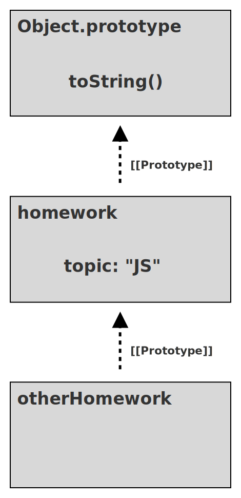
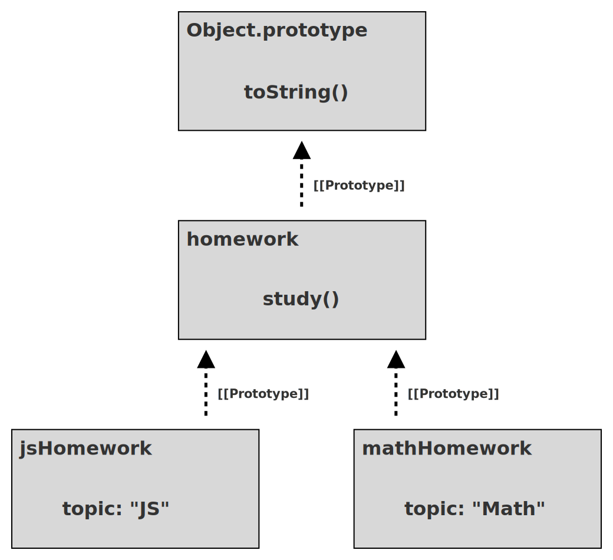

# Серія "Ти поки що не знаєш JS". Книга 1: "Перші кроки". Друге видання
# Глава 3: Шлях до самого коріння JS

Сподіваюся, що після прочитання та засвоєння глав 1 і 2 ви починаєте *розуміти* JS трохи краще. Якщо ви пропустили їх або прочитали неуважно, особливо главу 2, я рекомендую повернутися та приділити більше уваги цьому матеріалу.

У главі 2 ми оглянули синтаксис, шаблони та поведінку, проте не заглиблювались у подробиці. У цій главі наша увага переходить до деяких кореневих характеристик JS нижчого рівня, які лежать в основі практично кожного рядка коду, який ми пишемо.

Майте на увазі: ця глава заглиблюється у роботу мов програмування сильніше, ніж ви, напевно, звикли. Моя мета в тому, щоб допомогти вам зрозуміти суть того, як працює JS, суть механізму у нього в середині. Ця глава має дати перші відповіді на деякі питання, які можуть виникати під час вивчення JS. Однак цей матеріал не є вичерпним викладенням мови; для цього призначена решта серії книг! Наша ціль у цій главі, як і у попередніх – лише *розпочати* й почуватися комфортніше, *відчути* JS, його сильні та слабкі сторони.

Не пробігайте цей матеріал надто швидко, бо можете загубитися. Як я вже говорив з десяток разів, **не поспішайте**. Навіть так після цієї глави у вас скоріш за все залишаться питання. Це нормально, адже у вас попереду ще ціла серія книг, щоб продовжувати дослідження!

## Ітерація

Оскільки програми по суті будують для обробки даних і прийняття рішень щодо цих даних, великий вплив на читабельність програми мають шаблони перебору даних.

Шаблон "Ітератор" існує десятки років і пропонує "стандартизований" підхід до споживання даних з певного джерела по одному *фрагменту* за раз. Ідея в тому, що ітерувати джерело даних, тобто поступово обробляти колекцію даних по одному фрагменту за раз, а не весь набір даних одночасно – це і більш розповсюджений підхід, і більш зручний.

Уявіть собі структуру даних, яка представляє результат роботи запиту `SELECT` до реляційної бази даних. Цей запит зазвичай організовує результати у вигляді рядків. Якщо за запитом знайшовся лише один рядок або невелика кількість рядків, ви можете обробляти весь результат одразу: призначити кожен рядок локальній змінній та виконувати будь-які необхідні операції з тими даними.

Проте якщо запит повертає 100, 1000 або навіть більше рядків, вам доведеться обробляти дані ітеративно (як правило, у циклі).

Шаблон "Ітератор" визначає структуру даних, яка називається "ітератор". Ця структура має посилання на базове джерело даних (наприклад, рядки результату запиту), яке надає метод, що називається `next()` чи подібний до нього. Виклик `next()` повертає наступний фрагмент даних. У нашому прикладі це буде наступний запис або наступний рядок із запиту до бази даних.

Ви не завжди знаєте, скільки фрагментів даних вам треба переглянути, тому як правило шаблон передбачає повернення спеціального значення, що вказує на завершення ітерації або на помилку, щоб ви знали, що перебрали всі наявні елементи та пройшли повз останній.

Значення шаблону ітератора полягає у дотриманні *стандартного* способу обробки даних ітеративно, що забезпечує чистіший та легший для розуміння код, на противагу тому, що кожна структура даних або джерело визначатиме свій власний спосіб обробки своїх даних.

Після багатьох років зусиль JS-спільноти щодо узгоджених методів ітерації ES6 стандартизував конкретний протокол для шаблону "Ітератор" безпосередньо в мові. Протокол визначає метод `next()`, значенням якого є об'єкт, що називається *результатом ітератора*; об'єкт має властивості `value` і `done`, де `done` є булевим значенням, що дорівнюватиме `false`, доки ітерація базового джерела даних не завершиться.

### Споживання ітераторів

З появою протоколу ітерації в ES6 стало можливо споживати джерело даних по одному значенню за раз, перевіряючи після кожного виклику `next()`, чи значення `done` дорівнює `true`, щоб зупинити ітерацію. Але цей підхід вимагає ручного управління, тому ES6 також включав кілька механізмів (новий синтаксис та програмні інтерфейси) для стандартизованого споживання цих ітераторів.

Одним з таких механізмів є цикл `for..of`:

```js
// припустимо, що є ітератор певної структури даних:
var it = /* .. */;

// проходимо у циклі результати ітерації по одному за раз
for (let val of it) {
    console.log(`Iterator value: ${ val }`);
}
// Iterator value: ..
// Iterator value: ..
// ..
```

| ПРИМІТКА: |
| :--- |
| У цьому прикладі ми не наводимо еквівалентний ручний цикл, але він, безумовно, менш читабельний, ніж цикл `for..of`! |

Іншим механізмом, який часто використовується для споживання ітераторів, є оператор `...`. Цей оператор насправді має дві симетричні форми: *spread* та *rest* (другий я б назвав *gather*, тобто "збирання"). Форма *spread* є споживанням ітератора.

Щоб "заспредити", тобто розкласти ітератор, потрібно мати *щось*, куди покласти результат. JS пропонує дві можливості: масив або список аргументів для виклику функції.

Розкладання ітератора у масив:

```js
// розкладання ітератора у масив,
// де кожне значення ітератора
// займає одне місце у масиві
var vals = [ ...it ];
```

Виклик функції:

```js
// розкладання ітератора у виклику функції,
// де кожне значення ітератора
// займає місце одного аргументу
doSomethingUseful( ...it );
```

В обох випадках форма розкладання ітератора `...` слідує протоколу споживання ітератора (так само як цикл `for..of`) для отримання всіх доступних значень з ітератора та розміщення їх у контекст отримання (масив, список аргументів).

### Ітеровані сутності

З технічної точки зору протокол споживання ітератора визначений для споживання *ітерованих сутностей*; ітерована сутність – це значення, яка піддається ітерації.

Протокол автоматично створює екземпляр ітератора з ітерованої сутності і споживає *саме цей екземпляр ітератора* до його вичерпання. Це означає, що одну ітеровану сутність можна споживати більше одного разу; кожного разу створюватиметься та використовуватиметься новий екземпляр ітератора.

То де взяти ітеровані сутності?

ES6 визначив певні базові структури даних та типи колекцій в JS як ітеровані сутності. Сюди входять рядки, масиви, мапи, множини тощо.

Розглянемо:

```js
// масив є ітерованою сутністю
var arr = [ 10, 20, 30 ];

for (let val of arr) {
    console.log(`Array value: ${ val }`);
}
// Array value: 10
// Array value: 20
// Array value: 30
```
Оскільки масиви є ітерованими сутностями, ми можемо поверхнево скопіювати масив, споживаючи ітератор оператором `...`:
```js
var arrCopy = [ ...arr ];
```

Ми також можемо перебрати символи в рядку:

```js
var greeting = "Hello world!";
var chars = [ ...greeting ];

chars;
// [ "H", "e", "l", "l", "o", " ",
//   "w", "o", "r", "l", "d", "!" ]
```

Структура даних `Map` використовує об'єкти як ключі, з якими поєднує значення будь-якого типу. Мапи мають іншу ітерацію за замовчуванням, ніж така, яку ми бачили у попередніх прикладах, оскільки ітерація перебирає не значення Мапи, а *записи*. *Запис* - це кортеж (2-елементний масив), що включає як ключ, так і значення.

Розглянемо:

```js
// припустимо, що є два DOM-елементи, `btn1` та `btn2`

var buttonNames = new Map();
buttonNames.set(btn1,"Button 1");
buttonNames.set(btn2,"Button 2");

for (let [btn,btnName] of buttonNames) {
    btn.addEventListener("click",function onClick(){
        console.log(`Clicked ${ btnName }`);
    });
}
```

У циклі `for..of` над ітерацією мапи за замовчуванням ми використовуємо синтаксис `[btn, btnName]` (який називається "деструктуризація масиву"), щоб розбити кожен спожитий кортеж на відповідні пари "ключ і значення" (`btn1` та `"Button 1"` і `btn2` та `"Button 2"`).

Кожна вбудована ітерована сутність в JS визначає ітерацію за замовчуванням, яка, скоріш за все, відповідає тому, як ви її уявляєте. Але ви також можете вибрати більш конкретну ітерацію, коли це необхідно. Наприклад, якщо ми хочемо споживати лише значення наведеної вище мапи `buttonNames`, ми можемо викликати `values​​()`, щоб отримати ітератор лише для значень:

```js
for (let btnName of buttonNames.values()) {
    console.log(btnName);
}
// Button 1
// Button 2
```

Або якщо нам потрібні значення індексу *та* значення під час ітерації масиву, ми можемо зробити ітератор по записах методом `entries()`:

```js
var arr = [ 10, 20, 30 ];

for (let [idx,val] of arr.entries()) {
    console.log(`[${ idx }]: ${ val }`);
}
// [0]: 10
// [1]: 20
// [2]: 30
```

Здебільшого всі вбудовані ітеровані сутності в JS мають три форми ітераторів: перебір ключів (`keys()`), значень  (`values()`) та записів (`entries()`).

Ви можете використовувати ітерацію, запропоновану мовою, але також ви також можете додати підтримку протоколу ітерації власним структурам даних; це означає, що ви вибираєте можливість використовувати ваші дані за допомогою циклів `for..of` та оператора `...`. "Стандартизація" цього протоколу означає, що код стає більш легко впізнаваним і читабельним.

| ПРИМІТКА: |
| :--- |
| Можливо, ви помітили зміну, яка відбулася в нашій дискусії. Ми почали з розмови про споживання **ітераторів**, але потім перейшли до розмови про перебір **ітерованих сутностей**. Протокол ітерації та споживання очікує *ітеровану сутність*, але причина, з якої ми можемо надати прямий *ітератор*, полягає в тому, що ітератор сам по собі є ітерованою сутністю! При створенні екземпляра ітератора з наявного ітератора повертається сам ітератор. |

## Замикання


Я припускаю, що майже кожен розробник JS користувався замиканнями, інколи не усвідомлюючи цього. Насправді замикання є однією з найбільш поширених функціональних можливостей програмування у багатьох мовах. Розуміння замикань може бути так само важливим, як розуміння змінних або циклів; ось наскільки це принципово.

І все-таки замикання справляють враження тайни чи магії. Про них часто говорять або дуже абстрактно, або дуже неформально, що мало допомагає нам зрозуміти, що вони таке.

Ми повинні вміти розпізнавати, де в програмах використовується замикання, оскільки наявність або відсутність замикання іноді є причиною помилок (чи навіть причиною проблем зі швидкодією).

Тож дамо замиканням прагматичне і конкретне визначення:

> Замикання – це коли функція запам'ятовує змінні поза межами своєї області видимості та може звернутися до них,  навіть коли виконується в іншій області видимості.

Тут ми бачимо дві визначальні характеристики. Перша: замикання є частиною природи функції. Об'єкти не створюють замикання, їх створюють лише функції. Друга: щоб побачити замикання, ви повинні виконати функцію в іншій области видимості, ніж та, де ця функція була визначена.

Розглянемо приклад:

```js
function greeting(msg) {
    return function who(name) {
        console.log(`${ msg }, ${ name }!`);
    };
}

var hello = greeting("Hello");
var howdy = greeting("Howdy");

hello("Kyle");
// Hello, Kyle!

hello("Sarah");
// Hello, Sarah!

howdy("Grant");
// Howdy, Grant!
```

Спочатку виконується зовнішня функція `greeting(..)`, що створює екземпляр внутрішньої функції `who(..)`; ця функція замикає змінну `msg`, яка є параметром із зовнішньої області видимості `greeting(..)`. Коли ця внутрішня функція закінчує роботу, її посилання призначається змінній `hello` у зовнішній області видимості. Потім ми вдруге викликаємо `greeting(..)`, створюючи новий екземпляр внутрішньої функції, з новим замиканням нового значення `msg`, і повертаємо це посилання, яке буде призначене для `howdy`.

Коли функція `greeting(..)` завершує свою роботи, ми очікуємо, що всі її змінні будуть видалені з пам'яті прибиральником сміття (garbage collector). Нам здається, що усі екземпляри `msg` мають зникнути, але цього не відбувається. Причина – замикання. Оскільки внутрішні екземпляри функцій все ще живі (зверніть увагу на присвоєні `hello` та `howdy`, відповідно), їх замикання все ще зберігають змінні `msg`.

Проте ці замикання не є статичним відбитком значення змінної `msg`; вони представляють прямий зв'язок із самою змінною. Це означає, що замикання може фактично відстежувати оновлення або навіть оновлювати значення цих змінних з часом.

```js
function counter(step = 1) {
    var count = 0;
    return function increaseCount(){
        count = count + step;
        return count;
    };
}

var incBy1 = counter(1);
var incBy3 = counter(3);

incBy1();       // 1
incBy1();       // 2

incBy3();       // 3
incBy3();       // 6
incBy3();       // 9
```

Кожен екземпляр внутрішньої функції `yieldCount()` замикає змінні `count` та `step` з області видимості зовнішньої функції `counter(..)`. `step` залишається незмінним з часом, але `count` оновлюється при кожному виклику цієї внутрішньої функції. Оскільки замикання зберігає самі змінні, а не лише їхні значення у певний момент часу, ці оновлення також зберігаються.

Замикання найчастіше можна спостерігати при роботі з асинхронним кодом, наприклад, з функціями зворотного виклику(callbacks). Розглянемо:

```js
function getSomeData(url) {
    ajax(url,function onResponse(resp){
        console.log(
            `Response (from ${ url }): ${ resp }`
        );
    });
}

getSomeData("https://some.url/wherever");
// Response (from https://some.url/wherever): ...
```

Внутрішня функція `onResponse(..)` замикає `url` і, таким чином, зберігає та запам'ятовує цю змінну, поки Ajax-виклик не повернеться і не виконає `onResponse(..) `. Попри те, що `getSomeData(..)` закінчує свою роботу одразу, змінна параметра `url` зберігається в замиканні стільки часу, скільки потрібно.

Не обов’язково, щоб зовнішня область видимості була функцією. Зазвичай це так, але не завжди. Треба лише, щоб у зовнішній області була принаймні одна змінна, до якої можна отримати доступ із внутрішньої функції:

```js
for (let [idx,btn] of buttons.entries()) {
    btn.addEventListener("click",function onClick(){
       console.log(`Clicked on button (${ idx })!`);
    });
}
```

Оскільки цей цикл використовує декларації `let`, кожна ітерація отримує нові змінні `idx` та `btn` з блокової області видимості (тобто, локальні); цикл також щоразу створює нову внутрішню функцію `onClick(..)`. Ця внутрішня функція замикає змінну `idx`, зберігаючи її до тих пір, поки на `btn` існує функція, що обробляє натискання. Отже, щоразу як натискається кожна з кнопок, обробник цієї кнопки може надрукувати відповідне значення індексу, оскільки обробник запам'ятовує відповідну змінну `idx`.

Пам'ятайте: це замикання зберігає не значення (наприклад, `1` або `3`), а саму змінну `idx`.

Замикання – один з найпоширеніших і найважливіших шаблонів програмування будь-якою мовою. Але замикання особливо важливі для JS; важко уявити, як можна зробити щось корисне, не використовуючи замикання в той чи інший спосіб.

Якщо ви все ще маєте питання або відчуваєте хиткість своїх знань про замикання, то майте на увазі, що більшість Книги 2 *Області видимості та замикання* зосереджена саме на цій темі.

## Ключове слово `this`

Один з найпотужніших механізмів в JS є також одним з найбільш неправильно зрозумілих: ключове слово `this`. Поширеним хибним уявленням є думка, що `this` у функції вказує на саму функцію. Через те, як `this` працює в інших мовах, іншим хибним уявленням є те, що `this` вказує на екземпляр, якому належить метод. Обидва твердження помилкові.

Як вже обговорювалося раніше, при визначенні функція *приєднується* до навколишньої області видимості за допомогою замикання. Область видимості – це набір правил, який контролює спосіб розв’язування посилань на змінні.

Але окрім області видимості функції мають ще одну характеристику, яка впливає на те, до чого вони мають доступ. Цю характеристику найкраще описати як *контекст виконання*. Функція доступається до цього контексту за допомогою ключового слова `this`.

Область видимості є статичною і містить фіксований набір змінних, доступних на цей момент, та місце, де ви визначаєте функцію, але *контекст* виконання функції є динамічним, тобто повністю залежить від того, **як** ви викликаєте функцію (незалежно від того, де вона визначена або навіть де викликається).

`this` – це не фіксована характеристика функції, заснована на визначенні функції, а швидше динамічна характеристика, яка визначається заново щоразу, коли функція викликається.

Можна уявити *контекст виконання* як матеріальний об'єкт, властивості якого стають доступними функції під час її виконання. Порівняйте цю модель з областю видимості, яку також можна сприймати як *об'єкт*; на відміну від контексту виконання, *об'єкт* області видимості прихований усередині рушія JS, він завжди однаковий для певної функції, а його *властивості* мають вигляд ідентифікаторів, доступних всередині функції.

```js
function classroom(teacher) {
    return function study() {
        console.log(
            `${ teacher } says to study ${ this.topic }`
        );
    };
}
var assignment = classroom("Kyle");
```

Зовнішня функція `classroom(..)` не посилається на ключове слово `this`, тому вона подібна до будь-якої іншої функції, яку ми бачили до цього часу. Але внутрішня функція `study()` посилається на `this`, що робить її `this`-свідомою. Іншими словами, це функція, яка залежить від *контексту виконання*.

| ПРИМІТКА: |
| :--- |
| "study()" також замикає змінну `teacher` із зовнішньої області видимості. |

Внутрішня функція `study()`, яку повернув виклик `classroom("Kyle")`, присвоюється змінній, яка називається `assignment`. То як можна викликати `assignment()` (він же `study()`)?

```js
assignment();
// Kyle says to study undefined  -- Отакої :(
```

У цьому фрагменті ми викликаємо `assignment()` як звичайну функцію, не надаючи їй жодного *контексту виконання*.

Оскільки ця програма виконується не в строгому режимі (див. Главу 1, "Строго кажучи"), функції, що знають про контекст, проте викликаються **без надання контексту**, за замовчуванням отримують в якості контексту глобальний об'єкт (`window` у браузері). Оскільки глобальної змінної на ім'я `topic` немає (отже, такої властивості на глобальному об'єкті теж немає), `this.topic` має значення `undefined`.

Тепер розглянемо такий код:

```js
var homework = {
    topic: "JS",
    assignment: assignment
};

homework.assignment();
// Kyle says to study JS
```

Копія посилання на функцію `assignment` призначається як значення властивості об'єкта `homework`, а потім вона викликається як `homework.assignment()`. Це означає, що `this` для цього виклику функції буде об'єктом `homework`. Отже, `this.topic` перетворюється на `"JS"`.

І нарешті:

```js
var otherHomework = {
    topic: "Math"
};

assignment.call(otherHomework);
// Kyle says to study Math
```

Третім способом виклику функції є метод `call(..)`, який бере об'єкт (тут `otherHomework`) для встановлення посилання `this` для виклику функції. Посилання на властивість `this.topic` перетворюється на `"Math"`.

Одна і та сама контекстно-свідома функція, що викликається трьома різними способами, щоразу дає різні відповіді на те, на який об'єкт посилається `this`.

Перевага функцій, що знають про `this`, та їх динамічного контексту полягає в можливості гнучкішого повторного використання однієї функції з даними різних об'єктів. Функція, яка замикає область видимості, ніколи не може посилатися на іншу область або набір змінних. Але функція, яка має динамічне усвідомлення контексту `this`, може бути дуже корисною для певних завдань.

## Прототипи

Якщо `this` є характеристикою виконання функції, то прототип – це характеристика об'єкта, а саме спосіб визначення доступу до властивості.

Думайте про прототип як про зв'язок між двома об'єктами; цей зв'язок прихований за лаштунками, хоча є способи викрити його та дослідити. Поєднання прототипів відбувається під час створення об'єкту: об'єкт прив'язується до іншого наявного об'єкта.

Серія об'єктів, пов'язаних між собою прототипами, називається "ланцюжком прототипів".

Призначення цього зв’язку прототипу (тобто від об’єкта B до іншого об’єкта A) полягає в тому, що доступ до властивостей чи методів, яких B не має, *делегувався* для обробки об’єкту A. Делегування доступу властивості та методу дозволяє двом або більше об'єктам взаємодіяти для виконання завдання.

Наприклад, визначимо об’єкт як звичайний літерал:

```js
var homework = {
    topic: "JS"
};
```

Об'єкт `homework` має лише одну властивість: `topic`. Однак його зв’язок прототипу за замовчуванням підключається до об’єкта `Object.prototype`, який має загальновбудовані в ньому методи, такі як `toString()` та `valueOf()`, серед іншого.

Ми можемо спостерігати це *делегування* від `homework` до `Object.prototype`:

```js
homework.toString();    // [object Object]
```

`homework.toString()` працює, хоча в `homework` не визначено метод `toString()`; виклик делегується до `Object.prototype.toString()`.

### З'єднання об'єктів

Щоб визначити з'єднання прототипу об'єкта, ви можете створити об'єкт за допомогою утиліти `Object.create(..)`:

```js
var homework = {
    topic: "JS"
};

var otherHomework = Object.create(homework);

otherHomework.topic;   // "JS"
```

Перший аргумент `Object.create(..)` визначає об'єкт, з яким потрібно поєднати новостворений об'єкт, а потім повертається новостворений і зв'язаний об'єкт.

На малюнку 4 показано, як три об'єкти (`otherHomework`,`homework` та `Object.prototype`) пов'язані ланцюжком прототипів:

<figure>
    
    <figcaption><em>Рис. 4: Об'єкти в прототипному ланцюжку</em></figcaption>
    <br><br>
</figure>

Делегування через ланцюжок прототипів застосовується лише для доступу до значення властивості. Якщо ви натомість призначаєте значення властивості об’єкта, то призначення відбудеться саме в цьому об'єкті, незалежно від того, де цей об’єкт пов’язаний з прототипом.

| ПОРАДА: |
| :--- |
| `Object.create(null)` створює об'єкт, прототип якого ні до чого не прив'язаний, тому це окремий об'єкт; за деяких обставин це може бути бажаним ефектом. |

Розглянемо:

```js
homework.topic;
// "JS"

otherHomework.topic;
// "JS"

otherHomework.topic = "Math";
otherHomework.topic;
// "Math"

homework.topic;
// "JS" -- not "Math"
```

Призначення `topic` створює властивість з цією назвою безпосередньо на `otherHomework`; немає ніякого впливу на властивість `topic` у `homework`. Наступна інструкція отримує доступ до `otherHomework.topic`, і ми бачимо безпосередню (неделеговану) відповідь із цієї нової властивості: `"Math"`.

На рисунку 5 показані об'єкти та властивості після призначення, яке створює властивість `otherHomework.topic`:

<figure>
    
    <figcaption><em>Рис. 5: Перекрита властивість 'topic'</em></figcaption>
    <br><br>
</figure>

Властивість `topic` в об'єкті `otherHomework` перекриває однойменну властивість об'єкта `homework` у ланцюжку.

| ПРИМІТКА: |
| :--- |
| Іншим, відверто більш заплутаним, але, можливо, ще більш розповсюдженим способом створення об'єкта з визначеним прототипом є використання шаблону "prototypal class", до того, як `class` (див. Главу 2, "Класи") було додано до ES6. Ми докладніше розглянемо цю тему в Додатку А, "Прототипні "класи"". |

### Повернення до `this`

Ми розглядали ключове слово `this` раніше, але його справжнє значення стає очевиднішим при розгляді того, як воно забезпечує делегування виклику функцій по прототипному ланцюжку. Дійсно, одна з головних причин, що `this` підтримує динамічний контекст, що залежить від способу виклику функції, полягає в тому, що метод викликає об'єкти, які делегують через ланцюжок прототипів, як і раніше підтримують очікуване значення `this`.

Розглянемо:

```js
var homework = {
    study() {
        console.log(`Please study ${ this.topic }`);
    }
};

var jsHomework = Object.create(homework);
jsHomework.topic = "JS";
jsHomework.study();
// Please study JS

var mathHomework = Object.create(homework);
mathHomework.topic = "Math";
mathHomework.study();
// Please study Math
```

Прототипи двох об'єктів `jsHomework` і `mathHomework` пов'язані з єдиним об'єктом `homework`, який має функцію `study()`. `jsHomework` і `mathHomework` отримують власні властивості `topic` (див. малюнок 6).

<figure>
    
    <figcaption><em>Рис. 6: Два об'єкти поєднано зі спільним батьківським об'єктом</em></figcaption>
    <br><br>
</figure>

`jsHomework.study()` делегує виклик до `homework.study()`, але його `this` (`this.topic`) для цього виконання дорівнює `jsHomework` через те, як викликається функція, так що `this.topic` є `"JS"`. Подібним чином для `mathHomework.study()`, делегуючи виклик до `homework.study()`, але все одно вирішуючи `this` до` mathHomework`, а отже `this.topic` як `"Math"`.

Попередній фрагмент коду був би набагато менш корисним, якби `this` вказувало на `homework`. Однак з точки зору багатьох інших мов здається, що `this` було б `homework`, оскільки метод `study()` справді визначений на об'єкті `homework`.

На відміну від багатьох інших мов, динамічний `this` у JS – це важливий компонент, який дозволяє делегування між прототипами і належну роботу `class`!

## Про важливість питання "Чому так?"

З цього розділу ви мали зрозуміти, що "під капотом" JS значно більше деталей, ніж видно на поверхні.

В міру того, як ви *починаєте* вивчати та пізнавати JS зблизька, однією з найважливіших навичок, яку ви можете здобути та розвивати, є допитливість та мистецтво запитувати "Чому так?", коли стикаєтесь з будь-чим у мові.

Попри те, що ця глава заглибилась у деякі теми, багато деталей було пропущено. Тут можна дізнатися ще багато чого, і шлях до цих нових знань починається з *правильних* питань про свій код. Правильно поставити запитання – критично важлива навичка для того, хто хоче ставати кращим розробником.

В останній главі цієї книги ми коротко розглянемо, на які частини поділяється JS, як описано в решті серії книг *Ти ще не знаєш JS*. Крім того, не пропускайте Додаток B цієї книги, який містить вправи для закріплення деяких важливих тем, висвітлених в цій книзі.
