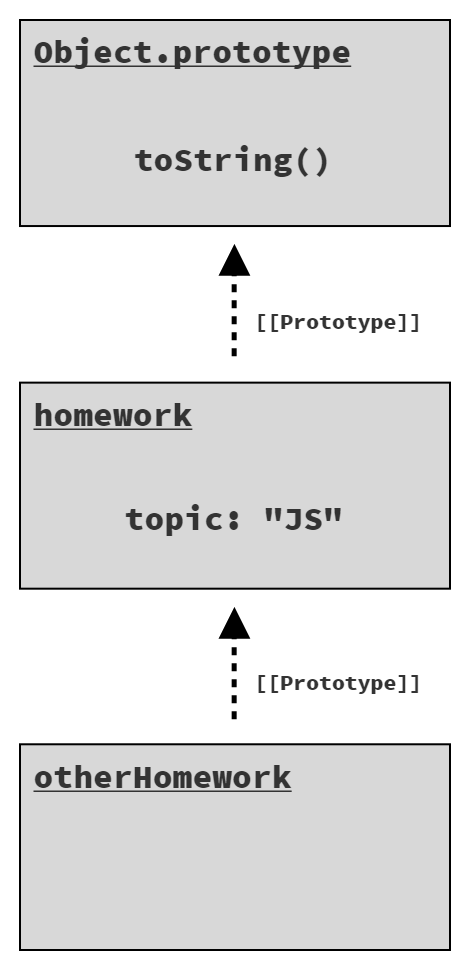
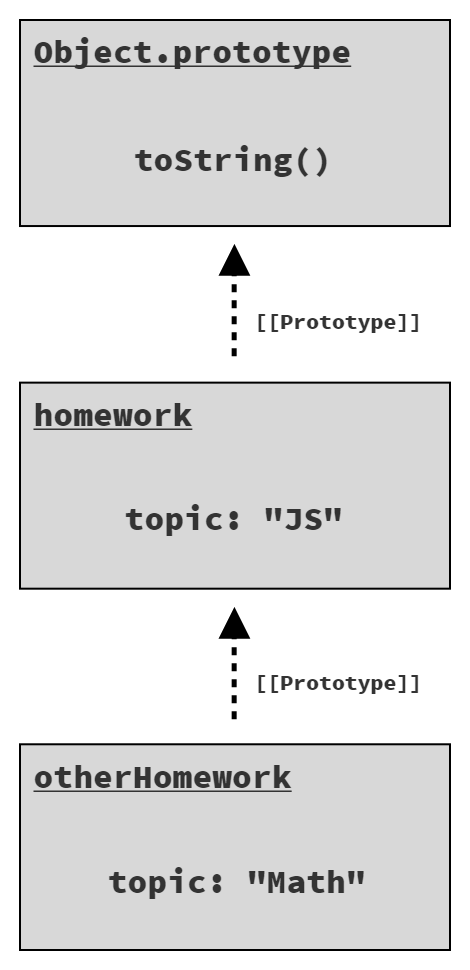
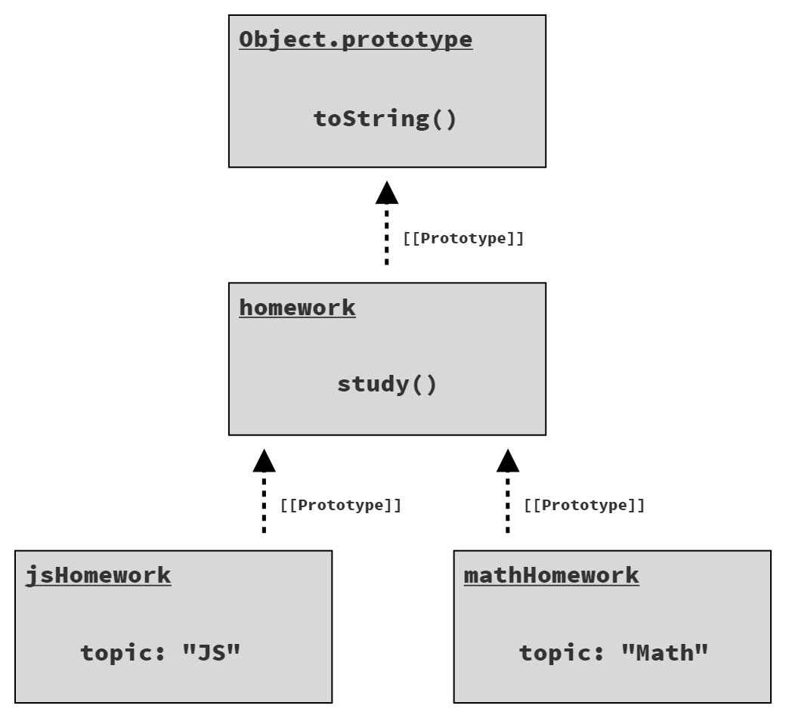

# You Don't Know JS Yet: Get Started - 2nd Edition
# Chapter 3: Digging to the Roots of JS

If you've read Chapters 1 and 2, and taken the time to digest and percolate, you're hopefully starting to *get* JS a little more. If you skipped/skimmed them (especially Chapter 2), I recommend going back to spend some more time with that material.

In Chapter 2, we surveyed syntax, patterns, and behaviors at a high level. In this chapter, our attention shifts to some of the lower-level root characteristics of JS that underpin virtually every line of code we write.

Be aware: this chapter digs much deeper than you're likely used to thinking about a programming language. My goal is to help you appreciate the core of how JS works, what makes it tick. This chapter should begin to answer some of the "Why?" questions that may be cropping up as you explore JS. However, this material is still not an exhaustive exposition of the language; that's what the rest of the book series is for! Our goal here is still just to *get started*, and become more comfortable with, the *feel* of JS, how it ebbs and flows.

Don't run so quickly through this material that you get lost in the weeds. As I've said a dozen times already, **take your time**. Even still, you'll probably finish this chapter with remaining questions. That's OK, because there's a whole book series ahead of you to keep exploring!

## Iteration

Since programs are essentially built to process data (and make decisions on that data), the patterns used to step through the data have a big impact on the program's readability.

The iterator pattern has been around for decades, and suggests a "standardized" approach to consuming data from a source one *chunk* at a time. The idea is that it's more common and helpful to iterate the data source—to progressively handle the collection of data by processing the first part, then the next, and so on, rather than handling the entire set all at once.

Imagine a data structure that represents a relational database `SELECT` query, which typically organizes the results as rows. If this query had only one or a couple of rows, you could handle the entire result set at once, and assign each row to a local variable, and perform whatever operations on that data that were appropriate.

But if the query has 100 or 1,000 (or more!) rows, you'll need iterative processing to deal with this data (typically, a loop).

The iterator pattern defines a data structure called an "iterator" that has a reference to an underlying data source (like the query result rows), which exposes a method like `next()`. Calling `next()` returns the next piece of data (i.e., a "record" or "row" from a database query).

You don't always know how many pieces of data that you will need to iterate through, so the pattern typically indicates completion by some special value or exception once you iterate through the entire set and *go past the end*.

The importance of the iterator pattern is in adhering to a *standard* way of processing data iteratively, which creates cleaner and easier to understand code, as opposed to having every data structure/source define its own custom way of handling its data.

After many years of various JS community efforts around mutually agreed-upon iteration techniques, ES6 standardized a specific protocol for the iterator pattern directly in the language. The protocol defines a `next()` method whose return is an object called an *iterator result*; the object has `value` and `done` properties, where `done` is a boolean that is `false` until the iteration over the underlying data source is complete.

### Consuming Iterators

With the ES6 iteration protocol in place, it's workable to consume a data source one value at a time, checking after each `next()` call for `done` to be `true` to stop the iteration. But this approach is rather manual, so ES6 also included several mechanisms (syntax and APIs) for standardized consumption of these iterators.

One such mechanism is the `for..of` loop:

```js
// given an iterator of some data source:
var it = /* .. */;

// loop over its results one at a time
for (let val of it) {
    console.log(`Iterator value: ${ val }`);
}
// Iterator value: ..
// Iterator value: ..
// ..
```

| NOTE: |
| :--- |
| We'll omit the manual loop equivalent here, but it's definitely less readable than the `for..of` loop! |

Another mechanism that's often used for consuming iterators is the `...` operator. This operator actually has two symmetrical forms: *spread* and *rest* (or *gather*, as I prefer). The *spread* form is an iterator-consumer.

To *spread* an iterator, you have to have *something* to spread it into. There are two possibilities in JS: an array or an argument list for a function call.

An array spread:

```js
// spread an iterator into an array,
// with each iterated value occupying
// an array element position.
var vals = [ ...it ];
```

A function call spread:

```js
// spread an iterator into a function,
// call with each iterated value
// occupying an argument position.
doSomethingUseful( ...it );
```

In both cases, the iterator-spread form of `...` follows the iterator-consumption protocol (the same as the `for..of` loop) to retrieve all available values from an iterator and place (aka, spread) them into the receiving context (array, argument list).

### Iterables

The iterator-consumption protocol is technically defined for consuming *iterables*; an iterable is a value that can be iterated over.

The protocol automatically creates an iterator instance from an iterable, and consumes *just that iterator instance* to its completion. This means a single iterable could be consumed more than once; each time, a new iterator instance would be created and used.

So where do we find iterables?

ES6 defined the basic data structure/collection types in JS as iterables. This includes strings, arrays, maps, sets, and others.

Consider:

```js
// an array is an iterable
var arr = [ 10, 20, 30 ];

for (let val of arr) {
    console.log(`Array value: ${ val }`);
}
// Array value: 10
// Array value: 20
// Array value: 30
```

Since arrays are iterables, we can shallow-copy an array using iterator consumption via the `...` spread operator:

```js
var arrCopy = [ ...arr ];
```

We can also iterate the characters in a string one at a time:

```js
var greeting = "Hello world!";
var chars = [ ...greeting ];

chars;
// [ "H", "e", "l", "l", "o", " ",
//   "w", "o", "r", "l", "d", "!" ]
```

A `Map` data structure uses objects as keys, associating a value (of any type) with that object. Maps have a different default iteration than seen here, in that the iteration is not just over the map's values but instead its *entries*. An *entry* is a tuple (2-element array) including both a key and a value.

Consider:

```js
// given two DOM elements, `btn1` and `btn2`

var buttonNames = new Map();
buttonNames.set(btn1,"Button 1");
buttonNames.set(btn2,"Button 2");

for (let [btn,btnName] of buttonNames) {
    btn.addEventListener("click",function onClick(){
        console.log(`Clicked ${ btnName }`);
    });
}
```

In the `for..of` loop over the default map iteration, we use the `[btn,btnName]` syntax (called "array destructuring") to break down each consumed tuple into the respective key/value pairs (`btn1` / `"Button 1"` and `btn2` / `"Button 2"`).

Each of the built-in iterables in JS expose a default iteration, one which likely matches your intuition. But you can also choose a more specific iteration if necessary. For example, if we want to consume only the values of the above `buttonNames` map, we can call `values()` to get a values-only iterator:

```js
for (let btnName of buttonNames.values()) {
    console.log(btnName);
}
// Button 1
// Button 2
```

Or if we want the index *and* value in an array iteration, we can make an entries iterator with the `entries()` method:

```js
var arr = [ 10, 20, 30 ];

for (let [idx,val] of arr.entries()) {
    console.log(`[${ idx }]: ${ val }`);
}
// [0]: 10
// [1]: 20
// [2]: 30
```

For the most part, all built-in iterables in JS have three iterator forms available: keys-only (`keys()`), values-only (`values()`), and entries (`entries()`).

Beyond just using built-in iterables, you can also ensure your own data structures adhere to the iteration protocol; doing so means you opt into the ability to consume your data with `for..of` loops and the `...` operator. "Standardizing" on this protocol means code that is overall more readily recognizable and readable.

| NOTE: |
| :--- |
| You may have noticed a nuanced shift that occurred in this discussion. We started by talking about consuming **iterators**, but then switched to talking about iterating over **iterables**. The iteration-consumption protocol expects an *iterable*, but the reason we can provide a direct *iterator* is that an iterator is just an iterable of itself! When creating an iterator instance from an existing iterator, the iterator itself is returned. |

## Closure

Perhaps without realizing it, almost every JS developer has made use of closure. In fact, closure is one of the most pervasive programming functionalities across a majority of languages. It might even be as important to understand as variables or loops; that's how fundamental it is.

Yet it feels kind of hidden, almost magical. And it's often talked about in either very abstract or very informal terms, which does little to help us nail down exactly what it is.

We need to be able to recognize where closure is used in programs, as the presence or lack of closure is sometimes the cause of bugs (or even the cause of performance issues).

So let's define closure in a pragmatic and concrete way:

> Closure is when a function remembers and continues to access variables from outside its scope, even when the function is executed in a different scope.

We see two definitional characteristics here. First, closure is part of the nature of a function. Objects don't get closures, functions do. Second, to observe a closure, you must execute a function in a different scope than where that function was originally defined.

Consider:

```js
function greeting(msg) {
    return function who(name) {
        console.log(`${ msg }, ${ name }!`);
    };
}

var hello = greeting("Hello");
var howdy = greeting("Howdy");

hello("Kyle");
// Hello, Kyle!

hello("Sarah");
// Hello, Sarah!

howdy("Grant");
// Howdy, Grant!
```

First, the `greeting(..)` outer function is executed, creating an instance of the inner function `who(..)`; that function closes over the variable `msg`, which is the parameter from the outer scope of `greeting(..)`. When that inner function is returned, its reference is assigned to the `hello` variable in the outer scope. Then we call `greeting(..)` a second time, creating a new inner function instance, with a new closure over a new `msg`, and return that reference to be assigned to `howdy`.

When the `greeting(..)` function finishes running, normally we would expect all of its variables to be garbage collected (removed from memory). We'd expect each `msg` to go away, but they don't. The reason is closure. Since the inner function instances are still alive (assigned to `hello` and `howdy`, respectively), their closures are still preserving the `msg` variables.

These closures are not a snapshot of the `msg` variable's value; they are a direct link and preservation of the variable itself. That means closure can actually observe (or make!) updates to these variables over time.

```js
function counter(step = 1) {
    var count = 0;
    return function increaseCount(){
        count = count + step;
        return count;
    };
}

var incBy1 = counter(1);
var incBy3 = counter(3);

incBy1();       // 1
incBy1();       // 2

incBy3();       // 3
incBy3();       // 6
incBy3();       // 9
```

Each instance of the inner `increaseCount()` function is closed over both the `count` and `step` variables from its outer `counter(..)` function's scope. `step` remains the same over time, but `count` is updated on each invocation of that inner function. Since closure is over the variables and not just snapshots of the values, these updates are preserved.

Closure is most common when working with asynchronous code, such as with callbacks. Consider:

```js
function getSomeData(url) {
    ajax(url,function onResponse(resp){
        console.log(
            `Response (from ${ url }): ${ resp }`
        );
    });
}

getSomeData("https://some.url/wherever");
// Response (from https://some.url/wherever): ...
```

The inner function `onResponse(..)` is closed over `url`, and thus preserves and remembers it until the Ajax call returns and executes `onResponse(..)`. Even though `getSomeData(..)` finishes right away, the `url` parameter variable is kept alive in the closure for as long as needed.

It's not necessary that the outer scope be a function—it usually is, but not always—just that there be at least one variable in an outer scope accessed from an inner function:

```js
for (let [idx,btn] of buttons.entries()) {
    btn.addEventListener("click",function onClick(){
       console.log(`Clicked on button (${ idx })!`);
    });
}
```

Because this loop is using `let` declarations, each iteration gets new block-scoped (aka, local) `idx` and `btn` variables;  the loop also creates a new inner `onClick(..)` function each time. That inner function closes over `idx`, preserving it for as long as the click handler is set on the `btn`. So when each button is clicked, its handler can print its associated index value, because the handler remembers its respective `idx` variable.

Remember: this closure is not over the value (like `1` or `3`), but over the variable `idx` itself.

Closure is one of the most prevalent and important programming patterns in any language. But that's especially true of JS; it's hard to imagine doing anything useful without leveraging closure in one way or another.

If you're still feeling unclear or shaky about closure, the majority of Book 2, *Scope & Closures* is focused on the topic.

## `this` Keyword

One of JS's most powerful mechanisms is also one of its most misunderstood: the `this` keyword. One common misconception is that a function's `this` refers to the function itself. Because of how `this` works in other languages, another misconception is that `this` points the instance that a method belongs to. Both are incorrect.

As discussed previously, when a function is defined, it is *attached* to its enclosing scope via closure. Scope is the set of rules that controls how references to variables are resolved.

But functions also have another characteristic besides their scope that influences what they can access. This characteristic is best described as an *execution context*, and it's exposed to the function via its `this` keyword.

Scope is static and contains a fixed set of variables available at the moment and location you define a function, but a function's execution *context* is dynamic, entirely dependent on **how it is called** (regardless of where it is defined or even called from).

`this` is not a fixed characteristic of a function based on the function's definition, but rather a dynamic characteristic that's determined each time the function is called.

One way to think about the *execution context* is that it's a tangible object whose properties are made available to a function while it executes. Compare that to scope, which can also be thought of as an *object*; except, the *scope object* is hidden inside the JS engine, it's always the same for that function, and its *properties* take the form of identifier variables available inside the function.

```js
function classroom(teacher) {
    return function study() {
        console.log(
            `${ teacher } says to study ${ this.topic }`
        );
    };
}
var assignment = classroom("Kyle");
```

The outer `classroom(..)` function makes no reference to a `this` keyword, so it's just like any other function we've seen so far. But the inner `study()` function does reference `this`, which makes it a `this`-aware function. In other words, it's a function that is dependent on its *execution context*.

| NOTE: |
| :--- |
| `study()` is also closed over the `teacher` variable from its outer scope. |

The inner `study()` function returned by `classroom("Kyle")` is assigned to a variable called `assignment`. So how can `assignment()` (aka `study()`) be called?

```js
assignment();
// Kyle says to study undefined  -- Oops :(
```

In this snippet, we call `assignment()` as a plain, normal function, without providing it any *execution context*.

Since this program is not in strict mode (see Chapter 1, "Strictly Speaking"), context-aware functions that are called **without any context specified** default the context to the global object (`window` in the browser). As there is no global variable named `topic` (and thus no such property on the global object), `this.topic` resolves to `undefined`.

Now consider:

```js
var homework = {
    topic: "JS",
    assignment: assignment
};

homework.assignment();
// Kyle says to study JS
```

A copy of the `assignment` function reference is set as a property on the `homework` object, and then it's called as `homework.assignment()`. That means the `this` for that function call will be the `homework` object. Hence, `this.topic` resolves to `"JS"`.

Lastly:

```js
var otherHomework = {
    topic: "Math"
};

assignment.call(otherHomework);
// Kyle says to study Math
```

A third way to invoke a function is with the `call(..)` method, which takes an object (`otherHomework` here) to use for setting the `this` reference for the function call. The property reference `this.topic` resolves to `"Math"`.

The same context-aware function invoked three different ways, gives different answers each time for what object `this` will reference.

The benefit of `this`-aware functions—and their dynamic context—is the ability to more flexibly re-use a single function with data from different objects. A function that closes over a scope can never reference a different scope or set of variables. But a function that has dynamic `this` context awareness can be quite helpful for certain tasks.

## Prototypes

Where `this` is a characteristic of function execution, a prototype is a characteristic of an object, and specifically resolution of a property access.

Think about a prototype as a linkage between two objects; the linkage is hidden behind the scenes, though there are ways to expose and observe it. This prototype linkage occurs when an object is created; it's linked to another object that already exists.

A series of objects linked together via prototypes is called the "prototype chain."

The purpose of this prototype linkage (i.e., from an object B to another object A) is so that accesses against B for properties/methods that B does not have, are *delegated* to A to handle. Delegation of property/method access allows two (or more!) objects to cooperate with each other to perform a task.

Consider defining an object as a normal literal:

```js
var homework = {
    topic: "JS"
};
```

The `homework` object only has a single property on it: `topic`. However, its default prototype linkage connects to the `Object.prototype` object, which has common built-in methods on it like `toString()` and `valueOf()`, among others.

We can observe this prototype linkage *delegation* from `homework` to `Object.prototype`:

```js
homework.toString();    // [object Object]
```

`homework.toString()` works even though `homework` doesn't have a `toString()` method defined; the delegation invokes `Object.prototype.toString()` instead.

### Object Linkage

To define an object prototype linkage, you can create the object using the `Object.create(..)` utility:

```js
var homework = {
    topic: "JS"
};

var otherHomework = Object.create(homework);

otherHomework.topic;   // "JS"
```

The first argument to `Object.create(..)` specifies an object to link the newly created object to, and then returns the newly created (and linked!) object.

Figure 4 shows how the three objects (`otherHomework`, `homework`, and `Object.prototype`) are linked in a prototype chain:

<figure>
    
    <figcaption><em>Fig. 4: Objects in a prototype chain</em></figcaption>
    <br><br>
</figure>

Delegation through the prototype chain only applies for accesses to lookup the value in a property. If you assign to a property of an object, that will apply directly to the object regardless of where that object is prototype linked to.

| TIP: |
| :--- |
| `Object.create(null)` creates an object that is not prototype linked anywhere, so it's purely just a standalone object; in some circumstances, that may be preferable. |

Consider:

```js
homework.topic;
// "JS"

otherHomework.topic;
// "JS"

otherHomework.topic = "Math";
otherHomework.topic;
// "Math"

homework.topic;
// "JS" -- not "Math"
```

The assignment to `topic` creates a property of that name directly on `otherHomework`; there's no effect on the `topic` property on `homework`. The next statement then accesses `otherHomework.topic`, and we see the non-delegated answer from that new property: `"Math"`.

Figure 5 shows the objects/properties after the assignment that creates the `otherHomework.topic` property:

<figure>
    
    <figcaption><em>Fig. 5: Shadowed property 'topic'</em></figcaption>
    <br><br>
</figure>

The `topic` on `otherHomework` is "shadowing" the property of the same name on the `homework` object in the chain.

| NOTE: |
| :--- |
| Another frankly more convoluted but perhaps still more common way of creating an object with a prototype linkage is using the "prototypal class" pattern, from before `class` (see Chapter 2, "Classes") was added in ES6. We'll cover this topic in more detail in Appendix A, "Prototypal 'Classes'". |

### `this` Revisited

We covered the `this` keyword earlier, but its true importance shines when considering how it powers prototype-delegated function calls. Indeed, one of the main reasons `this` supports dynamic context based on how the function is called is so that method calls on objects which delegate through the prototype chain still maintain the expected `this`.

Consider:

```js
var homework = {
    study() {
        console.log(`Please study ${ this.topic }`);
    }
};

var jsHomework = Object.create(homework);
jsHomework.topic = "JS";
jsHomework.study();
// Please study JS

var mathHomework = Object.create(homework);
mathHomework.topic = "Math";
mathHomework.study();
// Please study Math
```

The two objects `jsHomework` and `mathHomework` each prototype link to the single `homework` object, which has the `study()` function. `jsHomework` and `mathHomework` are each given their own `topic` property (see Figure 6).

<figure>
    
    <figcaption><em>Fig. 6: Two objects linked to a common parent</em></figcaption>
    <br><br>
</figure>

`jsHomework.study()` delegates to `homework.study()`, but its `this` (`this.topic`) for that execution resolves to `jsHomework` because of how the function is called, so `this.topic` is `"JS"`. Similarly for `mathHomework.study()` delegating to `homework.study()` but still resolving `this` to `mathHomework`, and thus `this.topic` as `"Math"`.

The preceding code snippet would be far less useful if `this` was resolved to `homework`. Yet, in many other languages, it would seem `this` would be `homework` because the `study()` method is indeed defined on `homework`.

Unlike many other languages, JS's `this` being dynamic is a critical component of allowing prototype delegation, and indeed `class`, to work as expected!

## Asking "Why?"

The intended take-away from this chapter is that there's a lot more to JS under the hood than is obvious from glancing at the surface.

As you are *getting started* learning and knowing JS more closely, one of the most important skills you can practice and bolster is curiosity, and the art of asking "Why?" when you encounter something in the language.

Even though this chapter has gone quite deep on some of the topics, many details have still been entirely skimmed over. There's much more to learn here, and the path to that starts with you asking the *right* questions of your code. Asking the right questions is a critical skill of becoming a better developer.

In the final chapter of this book, we're going to briefly look at how JS is divided, as covered across the rest of the *You Don't Know JS Yet* book series. Also, don't skip Appendix B of this book, which has some practice code to review some of the main topics covered in this book.
