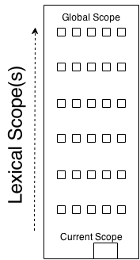

# 你不懂JS：作用域与闭包
# 第一章：什么是作用域？

几乎所有语言的最基础范例之一就是在变量中存储值的能力，并且在稍后取出或修改这些值。事实上，在变量中存储值和取出值的能力，给程序赋予了 *状态*。

如果没有这样的概念，一个程序虽然可以执行一些任务，但是它们将会受到极大的限制而且不会非常有趣。

但是在我们的程序中包含进变量，引出了我们现在将要解决的最有趣的问题：这些变量 *存活* 在哪里？换句话说，它们被存储在哪儿？而且，最重要的是，我们的程序如何在需要它们的时候找到它们？

回答这些问题需要一组明确定义的规则，它定义了如何在某些位置存储变量，和如何在稍后找到这些变量。我们称这组规则为：*作用域*。

但是，这些 *作用域* 规则是在哪里，如何被设置的？

## 编译器理论

根据你与各种编程语言打交道的水平不同，这也许是不证自明的，或者这也许令人吃惊，尽管JavaScript一般被划分到“动态”或者“解释型”语言的范畴，但是其实它是一个编译型语言。它 *不是* 像许多传统意义上的编译型语言那样预先被编译好，编译的结果也不能在各种不同的分布式系统间移植。

但是无论如何，JavaScript引擎在实施许多与传统的语言编译器相同的步骤，虽然是以一种我们平常不能发觉的更精巧的方式。

在传统的编译型语言处理中，一块儿源代码，你的程序，在它被执行 *之前* 典型地将会经历三个步骤，大致被称为“编译”：

1. **分词/词法分析：** 将一连串字符打断成（对于语言来说）有意义的片段，称为token（记号）。举例来说，考虑这段程序：`var a = 2;`。这段程序很可能会被打断成如下token：`var`，`a`，`=`，`2`，和`;`。空格也许会被保留为一个token，这要看它是否是有意义的。

    **注意：** 分词和词法分析之间的区别是微妙和学术上的，其中心在于这些token是否以 *无状态* 或 *有状态* 的方式识别。简而言之，如果分词器去调用有状态的解析规则来弄清`a`是否应当被考虑为一个不同的token，还是只是其他token的一部分，那么这就是 **词法分析**。

2. **解析：** 将一个token的流（数组）转换为一个嵌套元素的树，它总体上表示了程序的语法结构。这棵树称为“AST”（<b>A</b>bstract <b>S</b>yntax <b>T</b>ree —— 抽象语法树）。

    `var a = 2;`的树也许开始于称为`VariableDeclaration`顶层节点，带有一个称为`Identifier`的子节点（它的值为`a`），和另一个称为`AssignmentExpression`的子节点，而这个子节点本身带有一个称为`NumericLiteral`的子节点（它的值为`2`）。

3. **代码生成：** 这个处理将AST转换为可执行的代码。这一部分将根据语言，它的目标平台等因素有很大的不同。

    所以，与其深陷细节，我们不如笼统地说，有一种方法将我们上面描述的`var a = 2;`的AST转换为机器指令，来实际上 *创建* 一个称为`a`的变量（包括分配内存等等），让后再`a`中存入一个值。

    **注意：** 引擎如何管理系统资源的细节远比我们要挖掘的东西深刻，所以我们将理所当然地认为引擎有能力按其需要创建和存储变量。

和大多数其他语言一样，JavaScript引擎要比区区三步复杂太多了。例如，在解析和代码生成的处理中，一定会存在优化执行效率的步骤，包括压缩冗余元素，等等。

所以，我在此描绘的只是大框架。但是我想你很快就会明白为什么我们涵盖的这些细节，虽然是在很高的层次上，是有关系的。

其一，JavaScript引擎没有（像其他语言的编译器那样）大把的时间去优化，因为JavaScript的编译和其他语言不同，不是提前发生在一个编译的步骤中。

对JavaScript来说，在许多情况下，编译发生在代码被执行前的仅仅几微妙之内（或更少！）。为了确保最快的性能，JS引擎将使用所有的招数（比如JIT，它可以懒编译甚至是热编译，等等），而这远超出了我们的关于“作用域”的讨论。

为了简单起见，我们可以说，任何JavaScript代码段在它执行之前（通常是 *刚好* 在它执行之前！）都必须被编译。所以，JS编译器将把程序`var a = 2;`拿过来，并首先编译它，然后准备运行它，通常是立即的。

## 理解作用域

我们将采用的学习作用域的方法，是将这个处理过程想象为一场对话。但是，*谁* 在进行这场对话呢？

### 演员

让我们见一见处理程序`var a = 2;`时进行互动的演员吧，这样我们就能理解稍后将要听到的它们的对话：

1. *引擎*：负责从始至终的编译，和执行我们的JavaScript程序。

2. *编译器*：*引擎* 的朋友；处理所有的解析和代码生成的重活儿（见前一节）。

3. *作用域*：*引擎* 的另一个朋友；收集并维护一张所有被声明的标识符（变量）的列表，并对当前执行中的代码如何访问这些变量强制实施一组严格的规则。

为了 *全面理解* JavaScript是如何工作的，你需要开始像 *引擎*（和它的朋友们）那样 *思考*，问它们问的问题，并像它们一样回答。

### 反复

当你看到程序`var a = 2;`时，你很可能认为它是一个语句。但这不是我们的新朋友 *引擎* 所看到的。事实上，*引擎* 看到两个不同的语句，一个是 *编译器* 将在编译期间处理的，一个是 *引擎* 将在执行期间处理的。

那么，然我们来分解 *引擎* 和它的朋友们将如何处理程序`var a = 2;`。

*编译器* 将对这个程序做的第一件事情，是进行词法分析来将它分解为一系列token，然后这些token被解析为一棵树。但是当 *编译器* 到了代码生成阶段时，它会以一种与我们可能想象的不同的方式来对待这段程序。

一个合理的假设是，*编译器* 将会产生可以用这种假想代码概括的代码：“为一个变量分配内存，将它标记为`a`，然后将值`2`贴在这个变量里”。不幸的是，这不是十分准确。

*编译器* 将会这样处理：

1. 遇到`var a`，*编译器* 让 *作用域* 去查看对于这个特定的作用域集合，变量`a`是否已经存在了。如果是，*编译器* 就忽略这个生命并继续前进。否则，*编译器* 就让 *作用域* 去为这个作用域集合声明一个称为`a`的新变量。

2. 然后 *编译器* 为 *引擎* 生成稍后要执行的代码，来处理赋值`a = 2`。*引擎* 运行的代码首先让 *作用域* 去查看在当前的作用域集合中是否有一个称为`a`的变量可以访问。如果有，*引擎* 就使用这个变量。如果没有，*引擎* 就查看 *其他地方*（参加下面的嵌套 *作用域* 一节）。

如果 *引擎* 最终找到一个变量，它就将值`2`赋予它。如果没有，*引擎* 将会举起它的手并喊出一个错误！

总结来说：对于一个变量赋值，发生了两个不同的动作：第一，*编译器* 声明一个变量（如果先前没有在当前作用域中声明过），第二，当执行时，*引擎* 在 *作用域* 中查询这个变量并给它赋值，如果找到的话。

### Compiler Speak

为了继续更深地理解，我们需要一点儿更多的编译器术语。

当 *引擎* 执行 *编译器* 为第二步产生的代码时，它必须查询变量`a`来看它是否已经被声明过了，而且这个查询是咨询 *作用域* 的。但是 *引擎* 实施的查询的类型会影响查询的结果。

在我们这个例子中，*引擎* 将会对变量`a`实施一个“LHS”查询。另一种查询的类型称为“RHS”。

我打赌你能猜出“L”和“R”是什么意思。这两个术语表示“Left-hand Side（左手边）”和“Right-hand Side（右手边）”

什么的...边？**赋值操作的。**

换言之，当一个变量出现在赋值操作的左手边时，会进行LHS查询，当一个变量出现在赋值操作的右手边时，会进行RHS查询。

实际上，让我们更准确一点儿的话，对于我们的目的来说，一个RHS是不可分辨的，因为它简单地查询某个变量的值，而LHS查询是试着找到变量容器本身，以便它可以赋值。从这种意义上说，RHS的含义实质上不是 *真正的* “一个赋值的右手边”，更准确地说，它只是意味着“不是左手边”。

在这一番油腔滑调之后，你也可以认为“RHS”意味着“取得他/她的源（值）”，暗示着RHS的意思是“去取...的值”。

让我们挖掘得更深一些。

当我说：

```js
console.log( a );
```

这个指向`a`的引用是一个RHS医用，因为这里没有东西被赋值给`a`。而是我们在查询`a`并取得它的值，这样这个值可以被传递进`console.log(..)`。

作为对比：

```js
a = 2;
```

这里指向`a`的引用是一个LHS引用，因为我们实际上不关心当前的值是什么，我们只是想找到这个变量，将它作为`= 2`赋值操作的目标。

**注意：** LHS和RHS意味着“赋值的左/右手边”未必像字面上那样意味着“`=`赋值操作符的左/右边”。赋值有几种其他的发生形式，所以最好在概念上将它考虑为：“复制的目标（LHS）”和“复制的源（RHS）”。

考虑这段程序，它既有LHS引用又有RHS引用：

```js
function foo(a) {
	console.log( a ); // 2
}

foo( 2 );
```

调用`foo(..)`的最后一行作为一个函数调用要求一个指向`foo`的RHS引用，意味着，“去查询`foo`的值，并把它交给我”。另外，`(..)`意味着`foo`的值应当被执行，所以它最好实际上是一个函数！

这里有一个微妙但重要的赋值。**你发现了吗？**

你可能错过了这个代码段隐含的`a = 2`。它发生在当值`2`作为参数传递给`foo(..)`函数时，这时值`2` **被赋值** 给参数`a`。为了（隐含地）给参数`a`赋值，进行了一个LHS查询。

There's also an RHS reference for the value of `a`, and that resulting value is passed to `console.log(..)`. `console.log(..)` needs a reference to execute. It's an RHS look-up for the `console` object, then a property-resolution occurs to see if it has a method called `log`.

这里还有一个`a`的值的RHS引用，它的结果值被传入`console.log(..)`。`console.log(..)`需要一个引用来执行。它为`console`对象进行一个RHS查询，然后发生一个属性解析来看它是否有一个称为`log`的方法。

Finally, we can conceptualize that there's an LHS/RHS exchange of passing the value `2` (by way of variable `a`'s RHS look-up) into `log(..)`. Inside of the native implementation of `log(..)`, we can assume it has parameters, the first of which (perhaps called `arg1`) has an LHS reference look-up, before assigning `2` to it.

最后，我们可以将这一过程概念化为，在将值`2`（通过变量`a`的RHS查询得到的）传入`log(..)`时发生了一次LHS/RHS的交换。在`log(..)`的原生实现内部，我们可以假定它拥有参数，其中的第一个（也许被称为`arg1`）在`2`被赋值给它之前，进行了一次LHS引用查询。

**Note:** You might be tempted to conceptualize the function declaration `function foo(a) {...` as a normal variable declaration and assignment, such as `var foo` and `foo = function(a){...`. In so doing, it would be tempting to think of this function declaration as involving an LHS look-up.

**注意：** 你可能会试图将函数声明`function foo(a) {...`概念化为一个普通的变量声明和赋值，比如`var foo`和`foo = function(a){...`。这样做会诱使你认为函数声明涉及了一次LHS查询。

However, the subtle but important difference is that *Compiler* handles both the declaration and the value definition during code-generation, such that when *Engine* is executing code, there's no processing necessary to "assign" a function value to `foo`. Thus, it's not really appropriate to think of a function declaration as an LHS look-up assignment in the way we're discussing them here.

然而，一个微妙但重要的不同是，*编译器* 处理声明和代码生成期间的值的定义，如此当 *引擎* 执行代码时，没有必要将一个函数值“赋予”`foo`。因此，认为函数声明是一个我们在这里讨论的LSH查询赋值是不太合适的。

### Engine/Scope Conversation
### 引擎/作用域对话

```js
function foo(a) {
	console.log( a ); // 2
}

foo( 2 );
```

Let's imagine the above exchange (which processes this code snippet) as a conversation. The conversation would go a little something like this:

让我们将上面的（处理这个代码段的）交互想象为一场对话。这场对话将会有点儿像这样进行：

> ***Engine***: Hey *Scope*, I have an RHS reference for `foo`. Ever heard of it?
> ***引擎***：嘿 *作用域*，我有一个`foo`的RHS引用。听说过它吗？

> ***Scope***: Why yes, I have. *Compiler* declared it just a second ago. He's a function. Here you go.
> ***作用域***；啊，是的，听说过。*编译器* 刚在一秒钟之前声明了它。它是一个函数。给你。

> ***Engine***: Great, thanks! OK, I'm executing `foo`.
> ***引擎***：太棒了，谢谢！好的，我要执行`foo`了。

> ***Engine***: Hey, *Scope*, I've got an LHS reference for `a`, ever heard of it?
> ***引擎***：嘿，*作用域*，我得到了一个`a`的LHS引用，听说过它吗？

> ***Scope***: Why yes, I have. *Compiler* declared it as a formal parameter to `foo` just recently. Here you go.
> ***作用域***：啊，是的，听说过。*编译器* 刚才将它声明为`foo`的一个正式参数了。给你。

> ***Engine***: Helpful as always, *Scope*. Thanks again. Now, time to assign `2` to `a`.
> ***引擎***：一如既往的给力，*作用域*。再次感谢你。现在，该把`2`赋值给`a`了。

> ***Engine***: Hey, *Scope*, sorry to bother you again. I need an RHS look-up for `console`. Ever heard of it?
> ***引擎***：嘿，*作用域*，很抱歉又一次打扰你。我需要RHS查询`console`。听说过它吗？

> ***Scope***: No problem, *Engine*, this is what I do all day. Yes, I've got `console`. He's built-in. Here ya go.
> ***作用域***：没问题，*引擎*，这是我一天到晚的工作。是的，我得到`console`了。它是一个内建对象。给你。

> ***Engine***: Perfect. Looking up `log(..)`. OK, great, it's a function.
> ***引擎***：完美。查找`log(..)`。好的，很好，它是一个函数。

> ***Engine***: Yo, *Scope*. Can you help me out with an RHS reference to `a`. I think I remember it, but just want to double-check.
> ***引擎***：嘿，*作用域*。你能帮我查一下`a`的RHS引用吗？我想记得它，但只是想再次确认一下。

> ***Scope***: You're right, *Engine*. Same guy, hasn't changed. Here ya go.
> ***作用域***：你是对的，*引擎*。同一个家伙，没变。给你。

> ***Engine***: Cool. Passing the value of `a`, which is `2`, into `log(..)`.
> ***引擎***：酷。传递`a`的值，也就是`2`，给`log(..)`。

> ...

### 小测验

Check your understanding so far. Make sure to play the part of *Engine* and have a "conversation" with the *Scope*:

检查你目前为止的理解。确保你扮演 *引擎*，并与 *作用域* “对话”：

```js
function foo(a) {
	var b = a;
	return a + b;
}

var c = foo( 2 );
```

1. Identify all the LHS look-ups (there are 3!).

2. Identify all the RHS look-ups (there are 4!).

**Note:** See the chapter review for the quiz answers!

**注意：** 小测验答案参见本章的复习部分！

## Nested Scope

## 嵌套作用域

We said that *Scope* is a set of rules for looking up variables by their identifier name. There's usually more than one *Scope* to consider, however.

Just as a block or function is nested inside another block or function, scopes are nested inside other scopes. So, if a variable cannot be found in the immediate scope, *Engine* consults the next outer containing scope, continuing until found or until the outermost (aka, global) scope has been reached.

Consider:

```js
function foo(a) {
	console.log( a + b );
}

var b = 2;

foo( 2 ); // 4
```

The RHS reference for `b` cannot be resolved inside the function `foo`, but it can be resolved in the *Scope* surrounding it (in this case, the global).

So, revisiting the conversations between *Engine* and *Scope*, we'd overhear:

> ***Engine***: "Hey, *Scope* of `foo`, ever heard of `b`? Got an RHS reference for it."

> ***Scope***: "Nope, never heard of it. Go fish."

> ***Engine***: "Hey, *Scope* outside of `foo`, oh you're the global *Scope*, ok cool. Ever heard of `b`? Got an RHS reference for it."

> ***Scope***: "Yep, sure have. Here ya go."

The simple rules for traversing nested *Scope*: *Engine* starts at the currently executing *Scope*, looks for the variable there, then if not found, keeps going up one level, and so on. If the outermost global scope is reached, the search stops, whether it finds the variable or not.

### Building on Metaphors

To visualize the process of nested *Scope* resolution, I want you to think of this tall building.



The building represents our program's nested *Scope* rule set. The first floor of the building represents your currently executing *Scope*, wherever you are. The top level of the building is the global *Scope*.

You resolve LHS and RHS references by looking on your current floor, and if you don't find it, taking the elevator to the next floor, looking there, then the next, and so on. Once you get to the top floor (the global *Scope*), you either find what you're looking for, or you don't. But you have to stop regardless.

## Errors

Why does it matter whether we call it LHS or RHS?

Because these two types of look-ups behave differently in the circumstance where the variable has not yet been declared (is not found in any consulted *Scope*).

Consider:

```js
function foo(a) {
	console.log( a + b );
	b = a;
}

foo( 2 );
```

When the RHS look-up occurs for `b` the first time, it will not be found. This is said to be an "undeclared" variable, because it is not found in the scope.

If an RHS look-up fails to ever find a variable, anywhere in the nested *Scope*s, this results in a `ReferenceError` being thrown by the *Engine*. It's important to note that the error is of the type `ReferenceError`.

By contrast, if the *Engine* is performing an LHS look-up and arrives at the top floor (global *Scope*) without finding it, and if the program is not running in "Strict Mode" [^note-strictmode], then the global *Scope* will create a new variable of that name **in the global scope**, and hand it back to *Engine*.

*"No, there wasn't one before, but I was helpful and created one for you."*

"Strict Mode" [^note-strictmode], which was added in ES5, has a number of different behaviors from normal/relaxed/lazy mode. One such behavior is that it disallows the automatic/implicit global variable creation. In that case, there would be no global *Scope*'d variable to hand back from an LHS look-up, and *Engine* would throw a `ReferenceError` similarly to the RHS case.

Now, if a variable is found for an RHS look-up, but you try to do something with its value that is impossible, such as trying to execute-as-function a non-function value, or reference a property on a `null` or `undefined` value, then *Engine* throws a different kind of error, called a `TypeError`.

`ReferenceError` is *Scope* resolution-failure related, whereas `TypeError` implies that *Scope* resolution was successful, but that there was an illegal/impossible action attempted against the result.

## Review (TL;DR)

Scope is the set of rules that determines where and how a variable (identifier) can be looked-up. This look-up may be for the purposes of assigning to the variable, which is an LHS (left-hand-side) reference, or it may be for the purposes of retrieving its value, which is an RHS (right-hand-side) reference.

LHS references result from assignment operations. *Scope*-related assignments can occur either with the `=` operator or by passing arguments to (assign to) function parameters.

The JavaScript *Engine* first compiles code before it executes, and in so doing, it splits up statements like `var a = 2;` into two separate steps:

1. First, `var a` to declare it in that *Scope*. This is performed at the beginning, before code execution.

2. Later, `a = 2` to look up the variable (LHS reference) and assign to it if found.

Both LHS and RHS reference look-ups start at the currently executing *Scope*, and if need be (that is, they don't find what they're looking for there), they work their way up the nested *Scope*, one scope (floor) at a time, looking for the identifier, until they get to the global (top floor) and stop, and either find it, or don't.

Unfulfilled RHS references result in `ReferenceError`s being thrown. Unfulfilled LHS references result in an automatic, implicitly-created global of that name (if not in "Strict Mode" [^note-strictmode]), or a `ReferenceError` (if in "Strict Mode" [^note-strictmode]).

### Quiz Answers

```js
function foo(a) {
	var b = a;
	return a + b;
}

var c = foo( 2 );
```

1. Identify all the LHS look-ups (there are 3!).

	**`c = ..`, `a = 2` (implicit param assignment) and `b = ..`**

2. Identify all the RHS look-ups (there are 4!).

    **`foo(2..`, `= a;`, `a + ..` and `.. + b`**


[^note-strictmode]: MDN: [Strict Mode](https://developer.mozilla.org/en-US/docs/Web/JavaScript/Reference/Functions_and_function_scope/Strict_mode)
