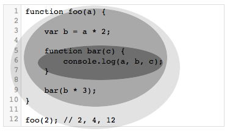

# 你不懂JS：作用域与闭包
# 第二章：词法作用域

在第一章中，我们将“作用域”定义为一组规则，它主宰着 *引擎* 如何通过标识符名称在当前的 *作用域*，或者在包含它的任意 *嵌套作用域* 中来查询一个变量，

作用域的工作方式有两种占统治地位的模型。其中的第一种是最最常见，在绝大多数的编程语言中被使用的。它称为 **词法作用域**，我们将深入检视它。另一种仍然被一些语言（比如 Bash 脚本，Perl 中的一些模式，等等）使用的模型，称为 **动态作用域**。

动态作用域在附录A中讲解。我在这里提到它仅仅是为词法作用域提供一个对比，而词法作用域是 JavaScript 所采用的作用域模型。

## 词法分析时

正如我们在第一章中讨论的，标准语言编译器的第一个传统步骤称为词法分析（也就是分词）。如果你回忆一下，词法分析处理是检查一串源代码字符，并给 token 赋予语法含义作为某种有状态解析的输出。

正是这个概念给理解词法作用域是什么提供了基础，它也是这个名字的渊源。

要定义它有点儿兜圈子，词法作用域是在词法分析时被定义的作用域。换句话说，词法作用域是基于，你，在写程序时，变量和作用域的块儿在何处被编写决定的，因此它在词法分析器处理你的代码时（基本上）是固定不变的。

**注意：** 我们将会稍稍看到有一些方法可以骗过词法作用域，从而在词法分析器处理过后改变它，但是这些方法都是使人皱眉头的。事实上公认的最佳实践是，将词法作用域看作是仅仅依靠词法的，因此自然而然地完全是编写时决定的。

让我们考虑这段代码：

```js
function foo(a) {

	var b = a * 2;

	function bar(c) {
		console.log( a, b, c );
	}

	bar(b * 3);
}

foo( 2 ); // 2 4 12
```

在这个代码实例中有三个固有的嵌套作用域。将这些作用域考虑为套在一起的气泡可能有助于思考。



**气泡1** 包围着全局作用域，它里面只有一个标识符：`foo`。

**气泡2** 包围着作用域 `foo`，它含有三个标识符：`a`，`bar` 和 `b`。

**气泡3** 包围着作用域 `bar`，它里面只包含一个标识符：`c`。

作用域气泡是根据作用域的块儿被写在何处定义的，一个嵌套在另一个内部，等等。在下一章中，我们将讨论作用域的不同单位，但是就现在来说，让我们认为每一个函数创建了一个新的作用域气泡。

`bar` 的气泡完全被包含在 `foo` 的气泡中，因为（而且只因为）这就是我们选择定义函数 `bar` 的位置。

注意这些嵌套的气泡是严格嵌套的。我们没有讨论气泡可以跨越边界的维恩图（Venn diagrams）。换句话说，没有那个函数的气泡可以同时（部分地）存在于另外两个外部的作用域气泡中，就像没有函数可以部分地存在于它的两个父函数中一样。

### 查询

这些作用域气泡的结构和相对位置完全解释了 *引擎* 在查找一个标识符时，它需要查看的所有地方。

在上面的代码段中，*引擎* 执行语句 `console.log(..)` 并开始查找三个被引用的变量 `a`，`b` 和 `c`。它首先从最内部的作用域气泡开始，也就是 `bar(..)` 函数的作用域。在这里它找不到 `a`，所以它向上走一层，到外面下一个最近的作用域气泡，`foo(..)` 的作用域。它在这里找到了 `a`，于是它就使用这个 `a`。同样的事情也发生在 `b` 身上。但是对于 `c`，它在 `bar(..)` 内部就找到了。

如果在 `bar(..)` 内部和 `foo(..)` 内部都有一个 `c`，那么 `console.log(..)` 语句将会找到并使用 `bar(..)` 中的那一个，绝不会到达 `foo(..)` 中的那一个。

**一旦找到第一个匹配，作用域查询就停止了**。相同的标识符名称可以在嵌套作用域的多个层中被指定，这称为“遮蔽（shadowing）”（内部的标识符“遮蔽”了外部的标识符）。无论如何遮蔽，作用域查询总是从当前被执行的最内侧的作用域开始，向外/向上不断查找，直到第一个匹配才停止。

**注意：** 全局变量也自动地是全局对象（在浏览器中是 `window`，等等）的属性，所以不直接通过全局变量的词法名称，而通过将它作为全局对象的一个属性引用来间接地引用，是可能的。

```js
window.a
```

这种技术给出了访问全局变量的方法，没有它全局变量将因为被遮蔽而不可访问。然而，被遮蔽的非全局变量是无法访问的。

不管函数是从 *哪里* 被调用的，也不论它是 *如何* 被调用的，它的词法作用域是由这个函数被声明的位置 **唯一** 定义的。

词法作用域查询 *仅仅* 在处理头等标识符时实施，比如 `a`，`b`，和 `c`。如果你在一段代码中拥有一个 `foo.bar.baz` 的引用，词法作用域查询将在查找 `foo` 标识符时实施，但一旦定位这个变量，对象属性访问规则将会分别接管 `bar` 和 `baz` 属性的解析。

## 欺骗词法作用域

如果词法作用域是由函数被声明的位置唯一定义的，而且这个位置完全是一个编写时的决定，那么怎么可能有办法在运行时“修改”（也就是，作弊欺骗）词法作用域呢？

JavaScript 有两种这样的机制。在广大的社区中它们都等同地被认为是让人皱眉头的，在你代码中使用它们是一种差劲儿的做法。但是关于它们的常见的争论经常错过了最重要的一点：**欺骗词法作用域会导致更低下的性能。**

在我讲解性能的问题以前，先让我们看看这两种机制是如何工作的。

### `eval`

JavaScript 中的 `eval(..)` 函数接收一个字符串作为参数值，并将这个字符串的内容看作是好像它已经被实际编写在程序的那个位置上。换句话说，你可以用编程的方式在你编写好的代码内部生成代码，而且你可以运行这个生成的代码，就好像它在编写时就已经在那里了一样。

如果以这种观点来评价 `eval(..)`，那么 `eval(..)` 是如何允许你修改词法作用域环境应当是很清楚的：欺骗并假装这个编写时（也就是，词法）代码一直就在那里。

在 `eval(..)` 被执行的后续代码行中，*引擎* 将不会“知道”或“关心”前面的代码是被动态翻译的，而且因此修改了词法作用域环境。*引擎* 将会像它一直做的那样，简单地进行词法作用域查询。

考虑如下代码：

```js
function foo(str, a) {
	eval( str ); // 作弊！
	console.log( a, b );
}

var b = 2;

foo( "var b = 3;", 1 ); // 1 3
```

在 `eval(..)` 调用的位置上，字符串 `"var b = 3"` 被看作是一直就存在在那里的代码。因为这个代码恰巧声明了一个新的变量 `b`，它就修改了现存的 `foo(..)` 的词法作用域。事实上，就像上面提到的那样，这个代码实际上在 `foo(..)` 内部创建了变量 `b`，它遮蔽了声明在外部（全局）作用域中的 `b`。

当 `console.log(..)` 调用发生时，它会在 `foo(..)` 的作用域中找到 `a` 和 `b`，而且绝不会找到外部的 `b`。这样，我们就打印出 "1 3" 而不是一般情况下的 "1 2"。

**注意：** 在这个例子中，为了简单起见，我们传入的“代码”字符串是固定的文字。但是它可以通过根据你的程序逻辑将字符拼接在一起，很容易地以编程方式创建。`eval(..)` 通常被用于执行动态创建的代码，因为动态地对一段实质上源自字符串字面值的静态代码进行求值，并不会比直接编写这样的代码带来更多真正的好处。

默认情况下，如果 `eval(..)` 执行的代码字符串包含一个或多个声明（变量或函数）的话，这个动作就会修改这个 `eval(..)` 所在的词法作用域。技术上讲，`eval(..)` 可以通过种种技巧（超出了我们这里的讨论范围）被“间接”调用，而使它在全局作用域的上下文中执行，以此修改全局作用域。但不论那种情况，`eval(..)` 都可以在运行时修改一个编写时的词法作用域。

**注意：** 当 `eval(..)` 被用于一个操作它自己的词法作用域的 strict 模式程序时，在 `eval(..)` 内部做出的声明不会实际上修改包围它的作用域。

```js
function foo(str) {
   "use strict";
   eval( str );
   console.log( a ); // ReferenceError: a is not defined
}

foo( "var a = 2" );
```

在 JavaScript 中还有其他的工具拥有与 `eval(..)` 非常类似的效果。`setTimeout(..)` 和 `setInterval(..)` *可以* 为它们各自的第一个参数值接收一个字符串，其内容将会被 `eval` 为一个动态生成的函数的代码。这种老旧的，遗产行为早就被废弃了。别这么做！

`new Function(..)` 函数构造器类似地为它的 **最后** 一个参数值接收一个代码字符串，来把它转换为一个动态生成的函数（前面的参数值，如果有的话，将作为新函数的形式参数）。这种函数构造器语法要比 `eval(..)` 稍稍安全一些，但在你的代码中它仍然应当被避免。

在你的代码中动态生成代码的用例少的不可思议，因为在性能上的倒退使得这种能力几乎总是得不偿失。

### `with`

JavaScript 的另一个使人皱眉头（而且现在被废弃了！），而且可以欺骗词法作用域的特性是 `with` 关键字。有许多种合法的方式可以讲解 `with`，但是我在此选择从它如何与词法作用域互动并影响词法作用域的角度来讲解它。

讲解 `with` 的常见方式是作为一种缩写，来引用一个对象的多个属性，而 *不必* 每次都重复对象引用本身。

例如：

```js
var obj = {
	a: 1,
	b: 2,
	c: 3
};

//  重复“obj”显得更“繁冗”
obj.a = 2;
obj.b = 3;
obj.c = 4;

// “更简单”的缩写
with (obj) {
	a = 3;
	b = 4;
	c = 5;
}
```

然而，这里发生的事情要比只是一个对象属性访问的便捷缩写要多得多。考虑如下代码：

```js
function foo(obj) {
	with (obj) {
		a = 2;
	}
}

var o1 = {
	a: 3
};

var o2 = {
	b: 3
};

foo( o1 );
console.log( o1.a ); // 2

foo( o2 );
console.log( o2.a ); // undefined
console.log( a ); // 2 -- 哦，全局作用域被泄漏了！
```

在这个代码示例中，创建了两个对象 `o1` 和 `o2`。一个有 `a` 属性，而另一个没有。`foo(..)` 函数接收一个对象引用 `obj` 作为参数值，并在这个引用上调用 `with (obj) {..}`。在 `with` 块儿内部，我们制造了一个变量 `a` 的看似是普通词法引用的东西，实际上是一个 LHS 引用（见第一章），并将值 `2` 赋予它。

当我们传入 `o1` 时，赋值 `a = 2` 找到属性 `o1.a` 并赋予它值 `2`，正如在后续的 `console.log(o1.a)` 语句中反映出的那样。然而，当我们传入 `o2`，因为它没有 `a` 属性，没有这样的属性被创建，所以 `o2.a` 还是 `undefined`。

但是之后我们注意到一个特别的副作用，赋值 `a = 2` 创建了一个全局变量 `a`。这怎么可能？

`with` 语句接收一个对象，这个对象有0个或多个属性，并 **将这个对象视为好像它是一个完全隔离的词法作用域**，因此这个对象的属性被视为在这个“作用域”中词法定义的标识符。

**注意：** 尽管一个 `with` 块儿将一个对象视为一个词法作用域，但是在 `with` 块儿内部的一个普通 `var` 声明将不会归于这个 `with` 块儿的作用域，而是归于包含它的函数作用域。

如果 `eval(..)` 函数接收一个含有一个或多个声明的代码字符串，它就会修改现存的词法作用域，而 `with` 语句实际上是从你传递给它的对象中凭空制造了一个 **全新的词法作用域**。

以这种方式理解的话，当我们传入 `o1` 时 `with` 语句声明的“作用域”就是 `o1`，而且这个“作用域”拥有一个对应于 `o1.a` 属性的“标识符”。但当我们使用 `o2` 作为“作用域”时，它里面没有这样的 `a` “标识符”，于是 LHS 标识符查询（见第一章）的普通规则发生了。

“作用域” `o2` 中没有，`foo(..)` 的作用域中也没有，甚至连全局作用域中都没有找到标识符 `a`，所以当 `a = 2` 被执行时，其结果就是自动全局变量被创建（因为我们没有在 strict 模式下）。

`with` 在运行时将一个对象和它的属性转换为一个带有“标识符”的“作用域”，这个奇怪想法有些烧脑。但是对于我们看到的结果来说，这是我能给出的最清晰的解释。

**注意：** 除了使用它们是个坏主意以外，`eval(..)` 和 `with` 都受Strict模式的影响（制约）。`with` 干脆就不允许使用，而虽然 `eval(..)` 还保有其核心功能，但各种间接形式的或不安全的 `eval(..)` 是不允许的。

### 性能

通过在运行时修改，或创建新的词法作用域，`eval(..)` 和 `with` 都可以欺骗编写时定义的词法作用域。

你可能会问，那又有什么大不了的？如果它们提供了更精巧的功能和编码灵活性，那它们不是 *好的* 特性吗？**不。**

JavaScript *引擎* 在编译阶段期行许多性能优化工作。其中的一些优化原理都归结为实质上在进行词法分析时可以静态地分析代码，并提前决定所有的变量和函数声明都在什么位置，这样在执行期间就可以少花些力气来解析标识符。

但如果 *引擎* 在代码中发现一个 `eval(..)` 或 `with`，它实质上就不得不 *假定* 自己知道的所有的标识符的位置可能是无效的，因为它不可能在词法分析时就知道你将会向`eval(..)`传递什么样的代码来修改词法作用域，或者你可能会向`with`传递的对象有什么样的内容来创建一个新的将被查询的词法作用域。

换句话说，悲观地看，如果 `eval(..)` 或 `with` 出现，那么它 *将* 做的几乎所有的优化都会变得没有意义，所以它就会简单地根本不做任何优化。

你的代码几乎肯定会趋于运行的更慢，只因为你在代码的任何地方引入了一个了 `eval(..)` 或 `with`。无论 *引擎* 将在努力限制这些悲观臆测的副作用上表现得多么聪明，**都没有任何办法可以绕过这个事实：没有优化，代码就运行的更慢。**

## 复习

词法作用域意味着作用域是由编写时函数被声明的位置的决策定义的。编译器的词法分析阶段实质上可以知道所有的标识符是在哪里和如何声明的，并如此在执行期间预测它们将如何被查询。

在 JavaScript 中有两种机制可以“欺骗”词法作用域：`eval(..)` 和 `with`。前者可以通过对一个拥有一个或多个声明的“代码”字符串进行求值，来（在运行时）修改现存的词法作用域。后者实质上是通过将一个对象引用看作一个“作用域”，并将这个对象的属性看作作用域中的标识符，（同样，也是在运行时）创建一个全新的词法作用域。

这些机制的缺点是，它压制了 *引擎* 在作用域查询上进行编译期优化的能力，因为 *引擎* 不得不悲观地假定这样的优化是无效的。这两种特性的结果就是代码 *将* 会运行的更慢。**不要使用它们。**
