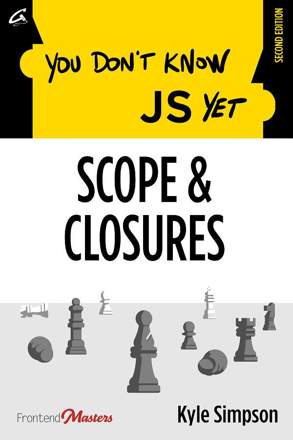

# You Don't Know JS Yet: Scope & Closures - 2nd Edition

-----

**[Purchase ebook/PDF from Leanpub](https://leanpub.com/ydkjsy-scope-closures)**

-----

[Table of Contents](toc.md)

* [Foreword](foreword.md) (by [Sarah Drasner](https://sarah.dev/))
* [Preface](../preface.md)
* [Chapter 1: What's the Scope?](ch1.md)
* [Chapter 2: Illustrating Lexical Scope](ch2.md)
* [Chapter 3: The Scope Chain](ch3.md)
* [Chapter 4: Around the Global Scope](ch4.md)
* [Chapter 5: The (Not So) Secret Lifecycle of Variables](ch5.md)
* [Chapter 6: Limiting Scope Exposure](ch6.md)
* [Chapter 7: Using Closures](ch7.md)
* [Chapter 8: The Module Pattern](ch8.md)
* [Appendix A: Exploring Further](apA.md)
* [Appendix B: Practice](apB.md)
