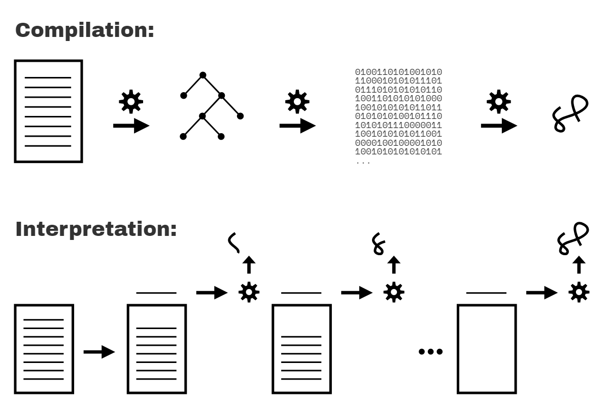

# You Don't Know JS Yet: Scope & Closures - 2nd Edition
# Chapter 1: What's the Scope?

By the time you've written your first few programs, you're likely getting somewhat comfortable with creating variables and storing values in them. Working with variables is one of the most foundational things we do in programming!

But you may not have considered very closely the underlying mechanisms used by the engine to organize and manage these variables. I don't mean how the memory is allocated on the computer, but rather: how does JS know which variables are accessible by any given statement, and how does it handle two variables of the same name?

The answers to questions like these take the form of well-defined rules called scope. This book will dig through all aspects of scope—how it works, what it's useful for, gotchas to avoid—and then point toward common scope patterns that guide the structure of programs.

Our first step is to uncover how the JS engine processes our program **before** it runs.

## About This Book

Welcome to book 2 in the *You Don't Know JS Yet* series! If you already finished *Get Started* (the first book), you're in the right spot! If not, before you proceed I encourage you to *start there* for the best foundation.

Our focus will be the first of three pillars in the JS language: the scope system and its function closures, as well as the power of the module design pattern.

JS is typically classified as an interpreted scripting language, so it's assumed by most that JS programs are processed in a single, top-down pass. But JS is in fact parsed/compiled in a separate phase **before execution begins**. The code author's decisions on where to place variables, functions, and blocks with respect to each other are analyzed according to the rules of scope, during the initial parsing/compilation phase. The resulting scope structure is generally unaffected by runtime conditions.

JS functions are themselves first-class values; they can be assigned and passed around just like numbers or strings. But since these functions hold and access variables, they maintain their original scope no matter where in the program the functions are eventually executed. This is called closure.

Modules are a code organization pattern characterized by public methods that have privileged access (via closure) to hidden variables and functions in the internal scope of the module.

## Compiled vs. Interpreted

You may have heard of *code compilation* before, but perhaps it seems like a mysterious black box where source code slides in one end and executable programs pop out the other.

It's not mysterious or magical, though. Code compilation is a set of steps that process the text of your code and turn it into a list of instructions the computer can understand. Typically, the whole source code is transformed at once, and those resulting instructions are saved as output (usually in a file) that can later be executed.

You also may have heard that code can be *interpreted*, so how is that different from being *compiled*?

Interpretation performs a similar task to compilation, in that it transforms your program into machine-understandable instructions. But the processing model is different. Unlike a program being compiled all at once, with interpretation the source code is transformed line by line; each line or statement is executed before immediately proceeding to processing the next line of the source code.

<figure>
    
    <figcaption><em>Fig. 1: Compiled vs. Interpreted Code</em></figcaption>
    <br><br>
</figure>

Figure 1 illustrates compilation vs. interpretation of programs.

Are these two processing models mutually exclusive? Generally, yes. However, the issue is more nuanced, because interpretation can actually take other forms than just operating line by line on source code text. Modern JS engines actually employ numerous variations of both compilation and interpretation in the handling of JS programs.

Recall that we surveyed this topic in Chapter 1 of the *Get Started* book. Our conclusion there is that JS is most accurately portrayed as a **compiled language**. For the benefit of readers here, the following sections will revisit and expand on that assertion.

## Compiling Code

But first, why does it even matter whether JS is compiled or not?

Scope is primarily determined during compilation, so understanding how compilation and execution relate is key in mastering scope.

In classic compiler theory, a program is processed by a compiler in three basic stages:

1. **Tokenizing/Lexing:** breaking up a string of characters into meaningful (to the language) chunks, called tokens. For instance, consider the program: `var a = 2;`. This program would likely be broken up into the following tokens: `var`, `a`, `=`, `2`, and `;`. Whitespace may or may not be persisted as a token, depending on whether it's meaningful or not.

    (The difference between tokenizing and lexing is subtle and academic, but it centers on whether or not these tokens are identified in a *stateless* or *stateful* way. Put simply, if the tokenizer were to invoke stateful parsing rules to figure out whether `a` should be considered a distinct token or just part of another token, *that* would be **lexing**.)

2. **Parsing:** taking a stream (array) of tokens and turning it into a tree of nested elements, which collectively represent the grammatical structure of the program. This is called an Abstract Syntax Tree (AST).

    For example, the tree for `var a = 2;` might start with a top-level node called `VariableDeclaration`, with a child node called `Identifier` (whose value is `a`), and another child called `AssignmentExpression` which itself has a child called `NumericLiteral` (whose value is `2`).

3. **Code Generation:** taking an AST and turning it into executable code. This part varies greatly depending on the language, the platform it's targeting, and other factors.

    The JS engine takes the just described AST for `var a = 2;` and turns it into a set of machine instructions to actually *create* a variable called `a` (including reserving memory, etc.), and then store a value into `a`.

| NOTE: |
| :--- |
| The implementation details of a JS engine (utilizing system memory resources, etc.) is much deeper than we will dig here. We'll keep our focus on the observable behavior of our programs and let the JS engine manage those deeper system-level abstractions. |

The JS engine is vastly more complex than *just* these three stages. In the process of parsing and code generation, there are steps to optimize the performance of the execution (i.e., collapsing redundant elements). In fact, code can even be re-compiled and re-optimized during the progression of execution.

So, I'm painting only with broad strokes here. But you'll see shortly why *these* details we *do* cover, even at a high level, are relevant.

JS engines don't have the luxury of an abundance of time to perform their work and optimizations, because JS compilation doesn't happen in a build step ahead of time, as with other languages. It usually must happen in mere microseconds (or less!) right before the code is executed. To ensure the fastest performance under these constraints, JS engines use all kinds of tricks (like JITs, which lazy compile and even hot re-compile); these are well beyond the "scope" of our discussion here.

### Required: Two Phases

To state it as simply as possible, the most important observation we can make about processing of JS programs is that it occurs in (at least) two phases: parsing/compilation first, then execution.

The separation of a parsing/compilation phase from the subsequent execution phase is observable fact, not theory or opinion. While the JS specification does not require "compilation" explicitly, it requires behavior that is essentially only practical with a compile-then-execute approach.

There are three program characteristics you can observe to prove this to yourself: syntax errors, early errors, and hoisting.

#### Syntax Errors from the Start

Consider this program:

```js
var greeting = "Hello";

console.log(greeting);

greeting = ."Hi";
// SyntaxError: unexpected token .
```

This program produces no output (`"Hello"` is not printed), but instead throws a `SyntaxError` about the unexpected `.` token right before the `"Hi"` string. Since the syntax error happens after the well-formed `console.log(..)` statement, if JS was executing top-down line by line, one would expect the `"Hello"` message being printed before the syntax error being thrown. That doesn't happen.

In fact, the only way the JS engine could know about the syntax error on the third line, before executing the first and second lines, is by the JS engine first parsing the entire program before any of it is executed.

#### Early Errors

Next, consider:

```js
console.log("Howdy");

saySomething("Hello","Hi");
// Uncaught SyntaxError: Duplicate parameter name not
// allowed in this context

function saySomething(greeting,greeting) {
    "use strict";
    console.log(greeting);
}
```

The `"Howdy"` message is not printed, despite being a well-formed statement.

Instead, just like the snippet in the previous section, the `SyntaxError` here is thrown before the program is executed. In this case, it's because strict-mode (opted in for only the `saySomething(..)` function here) forbids, among many other things, functions to have duplicate parameter names; this has always been allowed in non-strict-mode.

The error thrown is not a syntax error in the sense of being a malformed string of tokens (like `."Hi"` prior), but in strict-mode is nonetheless required by the specification to be thrown as an "early error" before any execution begins.

But how does the JS engine know that the `greeting` parameter has been duplicated? How does it know that the `saySomething(..)` function is even in strict-mode while processing the parameter list (the `"use strict"` pragma appears only later, in the function body)?

Again, the only reasonable explanation is that the code must first be *fully* parsed before any execution occurs.

#### Hoisting

Finally, consider:

```js
function saySomething() {
    var greeting = "Hello";
    {
        greeting = "Howdy";  // error comes from here
        let greeting = "Hi";
        console.log(greeting);
    }
}

saySomething();
// ReferenceError: Cannot access 'greeting' before
// initialization
```

The noted `ReferenceError` occurs from the line with the statement `greeting = "Howdy"`. What's happening is that the `greeting` variable for that statement belongs to the declaration on the next line, `let greeting = "Hi"`, rather than to the previous `var greeting = "Hello"` statement.

The only way the JS engine could know, at the line where the error is thrown, that the *next statement* would declare a block-scoped variable of the same name (`greeting`) is if the JS engine had already processed this code in an earlier pass, and already set up all the scopes and their variable associations. This processing of scopes and declarations can only accurately be accomplished by parsing the program before execution.

The `ReferenceError` here technically comes from `greeting = "Howdy"` accessing the `greeting` variable **too early**, a conflict referred to as the Temporal Dead Zone (TDZ). Chapter 5 will cover this in more detail.

| WARNING: |
| :--- |
| It's often asserted that `let` and `const` declarations are not hoisted, as an explanation of the TDZ behavior just illustrated. But this is not accurate. We'll come back and explain both the hoisting and TDZ of `let`/`const` in Chapter 5. |

Hopefully you're now convinced that JS programs are parsed before any execution begins. But does it prove they are compiled?

This is an interesting question to ponder. Could JS parse a program, but then execute that program by *interpreting* operations represented in the AST **without** first compiling the program? Yes, that is *possible*. But it's extremely unlikely, mostly because it would be extremely inefficient performance wise.

It's hard to imagine a production-quality JS engine going to all the trouble of parsing a program into an AST, but not then converting (aka, "compiling") that AST into the most efficient (binary) representation for the engine to then execute.

Many have endeavored to split hairs with this terminology, as there's plenty of nuance and "well, actually..." interjections floating around. But in spirit and in practice, what the engine is doing in processing JS programs is **much more alike compilation** than not.

Classifying JS as a compiled language is not concerned with the distribution model for its binary (or byte-code) executable representations, but rather in keeping a clear distinction in our minds about the phase where JS code is processed and analyzed; this phase observably and indisputedly happens *before* the code starts to be executed.

We need proper mental models of how the JS engine treats our code if we want to understand JS and scope effectively.

## Compiler Speak

With awareness of the two-phase processing of a JS program (compile, then execute), let's turn our attention to how the JS engine identifies variables and determines the scopes of a program as it is compiled.

First, let's examine a simple JS program to use for analysis over the next several chapters:

```js
var students = [
    { id: 14, name: "Kyle" },
    { id: 73, name: "Suzy" },
    { id: 112, name: "Frank" },
    { id: 6, name: "Sarah" }
];

function getStudentName(studentID) {
    for (let student of students) {
        if (student.id == studentID) {
            return student.name;
        }
    }
}

var nextStudent = getStudentName(73);

console.log(nextStudent);
// Suzy
```

Other than declarations, all occurrences of variables/identifiers in a program serve in one of two "roles": either they're the *target* of an assignment or they're the *source* of a value.

(When I first learned compiler theory while earning my computer science degree, we were taught the terms "LHS" (aka, *target*) and "RHS" (aka, *source*) for these roles, respectively. As you might guess from the "L" and the "R", the acronyms mean "Left-Hand Side" and "Right-Hand Side", as in left and right sides of an `=` assignment operator. However, assignment targets and sources don't always literally appear on the left or right of an `=`, so it's probably clearer to think in terms of *target* / *source* rather than *left* / *right*.)

How do you know if a variable is a *target*? Check if there is a value that is being assigned to it; if so, it's a *target*. If not, then the variable is a *source*.

For the JS engine to properly handle a program's variables, it must first label each occurrence of a variable as *target* or *source*. We'll dig in now to how each role is determined.

### Targets

What makes a variable a *target*? Consider:

```js
students = [ // ..
```

This statement is clearly an assignment operation; remember, the `var students` part is handled entirely as a declaration at compile time, and is thus irrelevant during execution; we left it out for clarity and focus. Same with the `nextStudent = getStudentName(73)` statement.

But there are three other *target* assignment operations in the code that are perhaps less obvious. One of them:

```js
for (let student of students) {
```

That statement assigns a value to `student` for each iteration of the loop. Another *target* reference:

```js
getStudentName(73)
```

But how is that an assignment to a *target*? Look closely: the argument `73` is assigned to the parameter `studentID`.

And there's one last (subtle) *target* reference in our program. Can you spot it?

..

..

..

Did you identify this one?

```js
function getStudentName(studentID) {
```

A `function` declaration is a special case of a *target* reference. You can think of it sort of like `var getStudentName = function(studentID)`, but that's not exactly accurate. An identifier `getStudentName` is declared (at compile time), but the `= function(studentID)` part is also handled at compilation; the association between `getStudentName` and the function is automatically set up at the beginning of the scope rather than waiting for an `=` assignment statement to be executed.

| NOTE: |
| :--- |
| This automatic association of function and variable is referred to as "function hoisting", and is covered in detail in Chapter 5. |

### Sources

So we've identified all five *target* references in the program. The other variable references must then be *source* references (because that's the only other option!).

In `for (let student of students)`, we said that `student` is a *target*, but `students` is a *source* reference. In the statement `if (student.id == studentID)`, both `student` and `studentID` are *source* references. `student` is also a *source* reference in `return student.name`.

In `getStudentName(73)`, `getStudentName` is a *source* reference (which we hope resolves to a function reference value). In `console.log(nextStudent)`, `console` is a *source* reference, as is `nextStudent`.

| NOTE: |
| :--- |
| In case you were wondering, `id`, `name`, and `log` are all properties, not variable references. |

What's the practical importance of understanding *targets* vs. *sources*? In Chapter 2, we'll revisit this topic and cover how a variable's role impacts its lookup (specifically, if the lookup fails).

## Cheating: Runtime Scope Modifications

It should be clear by now that scope is determined as the program is compiled, and should not generally be affected by runtime conditions. However, in non-strict-mode, there are technically still two ways to cheat this rule, modifying a program's scopes during runtime.

Neither of these techniques *should* be used—they're both dangerous and confusing, and you should be using strict-mode (where they're disallowed) anyway. But it's important to be aware of them in case you run across them in some programs.

The `eval(..)` function receives a string of code to compile and execute on the fly during the program runtime. If that string of code has a `var` or `function` declaration in it, those declarations will modify the current scope that the `eval(..)` is currently executing in:

```js
function badIdea() {
    eval("var oops = 'Ugh!';");
    console.log(oops);
}
badIdea();   // Ugh!
```

If the `eval(..)` had not been present, the `oops` variable in `console.log(oops)` would not exist, and would throw a `ReferenceError`. But `eval(..)` modifies the scope of the `badIdea()` function at runtime. This is bad for many reasons, including the performance hit of modifying the already compiled and optimized scope, every time `badIdea()` runs.

The second cheat is the `with` keyword, which essentially dynamically turns an object into a local scope—its properties are treated as identifiers in that new scope's block:

```js
var badIdea = { oops: "Ugh!" };

with (badIdea) {
    console.log(oops);   // Ugh!
}
```

The global scope was not modified here, but `badIdea` was turned into a scope at runtime rather than compile time, and its property `oops` becomes a variable in that scope. Again, this is a terrible idea, for performance and readability reasons.

At all costs, avoid `eval(..)` (at least, `eval(..)` creating declarations) and `with`. Again, neither of these cheats is available in strict-mode, so if you just use strict-mode (you should!) then the temptation goes away!

## Lexical Scope

We've demonstrated that JS's scope is determined at compile time; the term for this kind of scope is "lexical scope". "Lexical" is associated with the "lexing" stage of compilation, as discussed earlier in this chapter.

To narrow this chapter down to a useful conclusion, the key idea of "lexical scope" is that it's controlled entirely by the placement of functions, blocks, and variable declarations, in relation to one another.

If you place a variable declaration inside a function, the compiler handles this declaration as it's parsing the function, and associates that declaration with the function's scope. If a variable is block-scope declared (`let` / `const`), then it's associated with the nearest enclosing `{ .. }` block, rather than its enclosing function (as with `var`).

Furthermore, a reference (*target* or *source* role) for a variable must be resolved as coming from one of the scopes that are *lexically available* to it; otherwise the variable is said to be "undeclared" (which usually results in an error!). If the variable is not declared in the current scope, the next outer/enclosing scope will be consulted. This process of stepping out one level of scope nesting continues until either a matching variable declaration can be found, or the global scope is reached and there's nowhere else to go.

It's important to note that compilation doesn't actually *do anything* in terms of reserving memory for scopes and variables. None of the program has been executed yet.

Instead, compilation creates a map of all the lexical scopes that lays out what the program will need while it executes. You can think of this plan as inserted code for use at runtime, which defines all the scopes (aka, "lexical environments") and registers all the identifiers (variables) for each scope.

In other words, while scopes are identified during compilation, they're not actually created until runtime, each time a scope needs to run. In the next chapter, we'll sketch out the conceptual foundations for lexical scope.
