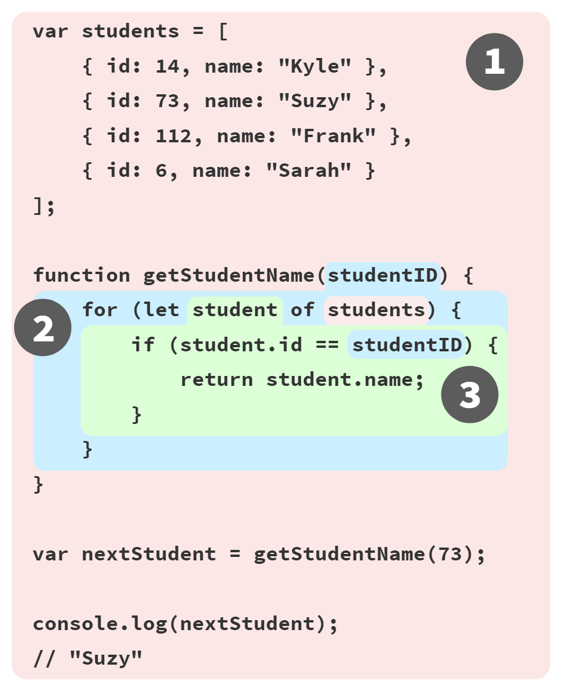

# You Don't Know JS Yet: Scope & Closures - 2nd Edition
# Chapter 2: Understanding Scope

In Chapter 1, we explored how scope is determined at code compilation, a model called "lexical scope".

Before we get to the nuts and bolts of how using lexical scope in our programs, we should make sure we have a good conceptual foundation for how scope works. This chapter will illustrate *scope* by listening in on "conversations" inside the JS engine as it processes and executes our programs.

## Buckets of Marbles

One metaphor I've found effective in understanding scope is sorting colored marbles into buckets of their matching color.

Imagine you come across a pile of marbles, and notice that all the marbles are colored red, blue, or green. To sort all the marbles, let's drop the red ones into a red bucket, green into a green bucket, and blue into a blue bucket. After sorting, when you later need a green marble, you already know the green bucket is where to go to get it.

In this metaphor, the marbles are the variables in our program. The buckets are scopes (functions and blocks), which we just conceptually assign individual colors for our discussion purposes. The color of each marble is thus determined by which *color* scope we find the marble originally created in.

Let's annotate the program example from Chapter 1 with scope color labels:

```js
// outer/global scope: RED

var students = [
    { id: 14, name: "Kyle" },
    { id: 73, name: "Suzy" },
    { id: 112, name: "Frank" },
    { id: 6, name: "Sarah" }
];

function getStudentName(studentID) {
    // function scope: BLUE

    for (let student of students) {
        // loop scope: GREEN

        if (student.id == studentID) {
            return student.name;
        }
    }
}

var nextStudent = getStudentName(73);
console.log(nextStudent);
// "Suzy"
```

We designate 3 scope colors: RED (outermost global scope), BLUE (scope of function `getStudentName(..)`), and GREEN (scope of/inside the `for` loop).

The RED marbles are variables/identifiers originally declared in the RED scope:

* `students`

* `getStudentName`

* `nextStudent`

The only BLUE marble, the function parameter declared in the BLUE scope:

* `studentID`

The only GREEN marble, the loop iterator declared in the GREEN scope:

* `student`

As the JS engine processes a program (during compilation), and finds a declaration for a variable/identifier, it essentially asks, "which *color* scope am I currently in?" The variable/identifier is designated as that same *color*, meaning it belongs to that bucket.

The GREEN bucket is wholly nested inside of the BLUE bucket, and similarly the BLUE bucket is wholly nested inside the RED bucket. Scopes can nest inside each other as shown, to any depth of nesting as your program needs. But scopes can never cross boundaries, meaning no scope is ever partially in two parent scopes.

References (non-declarations) to variables/identifiers can be made from either the current scope, or any scope above/outside the current scope, but never to lower/nested scopes. So an expression in the RED bucket only has access to RED marbles, not BLUE or GREEN. An expression in the BLUE bucket can reference either BLUE or RED marbles, not GREEN. And an expression in the GREEN bucket has access to RED, BLUE, and GREEN marbles.

We can conceptualize the process of determining these marble colors during runtime as a lookup. At first, the `students` variable reference in the `for` loop-statement has no color, so we ask the current scope if it has a marble matching that name. Since it doesn't, the lookup continues with the next outer/containing scope, and so on. When the RED bucket is reached, a marble of the name `students` is found, so the loop-statement's `students` variable is determined to be a red marble.

The `if (student.id == studentID)` is similarly determined to reference a GREEN marble named `student` and a BLUE marble `studentID`.

| NOTE: |
| :--- |
| The JS engine doesn't generally determine these marble colors during run-time; the "lookup" here is a rhetorical device to help you understand the concepts. During compilation, most or all variable references will be from already-known scope buckets, so their color is determined at that, and stored with each marble reference to avoid unnecessary lookups as the program runs. |

The key take-aways from the marbles & buckets metaphor:

* Variables are declared in certain scopes, which can be thought of as colored marbles in matching-color buckets.

* Any reference to a variable of that same name in that scope, or any deeper nested scope, will be a marble of that same color.

* The determination of buckets, colors, and marbles is all done during compilation. This information is used during code execution.

## A Conversation Among Friends

Another useful metaphor for the process of analyzing variables and the scopes they come from is to imagine various conversations that go on inside the engine as code is processed and then executed. We can "listen in" on these conversations to get a better conceptual foundation for how scopes work.

Let's now meet the members of the JS engine that will have conversations as they process that program:

1. *Engine*: responsible for start-to-finish compilation and execution of our JavaScript program.

2. *Compiler*: one of *Engine*'s friends; handles all the dirty work of parsing and code-generation (see previous section).

3. *Scope Manager*: another friend of *Engine*; collects and maintains a look-up list of all the declared variables/identifiers, and enforces a set of rules as to how these are accessible to currently executing code.

For you to *fully understand* how JavaScript works, you need to begin to *think* like *Engine* (and friends) think, ask the questions they ask, and answer their questions likewise.

To explore these conversations, recall again our running program example:

```js
var students = [
    { id: 14, name: "Kyle" },
    { id: 73, name: "Suzy" },
    { id: 112, name: "Frank" },
    { id: 6, name: "Sarah" }
];

function getStudentName(studentID) {
    for (let student of students) {
        if (student.id == studentID) {
            return student.name;
        }
    }
}

var nextStudent = getStudentName(73);

console.log(nextStudent);
// "Suzy"
```

Let's examine how JS is going to process that program, specifically starting with the first statement. The array and its contents are just basic JS value literals (and thus unaffected by any scoping concerns), so our focus here will be on the `var students = [ .. ]` declaration and initialization-assignment parts.

We typically think of that as a single statement, but that's not how our friend *Engine* sees it. In fact, *Engine* sees two distinct operations, one which *Compiler* will handle during compilation, and the other which *Engine* will handle during execution.

The first thing *Compiler* will do with this program is perform lexing to break it down into tokens, which it will then parse into a tree (AST).

But when *Compiler* gets to code-generation, there's more detail to consider than may be obvious. A reasonable assumption would be that *Compiler* will produce code such as: "Allocate memory for a variable, label it `students`, then stick a reference to the array into that variable." Unfortunately, that's not quite complete.

Here's how *Compiler* will proceed:

1. Encountering `var students`, *Compiler* asks *Scope Manager* to see if a variable named `students` already exists for that particular scope bucket. If so, *Compiler* ignores this declaration and moves on. Otherwise, *Compiler* prepares code that, at execution time, asks *Scope Manager* to declare a new variable called `students` in that scope bucket.

2. *Compiler* then produces code for *Engine* to later execute, to handle the `students = []` assignment. The code *Engine* runs will first ask *Scope Manager* if there is a variable called `students` accessible in the current scope bucket. If not, *Engine* looks elsewhere (see "Nested Scope" below).

If *Engine* (eventually) finds a variable, it assigns the reference of the `[ .. ]` array to it. If not, *Engine* will raise its hand and yell out an error!

To summarize: two distinct actions are taken for a variable assignment: First, *Compiler* sets up the declaration of a scope variable (if not previously declared in the current scope), and second, while executing, *Engine* asks *Scope Manager* to look up the variable, and assigns to it, if found.

### Lookup Failures

When *Engine* eventually executes the code that *Compiler* produced for step (2) in the previous section, it has to consult *Scope Manager* to look-up the variable `students` to see if it has been declared, and if so, which scope it's in. *Scope Manager* handles lookup failures differently depending on the the role a variable/identifier serves (i.e., *target* vs. *scope* from Chapter 1).

.

.

.

.

.

.

.

----

| NOTE: |
| :--- |
| Everything below here is previous text from 1st edition, and is only here for reference while 2nd edition work is underway. **Please ignore this stuff.** |

### Engine/Scope Conversation

```js
function foo(a) {
    console.log( a ); // 2
}

foo( 2 );
```

Let's imagine the above exchange (which processes this code snippet) as a conversation. The conversation would go a little something like this:

> ***Engine***: Hey *Scope*, I have an RHS reference for `foo`. Ever heard of it?

> ***Scope***: Why yes, I have. *Compiler* declared it just a second ago. He's a function. Here you go.

> ***Engine***: Great, thanks! OK, I'm executing `foo`.

> ***Engine***: Hey, *Scope*, I've got an LHS reference for `a`, ever heard of it?

> ***Scope***: Why yes, I have. *Compiler* declared it as a formal parameter to `foo` just recently. Here you go.

> ***Engine***: Helpful as always, *Scope*. Thanks again. Now, time to assign `2` to `a`.

> ***Engine***: Hey, *Scope*, sorry to bother you again. I need an RHS look-up for `console`. Ever heard of it?

> ***Scope***: No problem, *Engine*, this is what I do all day. Yes, I've got `console`. He's built-in. Here ya go.

> ***Engine***: Perfect. Looking up `log(..)`. OK, great, it's a function.

> ***Engine***: Yo, *Scope*. Can you help me out with an RHS reference to `a`. I think I remember it, but just want to double-check.

> ***Scope***: You're right, *Engine*. Same guy, hasn't changed. Here ya go.

> ***Engine***: Cool. Passing the value of `a`, which is `2`, into `log(..)`.

> ...

### Quiz

Check your understanding so far. Make sure to play the part of *Engine* and have a "conversation" with the *Scope*:

```js
function foo(a) {
    var b = a;
    return a + b;
}

var c = foo( 2 );
```

1. Identify all the LHS look-ups (there are 3!).

2. Identify all the RHS look-ups (there are 4!).

**Note:** See the chapter review for the quiz answers!

## Nested Scope

We said that *Scope* is a set of rules for looking up variables by their identifier name. There's usually more than one *Scope* to consider, however.

Just as a block or function is nested inside another block or function, scopes are nested inside other scopes. So, if a variable cannot be found in the immediate scope, *Engine* consults the next outer containing scope, continuing until found or until the outermost (aka, global) scope has been reached.

Consider:

```js
function foo(a) {
    console.log( a + b );
}

var b = 2;

foo( 2 ); // 4
```

The RHS reference for `b` cannot be resolved inside the function `foo`, but it can be resolved in the *Scope* surrounding it (in this case, the global).

So, revisiting the conversations between *Engine* and *Scope*, we'd overhear:

> ***Engine***: "Hey, *Scope* of `foo`, ever heard of `b`? Got an RHS reference for it."

> ***Scope***: "Nope, never heard of it. Go fish."

> ***Engine***: "Hey, *Scope* outside of `foo`, oh you're the global *Scope*, ok cool. Ever heard of `b`? Got an RHS reference for it."

> ***Scope***: "Yep, sure have. Here ya go."

The simple rules for traversing nested *Scope*: *Engine* starts at the currently executing *Scope*, looks for the variable there, then if not found, keeps going up one level, and so on. If the outermost global scope is reached, the search stops, whether it finds the variable or not.

### Building on Metaphors

To visualize the process of nested *Scope* resolution, I want you to think of this tall building.


The building represents our program's nested *Scope* rule set. The first floor of the building represents your currently executing *Scope*, wherever you are. The top level of the building is the global *Scope*.

You resolve LHS and RHS references by looking on your current floor, and if you don't find it, taking the elevator to the next floor, looking there, then the next, and so on. Once you get to the top floor (the global *Scope*), you either find what you're looking for, or you don't. But you have to stop regardless.

## Errors

Why does it matter whether we call it LHS or RHS?

Because these two types of look-ups behave differently in the circumstance where the variable has not yet been declared (is not found in any consulted *Scope*).

Consider:

```js
function foo(a) {
    console.log( a + b );
    b = a;
}

foo( 2 );
```

When the RHS look-up occurs for `b` the first time, it will not be found. This is said to be an "undeclared" variable, because it is not found in the scope.

If an RHS look-up fails to ever find a variable, anywhere in the nested *Scope*s, this results in a `ReferenceError` being thrown by the *Engine*. It's important to note that the error is of the type `ReferenceError`.

By contrast, if the *Engine* is performing an LHS look-up and arrives at the top floor (global *Scope*) without finding it, and if the program is not running in "Strict Mode" [^note-strictmode], then the global *Scope* will create a new variable of that name **in the global scope**, and hand it back to *Engine*.

*"No, there wasn't one before, but I was helpful and created one for you."*

"Strict Mode" [^note-strictmode], which was added in ES5, has a number of different behaviors from normal/relaxed/lazy mode. One such behavior is that it disallows the automatic/implicit global variable creation. In that case, there would be no global *Scope*'d variable to hand back from an LHS look-up, and *Engine* would throw a `ReferenceError` similarly to the RHS case.

Now, if a variable is found for an RHS look-up, but you try to do something with its value that is impossible, such as trying to execute-as-function a non-function value, or reference a property on a `null` or `undefined` value, then *Engine* throws a different kind of error, called a `TypeError`.

`ReferenceError` is *Scope* resolution-failure related, whereas `TypeError` implies that *Scope* resolution was successful, but that there was an illegal/impossible action attempted against the result.

## Review (TL;DR)

Scope is the set of rules that determines where and how a variable (identifier) can be looked-up. This look-up may be for the purposes of assigning to the variable, which is an LHS (left-hand-side) reference, or it may be for the purposes of retrieving its value, which is an RHS (right-hand-side) reference.

LHS references result from assignment operations. *Scope*-related assignments can occur either with the `=` operator or by passing arguments to (assign to) function parameters.

The JavaScript *Engine* first compiles code before it executes, and in so doing, it splits up statements like `var a = 2;` into two separate steps:

1. First, `var a` to declare it in that *Scope*. This is performed at the beginning, before code execution.

2. Later, `a = 2` to look up the variable (LHS reference) and assign to it if found.

Both LHS and RHS reference look-ups start at the currently executing *Scope*, and if need be (that is, they don't find what they're looking for there), they work their way up the nested *Scope*, one scope (floor) at a time, looking for the identifier, until they get to the global (top floor) and stop, and either find it, or don't.

Unfulfilled RHS references result in `ReferenceError`s being thrown. Unfulfilled LHS references result in an automatic, implicitly-created global of that name (if not in "Strict Mode" [^note-strictmode]), or a `ReferenceError` (if in "Strict Mode" [^note-strictmode]).

### Quiz Answers

```js
function foo(a) {
    var b = a;
    return a + b;
}

var c = foo( 2 );
```

1. Identify all the LHS look-ups (there are 3!).

    **`c = ..`, `a = 2` (implicit param assignment) and `b = ..`**

2. Identify all the RHS look-ups (there are 4!).

    **`foo(2..`, `= a;`, `a + ..` and `.. + b`**


[^note-strictmode]: MDN: [Strict Mode](https://developer.mozilla.org/en-US/docs/Web/JavaScript/Reference/Functions_and_function_scope/Strict_mode)


| NOTE: |
| :--- |
| Work in progress |

.

.

.

.

.

.

.

----

| NOTE: |
| :--- |
| Everything below here is previous text from 1st edition, and is only here for reference while 2nd edition work is underway. **Please ignore this stuff.** |

In Chapter 1, we defined "scope" as the set of rules that govern how the *Engine* can look up a variable by its identifier name and find it, either in the current *Scope*, or in any of the *Nested Scopes* it's contained within.

There are two predominant models for how scope works. The first of these is by far the most common, used by the vast majority of programming languages. It's called **Lexical Scope**, and we will examine it in-depth. The other model, which is still used by some languages (such as Bash scripting, some modes in Perl, etc.) is called **Dynamic Scope**.

Dynamic Scope is covered in Appendix A. I mention it here only to provide a contrast with Lexical Scope, which is the scope model that JavaScript employs.

## Lex-time

As we discussed in Chapter 1, the first traditional phase of a standard language compiler is called lexing (aka, tokenizing). If you recall, the lexing process examines a string of source code characters and assigns semantic meaning to the tokens as a result of some stateful parsing.

It is this concept which provides the foundation to understand what lexical scope is and where the name comes from.

To define it somewhat circularly, lexical scope is scope that is defined at lexing time. In other words, lexical scope is based on where variables and blocks of scope are authored, by you, at write time, and thus is (mostly) set in stone by the time the lexer processes your code.

**Note:** We will see in a little bit there are some ways to cheat lexical scope, thereby modifying it after the lexer has passed by, but these are frowned upon. It is considered best practice to treat lexical scope as, in fact, lexical-only, and thus entirely author-time in nature.

Let's consider this block of code:

```js
function foo(a) {

	var b = a * 2;

	function bar(c) {
		console.log( a, b, c );
	}

	bar(b * 3);
}

foo( 2 ); // 2 4 12
```

There are three nested scopes inherent in this code example. It may be helpful to think about these scopes as bubbles inside of each other.



**Bubble 1** encompasses the global scope, and has just one identifier in it: `foo`.

**Bubble 2** encompasses the scope of `foo`, which includes the three identifiers: `a`, `bar` and `b`.

**Bubble 3** encompasses the scope of `bar`, and it includes just one identifier: `c`.

Scope bubbles are defined by where the blocks of scope are written, which one is nested inside the other, etc. In the next chapter, we'll discuss different units of scope, but for now, let's just assume that each function creates a new bubble of scope.

The bubble for `bar` is entirely contained within the bubble for `foo`, because (and only because) that's where we chose to define the function `bar`.

Notice that these nested bubbles are strictly nested. We're not talking about Venn diagrams where the bubbles can cross boundaries. In other words, no bubble for some function can simultaneously exist (partially) inside two other outer scope bubbles, just as no function can partially be inside each of two parent functions.

### Look-ups

The structure and relative placement of these scope bubbles fully explains to the *Engine* all the places it needs to look to find an identifier.

In the above code snippet, the *Engine* executes the `console.log(..)` statement and goes looking for the three referenced variables `a`, `b`, and `c`. It first starts with the innermost scope bubble, the scope of the `bar(..)` function. It won't find `a` there, so it goes up one level, out to the next nearest scope bubble, the scope of `foo(..)`. It finds `a` there, and so it uses that `a`. Same thing for `b`. But `c`, it does find inside of `bar(..)`.

Had there been a `c` both inside of `bar(..)` and inside of `foo(..)`, the `console.log(..)` statement would have found and used the one in `bar(..)`, never getting to the one in `foo(..)`.

**Scope look-up stops once it finds the first match**. The same identifier name can be specified at multiple layers of nested scope, which is called "shadowing" (the inner identifier "shadows" the outer identifier). Regardless of shadowing, scope look-up always starts at the innermost scope being executed at the time, and works its way outward/upward until the first match, and stops.

**Note:** Global variables are also automatically properties of the global object (`window` in browsers, etc.), so it *is* possible to reference a global variable not directly by its lexical name, but instead indirectly as a property reference of the global object.

```js
window.a
```

This technique gives access to a global variable which would otherwise be inaccessible due to it being shadowed. However, non-global shadowed variables cannot be accessed.

No matter *where* a function is invoked from, or even *how* it is invoked, its lexical scope is **only** defined by where the function was declared.

The lexical scope look-up process *only* applies to first-class identifiers, such as the `a`, `b`, and `c`. If you had a reference to `foo.bar.baz` in a piece of code, the lexical scope look-up would apply to finding the `foo` identifier, but once it locates that variable, object property-access rules take over to resolve the `bar` and `baz` properties, respectively.

## Cheating Lexical

If lexical scope is defined only by where a function is declared, which is entirely an author-time decision, how could there possibly be a way to "modify" (aka, cheat) lexical scope at run-time?

JavaScript has two such mechanisms. Both of them are equally frowned-upon in the wider community as bad practices to use in your code. But the typical arguments against them are often missing the most important point: **cheating lexical scope leads to poorer performance.**

Before I explain the performance issue, though, let's look at how these two mechanisms work.

### `eval`

The `eval(..)` function in JavaScript takes a string as an argument, and treats the contents of the string as if it had actually been authored code at that point in the program. In other words, you can programmatically generate code inside of your authored code, and run the generated code as if it had been there at author time.

Evaluating `eval(..)` (pun intended) in that light, it should be clear how `eval(..)` allows you to modify the lexical scope environment by cheating and pretending that author-time (aka, lexical) code was there all along.

On subsequent lines of code after an `eval(..)` has executed, the *Engine* will not "know" or "care" that the previous code in question was dynamically interpreted and thus modified the lexical scope environment. The *Engine* will simply perform its lexical scope look-ups as it always does.

Consider the following code:

```js
function foo(str, a) {
	eval( str ); // cheating!
	console.log( a, b );
}

var b = 2;

foo( "var b = 3;", 1 ); // 1 3
```

The string `"var b = 3;"` is treated, at the point of the `eval(..)` call, as code that was there all along. Because that code happens to declare a new variable `b`, it modifies the existing lexical scope of `foo(..)`. In fact, as mentioned above, this code actually creates variable `b` inside of `foo(..)` that shadows the `b` that was declared in the outer (global) scope.

When the `console.log(..)` call occurs, it finds both `a` and `b` in the scope of `foo(..)`, and never finds the outer `b`. Thus, we print out "1 3" instead of "1 2" as would have normally been the case.

**Note:** In this example, for simplicity's sake, the string of "code" we pass in was a fixed literal. But it could easily have been programmatically created by adding characters together based on your program's logic. `eval(..)` is usually used to execute dynamically created code, as dynamically evaluating essentially static code from a string literal would provide no real benefit to just authoring the code directly.

By default, if a string of code that `eval(..)` executes contains one or more declarations (either variables or functions), this action modifies the existing lexical scope in which the `eval(..)` resides. Technically, `eval(..)` can be invoked "indirectly", through various tricks (beyond our discussion here), which causes it to instead execute in the context of the global scope, thus modifying it. But in either case, `eval(..)` can at runtime modify an author-time lexical scope.

**Note:** `eval(..)` when used in a strict-mode program operates in its own lexical scope, which means declarations made inside of the `eval()` do not actually modify the enclosing scope.

```js
function foo(str) {
   "use strict";
   eval( str );
   console.log( a ); // ReferenceError: a is not defined
}

foo( "var a = 2" );
```

There are other facilities in JavaScript which amount to a very similar effect to `eval(..)`. `setTimeout(..)` and `setInterval(..)` *can* take a string for their respective first argument, the contents of which are `eval`uated as the code of a dynamically-generated function. This is old, legacy behavior and long-since deprecated. Don't do it!

The `new Function(..)` function constructor similarly takes a string of code in its **last** argument to turn into a dynamically-generated function (the first argument(s), if any, are the named parameters for the new function). This function-constructor syntax is slightly safer than `eval(..)`, but it should still be avoided in your code.

The use-cases for dynamically generating code inside your program are incredibly rare, as the performance degradations are almost never worth the capability.

### `with`

The other frowned-upon (and now deprecated!) feature in JavaScript which cheats lexical scope is the `with` keyword. There are multiple valid ways that `with` can be explained, but I will choose here to explain it from the perspective of how it interacts with and affects lexical scope.

`with` is typically explained as a short-hand for making multiple property references against an object *without* repeating the object reference itself each time.

For example:

```js
var obj = {
	a: 1,
	b: 2,
	c: 3
};

// more "tedious" to repeat "obj"
obj.a = 2;
obj.b = 3;
obj.c = 4;

// "easier" short-hand
with (obj) {
	a = 3;
	b = 4;
	c = 5;
}
```

However, there's much more going on here than just a convenient short-hand for object property access. Consider:

```js
function foo(obj) {
	with (obj) {
		a = 2;
	}
}

var o1 = {
	a: 3
};

var o2 = {
	b: 3
};

foo( o1 );
console.log( o1.a ); // 2

foo( o2 );
console.log( o2.a ); // undefined
console.log( a ); // 2 -- Oops, leaked global!
```

In this code example, two objects `o1` and `o2` are created. One has an `a` property, and the other does not. The `foo(..)` function takes an object reference `obj` as an argument, and calls `with (obj) { .. }` on the reference. Inside the `with` block, we make what appears to be a normal lexical reference to a variable `a`, an LHS reference in fact (see Chapter 1), to assign to it the value of `2`.

When we pass in `o1`, the `a = 2` assignment finds the property `o1.a` and assigns it the value `2`, as reflected in the subsequent `console.log(o1.a)` statement. However, when we pass in `o2`, since it does not have an `a` property, no such property is created, and `o2.a` remains `undefined`.

But then we note a peculiar side-effect, the fact that a global variable `a` was created by the `a = 2` assignment. How can this be?

The `with` statement takes an object, one which has zero or more properties, and **treats that object as if *it* is a wholly separate lexical scope**, and thus the object's properties are treated as lexically defined identifiers in that "scope".

**Note:** Even though a `with` block treats an object like a lexical scope, a normal `var` declaration inside that `with` block will not be scoped to that `with` block, but instead the containing function scope.

While the `eval(..)` function can modify existing lexical scope if it takes a string of code with one or more declarations in it, the `with` statement actually creates a **whole new lexical scope** out of thin air, from the object you pass to it.

Understood in this way, the "scope" declared by the `with` statement when we passed in `o1` was `o1`, and that "scope" had an "identifier" in it which corresponds to the `o1.a` property. But when we used `o2` as the "scope", it had no such `a` "identifier" in it, and so the normal rules of LHS identifier look-up (see Chapter 1) occurred.

Neither the "scope" of `o2`, nor the scope of `foo(..)`, nor the global scope even, has an `a` identifier to be found, so when `a = 2` is executed, it results in the automatic-global being created (since we're in non-strict mode).

It is a strange sort of mind-bending thought to see `with` turning, at runtime, an object and its properties into a "scope" *with* "identifiers". But that is the clearest explanation I can give for the results we see.

**Note:** In addition to being a bad idea to use, both `eval(..)` and `with` are affected (restricted) by Strict Mode. `with` is outright disallowed, whereas various forms of indirect or unsafe `eval(..)` are disallowed while retaining the core functionality.

### Performance

Both `eval(..)` and `with` cheat the otherwise author-time defined lexical scope by modifying or creating new lexical scope at runtime.

So, what's the big deal, you ask? If they offer more sophisticated functionality and coding flexibility, aren't these *good* features? **No.**

The JavaScript *Engine* has a number of performance optimizations that it performs during the compilation phase. Some of these boil down to being able to essentially statically analyze the code as it lexes, and pre-determine where all the variable and function declarations are, so that it takes less effort to resolve identifiers during execution.

But if the *Engine* finds an `eval(..)` or `with` in the code, it essentially has to *assume* that all its awareness of identifier location may be invalid, because it cannot know at lexing time exactly what code you may pass to `eval(..)` to modify the lexical scope, or the contents of the object you may pass to `with` to create a new lexical scope to be consulted.

In other words, in the pessimistic sense, most of those optimizations it *would* make are pointless if `eval(..)` or `with` are present, so it simply doesn't perform the optimizations *at all*.

Your code will almost certainly tend to run slower simply by the fact that you include an `eval(..)` or `with` anywhere in the code. No matter how smart the *Engine* may be about trying to limit the side-effects of these pessimistic assumptions, **there's no getting around the fact that without the optimizations, code runs slower.**

## Review (TL;DR)

Lexical scope means that scope is defined by author-time decisions of where functions are declared. The lexing phase of compilation is essentially able to know where and how all identifiers are declared, and thus predict how they will be looked-up during execution.

Two mechanisms in JavaScript can "cheat" lexical scope: `eval(..)` and `with`. The former can modify existing lexical scope (at runtime) by evaluating a string of "code" which has one or more declarations in it. The latter essentially creates a whole new lexical scope (again, at runtime) by treating an object reference *as* a "scope" and that object's properties as scoped identifiers.

The downside to these mechanisms is that it defeats the *Engine*'s ability to perform compile-time optimizations regarding scope look-up, because the *Engine* has to assume pessimistically that such optimizations will be invalid. Code *will* run slower as a result of using either feature. **Don't use them.**
