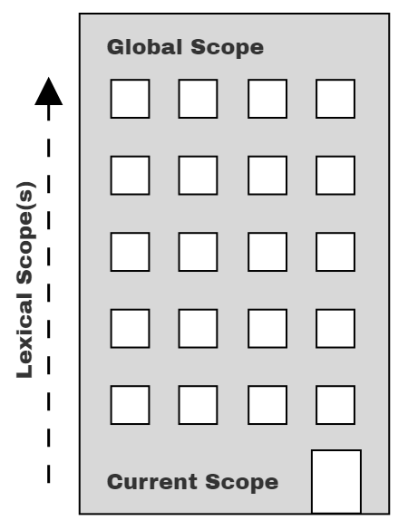

# You Don't Know JS Yet: Scope & Closures - 2nd Edition
# Chapter 2: Illustrating Lexical Scope

In Chapter 1, we explored how scope is determined during code compilation, a model called "lexical scope." The term "lexical" refers to the first stage of compilation (lexing/parsing).

To properly *reason* about our programs, it's important to have a solid conceptual foundation of how scope works. If we rely on guesses and intuition, we may accidentally get the right answers some of the time, but many other times we're far off. This isn't a recipe for success.

Like way back in grade school math class, getting the right answer isn't enough if we don't show the correct steps to get there! We need to build accurate and helpful mental models as foundation moving forward.

This chapter will illustrate *scope* with several metaphors. The goal here is to *think* about how your program is handled by the JS engine in ways that more closely align with how the JS engine actually works.

## Marbles, and Buckets, and Bubbles... Oh My!

One metaphor I've found effective in understanding scope is sorting colored marbles into buckets of their matching color.

Imagine you come across a pile of marbles, and notice that all the marbles are colored red, blue, or green. Let's sort all the marbles, dropping the red ones into a red bucket, green into a green bucket, and blue into a blue bucket. After sorting, when you later need a green marble, you already know the green bucket is where to go to get it.

In this metaphor, the marbles are the variables in our program. The buckets are scopes (functions and blocks), which we just conceptually assign individual colors for our discussion purposes. The color of each marble is thus determined by which *color* scope we find the marble originally created in.

Let's annotate the running program example from Chapter 1 with scope color labels:

```js
// outer/global scope: RED

var students = [
    { id: 14, name: "Kyle" },
    { id: 73, name: "Suzy" },
    { id: 112, name: "Frank" },
    { id: 6, name: "Sarah" }
];

function getStudentName(studentID) {
    // function scope: BLUE

    for (let student of students) {
        // loop scope: GREEN

        if (student.id == studentID) {
            return student.name;
        }
    }
}

var nextStudent = getStudentName(73);
console.log(nextStudent);   // Suzy
```

We've designated three scope colors with code comments: RED (outermost global scope), BLUE (scope of function `getStudentName(..)`), and GREEN (scope of/inside the `for` loop). But it still may be difficult to recognize the boundaries of these scope buckets when looking at a code listing.

Figure 2 helps visualize the boundaries of the scopes by drawing colored bubbles (aka, buckets) around each:

<figure>
    
    <figcaption><em>Fig. 2: Colored Scope Bubbles</em></figcaption>
</figure>

1. **Bubble 1** (RED) encompasses the global scope, which holds three identifiers/variables: `students` (line 1), `getStudentName` (line 8), and `nextStudent` (line 16).

2. **Bubble 2** (BLUE) encompasses the scope of the function `getStudentName(..)` (line 8), which holds just one identifier/variable: the parameter `studentID` (line 8).

3. **Bubble 3** (GREEN) encompasses the scope of the `for`-loop (line 9), which holds just one identifier/variable: `student` (line 9).

| NOTE: |
| :--- |
| Technically, the parameter `studentID` is not exactly in the BLUE(2) scope. We'll unwind that confusion in "Implied Scopes" in Appendix A. For now, it's close enough to label `studentID` a BLUE(2) marble. |

Scope bubbles are determined during compilation based on where the functions/blocks of scope are written, the nesting inside each other, and so on. Each scope bubble is entirely contained within its parent scope bubble—a scope is never partially in two different outer scopes.

Each marble (variable/identifier) is colored based on which bubble (bucket) it's declared in, not the color of the scope it may be accessed from (e.g., `students` on line 9 and `studentID` on line 10).

| NOTE: |
| :--- |
| Remember we asserted in Chapter 1 that `id`, `name`, and `log` are all properties, not variables; in other words, they're not marbles in buckets, so they don't get colored based on any the rules we're discussing in this book. To understand how such property accesses are handled, see the third book in the series, *Objects & Classes*. |

As the JS engine processes a program (during compilation), and finds a declaration for a variable, it essentially asks, "Which *color* scope (bubble or bucket) am I currently in?" The variable is designated as that same *color*, meaning it belongs to that bucket/bubble.

The GREEN(3) bucket is wholly nested inside of the BLUE(2) bucket, and similarly the BLUE(2) bucket is wholly nested inside the RED(1) bucket. Scopes can nest inside each other as shown, to any depth of nesting as your program needs.

References (non-declarations) to variables/identifiers are allowed if there's a matching declaration either in the current scope, or any scope above/outside the current scope, but not with declarations from lower/nested scopes.

An expression in the RED(1) bucket only has access to RED(1) marbles, **not** BLUE(2) or GREEN(3). An expression in the BLUE(2) bucket can reference either BLUE(2) or RED(1) marbles, **not** GREEN(3). And an expression in the GREEN(3) bucket has access to RED(1), BLUE(2), and GREEN(3) marbles.

We can conceptualize the process of determining these non-declaration marble colors during runtime as a lookup. Since the `students` variable reference in the `for`-loop statement on line 9 is not a declaration, it has no color. So we ask the current BLUE(2) scope bucket if it has a marble matching that name. Since it doesn't, the lookup continues with the next outer/containing scope: RED(1). The RED(1) bucket has a marble of the name `students`, so the loop-statement's `students` variable reference is determined to be a RED(1) marble.

The `if (student.id == studentID)` statement on line 10 is similarly determined to reference a GREEN(3) marble named `student` and a BLUE(2) marble `studentID`.

| NOTE: |
| :--- |
| The JS engine doesn't generally determine these marble colors during runtime; the "lookup" here is a rhetorical device to help you understand the concepts. During compilation, most or all variable references will match already-known scope buckets, so their color is already determined, and stored with each marble reference to avoid unnecessary lookups as the program runs. More on this nuance in Chapter 3. |

The key take-aways from marbles & buckets (and bubbles!):

* Variables are declared in specific scopes, which can be thought of as colored marbles from matching-color buckets.

* Any variable reference that appears in the scope where it was declared, or appears in any deeper nested scopes, will be labeled a marble of that same color—unless an intervening scope "shadows" the variable declaration; see "Shadowing" in Chapter 3.

* The determination of colored buckets, and the marbles they contain, happens during compilation. This information is used for variable (marble color) "lookups" during code execution.

## A Conversation Among Friends

Another useful metaphor for the process of analyzing variables and the scopes they come from is to imagine various conversations that occur inside the engine as code is processed and then executed. We can "listen in" on these conversations to get a better conceptual foundation for how scopes work.

Let's now meet the members of the JS engine that will have conversations as they process our program:

* *Engine*: responsible for start-to-finish compilation and execution of our JavaScript program.

* *Compiler*: one of *Engine*'s friends; handles all the dirty work of parsing and code-generation (see previous section).

* *Scope Manager*: another friend of *Engine*; collects and maintains a lookup list of all the declared variables/identifiers, and enforces a set of rules as to how these are accessible to currently executing code.

For you to *fully understand* how JavaScript works, you need to begin to *think* like *Engine* (and friends) think, ask the questions they ask, and answer their questions likewise.

To explore these conversations, recall again our running program example:

```js
var students = [
    { id: 14, name: "Kyle" },
    { id: 73, name: "Suzy" },
    { id: 112, name: "Frank" },
    { id: 6, name: "Sarah" }
];

function getStudentName(studentID) {
    for (let student of students) {
        if (student.id == studentID) {
            return student.name;
        }
    }
}

var nextStudent = getStudentName(73);

console.log(nextStudent);
// Suzy
```

Let's examine how JS is going to process that program, specifically starting with the first statement. The array and its contents are just basic JS value literals (and thus unaffected by any scoping concerns), so our focus here will be on the `var students = [ .. ]` declaration and initialization-assignment parts.

We typically think of that as a single statement, but that's not how our friend *Engine* sees it. In fact, JS treats these as two distinct operations, one which *Compiler* will handle during compilation, and the other which *Engine* will handle during execution.

The first thing *Compiler* will do with this program is perform lexing to break it down into tokens, which it will then parse into a tree (AST).

Once *Compiler* gets to code generation, there's more detail to consider than may be obvious. A reasonable assumption would be that *Compiler* will produce code for the first statement such as: "Allocate memory for a variable, label it `students`, then stick a reference to the array into that variable." But that's not the whole story.

Here's the steps *Compiler* will follow to handle that statement:

1. Encountering `var students`, *Compiler* will ask *Scope Manager* to see if a variable named `students` already exists for that particular scope bucket. If so, *Compiler* would ignore this declaration and move on. Otherwise, *Compiler* will produce code that (at execution time) asks *Scope Manager* to create a new variable called `students` in that scope bucket.

2. *Compiler* then produces code for *Engine* to later execute, to handle the `students = []` assignment. The code *Engine* runs will first ask *Scope Manager* if there is a variable called `students` accessible in the current scope bucket. If not, *Engine* keeps looking elsewhere (see "Nested Scope" below). Once *Engine* finds a variable, it assigns the reference of the `[ .. ]` array to it.

In conversational form, the first phase of compilation for the program might play out between *Compiler* and *Scope Manager* like this:

> ***Compiler***: Hey, *Scope Manager* (of the global scope), I found a formal declaration for an identifier called `students`, ever heard of it?

> ***(Global) Scope Manager***: Nope, never heard of it, so I just created it for you.

> ***Compiler***: Hey, *Scope Manager*, I found a formal declaration for an identifier called `getStudentName`, ever heard of it?

> ***(Global) Scope Manager***: Nope, but I just created it for you.

> ***Compiler***: Hey, *Scope Manager*, `getStudentName` points to a function, so we need a new scope bucket.

> ***(Function) Scope Manager***: Got it, here's the scope bucket.

> ***Compiler***: Hey, *Scope Manager* (of the function), I found a formal parameter declaration for `studentID`, ever heard of it?

> ***(Function) Scope Manager***: Nope, but now it's created in this scope.

> ***Compiler***: Hey, *Scope Manager* (of the function), I found a `for`-loop that will need its own scope bucket.

> ...

The conversation is a question-and-answer exchange, where **Compiler** asks the current *Scope Manager* if an encountered identifier declaration has already been encountered. If "no," *Scope Manager* creates that variable in that scope. If the answer is "yes," then it's effectively skipped over since there's nothing more for that *Scope Manager* to do.

*Compiler* also signals when it runs across functions or block scopes, so that a new scope bucket and *Scope Manager* can be instantiated.

Later, when it comes to execution of the program, the conversation will shift to *Engine* and *Scope Manager*, and might play out like this:

> ***Engine***: Hey, *Scope Manager* (of the global scope), before we begin, can you look up the identifier `getStudentName` so I can assign this function to it?

> ***(Global) Scope Manager***: Yep, here's the variable.

> ***Engine***: Hey, *Scope Manager*, I found a *target* reference for `students`, ever heard of it?

> ***(Global) Scope Manager***: Yes, it was formally declared for this scope, so here it is.

> ***Engine***: Thanks, I'm initializing `students` to `undefined`, so it's ready to use.

> Hey, *Scope Manager* (of the global scope), I found a *target* reference for `nextStudent`, ever heard of it?

> ***(Global) Scope Manager***: Yes, it was formally declared for this scope, so here it is.

> ***Engine***: Thanks, I'm initializing `nextStudent` to `undefined`, so it's ready to use.

> Hey, *Scope Manager* (of the global scope), I found a *source* reference for `getStudentName`, ever heard of it?

> ***(Global) Scope Manager***: Yes, it was formally declared for this scope. Here it is.

> ***Engine***: Great, the value in `getStudentName` is a function, so I'm going to execute it.

> ***Engine***: Hey, *Scope Manager*, now we need to instantiate the function's scope.

> ...

This conversation is another question-and-answer exchange, where *Engine* first asks the current *Scope Manager* to look up the hoisted `getStudentName` identifier, so as to associate the function with it. *Engine* then proceeds to ask *Scope Manager* about the *target* reference for `students`, and so on.

To review and summarize how a statement like `var students = [ .. ]` is processed, in two distinct steps:

1. *Compiler* sets up the declaration of the scope variable (since it wasn't previously declared in the current scope).

2. While *Engine* is executing, to process the assignment part of the statement, *Engine* asks *Scope Manager* to look up the variable, initializes it to `undefined` so it's ready to use, and then assigns the array value to it.

## Nested Scope

When it comes time to execute the `getStudentName()` function, *Engine* asks for a *Scope Manager* instance for that function's scope, and it will then proceed to look up the parameter (`studentID`) to assign the `73` argument value to, and so on.

The function scope for `getStudentName(..)` is nested inside the global scope. The block scope of the `for`-loop is similarly nested inside that function scope. Scopes can be lexically nested to any arbitrary depth as the program defines.

Each scope gets its own *Scope Manager* instance each time that scope is executed (one or more times). Each scope automatically has all its identifiers registered at the start of the scope being executed (this is called "variable hoisting"; see Chapter 5).

At the beginning of a scope, if any identifier came from a `function` declaration, that variable is automatically initialized to its associated function reference. And if any identifier came from a `var` declaration (as opposed to `let`/`const`), that variable is automatically initialized to `undefined` so that it can be used; otherwise, the variable remains uninitialized (aka, in its "TDZ," see Chapter 5) and cannot be used until its full declaration-and-initialization are executed.

In the `for (let student of students) {` statement, `students` is a *source* reference that must be looked up. But how will that lookup be handled, since the scope of the function will not find such an identifier?

To explain, let's imagine that bit of conversation playing out like this:

> ***Engine***: Hey, *Scope Manager* (for the function), I have a *source* reference for `students`, ever heard of it?

> ***(Function) Scope Manager***: Nope, never heard of it. Try the next outer scope.

> ***Engine***: Hey, *Scope Manager* (for the global scope), I have a *source* reference for `students`, ever heard of it?

> ***(Global) Scope Manager***: Yep, it was formally declared, here it is.

> ...

One of the key aspects of lexical scope is that any time an identifier reference cannot be found in the current scope, the next outer scope in the nesting is consulted; that process is repeated until an answer is found or there are no more scopes to consult.

### Lookup Failures

When *Engine* exhausts all *lexically available* scopes (moving outward) and still cannot resolve the lookup of an identifier, an error condition then exists. However, depending on the mode of the program (strict-mode or not) and the role of the variable (i.e., *target* vs. *source*; see Chapter 1), this error condition will be handled differently.

#### Undefined Mess

If the variable is a *source*, an unresolved identifier lookup is considered an undeclared (unknown, missing) variable, which always results in a `ReferenceError` being thrown. Also, if the variable is a *target*, and the code at that moment is running in strict-mode, the variable is considered undeclared and similarly throws a `ReferenceError`.

The error message for an undeclared variable condition, in most JS environments, will look like, "Reference Error: XYZ is not defined." The phrase "not defined" seems almost identical to the word "undefined," as far as the English language goes. But these two are very different in JS, and this error message unfortunately creates a persistent confusion.

"Not defined" really means "not declared"—or, rather, "undeclared," as in a variable that has no matching formal declaration in any *lexically available* scope. By contrast, "undefined" really means a variable was found (declared), but the variable otherwise has no other value in it at the moment, so it defaults to the `undefined` value.

To perpetuate the confusion even further, JS's `typeof` operator returns the string `"undefined"` for variable references in either state:

```js
var studentName;
typeof studentName;     // "undefined"

typeof doesntExist;     // "undefined"
```

These two variable references are in very different conditions, but JS sure does muddy the waters. The terminology mess is confusing and terribly unfortunate. Unfortunately, JS developers just have to pay close attention to not mix up *which kind* of "undefined" they're dealing with!

#### Global... What!?

If the variable is a *target* and strict-mode is not in effect, a confusing and surprising legacy behavior kicks in. The troublesome outcome is that the global scope's *Scope Manager* will just create an **accidental global variable** to fulfill that target assignment!

Consider:

```js
function getStudentName() {
    // assignment to an undeclared variable :(
    nextStudent = "Suzy";
}

getStudentName();

console.log(nextStudent);
// "Suzy" -- oops, an accidental-global variable!
```

Here's how that *conversation* will proceed:

> ***Engine***: Hey, *Scope Manager* (for the function), I have a *target* reference for `nextStudent`, ever heard of it?

> ***(Function) Scope Manager***: Nope, never heard of it. Try the next outer scope.

> ***Engine***: Hey, *Scope Manager* (for the global scope), I have a *target* reference for `nextStudent`, ever heard of it?

> ***(Global) Scope Manager***: Nope, but since we're in non-strict-mode, I helped you out and just created a global variable for you, here it is!

Yuck.

This sort of accident (almost certain to lead to bugs eventually) is a great example of the beneficial protections offered by strict-mode, and why it's such a bad idea *not* to be using strict-mode. In strict-mode, the ***Global Scope Manager*** would instead have responded:

> ***(Global) Scope Manager***: Nope, never heard of it. Sorry, I've got to throw a `ReferenceError`.

Assigning to a never-declared variable *is* an error, so it's right that we would receive a `ReferenceError` here.

Never rely on accidental global variables. Always use strict-mode, and always formally declare your variables. You'll then get a helpful `ReferenceError` if you ever mistakenly try to assign to a not-declared variable.

### Building On Metaphors

To visualize nested scope resolution, I prefer yet another metaphor, an office building, as in Figure 3:

<figure>
    
    <figcaption><em>Fig. 3: Scope "Building"</em></figcaption>
    <br><br>
</figure>

The building represents our program's nested scope collection. The first floor of the building represents the currently executing scope. The top level of the building is the global scope.

You resolve a *target* or *source* variable reference by first looking on the current floor, and if you don't find it, taking the elevator to the next floor (i.e., an outer scope), looking there, then the next, and so on. Once you get to the top floor (the global scope), you either find what you're looking for, or you don't. But you have to stop regardless.

## Continue the Conversation

By this point, you should be developing richer mental models for what scope is and how the JS engine determines and uses it from your code.

Before *continuing*, go find some code in one of your projects and run through these conversations. Seriously, actually speak out loud. Find a friend and practice each role with them. If either of you find yourself confused or tripped up, spend more time reviewing this material.

As we move (up) to the next (outer) chapter, we'll explore how the lexical scopes of a program are connected in a chain.
