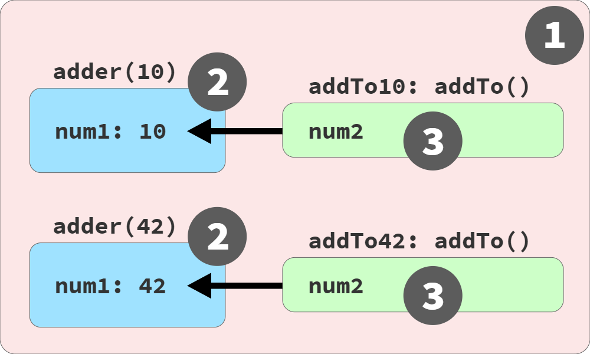
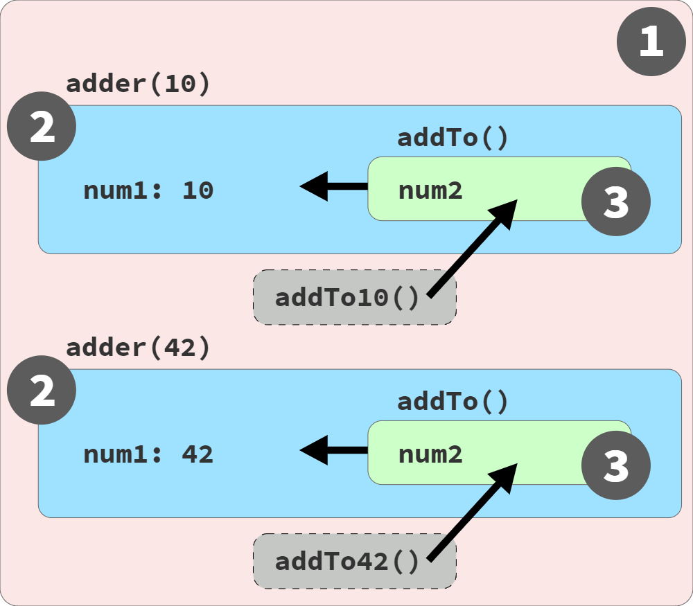

# You Don't Know JS Yet: Scope & Closures - 2nd Edition
# Chapter 7: Using Closures

Up to this point, we've focused on the ins and outs of lexical scope, and how that affects the organization and usage of variables in our programs.

Our attention again shifts broader in abstraction, to the historically somewhat daunting topic of closure. Don't worry! You don't need an advanced computer science degree to make sense of it. Our broad goal in this book is not merely to understand scope, but to more effectively use it in the structure of our programs; closure is central to that effort.

Recall the main conclusion of Chapter 6: the *least exposure* principle (POLE) encourages us to use block (and function) scoping to limit the scope exposure of variables. This helps keep code understandable and maintainable, and helps avoid many scoping pitfalls (i.e., name collision, etc.).

Closure builds on this approach: for variables we need to use over time, instead of placing them in larger outer scopes, we can encapsulate (more narrowly scope) them but still preserve access from inside functions, for broader use. Functions *remember* these referenced scoped variables via closure.

We already saw an example of this kind of closure in the previous chapter (`factorial(..)` in Chapter 6), and you've almost certainly already used it in your own programs. If you've ever written a callback that accesses variables outside its own scope... guess what!? That's closure.

Closure is one of the most important language characteristics ever invented in programming—it underlies major programming paradigms, including Functional Programming (FP), modules, and even a bit of class-oriented design. Getting comfortable with closure is required for mastering JS and effectively leveraging many important design patterns throughout your code.

Addressing all aspects of closure requires a daunting mountain of discussion and code throughout this chapter. Make sure to take your time and ensure you're comfortable with each bit before moving onto the next.

## See the Closure

Closure is originally a mathematical concept, from lambda calculus. But I'm not going to list out math formulas or use a bunch of notation and jargon to define it.

Instead, I'm going to focus on a practical perspective. We'll start by defining closure in terms of what we can observe in different behavior of our programs, as opposed to if closure was not present in JS. However, later in this chapter, we're going to flip closure around to look at it from an *alternative perspective*.

Closure is a behavior of functions and only functions. If you aren't dealing with a function, closure does not apply. An object cannot have closure, nor does a class have closure (though its functions/methods might). Only functions have closure.

For closure to be observed, a function must be invoked, and specifically it must be invoked in a different branch of the scope chain from where it was originally defined. A function executing in the same scope it was defined would not exhibit any observably different behavior with or without closure being possible; by the observational perspective and definition, that is not closure.

Let's look at some code, annotated with its relevant scope bubble colors (see Chapter 2):

```js
// outer/global scope: RED(1)

function lookupStudent(studentID) {
    // function scope: BLUE(2)

    var students = [
        { id: 14, name: "Kyle" },
        { id: 73, name: "Suzy" },
        { id: 112, name: "Frank" },
        { id: 6, name: "Sarah" }
    ];

    return function greetStudent(greeting){
        // function scope: GREEN(3)

        var student = students.find(
            student => student.id == studentID
        );

        return `${ greeting }, ${ student.name }!`;
    };
}

var chosenStudents = [
    lookupStudent(6),
    lookupStudent(112)
];

// accessing the function's name:
chosenStudents[0].name;
// greetStudent

chosenStudents[0]("Hello");
// Hello, Sarah!

chosenStudents[1]("Howdy");
// Howdy, Frank!
```

The first thing to notice about this code is that the `lookupStudent(..)` outer function creates and returns an inner function called `greetStudent(..)`. `lookupStudent(..)` is called twice, producing two separate instances of its inner `greetStudent(..)` function, both of which are saved into the `chosenStudents` array.

We verify that's the case by checking the `.name` property of the returned function saved in `chosenStudents[0]`, and it's indeed an instance of the inner `greetStudent(..)`.

After each call to `lookupStudent(..)` finishes, it would seem like all its inner variables would be discarded and GC'd (garbage collected). The inner function is the only thing that seems to be returned and preserved. But here's where the behavior differs in ways we can start to observe.

While `greetStudent(..)` does receive a single argument as the parameter named `greeting`, it also makes reference to both `students` and `studentID`, identifiers which come from the enclosing scope of `lookupStudent(..)`. Each of those references from the inner function to the variable in an outer scope is called a *closure*. In academic terms, each instance of `greetStudent(..)` *closes over* the outer variables `students` and `studentID`.

So what do those closures do here, in a concrete, observable sense?

Closure allows `greetStudent(..)` to continue to access those outer variables even after the outer scope is finished (when each call to `lookupStudent(..)` completes). Instead of the instances of `students` and `studentID` being GC'd, they stay around in memory. At a later time when either instance of the `greetStudent(..)` function is invoked, those variables are still there, holding their current values.

If JS functions did not have closure, the completion of each `lookupStudent(..)` call would immediately tear down its scope and GC the `students` and `studentID` variables. When we later called one of the `greetStudent(..)` functions, what would then happen?

If `greetStudent(..)` tried to access what it thought was a BLUE(2) marble, but that marble did not actually exist (anymore), the reasonable assumption is we should get a `ReferenceError`, right?

But we don't get an error. The fact that the execution of `chosenStudents[0]("Hello")` works and returns us the message "Hello, Sarah!", means it was still able to access the `students` and `studentID` variables. This is a direct observation of closure!

### Pointed Closure

Actually, we glossed over a little detail in the previous discussion which I'm guessing many readers missed!

Because of how terse the syntax for `=>` arrow functions is, it's easy to forget that they still create a scope (as asserted in "Arrow Functions" in Chapter 3). The `student => student.id == studentID` arrow function is creating another scope bubble inside the `greetStudent(..)` function scope.

Building on the metaphor of colored buckets and bubbles from Chapter 2, if we were creating a colored diagram for this code, there's a fourth scope at this innermost nesting level, so we'd need a fourth color; perhaps we'd pick ORANGE(4) for that scope:

```js
var student = students.find(
    student =>
        // function scope: ORANGE(4)
        student.id == studentID
);
```

The BLUE(2) `studentID` reference is actually inside the ORANGE(4) scope rather than the GREEN(3) scope of `greetStudent(..)`; also, the `student` parameter of the arrow function is ORANGE(4), shadowing the GREEN(3) `student`.

The consequence here is that this arrow function passed as a callback to the array's `find(..)` method has to hold the closure over `studentID`, rather than `greetStudent(..)` holding that closure. That's not too big of a deal, as everything still works as expected. It's just important not to skip over the fact that even tiny arrow functions can get in on the closure party.

### Adding Up Closures

Let's examine one of the canonical examples often cited for closure:

```js
function adder(num1) {
    return function addTo(num2){
        return num1 + num2;
    };
}

var add10To = adder(10);
var add42To = adder(42);

add10To(15);    // 25
add42To(9);     // 51
```

Each instance of the inner `addTo(..)` function is closing over its own `num1` variable (with values `10` and `42`, respectively), so those `num1`'s don't go away just because `adder(..)` finishes. When we later invoke one of those inner `addTo(..)` instances, such as the `add10To(15)` call, its closed-over `num1` variable still exists and still holds the original `10` value. The operation is thus able to perform `10 + 15` and return the answer `25`.

An important detail might have been too easy to gloss over in that previous paragraph, so let's reinforce it: closure is associated with an instance of a function, rather than its single lexical definition. In the preceding snippet, there's just one inner `addTo(..)` function defined inside `adder(..)`, so it might seem like that would imply a single closure.

But actually, every time the outer `adder(..)` function runs, a *new* inner `addTo(..)` function instance is created, and for each new instance, a new closure. So each inner function instance (labeled `add10To(..)` and `add42To(..)` in our program) has its own closure over its own instance of the scope environment from that execution of `adder(..)`.

Even though closure is based on lexical scope, which is handled at compile time, closure is observed as a runtime characteristic of function instances.

### Live Link, Not a Snapshot

In both examples from the previous sections, we **read the value from a variable** that was held in a closure. That makes it feel like closure might be a snapshot of a value at some given moment. Indeed, that's a common misconception.

Closure is actually a live link, preserving access to the full variable itself. We're not limited to merely reading a value; the closed-over variable can be updated (re-assigned) as well! By closing over a variable in a function, we can keep using that variable (read and write) as long as that function reference exists in the program, and from anywhere we want to invoke that function. This is why closure is such a powerful technique used widely across so many areas of programming!

Figure 4 depicts the function instances and scope links:

<figure>
    
    <figcaption><em>Fig. 4: Visualizing Closures</em></figcaption>
    <br><br>
</figure>

As shown in Figure 4, each call to `adder(..)` creates a new BLUE(2) scope containing a `num1` variable, as well as a new instance of `addTo(..)` function as a GREEN(3) scope. Notice that the function instances (`addTo10(..)` and `addTo42(..)`) are present in and invoked from the RED(1) scope.

Now let's examine an example where the closed-over variable is updated:

```js
function makeCounter() {
    var count = 0;

    return getCurrent(){
        count = count + 1;
        return count;
    };
}

var hits = makeCounter();

// later

hits();     // 1

// later

hits();     // 2
hits();     // 3
```

The `count` variable is closed over by the inner `getCurrent()` function, which keeps it around instead of it being subjected to GC. The `hits()` function calls access *and* update this variable, returning an incrementing count each time.

Though the enclosing scope of a closure is typically from a function, that's not actually required; there only needs to be an inner function present inside an outer scope:

```js
var hits;
{   // an outer scope (but not a function)
    let count = 0;
    hits = function getCurrent(){
        count = count + 1;
        return count;
    };
}
hits();     // 1
hits();     // 2
hits();     // 3
```

| NOTE: |
| :--- |
| I deliberately defined `getCurrent()` as a `function` expression instead of a `function` declaration. This isn't about closure, but with the dangerous quirks of FiB (Chapter 6). |

Because it's so common to mistake closure as value-oriented instead of variable-oriented, developers sometimes get tripped up trying to use closure to snapshot-preserve a value from some moment in time. Consider:

```js
var studentName = "Frank";

var greeting = function hello() {
    // we are closing over `studentName`,
    // not "Frank"
    console.log(
        `Hello, ${ studentName }!`
    );
}

// later

studentName = "Suzy";

// later

greeting();
// Hello, Suzy!
```

By defining `greeting()` (aka, `hello()`) when `studentName` holds the value `"Frank"` (before the re-assignment to `"Suzy"`), the mistaken assumption is often that the closure will capture `"Frank"`. But `greeting()` is closed over the variable `studentName`, not its value. Whenever `greeting()` is invoked, the current value of the variable (`"Suzy"`, in this case) is reflected.

The classic illustration of this mistake is defining functions inside a loop:

```js
var keeps = [];

for (var i = 0; i < 3; i++) {
    keeps[i] = function keepI(){
        // closure over `i`
        return i;
    };
}

keeps[0]();   // 3 -- WHY!?
keeps[1]();   // 3
keeps[2]();   // 3
```

| NOTE: |
| :--- |
| This kind of closure illustration typically uses a `setTimeout(..)` or some other callback like an event handler, inside the loop. I've simplified the example by storing function references in an array, so that we don't need to consider asynchronous timing in our analysis. The closure principle is the same, regardless. |

You might have expected the `keeps[0]()` invocation to return `0`, since that function was created during the first iteration of the loop when `i` was `0`. But again, that assumption stems from thinking of closure as value-oriented rather than variable-oriented.

Something about the structure of a `for`-loop can trick us into thinking that each iteration gets its own new `i` variable; in fact, this program only has one `i` since it was declared with `var`.

Each saved function returns `3`, because by the end of the loop, the single `i` variable in the program has been assigned `3`. Each of the three functions in the `keeps` array do have individual closures, but they're all closed over that same shared `i` variable.

Of course, a single variable can only ever hold one value at any given moment. So if you want to preserve multiple values, you need a different variable for each.

How could we do that in the loop snippet? Let's create a new variable for each iteration:

```js
var keeps = [];

for (var i = 0; i < 3; i++) {
    // new `j` created each iteration, which gets
    // a copy of the value of `i` at this moment
    let j = i;

    // the `i` here isn't being closed over, so
    // it's fine to immediately use its current
    // value in each loop iteration
    keeps[i] = function keepEachJ(){
        // close over `j`, not `i`!
        return j;
    };
}
keeps[0]();   // 0
keeps[1]();   // 1
keeps[2]();   // 2
```

Each function is now closed over a separate (new) variable from each iteration, even though all of them are named `j`. And each `j` gets a copy of the value of `i` at that point in the loop iteration; that `j` never gets re-assigned. So all three functions now return their expected values: `0`, `1`, and `2`!

Again remember, even if we were using asynchrony in this program, such as passing each inner `keepEachJ()` function into `setTimeout(..)` or some event handler subscription, the same kind of closure behavior would still be observed.

Recall the "Loops" section in Chapter 5, which illustrates how a `let` declaration in a `for` loop actually creates not just one variable for the loop, but actually creates a new variable for *each iteration* of the loop. That trick/quirk is exactly what we need for our loop closures:

```js
var keeps = [];

for (let i = 0; i < 3; i++) {
    // the `let i` gives us a new `i` for
    // each iteration, automatically!
    keeps[i] = function keepEachI(){
        return i;
    };
}
keeps[0]();   // 0
keeps[1]();   // 1
keeps[2]();   // 2
```

Since we're using `let`, three `i`'s are created, one for each loop, so each of the three closures *just work* as expected.

### Common Closures: Ajax and Events

Closure is most commonly encountered with callbacks:

```js
function lookupStudentRecord(studentID) {
    ajax(
        `https://some.api/student/${ studentID }`,
        function onRecord(record) {
            console.log(
                `${ record.name } (${ studentID })`
            );
        }
    );
}

lookupStudentRecord(114);
// Frank (114)
```

The `onRecord(..)` callback is going to be invoked at some point in the future, after the response from the Ajax call comes back. This invocation will happen from the internals of the `ajax(..)` utility, wherever that comes from. Furthermore, when that happens, the `lookupStudentRecord(..)` call will long since have completed.

Why then is `studentID` still around and accessible to the callback? Closure.

Event handlers are another common usage of closure:

```js
function listenForClicks(btn,label) {
    btn.addEventListener("click",function onClick(){
        console.log(
            `The ${ label } button was clicked!`
        );
    });
}

var submitBtn = document.getElementById("submit-btn");

listenForClicks(submitBtn,"Checkout");
```

The `label` parameter is closed over by the `onClick(..)` event handler callback. When the button is clicked, `label` still exists to be used. This is closure.

### What If I Can't See It?

You've probably heard this common adage:

> If a tree falls in the forest but nobody is around to hear it, does it make a sound?

It's a silly bit of philosophical gymnastics. Of course from a scientific perspective, sound waves are created. But the real point: *does it matter* if the sound happens?

Remember, the emphasis in our definition of closure is observability. If a closure exists (in a technical, implementation, or academic sense) but it cannot be observed in our programs, *does it matter?* No.

To reinforce this point, let's look at some examples that are *not* observably based on closure.

For example, invoking a function that makes use of lexical scope lookup:

```js
function say(myName) {
    var greeting = "Hello";
    output();

    function output() {
        console.log(
            `${ greeting }, ${ myName }!`
        );
    }
}

say("Kyle");
// Hello, Kyle!
```

The inner function `output()` accesses the variables `greeting` and `myName` from its enclosing scope. But the invocation of `output()` happens in that same scope, where of course `greeting` and `myName` are still available; that's just lexical scope, not closure.

Any lexically scoped language whose functions didn't support closure would still behave this same way.

In fact, global scope variables essentially cannot be (observably) closed over, because they're always accessible from everywhere. No function can ever be invoked in any part of the scope chain that is not a descendant of the global scope.

Consider:

```js
var students = [
    { id: 14, name: "Kyle" },
    { id: 73, name: "Suzy" },
    { id: 112, name: "Frank" },
    { id: 6, name: "Sarah" }
];

function getFirstStudent() {
    return function firstStudent(){
        return students[0].name;
    };
}

var student = getFirstStudent();

student();
// Kyle
```

The inner `firstStudent()` function does reference `students`, which is a variable outside its own scope. But since `students` happens to be from the global scope, no matter where that function is invoked in the program, its ability to access `students` is nothing more special than normal lexical scope.

All function invocations can access global variables, regardless of whether closure is supported by the language or not. Global variables don't need to be closed over.

Variables that are merely present but never accessed don't result in closure:

```js
function lookupStudent(studentID) {
    return function nobody(){
        var msg = "Nobody's here yet.";
        console.log(msg);
    };
}

var student = lookupStudent(112);

student();
// Nobody's here yet.
```

The inner function `nobody()` doesn't close over any outer variables—it only uses its own variable `msg`. Even though `studentID` is present in the enclosing scope, `studentID` is not referred to by `nobody()`. The JS engine doesn't need to keep `studentID` around after `lookupStudent(..)` has finished running, so GC wants to clean up that memory!

Whether JS functions support closure or not, this program would behave the same. Therefore, no observed closure here.

If there's no function invocation, closure can't be observed:

```js
function greetStudent(studentName) {
    return function greeting(){
        console.log(
            `Hello, ${ studentName }!`
        );
    };
}

greetStudent("Kyle");

// nothing else happens
```

This one's tricky, because the outer function definitely does get invoked. But the inner function is the one that *could* have had closure, and yet it's never invoked; the returned function here is just thrown away. So even if technically the JS engine created closure for a brief moment, it was not observed in any meaningful way in this program.

A tree may have fallen... but we didn't hear it, so we don't care.

### Observable Definition

We're now ready to define closure:

> Closure is observed when a function uses variable(s) from outer scope(s) even while running in a scope where those variable(s) wouldn't be accessible.

The key parts of this definition are:

* Must be a function involved

* Must reference at least one variable from an outer scope

* Must be invoked in a different branch of the scope chain from the variable(s)

This observation-oriented definition means we shouldn't dismiss closure as some indirect, academic trivia. Instead, we should look and plan for the direct, concrete effects closure has on our program behavior.

## The Closure Lifecycle and Garbage Collection (GC)

Since closure is inherently tied to a function instance, its closure over a variable lasts as long as there is still a reference to that function.

If ten functions all close over the same variable, and over time nine of these function references are discarded, the lone remaining function reference still preserves that variable. Once that final function reference is discarded, the last closure over that variable is gone, and the variable itself is GC'd.

This has an important impact on building efficient and performant programs. Closure can unexpectedly prevent the GC of a variable that you're otherwise done with, which leads to run-away memory usage over time. That's why it's important to discard function references (and thus their closures) when they're not needed anymore.

Consider:

```js
function manageBtnClickEvents(btn) {
    var clickHandlers = [];

    return function listener(cb){
        if (cb) {
            let clickHandler =
                function onClick(evt){
                    console.log("clicked!");
                    cb(evt);
                };
            clickHandlers.push(clickHandler);
            btn.addEventListener(
                "click",
                clickHandler
            );
        }
        else {
            // passing no callback unsubscribes
            // all click handlers
            for (let handler of clickHandlers) {
                btn.removeEventListener(
                    "click",
                    handler
                );
            }

            clickHandlers = [];
        }
    };
}

// var mySubmitBtn = ..
var onSubmit = manageBtnClickEvents(mySubmitBtn);

onSubmit(function checkout(evt){
    // handle checkout
});

onSubmit(function trackAction(evt){
    // log action to analytics
});

// later, unsubscribe all handlers:
onSubmit();
```

In this program, the inner `onClick(..)` function holds a closure over the passed in `cb` (the provided event callback). That means the `checkout()` and `trackAction()` function expression references are held via closure (and cannot be GC'd) for as long as these event handlers are subscribed.

When we call `onSubmit()` with no input on the last line, all event handlers are unsubscribed, and the `clickHandlers` array is emptied. Once all click handler function references are discarded, the closures of `cb` references to `checkout()` and `trackAction()` are discarded.

When considering the overall health and efficiency of the program, unsubscribing an event handler when it's no longer needed can be even more important than the initial subscription!

### Per Variable or Per Scope?

Another question we need to tackle: should we think of closure as applied only to the referenced outer variable(s), or does closure preserve the entire scope chain with all its variables?

In other words, in the previous event subscription snippet, is the inner `onClick(..)` function closed over only `cb`, or is it also closed over `clickHandler`, `clickHandlers`, and `btn`?

Conceptually, closure is **per variable** rather than *per scope*. Ajax callbacks, event handlers, and all other forms of function closures are typically assumed to close over only what they explicitly reference.

But the reality is more complicated than that.

Another program to consider:

```js
function manageStudentGrades(studentRecords) {
    var grades = studentRecords.map(getGrade);

    return addGrade;

    // ************************

    function getGrade(record){
        return record.grade;
    }

    function sortAndTrimGradesList() {
        // sort by grades, descending
        grades.sort(function desc(g1,g2){
            return g2 - g1;
        });

        // only keep the top 10 grades
        grades = grades.slice(0,10);
    }

    function addGrade(newGrade) {
        grades.push(newGrade);
        sortAndTrimGradesList();
        return grades;
    }
}

var addNextGrade = manageStudentGrades([
    { id: 14, name: "Kyle", grade: 86 },
    { id: 73, name: "Suzy", grade: 87 },
    { id: 112, name: "Frank", grade: 75 },
    // ..many more records..
    { id: 6, name: "Sarah", grade: 91 }
]);

// later

addNextGrade(81);
addNextGrade(68);
// [ .., .., ... ]
```

The outer function `manageStudentGrades(..)` takes a list of student records, and returns an `addGrade(..)` function reference, which we externally label `addNextGrade(..)`. Each time we call `addNextGrade(..)` with a new grade, we get back a current list of the top 10 grades, sorted numerically descending (see `sortAndTrimGradesList()`).

From the end of the original `manageStudentGrades(..)` call, and between the multiple `addNextGrade(..)` calls, the `grades` variable is preserved inside `addGrade(..)` via closure; that's how the running list of top grades is maintained. Remember, it's a closure over the variable `grades` itself, not the array it holds.

That's not the only closure involved, however. Can you spot other variables being closed over?

Did you spot that `addGrade(..)` references `sortAndTrimGradesList`? That means it's also closed over that identifier, which happens to hold a reference to the `sortAndTrimGradesList()` function. That second inner function has to stay around so that `addGrade(..)` can keep calling it, which also means any variables *it* closes over stick around—though, in this case, nothing extra is closed over there.

What else is closed over?

Consider the `getGrade` variable (and its function); is it closed over? It's referenced in the outer scope of `manageStudentGrades(..)` in the `.map(getGrade)` call. But it's not referenced in `addGrade(..)` or `sortAndTrimGradesList()`.

What about the (potentially) large list of student records we pass in as `studentRecords`? Is that variable closed over? If it is, the array of student records is never getting GC'd, which leads to this program holding onto a larger amount of memory than we might assume. But if we look closely again, none of the inner functions reference `studentRecords`.

According to the *per variable* definition of closure, since `getGrade` and `studentRecords` are *not* referenced by the inner functions, they're not closed over. They should be freely available for GC right after the `manageStudentGrades(..)` call completes.

Indeed, try debugging this code in a recent JS engine, like v8 in Chrome, placing a breakpoint inside the `addGrade(..)` function. You may notice that the inspector **does not** list the `studentRecords` variable. That's proof, debugging-wise anyway, that the engine does not maintain `studentRecords` via closure. Phew!

But how reliable is this observation as proof? Consider this (rather contrived!) program:

```js
function storeStudentInfo(id,name,grade) {
    return function getInfo(whichValue){
        // warning:
        //   using `eval(..)` is a bad idea!
        var val = eval(whichValue);
        return val;
    };
}

var info = storeStudentInfo(73,"Suzy",87);

info("name");
// Suzy

info("grade");
// 87
```

Notice that the inner function `getInfo(..)` is not explicitly closed over any of `id`, `name`, or `grade` variables. And yet, calls to `info(..)` seem to still be able to access the variables, albeit through use of the `eval(..)` lexical scope cheat (see Chapter 1).

So all the variables were definitely preserved via closure, despite not being explicitly referenced by the inner function. So does that disprove the *per variable* assertion in favor of *per scope*? Depends.

Many modern JS engines do apply an *optimization* that removes any variables from a closure scope that aren't explicitly referenced. However, as we see with `eval(..)`, there are situations where such an optimization cannot be applied, and the closure scope continues to contain all its original variables. In other words, closure must be *per scope*, implementation wise, and then an optional optimization trims down the scope to only what was closed over (a similar outcome as *per variable* closure).

Even as recent as a few years ago, many JS engines did not apply this optimization; it's possible your websites may still run in such browsers, especially on older or lower-end devices. That means it's possible that long-lived closures such as event handlers may be holding onto memory much longer than we would have assumed.

And the fact that it's an optional optimization in the first place, rather than a requirement of the specification, means that we shouldn't just casually over-assume its applicability.

In cases where a variable holds a large value (like an object or array) and that variable is present in a closure scope, if you don't need that value anymore and don't want that memory held, it's safer (memory usage) to manually discard the value rather than relying on closure optimization/GC.

Let's apply a *fix* to the earlier `manageStudentGrades(..)` example to ensure the potentially large array held in `studentRecords` is not caught up in a closure scope unnecessarily:

```js
function manageStudentGrades(studentRecords) {
    var grades = studentRecords.map(getGrade);

    // unset `studentRecords` to prevent unwanted
    // memory retention in the closure
    studentRecords = null;

    return addGrade;
    // ..
}
```

We're not removing `studentRecords` from the closure scope; that we cannot control. We're ensuring that even if `studentRecords` remains in the closure scope, that variable is no longer referencing the potentially large array of data; the array can be GC'd.

Again, in many cases JS might automatically optimize the program to the same effect. But it's still a good habit to be careful and explicitly make sure we don't keep any significant amount of device memory tied up any longer than necessary.

As a matter of fact, we also technically don't need the function `getGrade()` anymore after the `.map(getGrade)` call completes. If profiling our application showed this was a critical area of excess memory use, we could possibly eek out a tiny bit more memory by freeing up that reference so its value isn't tied up either. That's likely unnecessary in this toy example, but this is a general technique to keep in mind if you're optimizing the memory footprint of your application.

The takeaway: it's important to know where closures appear in our programs, and what variables are included. We should manage these closures carefully so we're only holding onto what's minimally needed and not wasting memory.

## An Alternative Perspective

Reviewing our working definition for closure, the assertion is that functions are "first-class values" that can be passed around the program, just like any other value. Closure is the link-association that connects that function to the scope/variables outside of itself, no matter where that function goes.

Let's recall a code example from earlier in this chapter, again with relevant scope bubble colors annotated:

```js
// outer/global scope: RED(1)

function adder(num1) {
    // function scope: BLUE(2)

    return function addTo(num2){
        // function scope: GREEN(3)

        return num1 + num2;
    };
}

var add10To = adder(10);
var add42To = adder(42);

add10To(15);    // 25
add42To(9);     // 51
```

Our current perspective suggests that wherever a function is passed and invoked, closure preserves a hidden link back to the original scope to facilitate the access to the closed-over variables. Figure 4, repeated here for convenience, illustrates this notion:

<figure>
    
    <figcaption><em>Fig. 4 (repeat): Visualizing Closures</em></figcaption>
    <br><br>
</figure>

But there's another way of thinking about closure, and more precisely the nature of functions being *passed around*, that may help deepen the mental models.

This alternative model de-emphasizes "functions as first-class values," and instead embraces how functions (like all non-primitive values) are held by reference in JS, and assigned/passed by reference-copy—see Appendix A of the *Get Started* book for more information.

Instead of thinking about the inner function instance of `addTo(..)` moving to the outer RED(1) scope via the `return` and assignment, we can envision that function instances actually just stay in place in their own scope environment, of course with their scope-chain intact.

What gets *sent* to the RED(1) scope is **just a reference** to the in-place function instance, rather than the function instance itself. Figure 5 depicts the inner function instances remaining in place, pointed to by the RED(1) `addTo10` and `addTo42` references, respectively:

<figure>
    
    <figcaption><em>Fig. 5: Visualizing Closures (Alternative)</em></figcaption>
    <br><br>
</figure>

As shown in Figure 5, each call to `adder(..)` still creates a new BLUE(2) scope containing a `num1` variable, as well as an instance of the GREEN(3) `addTo(..)` scope. But what's different from Figure 4 is, now these GREEN(3) instances remain in place, naturally nested inside of their BLUE(2) scope instances. The `addTo10` and `addTo42` references are moved to the RED(1) outer scope, not the function instances themselves.

When `addTo10(15)` is called, the `addTo(..)` function instance (still in place in its original BLUE(2) scope environment) is invoked. Since the function instance itself never moved, of course it still has natural access to its scope chain. Same with the `addTo42(9)` call—nothing special here beyond lexical scope.

So what then *is* closure, if not the *magic* that lets a function maintain a link to its original scope chain even as that function moves around in other scopes? In this alternative model, functions stay in place and keep accessing their original scope chain just like they always could.

Closure instead describes the *magic* of **keeping alive a function instance**, along with its whole scope environment and chain, for as long as there's at least one reference to that function instance floating around in any other part of the program.

That definition of closure is less observational and a bit less familiar-sounding compared to the traditional academic perspective. But it's nonetheless still useful, because the benefit is that we simplify explanation of closure to a straightforward combination of references and in-place function instances.

The previous model (Figure 4) is not *wrong* at describing closure in JS. It's just more conceptually inspired, an academic perspective on closure. By contrast, the alternative model (Figure 5) could be described as a bit more implementation focused, how JS actually works.

Both perspectives/models are useful in understanding closure, but the reader may find one a little easier to hold than the other. Whichever you choose, the observable outcomes in our program are the same.

| NOTE: |
| :--- |
| This alternative model for closure does affect whether we classify synchronous callbacks as examples of closure or not. More on this nuance in Appendix A. |

## Why Closure?

Now that we have a well-rounded sense of what closure is and how it works, let's explore some ways it can improve the code structure and organization of an example program.

Imagine you have a button on a page that when clicked, should retrieve and send some data via an Ajax request. Without using closure:

```js
var APIendpoints = {
    studentIDs:
        "https://some.api/register-students",
    // ..
};

var data = {
    studentIDs: [ 14, 73, 112, 6 ],
    // ..
};

function makeRequest(evt) {
    var btn = evt.target;
    var recordKind = btn.dataset.kind;
    ajax(
        APIendpoints[recordKind],
        data[recordKind]
    );
}

// <button data-kind="studentIDs">
//    Register Students
// </button>
btn.addEventListener("click",makeRequest);
```

The `makeRequest(..)` utility only receives an `evt` object from a click event. From there, it has to retrieve the `data-kind` attribute from the target button element, and use that value to lookup both a URL for the API endpoint as well as what data should be included in the Ajax request.

This works OK, but it's unfortunate (inefficient, more confusing) that the event handler has to read a DOM attribute each time it's fired. Why couldn't an event handler *remember* this value? Let's try using closure to improve the code:

```js
var APIendpoints = {
    studentIDs:
        "https://some.api/register-students",
    // ..
};

var data = {
    studentIDs: [ 14, 73, 112, 6 ],
    // ..
};

function setupButtonHandler(btn) {
    var recordKind = btn.dataset.kind;

    btn.addEventListener(
        "click",
        function makeRequest(evt){
            ajax(
                APIendpoints[recordKind],
                data[recordKind]
            );
        }
    );
}

// <button data-kind="studentIDs">
//    Register Students
// </button>

setupButtonHandler(btn);
```

With the `setupButtonHandler(..)` approach, the `data-kind` attribute is retrieved once and assigned to the `recordKind` variable at initial setup. `recordKind` is then closed over by the inner `makeRequest(..)` click handler, and its value is used on each event firing to look up the URL and data that should be sent.

| NOTE: |
| :--- |
| `evt` is still passed to `makeRequest(..)`, though in this case we're not using it anymore. It's still listed, for consistency with the previous snippet. |

By placing `recordKind` inside `setupButtonHandler(..)`, we limit the scope exposure of that variable to a more appropriate subset of the program; storing it globally would have been worse for code organization and readability. Closure lets the inner `makeRequest()` function instance *remember* this variable and access whenever it's needed.

Building on this pattern, we could have looked up both the URL and data once, at setup:

```js
function setupButtonHandler(btn) {
    var recordKind = btn.dataset.kind;
    var requestURL = APIendpoints[recordKind];
    var requestData = data[recordKind];

    btn.addEventListener(
        "click",
        function makeRequest(evt){
            ajax(requestURL,requestData);
        }
    );
}
```

Now `makeRequest(..)` is closed over `requestURL` and `requestData`, which is a little bit cleaner to understand, and also slightly more performant.

Two similar techniques from the Functional Programming (FP) paradigm that rely on closure are partial application and currying. Briefly, with these techniques, we alter the *shape* of functions that require multiple inputs so some inputs are provided up front, and other inputs are provided later; the initial inputs are remembered via closure. Once all inputs have been provided, the underlying action is performed.

By creating a function instance that encapsulates some information inside (via closure), the function-with-stored-information can later be used directly without needing to re-provide that input. This makes that part of the code cleaner, and also offers the opportunity to label partially applied functions with better semantic names.

Adapting partial application, we can further improve the preceding code:

```js
function defineHandler(requestURL,requestData) {
    return function makeRequest(evt){
        ajax(requestURL,requestData);
    };
}

function setupButtonHandler(btn) {
    var recordKind = btn.dataset.kind;
    var handler = defineHandler(
        APIendpoints[recordKind],
        data[recordKind]
    );
    btn.addEventListener("click",handler);
}
```

The `requestURL` and `requestData` inputs are provided ahead of time, resulting in the `makeRequest(..)` partially applied function, which we locally label `handler`. When the event eventually fires, the final input (`evt`, even though it's ignored) is passed to `handler()`, completing its inputs and triggering the underlying Ajax request.

Behavior-wise, this program is pretty similar to the previous one, with the same type of closure. But by isolating the creation of `makeRequest(..)` in a separate utility (`defineHandler(..)`), we make that definition more reusable across the program. We also explicitly limit the closure scope to only the two variables needed.

## Closer to Closure

As we close down a dense chapter, take some deep breaths let it all sink in. Seriously, that's a lot of information for anyone to consume!

We explored two models for mentally tackling closure:

* Observational: closure is a function instance remembering its outer variables even as that function is passed to and **invoked in** other scopes.

* Implementational: closure is a function instance and its scope environment preserved in-place while any references to it are passed around and **invoked from** other scopes.

Summarizing the benefits to our programs:

* Closure can improve efficiency by allowing a function instance to remember previously determined information instead of having to compute it each time.

* Closure can improve code readability, bounding scope-exposure by encapsulating variable(s) inside function instances, while still making sure the information in those variables is accessible for future use. The resultant narrower, more specialized function instances are cleaner to interact with, since the preserved information doesn't need to be passed in every invocation.

Before you move on, take some time to restate this summary *in your own words*, explaining what closure is and why it's helpful in your programs. The main book text concludes with a final chapter that builds on top of closure with the module pattern.
