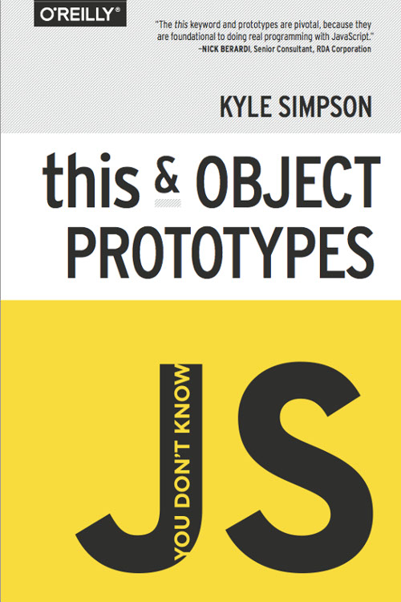

# 你不懂JS: *this* 与对象原型

-----

**[从 O'Reilly 购买数字/印刷版](http://shop.oreilly.com/product/0636920033738.do)**

-----

[目录](toc.md)

* [序](foreword.md)（[Nick Berardi](https://github.com/nberardi)）
* [前言](../preface.md)
* [第一章: *this* 是什么](ch1.md)
* [第二章: *this* 豁然开朗!](ch2.md)
* [第三章: 对象](ch3.md)
* [第四章: 混合（淆）“类”的对象](ch4.md)
* [第五章: 原型](ch5.md)
* [第六章: 行为委托](ch6.md)
* [附录A: ES6 *class*](apA.md)
* [附录B: 鸣谢](apB.md)
