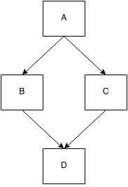

# 你不懂JS: *this* 与对象原型
# 第四章: 混合（淆）“类”的对象

接着我们上一章对对象的探索，我们很自然的将注意力转移到“面向对象（OO）编程”，与“类（class）”。我们先将“面向类”作为设计模式来看看，之后我们再考察“类”的机制：“实例化（instantiation）”, “继承（inheritance）”与“（相对）多态(relative polymorphism）”。

我们将会看到，这些概念并不是非常自然地映射到 JS 的对象机制上，以及许多 JavaScript 开发者为了克服这些挑战所做的努力（mixins等）。

**注意：** 这一章花了相当一部分时间（前一半！）在着重解释“面向对象编程”理论上。在后半部分讨论“Mixins（混合）”时，我们最终会将这些理论与真实且实际的 JavaScript 代码联系起来。但是这里首先要蹚过许多概念和假想代码，所以可别跟丢了 —— 坚持下去！

## 类理论

“类/继承”描述了一种特定的代码组织和结构形式 —— 一种在我们的软件中对真实世界的建模方法。

OO 或者面向类的编程强调数据和操作它的行为之间有固有的联系（当然，依数据的类型和性质不同而不同！），所以合理的设计是将数据和行为打包在一起（也称为封装）。这有时在正式的计算机科学中称为“数据结构”。

比如，表示一个单词或短语的一系列字符通常称为“string（字符串）”。这些字符就是数据。但你几乎从来不关心数据，你总是想对数据 *做事情*， 所以可以 *向* 数据实施的行为（计算它的长度，在末尾添加数据，检索，等等）都被设计成为 `String` 类的方法。

任何给定的字符串都是这个类的一个实例，这个类是一个整齐的集合包装：字符数据和我们可以对它进行操作的功能。

类还隐含着对一个特定数据结构的一种 *分类* 方法。其做法是将一个给定的结构考虑为一个更加泛化的基础定义的具体种类。

让我们通过一个最常被引用的例子来探索这种分类处理。一辆 *车* 可以被描述为一“类”更泛化的东西 —— *载具* —— 的具体实现。

我们在软件中通过定义 `Vehicle` 类和 `Car` 类来模型化这种关系。

`Vehicle` 的定义可能会包含像动力（引擎等），载人能力等等，这些都是行为。我们在 `Vehicle` 中定义的都是所有（或大多数）不同类型的载具（飞机、火车、机动车）都共同拥有的东西。

在我们的软件中为每一种不同类型的载具一次又一次地重定义“载人能力”这个基本性质可能没有道理。反而，我们在 `Vehicle` 中把这个能力定义一次，之后当我们定义 `Car` 时，我们简单地指出它从基本的 `Vehicle` 定义中“继承”（或“扩展”）。于是 `Car` 的定义就被称为特化了更一般的 `Vehicle` 定义。

`Vehicle` 和 `Car` 用方法的形式集约地定义了行为，另一方面一个实例中的数据就像一个唯一的车牌号一样属于一辆具体的车。

**这样，类，继承，和实例化就诞生了。**

另一个关于类的关键概念是“多态（polymorphism）”，它描述这样的想法：一个来自于父类的泛化行为可以被子类覆盖，从而使它更加具体。实际上，相对多态允许我们在覆盖行为中引用基础行为。

类理论强烈建议父类和子类对相同的行为共享同样的方法名，以便于子类（差异化地）覆盖父类。我们即将看到，在你的 JavaScript 代码中这么做会导致种种困难和脆弱的代码。

### "类"设计模式

你可能从没把类当做一种“设计模式”考虑过，因为最常见的是关于流行的“面向对象设计模式”的讨论，比如“迭代器（Iterator）”、“观察者（Observer）”、“工厂（Factory）”、“单例（Singleton）”等等。当以这种方式表现时，几乎可以假定 OO 的类是我们实现所有（高级）设计模式的底层机制，好像对所有代码来说 OO 是一个给定的基础。

取决于你在编程方面接受过的正规教育的水平，你可能听说过“过程式编程（procedural programming）”：一种不用任何高级抽象，仅仅由过程（也就是函数）调用其他函数构成的描述代码的方式。你可能被告知过，类是一个将过程式风格的“面条代码”转换为结构良好，组织良好代码的 *恰当* 的方法。

当然，如果你有“函数式编程（functional programming）”的经验，你可能知道类只是几种常见设计模式中的一种。但是对于其他人来说，这可能是第一次你问自己，类是否真的是代码的根本基础，或者它们是在代码顶层上的选择性抽象。

有些语言（比如 Java）不给你选择，所以这根本没什么 *选择性* —— 一切都是类。其他语言如 C/C++ 或 PHP 同时给你过程式和面向类的语法，在使用哪种风格合适或混合风格上，留给开发者更多选择。

### JavaScript 的“类”

在这个问题上 JavaScript 属于哪一边？JS 拥有 *一些* 像类的语法元素（比如 `new` 和 `instanceof`）有一阵子了，而且在最近的 ES6 中，还有一些追加的东西，比如 `class` 关键字（见附录A）。

但这意味着 JavaScript 实际上 *拥有* 类吗？简单明了：**没有。**

由于类是一种设计模式，你 *可以*，用相当的努力（正如我们将在本章剩下的部分看到的），近似实现很多经典类的功能。JS 在通过提供看起来像类的语法，来努力满足用类进行设计的极其广泛的 *渴望*。

虽然我们好像有了看起来像类的语法，但是 JavaScript 机制好像在抵抗你使用 *类设计模式*，因为在底层，这些你正在上面工作的机制运行的十分不同。语法糖和（极其广泛被使用的）JS “Class”库费了很大力气来把这些真实情况对你隐藏起来，但你迟早会面对现实：你在其他语言中遇到的 *类* 和你在 JS 中模拟的“类”不同。

总而言之，类是软件设计中的一种可选模式，你可以选择在 JavaScript 中使用或不使用它。因为许多开发者都对面向类的软件设计情有独钟，我们将在本章剩下的部分中探索一下，为了使用 JS 提供的东西维护类的幻觉要付出什么代价，和我们经历的痛苦。

## 类机制

在许多面向类语言中，“标准库”都提供一个叫“栈”（压栈，弹出等）的数据结构，用一个 `Stack` 类表示。这个类拥有一组变量来存储数据，还拥有一组可公开访问的行为（“方法”），这些行为使你的代码有能力与（隐藏的）数据互动（添加或移除数据等等）。

但是在这样的语言中，你不是直接在 `Stack` 上操作（除非制造一个 **静态的** 类成员引用，但这超出了我们要讨论的范围）。`Stack` 类仅仅是 *任何* 的“栈”都会做的事情的一个抽象解释，但它本身不是一个“栈”。为了得到一个可以对之进行操作的实在的数据结构，你必须 **实例化** 这个 `Stack` 类。

### 建筑物

传统的"类（class）"和"实例（instance）"的比拟源自于建筑物的建造。

一个建筑师会规划出一栋建筑的所有性质：多宽，多高，在哪里有多少窗户，甚至墙壁和天花板用什么材料。在这个时候，她并不关心建筑物将会被建造在 *哪里*，她也不关心有 *多少* 这栋建筑的拷贝将被建造。

同时她也不关心这栋建筑的内容 —— 家具、墙纸、吊扇等等 —— 她仅关心建筑物含有何种结构。

她生产的建筑学上的蓝图仅仅是建筑物的“方案”。它们不实际构成我们可以实在进入其中并坐下的建筑物。为了这个任务我们需要一个建筑工人。建筑工人会拿走方案并精确地依照它们 *建造* 这栋建筑物。在真正的意义上，他是在将方案中意图的性质 *拷贝* 到物理建筑物中。

一旦完成，这栋建筑就是蓝图方案的一个物理实例，一个很可能实质完美的 *拷贝*。然后建筑工人就可以移动到隔壁将它再重做一遍，建造另一个 *拷贝*。

建筑物与蓝图间的关系是间接的。你可以检视蓝图来了解建筑物是如何构造的，但对于直接考察建筑物的每一部分，仅有蓝图是不够的。如果你想打开一扇门，你不得不走进建筑物自身 —— 蓝图仅仅是为了用来 *表示* 门的位置而在纸上画的线条。

一个类就是一个蓝图。为了实际得到一个对象并与之互动，我们必须从类中建造（也就是实例化）某些东西。这种“构建”的最终结果是一个对象，通常称为一个“实例”，我们可以按需要直接调用它的方法，访问它的公共数据属性。

**这个对象是所有在类中被描述的特性的 *拷贝*。**

你不太可能会指望走进一栋建筑之后发现，一份用于规划这栋建筑物的蓝图被裱起来挂在墙上，虽然蓝图可能在办公室的公共记录的文件中。相似地，你一般不会使用对象实例来直接访问和操作类，但是对于判定对象实例来自于 *哪个类* 至少是可能的。

与考虑对象实例与它源自的类的任何间接关系相比，考虑类和对象实例的直接关系更有用。**一个类通过拷贝操作被实例化为对象的形式。**


如你所见，箭头由左向右，从上至下，这表示着概念上和物理上发生的拷贝操作。

### 构造器（Constructor）

类的实例由类的一种特殊方法构建，这个方法的名称通常与类名相同，称为 *“构造器（constructor）”*。这个方法的具体工作，就是初始化实例所需的所有信息（状态）。

比如，考虑下面这个类的假想代码（语法是自创的）：

```js
class CoolGuy {
	specialTrick = nothing

	CoolGuy( trick ) {
		specialTrick = trick
	}

	showOff() {
		output( "Here's my trick: ", specialTrick )
	}
}
```

为了 *制造* 一个 `CoolGuy` 实例，我们需要调用类的构造器:

```js
Joe = new CoolGuy( "jumping rope" )

Joe.showOff() // Here's my trick: jumping rope
```

注意，`CoolGuy` 类有一个构造器 `CoolGuy()`，它实际上就是在我们说 `new CoolGuy(..)` 时调用的。我们从这个构造器拿回一个对象（类的一个实例），我们可以调用 `showOff()` 方法，来打印这个特定的 `CoolGuy` 的特殊才艺。

*显然，跳绳使Joe看起来很酷。*

类的构造器 *属于* 那个类，几乎总是和类同名。同时，构造器大多数情况下总是需要用 `new` 来调用，以便使语言的引擎知道你想要构建一个 *新的* 类的实例。

## 类继承

在面向类的语言中，你不仅可以定义一个能够初始化它自己的类，你还可以定义另外一个类 **继承** 自第一个类。

这第二个类通常被称为“子类”，而第一个类被称为“父类”。这些名词显然来自于亲子关系的比拟，虽然这种比拟有些扭曲，就像你马上要看到的。

当一个家长拥有一个和他有血缘关系的孩子时，家长的遗传性质会被拷贝到孩子身上。明显地，在大多数生物繁殖系统中，双亲都平等地贡献基因进行混合。但是为了这个比拟的目的，我们假设只有一个亲人。

一旦孩子出现，他或她就从亲人那里分离出来。这个孩子受其亲人的继承因素的严重影响，但是独一无二。如果这个孩子拥有红色的头发，这并不意味这他的亲人的头发 *曾经* 是红色，或者会自动 *变成* 红色。

以相似的方式，一旦一个子类被定义，它就分离且区别于父类。子类含有一份从父类那里得来的行为的初始拷贝，但它可以覆盖这些继承的行为，甚至是定义新行为。

重要的是，要记住我们是在讨论父 **类** 和子 **类**，而不是物理上的东西。这就是这个亲子比拟让人糊涂的地方，因为我们实际上应当说父类就是亲人的 DNA，而子类就是孩子的 DNA。我们不得不从两套 DNA 制造出（也就是“初始化”）人，用得到的物理上存在的人来与之进行谈话。

让我们把生物学上的亲子放在一边，通过一个稍稍不同的角度来看看继承：不同种类型的载具。这是用来理解继承的最经典（也是争议不断的）的比拟。

让我们重新审视本章前面的 `Vehicle` 和 `Car` 的讨论。考虑下面表达继承的类的假想代码：

```js
class Vehicle {
	engines = 1

	ignition() {
		output( "Turning on my engine." )
	}

	drive() {
		ignition()
		output( "Steering and moving forward!" )
	}
}

class Car inherits Vehicle {
	wheels = 4

	drive() {
		inherited:drive()
		output( "Rolling on all ", wheels, " wheels!" )
	}
}

class SpeedBoat inherits Vehicle {
	engines = 2

	ignition() {
		output( "Turning on my ", engines, " engines." )
	}

	pilot() {
		inherited:drive()
		output( "Speeding through the water with ease!" )
	}
}
```

**注意：** 为了简洁明了，这些类的构造器被省略了。

我们定义 `Vehicle` 类，假定它有一个引擎，有一个打开打火器的方法，和一个行驶的方法。但你永远也不会制造一个泛化的“载具”，所以在这里它只是一个概念的抽象。

然后我们定义了两种具体的载具：`Car` 和 `SpeedBoat`。它们都继承 `Vehicle` 的泛化性质，但之后它们都对这些性质进行了恰当的特化。一辆车有4个轮子，一艘快艇有两个引擎，意味着它需要在打火时需要特别注意要启动两个引擎。

### 多态（Polymorphism）

`Car` 定义了自己的 `drive()` 方法，它覆盖了从 `Vehicle` 继承来的同名方法。但是，`Car` 的 `drive()` 方法调用了 `inherited:drive()`，这表示 `Car` 可以引用它继承的，覆盖之前的原版 `drive()`。`SpeedBoat` 的 `pilot()` 方法也引用了它继承的 `drive()` 拷贝。

这种技术称为“多态（polymorphism）”，或“虚拟多态（virtual polymorphism）”。对我们当前的情况更具体一些，我们称之为“相对多态（relative polymorphism）”。

多态这个话题比我们可以在这里谈到的内容要宽泛的多，但我们当前的“相对”意味着一个特殊层面：任何方法都可以引用位于继承层级上更高一层的其他（同名或不同名的）方法。我们说“相对”，因为我们不绝对定义我们想访问继承的哪一层（也就是类），而实质上用“向上一层”来相对地引用。

在许多语言中，在这个例子中出现 `inherited:` 的地方使用了 `super` 关键字，它基于这样的想法：一个“超类（super class）”是当前类的父亲/祖先。

多态的另一个方面是，一个方法名可以在继承链的不同层级上有多种定义，而且在解析哪个方法在被调用时，这些定义可以适当地被自动选择。

在我们上面的例子中，我们看到这种行为发生了两次：`drive()` 在 `Vehicle` 和 `Car` 中定义, 而 `ignition()` 在 `Vehicle` 和 `SpeedBoat` 中定义。

**注意：** 另一个传统面向类语言通过 `super` 给你的能力，是从子类的构造器中直接访问父类构造器。这很大程度上是对的，因为对真正的类来说，构造器属于这个类。然而在 JS 中，这是相反的 —— 实际上认为“类”属于构造器（`Foo.prototype...` 类型引用）更恰当。因为在 JS 中，父子关系仅存在于它们各自的构造器的两个`.prototype` 对象间，构造器本身不直接关联，而且没有简单的方法从一个中相对引用另一个（参见附录A，看看 ES6 中用 `super` “解决”此问题的 `class`）。

可以从 `ignition()` 中具体看出多态的一个有趣的含义。在 `pilot()` 内部，一个相对多态引用指向了（被继承的）`Vehicle` 版本的 `drive()`。而这个 `drive()` 仅仅通过名称（不是相对引用）来引用 `ignition()` 方法。

语言的引擎会使用哪一个版本的 `ignition()`？是 `Vehicle` 的还是 `SpeedBoat` 的？**它会使用 `SpeedBoat` 版本的 `ignition()`。** 如果你 *能* 初始化 `Vehicle` 类自身，并且调用它的 `drive()`，那么语言引擎将会使用 `Vehicle` 的 `ignition()` 定义。

换句话说，`ignition()` 方法的定义，根据你引用的实例是哪个类（继承层级）而 *多态*（改变）。

这看起来过于深入学术细节了。不过为了好好地与 JavaScript 的 `[[Prototype]]` 机制的类似行为进行对比，理解这些细节还是很重要的。

如果类是继承而来的，**对这些类本身**（不是由它们创建的对象！）有一个方法可以 *相对地* 引用它们继承的对象，这个相对引用通常称为 `super`。

记得刚才这幅图：


注意对于实例化(`a1`、`a2`、`b1`、和 `b2`) *和* 继承(`Bar`)，箭头如何表示拷贝操作。

从概念上讲，看起来子类 `Bar` 可以使用相对多态引用（也就是 `super`）来访问它的父类 `Foo` 的行为。然而在现实中，子类不过是被给与了一份它从父类继承来的行为的拷贝而已。如果子类“覆盖”一个它继承的方法，原版的方法和覆盖版的方法实际上都是存在的，所以它们都是可以访问的。

不要让多态把你搞糊涂，使你认为子类是链接到父类上的。子类得到一份它需要从父类继承的东西的拷贝。**类继承意味着拷贝。**

### 多重继承（Multiple Inheritance）

能回想起我们早先提到的亲子和 DNA 吗？我们说过这个比拟有些奇怪，因为生物学上大多数后代来自于双亲。如果类可以继承自其他两个类，那么这个亲子比拟会更合适一些。

有些面向类的语言允许你指定一个以上的“父类”来进行“继承”。多重继承意味着每个父类的定义都被拷贝到子类中。

表面上看来，这是对面向类的一个强大的加成，给我们能力去将更多功能组合在一起。然而，这无疑会产生一些复杂的问题。如果两个父类都提供了名为 `drive()` 的方法，在子类中的 `drive()` 引用将会解析为哪个版本？你会总是不得不手动指明哪个父类的 `drive()` 是你想要的，从而失去一些多态继承的优雅之处吗？

还有另外一个所谓的“钻石问题”：子类“D”继承自两个父类（“B”和“C”），它们两个又继承自共通的父类“A”。如果“A”提供了方法 `drive()`，而“B”和“C”都覆盖（多态地）了这个方法，那么当“D”引用 `drive()` 时，它应当使用那个版本呢（`B:drive()` 还是 `C:drive()`）？



事情会比我们这样窥豹一斑能看到的复杂得多。我们在这里将它们提出来，只是便于我们可以将它和 JavaScript 机制的工作方式比较。

JavaScript 更简单：它不为“多重继承”提供原生机制。许多人认为这是好事，因为省去的复杂性要比“减少”的功能多得多。但是这并不能阻挡开发者们用各种方法来模拟它，我们接下来就看看。

## 混合（Mixin）

当你“继承”或是“实例化”时，JavaScript 的对象机制不会 *自动地* 执行拷贝行为。很简单，在 JavaScript 中没有“类”可以拿来实例化，只有对象。而且对象也不会被拷贝到另一个对象中，而是被 *链接在一起*（详见第五章）。

因为在其他语言中观察到的类的行为意味着拷贝，让我们来看看 JS 开发者如何在 JavaScript 中 **模拟** 这种 *缺失* 的类的拷贝行为：mixins（混合）。我们会看到两种“mixin”：**明确的（explicit）** 和 **隐含的（implicit）**。

### 明确的 Mixin（Explicit Mixins）

让我们再次回顾前面的 `Vehicle` 和 `Car` 的例子。因为 JavaScript 不会自动地将行为从 `Vehicle` 拷贝到 `Car`，我们可以建造一个工具来手动拷贝。这样的工具经常被许多库/框架称为 `extend(..)`，但为了便于说明，我们在这里叫它 `mixin(..)`。

```js
// 大幅简化的 `mixin(..)` 示例：
function mixin( sourceObj, targetObj ) {
	for (var key in sourceObj) {
		// 仅拷贝非既存内容
		if (!(key in targetObj)) {
			targetObj[key] = sourceObj[key];
		}
	}

	return targetObj;
}

var Vehicle = {
	engines: 1,

	ignition: function() {
		console.log( "Turning on my engine." );
	},

	drive: function() {
		this.ignition();
		console.log( "Steering and moving forward!" );
	}
};

var Car = mixin( Vehicle, {
	wheels: 4,

	drive: function() {
		Vehicle.drive.call( this );
		console.log( "Rolling on all " + this.wheels + " wheels!" );
	}
} );
```

**注意：** 重要的细节：我们谈论的不再是类，因为在 JavaScript 中没有类。`Vehicle` 和 `Car` 分别只是我们实施拷贝的源和目标对象。

`Car` 现在拥有了一份从 `Vehicle` 得到的属性和函数的拷贝。技术上讲，函数实际上没有被复制，而是指向函数的 *引用* 被复制了。所以，`Car` 现在有一个称为 `ignition` 的属性，它是一个 `ignition()` 函数引用的拷贝；而且它还有一个称为 `engines` 的属性，持有从 `Vehicle` 拷贝来的值 `1`。

`Car`*已经* 有了 `drive` 属性（函数），所以这个属性引用没有被覆盖（参见上面 `mixin(..)` 的 `if` 语句）。

#### 重温"多态（Polymorphism）"

我们来考察一下这个语句：`Vehicle.drive.call( this )`。我将之称为“显式假想多态（explicit pseudo-polymorphism）”。回想一下，我们前一段假想代码的这一行是我们称之为“相对多态（relative polymorphism）”的 `inherited:drive()`。

JavaScript 没有能力实现相对多态（ES6 之前，见附录A）。所以，**因为 `Car` 和 `Vehicle` 都有一个名为 `drive()` 的函数**，为了在它们之间区别调用，我们必须使用绝对（不是相对）引用。我们明确地用名称指出 `Vehicle` 对象，然后在它上面调用 `drive()` 函数。

但如果我们说 `Vehicle.drive()`，那么这个函数调用的 `this` 绑定将会是 `Vehicle` 对象，而不是 `Car` 对象（见第二章），那不是我们想要的。所以，我们使用 `.call( this )`（见第二章）来保证 `drive()` 在 `Car` 对象的环境中被执行。

**注意：** 如果 `Car.drive()` 的函数名称标识符没有与 `Vehicle.drive()` 的重叠（也就是“遮蔽（shadowed）”；见第五章），我们就不会有机会演示“方法多态（method polymorphism）”。因为那样的话，一个指向 `Vehicle.drive()` 的引用会被 `mixin(..)` 调用拷贝，而我们可以使用 `this.drive()` 直接访问它。被选用的标识符重叠 **遮蔽** 就是为什么我们不得不使用更复杂的 *显式假想多态（explicit pseudo-polymorphism）* 的原因。

在拥有相对多态的面向类的语言中，`Car` 和 `Vehicle` 间的连接在类定义的顶端被建立一次，那里是维护这种关系的唯一场所。

但是由于 JavaScript 的特殊性，显式假想多态（因为遮蔽！） **在每一个你需要这种（假想）多态引用的函数中** 建立了一种脆弱的手动/显式链接。这可能会显著地增加维护成本。而且，虽然显式假想多态可以模拟“多重继承”的行为，但这只会增加复杂性和代码脆弱性。

这种方法的结果通常是更加复杂，更难读懂，*而且* 更难维护的代码。**应当尽可能地避免使用显式假想多态**，因为在大部分层面上它的代价要高于利益。

#### 混合拷贝（Mixing Copies）

回忆一下上面的 `mixin(..)` 工具：

```js
// 大幅简化的 `mixin()` 示例:
function mixin( sourceObj, targetObj ) {
	for (var key in sourceObj) {
		// 仅拷贝不存在的属性
		if (!(key in targetObj)) {
			targetObj[key] = sourceObj[key];
		}
	}

	return targetObj;
}
```

现在，我们考察一下 `mixin(..)` 如何工作。它迭代 `sourceObj`（在我们的例子中是 `Vehicle`）的所有属性，如果在 `targetObj`（在我们的例子中是 `Car`）中没有名称与之匹配的属性，它就进行拷贝。因为我们是在初始对象存在的情况下进行拷贝，所以我们要小心不要将目标属性覆盖掉。

如果在指明 `Car` 的具体内容之前，我们先进行拷贝，那么我们就可以省略对 `targetObj` 检查，但是这样做有些笨拙且低效，所以通常不优先选用：

```js
// 另一种 mixin，对覆盖不太“安全”
function mixin( sourceObj, targetObj ) {
	for (var key in sourceObj) {
		targetObj[key] = sourceObj[key];
	}

	return targetObj;
}

var Vehicle = {
	// ...
};

// 首先，创建一个空对象
// 将 Vehicle 的内容拷贝进去
var Car = mixin( Vehicle, { } );

// 现在拷贝 Car 的具体内容
mixin( {
	wheels: 4,

	drive: function() {
		// ...
	}
}, Car );
```

不论哪种方法，我们都明确地将 `Vehicle` 中的非重叠内容拷贝到 `Car` 中。“mixin”这个名称来自于解释这个任务的另一种方法：`Car` **混入** `Vehicle` 的内容，就像你吧巧克力碎片混入你最喜欢的曲奇饼面团。

这个拷贝操作的结果，是 `Car` 将会独立于 `Vehicle` 运行。如果你在 `Car` 上添加属性，它不会影响到 `Vehicle`，反之亦然。

**注意：** 这里有几个小细节被忽略了。仍然有一些微妙的方法使两个对象在拷贝完成后还能互相“影响”对方，比如它们共享一个共通对象（比如数组）的引用。

由于两个对象还共享它们的共通函数的引用，这意味着 **即便手动将函数从一个对象拷贝（也就是混入）到另一个对象中，也不能 *实际上模拟* 发生在面向类的语言中的从类到实例的真正的复制**。

JavaScript 函数不能真正意义上地（以标准，可靠的方式）被复制，所以你最终得到的是同一个共享的函数对象（函数是对象；见第三章）的 **被复制的引用**。举例来说，如果你在一个共享的函数对象（比如 `ignition()`）上添加属性来修改它，`Vehicle` 和 `Car` 都会通过这个共享的引用而受“影响”。

在 JavaScript 中明确的 mixin 是一种不错的机制。但是它们显得言过其实。**和将一个属性定义两次相比**，将属性从一个对象拷贝到另一个对象并不会产生多少 *实际的* 好处。而且由于我们刚才提到的函数对象引用的微妙之处，这显得尤为正确。

如果你明确地将两个或更多对象混入你的目标对象，你可以 **某种程度上模拟** “多重继承”的行为，但是在将方法或属性从多于一个源对象那里拷贝过来时，没有直接的办法可以解决名称的冲突。有些开发者/库使用“延迟绑定（late binding）”和其他诡异的替代方法来解决问题，但从根本上讲，这些“技巧” *通常* 得不偿失（而且低效！）。

要小心的是，仅在明确的 mixin 能够实际提高代码可读性时使用它，而如果你发现它使代码变得更很难追溯，或在对象间建立了不必要或笨重的依赖性时，要避免使用这种模式。

**如果正确使用 mixin 使你的问题变得比以前 *困难***，那么你可能应当停止使用 mixin。事实上，如果你不得不使用复杂的库/工具来处理这些细节，那么这可能标志着你正走在更困难，也许没必要的道路上。在第六章中，我们将试着提取一种更简单的方法来实现我们期望的结果，同时免去这些周折。

#### 寄生继承（Parasitic Inheritance）

明确的 mixin 模式的一个变种，在某种意义上是明确的而在某种意义上是隐含的，称为“寄生继承（Parasitic Inheritance）”，它主要是由 Douglas Crockford 推广的。

这是它如何工作：

```js
// “传统的 JS 类” `Vehicle`
function Vehicle() {
	this.engines = 1;
}
Vehicle.prototype.ignition = function() {
	console.log( "Turning on my engine." );
};
Vehicle.prototype.drive = function() {
	this.ignition();
	console.log( "Steering and moving forward!" );
};

// “寄生类” `Car`
function Car() {
	// 首先, `car` 是一个 `Vehicle`
	var car = new Vehicle();

	// 现在, 我们修改 `car` 使它特化
	car.wheels = 4;

	// 保存一个 `Vehicle::drive()` 的引用
	var vehDrive = car.drive;

	// 覆盖 `Vehicle::drive()`
	car.drive = function() {
		vehDrive.call( this );
		console.log( "Rolling on all " + this.wheels + " wheels!" );
	};

	return car;
}

var myCar = new Car();

myCar.drive();
// Turning on my engine.
// Steering and moving forward!
// Rolling on all 4 wheels!
```

如你所见，我们一开始从“父类”（对象）`Vehicle` 制造了一个定义的拷贝，之后将我们的“子类”（对象）定义混入其中（按照需要保留父类的引用），最后将组合好的对象 `car` 作为子类实例传递出去。

**注意：** 当我们调用 `new Car()` 时，一个新对象被创建并被 `Car` 的 `this` 所引用（见第二章）。但是由于我们没有使用这个对象，而是返回我们自己的 `car` 对象，所以这个初始化创建的对象就被丢弃了。因此，`Car()` 可以不用 `new` 关键字调用，就可以实现和上面代码相同的功能，而且还可以省去对象的创建和回收。

### 隐含的 Mixin（Implicit Mixins）

隐含的 mixin 和前面解释的 *显式假想多态* 是紧密相关的。所以它们需要注意相同的事项。

考虑这段代码：

```js
var Something = {
	cool: function() {
		this.greeting = "Hello World";
		this.count = this.count ? this.count + 1 : 1;
	}
};

Something.cool();
Something.greeting; // "Hello World"
Something.count; // 1

var Another = {
	cool: function() {
		// 隐式地将 `Something` 混入 `Another`
		Something.cool.call( this );
	}
};

Another.cool();
Another.greeting; // "Hello World"
Another.count; // 1 (不会和 `Something` 共享状态)
```

`Something.cool.call( this )` 既可以在“构造器”调用中使用（最常见的情况），也可以在方法调用中使用（如这里所示），我们实质上“借用”了 `Something.cool()` 函数并在 `Another` 环境下，而非 `Something` 环境下调用它（通过 `this` 绑定，见第二章）。结果是，`Something.cool()` 中进行的赋值被实施到了 `Another` 对象而非 `Something` 对象。

那么，这就是说我们将 `Something` 的行为“混入”了 `Another`。

虽然这种技术看起来有效利用了 `this` 再绑定的功能，也就是生硬地调用 `Something.cool.call( this )`，但是这种调用不能被作为相对（也更灵活的）引用，所以你应当 **提高警惕**。一般来说，**应当尽量避免使用这种结构** 以保持代码干净而且易于维护。

## 复习

类是一种设计模式。许多语言提供语法来启用自然而然的面向类的软件设计。JS 也有相似的语法，但是它的行为和你在其他语言中熟悉的工作原理 **有很大的不同**。

**类意味着拷贝。**

当一个传统的类被实例化时，就发生了类的行为向实例中拷贝。当类被继承时，也发生父类的行为向子类的拷贝。

多态（在继承链的不同层级上拥有同名的不同函数）也许看起来意味着一个从子类回到父类的相对引用链接，但是它仍然只是拷贝行为的结果。

JavaScript **不会自动地** （像类那样）在对象间创建拷贝。

mixin 模式常用于在 *某种程度上* 模拟类的拷贝行为，但是这通常导致像显式假想多态那样（`OtherObj.methodName.call(this, ...)`）难看而且脆弱的语法，这样的语法又常导致更难懂和更难维护的代码。

明确的 mixin 和类 *拷贝* 又不完全相同，因为对象（和函数！）仅仅是共享的引用被复制，不是对象/函数自身被复制。不注意这样的微小之处通常是各种陷阱的根源。

一般来讲，在 JS 中模拟类通常会比解决当前 *真正* 的问题埋下更多的坑。
