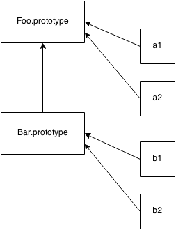

# 你不懂JS: *this* 与对象原型
# 第五章: 原型（Prototype）

在第三，四章中，我们几次提到了 `[[Prototype]]` 链，但我们没有讨论它到底是什么。现在我们就详细讲解一下原型（prototype）。

**注意：** 所有模拟类拷贝行为的企图，也就是我们在前面第四章描述的内容，称为各种种类的“mixin”，和我们要在本章中讲解的 `[[Prototype]]` 链机制完全不同。

## `[[Prototype]]`

JavaScript 中的对象有一个内部属性，在语言规范中称为 `[[Prototype]]`，它只是一个其他对象的引用。几乎所有的对象在被创建时，它的这个属性都被赋予了一个非 `null` 值。

**注意：** 我们马上就会看到，一个对象拥有一个空的 `[[Prototype]]` 链接是 *可能* 的，虽然这有些不寻常。

考虑下面的代码：

```js
var myObject = {
	a: 2
};

myObject.a; // 2
```

`[[Prototype]]` 引用有什么用？在第三章中，我们讲解了 `[[Get]]` 操作，它会在你引用一个对象上的属性时被调用，比如 `myObject.a`。对于默认的 `[[Get]]` 操作来说，第一步就是检查对象本身是否拥有一个 `a` 属性，如果有，就使用它。

**注意：** ES6 的代理（Proxy）超出了我们要在本书内讨论的范围（将会在本系列的后续书目中涵盖！），但是如果加入 `Proxy`，我们在这里讨论的关于普通 `[[Get]]` 和 `[[Put]]` 的行为都是不被采用的。

但是如果 `myObject` 上 **不** 存在 `a` 属性时，我们就将注意力转向对象的 `[[Prototype]]` 链。

如果默认的 `[[Get]]` 操作不能直接在对象上找到被请求的属性，那么它会沿着对象的 `[[Prototype]]` **链** 继续处理。

```js
var anotherObject = {
	a: 2
};

// 创建一个链接到 `anotherObject` 的对象
var myObject = Object.create( anotherObject );

myObject.a; // 2
```

**注意：** 我们马上就会解释 `Object.create(..)` 是做什么，如何做的。眼下先假设，它创建了一个对象，这个对象带有一个链到指定对象的 `[[Prototype]]` 链接，这个链接就是我们要讲解的。

那么，我们现在让 `myObject` `[[Prototype]]` 链到了 `anotherObject`。虽然很明显 `myObject.a` 实际上不存在，但是无论如何属性访问成功了（在 `anotherObject` 中找到了），而且确实找到了值 `2`。

但是，如果在 `anotherObject` 上也没有找到 `a`，而且如果它的 `[[Prototype]]` 链不为空，就沿着它继续查找。

这个处理持续进行，直到找到名称匹配的属性，或者 `[[Prototype]]` 链终结。如果在链条的末尾都没有找到匹配的属性，那么 `[[Get]]` 操作的返回结果为 `undefined`。

和这种 `[[Prototype]]` 链查询处理相似，如果你使用 `for..in` 循环迭代一个对象，所有在它的链条上可以到达的（并且是 `enumerable` —— 见第三章）属性都会被枚举。如果你使用 `in` 操作符来测试一个属性在一个对象上的存在性，`in` 将会检查对象的整个链条（不管 *可枚举性*）。

```js
var anotherObject = {
	a: 2
};

// 创建一个链接到 `anotherObject` 的对象
var myObject = Object.create( anotherObject );

for (var k in myObject) {
	console.log("found: " + k);
}
// 找到: a

("a" in myObject); // true
```

所以，当你以各种方式进行属性查询时，`[[Prototype]]` 链就会一个链接一个链接地被查询。一旦找到属性或者链条终结，这种查询就会停止。

### `Object.prototype`

但是 `[[Prototype]]` 链到底在 *哪里* “终结”？

每个 *普通* 的 `[[Prototype]]` 链的最顶端，是内建的 `Object.prototype`。这个对象包含各种在整个 JS 中被使用的共通工具，因为 JavaScript 中所有普通（内建，而非被宿主环境扩展的）的对象都“衍生自”（也就是，使它们的 `[[Prototype]]` 顶端为）`Object.prototype` 对象。

你会在这里发现一些你可能很熟悉的工具，比如 `.toString()` 和 `.valueOf()`。在第三章中，我们介绍了另一个：`.hasOwnProperty(..)`。还有另外一个你可能不太熟悉，但我们将在这一章里讨论的 `Object.prototype` 上的函数是 `.isPrototypeOf(..)`。

### 设置与遮蔽属性

回到第三章，我们提到过在对象上设置属性要比仅仅在对象上添加新属性或改变既存属性的值更加微妙。现在我们将更完整地重温这个话题。

```js
myObject.foo = "bar";
```

如果 `myObject` 对象已经直接拥有了普通的名为 `foo` 的数据访问器属性，那么这个赋值就和改变既存属性的值一样简单。

如果 `foo` 还没有直接存在于 `myObject`，`[[Prototype]]` 就会被遍历，就像 `[[Get]]` 操作那样。如果在链条的任何地方都没有找到 `foo`，那么就会像我们期望的那样，属性 `foo` 就以指定的值被直接添加到 `myObject` 上。

然而，如果 `foo` 已经存在于链条更高层的某处，`myObject.foo = "bar"` 赋值就可能会发生微妙的（也许令人诧异的）行为。我们一会儿就详细讲解。

如果属性名 `foo` 同时存在于 `myObject` 本身和从 `myObject` 开始的 `[[Prototype]]` 链的更高层，这样的情况称为 *遮蔽*。直接存在于 `myObject` 上的 `foo` 属性会 *遮蔽* 任何出现在链条高层的 `foo` 属性，因为 `myObject.foo` 查询总是在寻找链条最底层的 `foo` 属性。

正如我们被暗示的那样，在 `myObject` 上的 `foo` 遮蔽没有看起来那么简单。我们现在来考察 `myObject.foo = "bar"` 赋值的三种场景，当 `foo` **不直接存在** 于 `myObject`，但 **存在** 于 `myObject` 的 `[[Prototype]]` 链的更高层时：

1. 如果一个普通的名为 `foo` 的数据访问属性在 `[[Prototype]]` 链的高层某处被找到，**而且没有被标记为只读（`writable:false`）**，那么一个名为 `foo` 的新属性就直接添加到 `myObject` 上，形成一个 **遮蔽属性**。
2. 如果一个 `foo` 在 `[[Prototype]]` 链的高层某处被找到，但是它被标记为 **只读（`writable:false`）** ，那么设置既存属性和在 `myObject` 上创建遮蔽属性都是 **不允许** 的。如果代码运行在 `strict mode` 下，一个错误会被抛出。否则，这个设置属性值的操作会被无声地忽略。不论怎样，**没有发生遮蔽**。
3. 如果一个 `foo` 在 `[[Prototype]]` 链的高层某处被找到，而且它是一个 setter（见第三章），那么这个 setter 总是被调用。没有 `foo` 会被添加到（也就是遮蔽在）`myObject` 上，这个 `foo` setter 也不会被重定义。

大多数开发者认为，如果一个属性已经存在于 `[[Prototype]]` 链的高层，那么对它的赋值（`[[Put]]`）将总是造成遮蔽。但如你所见，这仅在刚才描述的三中场景中的一种（第一种）中是对的。

如果你想在第二和第三种情况中遮蔽 `foo`，那你就不能使用 `=` 赋值，而必须使用 `Object.defineProperty(..)`（见第三章）将 `foo` 添加到 `myObject`。

**注意：** 第二种情况可能是三种情况中最让人诧异的了。*只读* 属性的存在会阻止同名属性在 `[[Prototype]]` 链的低层被创建（遮蔽）。这个限制的主要原因是为了增强类继承属性的幻觉。如果你想象位于链条高层的 `foo` 被继承（拷贝）至 `myObject`， 那么在 `myObject` 上强制 `foo` 属性不可写就有道理。但如果你将幻觉和现实分开，而且认识到 *实际上* 没有这样的继承拷贝发生（见第四，五章），那么仅因为某些其他的对象上拥有不可写的 `foo`，而导致 `myObject` 不能拥有 `foo` 属性就有些不自然。而且更奇怪的是，这个限制仅限于 `=` 赋值，当使用 `Object.defineProperty(..)` 时不被强制。

如果你需要在方法间进行委托，**方法** 的遮蔽会导致难看的 *显式假想多态*（见第四章）。一般来说，遮蔽与它带来的好处相比太过复杂和微妙了，**所以你应当尽量避免它**。第六章介绍另一种设计模式，它提倡干净而且不鼓励遮蔽。

遮蔽甚至会以微妙的方式隐含地发生，所以要想避免它必须小心。考虑这段代码：

```js
var anotherObject = {
	a: 2
};

var myObject = Object.create( anotherObject );

anotherObject.a; // 2
myObject.a; // 2

anotherObject.hasOwnProperty( "a" ); // true
myObject.hasOwnProperty( "a" ); // false

myObject.a++; // 噢，隐式遮蔽！

anotherObject.a; // 2
myObject.a; // 3

myObject.hasOwnProperty( "a" ); // true
```

虽然看起来 `myObject.a++` 应当（通过委托）查询并 *原地* 递增 `anotherObject.a` 属性，但是 `++` 操作符相当于 `myObject.a = myObject.a + 1`。结果就是在 `[[Prototype]]` 上进行 `a` 的 `[[Get]]` 查询，从 `anotherObject.a` 得到当前的值 `2`，将这个值递增1，然后将值 `3` 用 `[[Put]]` 赋值到 `myObject` 上的新遮蔽属性 `a` 上。噢！

修改你的委托属性时要非常小心。如果你想递增 `anotherObject.a`， 那么唯一正确的方法是 `anotherObject.a++`。

## “类”

现在你可能会想知道：“*为什么* 一个对象需要链到另一个对象？” 真正的好处是什么？这是一个很恰当的问题，但在我们能够完全理解和体味它是什么和如何有用之前，我们必须首先理解 `[[Prototype]]` **不是** 什么。

正如我们在第四章讲解的，在 JavaScript 中，对于对象来说没有抽象模式/蓝图，即没有面向类的语言中那样的称为类的东西。JavaScript **只有** 对象。

实际上，在所有语言中，JavaScript **几乎是独一无二的**，也许是唯一的可以被称为“面向对象”的语言，因为可以根本没有类而直接创建对象的语言很少，而 JavaScript 就是其中之一。

在 JavaScript 中，类不能（因为根本不存在）描述对象可以做什么。对象直接定义它自己的行为。**这里 *仅有* 对象**。

### “类”函数

在 JavaScript 中有一种奇异的行为被无耻地滥用了许多年来 *山寨* 成某些 *看起来* 像“类”的东西。我们来仔细看看这种方式。

“某种程度的类” 这种奇特的行为取决于函数的一个奇怪的性质：所有的函数默认都会得到一个公有的，不可枚举的属性，称为 `prototype`，它可以指向任意的对象。

```js
function Foo() {
	// ...
}

Foo.prototype; // { }
```

这个对象经常被称为 “Foo 的原型”，因为我们通过一个不幸地被命名为 `Foo.prototype` 的属性引用来访问它。然而，我们马上会看到，这个术语命中注定地将我们搞糊涂。为了取代它，我将它称为 “以前被认为是 Foo 的原型的对象”。只是开个玩笑。“一个被随意标记为‘Foo 点儿原型’的对象”，怎么样？

不管我们怎么称呼它，这个对象到底是什么？

解释它的最直接的方法是，每个由调用 `new Foo()`（见第二章）而创建的对象将最终（有些随意地）被 `[[Prototype]]` 链接到这个 “Foo 点儿原型” 对象。

让我们描绘一下：

```js
function Foo() {
	// ...
}

var a = new Foo();

Object.getPrototypeOf( a ) === Foo.prototype; // true
```

当通过调用 `new Foo()` 创建 `a` 时，会发生的事情之一（见第二章了解所有 *四个* 步骤）是，`a` 得到一个内部 `[[Prototype]]` 链接，此链接链到 `Foo.prototype` 所指向的对象。

停一会来思考一下这句话的含义。

在面向类的语言中，可以制造一个类的多个 **拷贝**（即“实例”），就像从模具中冲压出某些东西一样。我们在第四章中看到，这是因为初始化（或者继承）类的处理意味着，“将行为计划从这个类拷贝到物理对象中”，对于每个新实例这都会发生。

但是在 JavaScript 中，没有这样的拷贝处理发生。你不会创建类的多个实例。你可以创建多个对象，它们的 `[[Prototype]]` 连接至一个共通对象。但默认地，没有拷贝发生，如此这些对象彼此间最终不会完全分离和切断关系，而是 ***链接在一起***。

`new Foo()` 得到一个新对象（我们叫他 `a`），这个新对象 `a` 内部地被 `[[Prototype]]` 链接至 `Foo.prototype` 对象。

**结果我们得到两个对象，彼此链接。** 如是而已。我们没有初始化一个对象。当然我们也没有做任何从一个“类”到一个实体对象的拷贝。我们只是让两个对象互相链接在一起。

事实上，这个使大多数 JS 开发者无法理解的秘密，是因为 `new Foo()` 函数调用实际上几乎和建立链接的处理没有任何 *直接* 关系。**它是某种偶然的副作用。** `new Foo()` 是一个间接的，迂回的方法来得到我们想要的：**一个被链接到另一个对象的对象。**

我们能用更直接的方法得到我们想要的吗？**可以！** 这位英雄就是 `Object.create(..)`。我们过会儿就谈到它。

#### 名称的意义何在？

在 JavaScript 中，我们不从一个对象（“类”）向另一个对象（“实例”） *拷贝*。我们在对象之间制造 *链接*。对于 `[[Prototype]]` 机制，视觉上，箭头的移动方向是从右至左，由下至上。



这种机制常被称为“原型继承（prototypal inheritance）”（我们很快就用代码说明），它经常被说成是动态语言版的“类继承”。这种说法试图建立在面向类世界中对“继承”含义的共识上。但是 *弄拧*（**意思是：抹平**） 了被理解的语义，来适应动态脚本。

先入为主，“继承”这个词有很强烈的含义（见第四章）。仅仅在它前面加入“原型”来区别于 JavaScript 中 *实际上几乎相反* 的行为，使真相在泥泞般的困惑中沉睡了近二十年。

我想说，将“原型”贴在“继承”之前很大程度上搞反了它的实际意义，就像一只手拿着一个桔子，另一手拿着一个苹果，而坚持说苹果是一个“红色的桔子”。无论我在它前面放什么令人困惑的标签，那都不会改变一个水果是苹果而另一个是桔子的 *事实*。

更好的方法是直白地将苹果称为苹果——使用最准确和最直接的术语。这样能更容易地理解它们的相似之处和 **许多不同之处**，因为我们都对“苹果”的意义有一个简单的，共享的理解。

由于用语的模糊和歧义，我相信，对于解释 JavaScript 机制真正如何工作来说，“原型继承”这个标签（以及试图错误地应用所有面向类的术语，比如“类”，“构造器”，“实例”，“多态”等）本身带来的 **危害比好处多**。

“继承”意味着 *拷贝* 操作，而 JavaScript 不拷贝对象属性（原生上，默认地）。相反，JS 在两个对象间建立链接，一个对象实质上可以将对属性/函数的访问 *委托* 到另一个对象上。对于描述 JavaScript 对象链接机制来说，“委托”是一个准确得多的术语。

另一个有时被扔到 JavaScript 旁边的术语是“差分继承”。它的想法是，我们可以用一个对象与一个更泛化的对象的 *不同* 来描述一个它的行为。比如，你要解释汽车是一种载具，与其重新描述组成一个一般载具的所有特点，不如只说它有四个轮子。

如果你试着想象，在 JS 中任何给定的对象都是通过委托可用的所有行为的总和，而且 **在你思维中你扁平化** 所有的行为到一个有形的 *东西* 中，那么你就可以（八九不离十地）看到“差分继承”是如何自圆其说的。

但正如“原型继承”，“差分继承”假意使你的思维模型比在语言中物理发生的事情更重要。它忽视了这样一个事实：对象 `B` 实际上不是一个差异结构，而是由一些定义好的特定性质，与一些没有任何定义的“漏洞”组成的。正是通过这些“漏洞”（缺少定义），委托可以接管并且动态地用委托行为“填补”它们。

对象不是像“差分继承”的思维模型所暗示的那样，原生默认地，**通过拷贝** 扁平化到一个单独的差异对象中。因此，对于描述 JavaScript 的 `[[Prototype]]` 机制如何工作来说，“差分继承”就不是自然合理。

你 *可以选择* 偏向“差分继承”这个术语和思维模型，这是个人口味的问题，但是不能否认这个事实：它 *仅仅* 符合你思维中的主观过程，不是引擎的物理行为。

### "构造器"（Constructors）

让我们回到早先的代码：

```js
function Foo() {
	// ...
}

var a = new Foo();
```

到底是什么导致我们认为 `Foo` 是一个“类”？

其一，我们看到了 `new` 关键字的使用，就像面向类语言中人们构建类的对象那样。另外，它看起来我们事实上执行了一个类的 *构造器* 方法，因为 `Foo()` 实际上是个被调用的方法，就像当你初始化一个真实的类时这个类的构造器被调用的那样。

为了使“构造器”的语义更令人糊涂，被随意贴上标签的 `Foo.prototype` 对象还有另外一招。考虑这段代码：

```js
function Foo() {
	// ...
}

Foo.prototype.constructor === Foo; // true

var a = new Foo();
a.constructor === Foo; // true
```

`Foo.prototype` 对象默认地（就在代码段中第一行中声明的地方！）得到一个公有的，称为 `.constructor` 的不可枚举（见第三章）属性，而且这个属性回头指向这个对象关联的函数（这里是 `Foo`）。另外，我们看到被“构造器”调用 `new Foo()` 创建的对象 `a` *看起来* 也拥有一个称为 `.constructor` 的属性，也相似地指向“创建它的函数”。

**注意：** 这实际上不是真的。`a` 上没有 `.constructor` 属性，而 `a.constructor` 确实解析成了 `Foo` 函数，“constructor”并不像它看起来的那样实际意味着“被XX创建”。我们很快就会解释这个奇怪的地方。

哦，是的，另外…… 根据 JavaScript 世界中的惯例，“类”都以大写字母开头的单词命名，所以使用 `Foo` 而不是 `foo` 强烈地意味着我们打算让它成为一个“类”。这对你来说太明显了，对吧！？

**注意：** 这个惯例是如此强大，以至于如果你在一个小写字母名称的方法上使用 `new` 调用，或并没有在一个大写字母开头的函数上使用 `new`，许多 JS 语法检查器将会报告错误。这是因为我们如此努力地想要在 JavaScript 中将（假的）“面向类” *搞对*，所以我们建立了这些语法规则来确保我们使用了大写字母，即便对 JS 引擎来讲，大写字母根本没有 *任何意义*。

#### 构造器还是调用？

上面的代码的段中，我们试图认为 `Foo` 是一个“构造器”，是因为我们用 `new` 调用它，而且我们观察到它“构建”了一个对象。

在现实中，`Foo` 不会比你的程序中的其他任何函数“更像构造器”。函数自身 **不是** 构造器。但是，当你在普通函数调用前面放一个 `new` 关键字时，这就将函数调用变成了“构造器调用”。事实上，`new` 在某种意义上劫持了普通函数并将它以另一种方式调用：构建一个对象，**外加这个函数要做的其他任何事**。

举个例子:

```js
function NothingSpecial() {
	console.log( "Don't mind me!" );
}

var a = new NothingSpecial();
// "Don't mind me!"

a; // {}
```

`NothingSpecial` 仅仅是一个普通的函数，但当用 `new` 调用时，几乎是一种副作用，它会 *构建* 一个对象，并被我们赋值到 `a`。这个 **调用** 是一个 *构造器调用*，但是 `NothingSpecial` 本身并不是一个 *构造器*。

换句话说，在 JavaScrip t中，更合适的说法是，“构造器”是在前面 **用 `new` 关键字调用的任何函数**。

函数不是构造器，但是当且仅当 `new` 被使用时，函数调用是一个“构造器调用”。

### 机制

仅仅是这些原因使得 JavaScript 中关于“类”的讨论变得命运多舛吗？

**不全是。** JS 开发者们努力尽可能地模拟面向类：

```js
function Foo(name) {
	this.name = name;
}

Foo.prototype.myName = function() {
	return this.name;
};

var a = new Foo( "a" );
var b = new Foo( "b" );

a.myName(); // "a"
b.myName(); // "b"
```

这段代码展示了另外两种“面向类”的花招：

1. `this.name = name`：在每个对象（分别在 `a` 和 `b` 上；参照第二章关于 `this` 绑定的内容）上添加了 `.name` 属性，和类的实例包装数据值很相似。

2. `Foo.prototype.myName = ...`：这也许是更有趣的技术，它在 `Foo.prototype` 对象上添加了一个属性（函数）。现在，也许让人惊奇，`a.myName()` 可以工作。但是是如何工作的？

在上面的代码段中，有很强的倾向认为当 `a` 和 `b` 被创建时，`Foo.prototype` 上的属性/函数被 *拷贝* 到了 `a` 与 `b` 俩个对象上。**但是，这没有发生。**

在本章开头，我们解释了 `[[Prototype]]` 链，以及它如何作为默认的 `[[Get]]` 算法的一部分，在不能直接在对象上找到属性引用时提供后备的查询步骤。

于是，得益于他们被创建的方式，`a` 和 `b` 都最终拥有一个内部的 `[[Prototype]]` 链接链到 `Foo.prototype`。当无法分别在 `a` 和 `b` 中找到 `myName` 时，就会在 `Foo.prototype` 上找到（通过委托，见第六章）。

#### 复活“构造器”

回想我们刚才对 `.constructor` 属性的讨论，怎么看起来 `a.constructor === Foo` 为 true 意味着 `a` 上实际拥有一个 `.constructor` 属性，指向 `Foo`？**不对。**

这只是一种不幸的混淆。实际上，`.constructor` 引用也 *委托* 到了 `Foo.prototype`，它 **恰好** 有一个指向 `Foo` 的默认属性。

这 *看起来* 方便得可怕，一个被 `Foo` 构建的对象可以访问指向 `Foo` 的 `.constructor` 属性。但这只不过是安全感上的错觉。它是一个欢乐的巧合，几乎是误打误撞，通过默认的 `[[Prototype]]` 委托 `a.constructor` *恰好* 指向 `Foo`。实际上 `.constructor` 意味着“被XX构建”这种注定失败的臆测会以几种方式来咬到你。

第一，在 `Foo.prototype` 上的 `.constructor` 属性仅当 `Foo` 函数被声明时才出现在对象上。如果你创建一个新对象，并用它替换函数默认的 `.prototype` 对象引用，这个新对象上将不会魔法般地得到 `.contructor`。

考虑这段代码：

```js
function Foo() { /* .. */ }

Foo.prototype = { /* .. */ }; // 创建一个新的 prototype 对象

var a1 = new Foo();
a1.constructor === Foo; // false!
a1.constructor === Object; // true!
```

`Object(..)` 没有“构建” `a1`，是吧？看起来确实是 `Foo()` “构建了”它。许多开发者认为 `Foo()` 在执行构建，但当你认为“构造器”意味着“被XX构建”时，一切就都崩塌了，因为如果那样的话，`a1.constructor` 应当是 `Foo`，但它不是！

发生了什么？`a1` 没有 `.constructor` 属性，所以它沿者 `[[Prototype]]` 链向上委托到了 `Foo.prototype`。但是这个对象也没有 `.constructor`（默认的 `Foo.prototype`  对象就会有！），所以它继续委托，这次轮到了 `Object.prototype`，委托链的最顶端。*那个* 对象上确实拥有 `.constructor`，它指向内建的 `Object(..)` 函数。

**误解，消除。**

当然，你可以把 `.constructor` 加回到 `Foo.prototype` 对象上，但是要做一些手动工作，特别是如果你想要它与原生的行为吻合，并不可枚举时（见第三章）。

举例来说：

```js
function Foo() { /* .. */ }

Foo.prototype = { /* .. */ }; // 创建一个新的 prototype 对象

// 需要正确地“修复”丢失的 `.constructor`
// 新对象上的属性以 `Foo.prototype` 的形式提供。
// `defineProperty(..)` 的内容见第三章。
Object.defineProperty( Foo.prototype, "constructor" , {
	enumerable: false,
	writable: true,
	configurable: true,
	value: Foo    // 使 `.constructor` 指向 `Foo`
} );
```

修复 `.constructor` 要花不少功夫。而且，我们做的一切是为了延续“构造器”意味着“被XX构建”的误解。这是一种昂贵的假象。

事实上，一个对象上的 `.constructor` 默认地随意指向一个函数，而这个函数反过来拥有一个指向被这个对象称为 `.prototype` 的对象。“构造器”和“原型”这两个词仅有松散的默认含义，可能是真的也可能不是真的。最佳方案是提醒你自己，“构造器不是意味着被XX构建”。

`.constructor` 不是一个魔法般不可变的属性。它是不可枚举的（见上面的代码段），但是它的值是可写的（可以改变），而且，你可以用你感觉合适的任何值在 `[[Prototype]]` 链上的任何对象上添加或覆盖（有意或无意地）名为 `constructor` 的属性。

根据 `[[Get]]` 算法如何遍历 `[[Prototype]]` 链，在任何地方找到的一个 `.constructor` 属性引用解析的结果可能与你期望的十分不同。

看到它的实际意义有多随便了吗？

结果？某些像 `a1.constructor` 这样随意的对象属性引用实际上不能被认为是默认的函数引用。还有，我们马上就会看到，通过一个简单的省略，`a1.constructor` 可以最终指向某些令人诧异，没道理的地方。

`a1.constructor` 是极其不可靠的，在你的代码中不应依赖的不安全引用。**一般来说，这样的引用应当尽量避免。**

## “（原型）继承”

我们已经看到了一些近似的“类”机制黑进 JavaScript 程序。但是如果我们没有一种近似的“继承”，JavaScript 的“类”将会更空洞。

实际上，我们已经看到了一个常被称为“原型继承”的机制如何工作：`a` 可以“继承自” `Foo.prototype`，并因此可以访问 `myName()` 函数。但是我们传统的想法认为“继承”是两个“类”间的关系，而非“类”与“实例”的关系。


回想之前这幅图，它不仅展示了从对象（也就是“实例”）`a1` 到对象 `Foo.prototype` 的委托，而且从 `Bar.prototype` 到 `Foo.prototype`，这酷似类继承的亲子概念。*酷似*，除了方向，箭头表示的是委托链接，而不是拷贝操作。

这里是一段典型的创建这样的链接的“原型风格”代码：

```js
function Foo(name) {
	this.name = name;
}

Foo.prototype.myName = function() {
	return this.name;
};

function Bar(name,label) {
	Foo.call( this, name );
	this.label = label;
}

// 这里，我们创建一个新的 `Bar.prototype` 链接链到 `Foo.prototype`
Bar.prototype = Object.create( Foo.prototype );

// 注意！现在 `Bar.prototype.constructor` 不存在了，
// 如果你有依赖这个属性的习惯的话，它可以被手动“修复”。

Bar.prototype.myLabel = function() {
	return this.label;
};

var a = new Bar( "a", "obj a" );

a.myName(); // "a"
a.myLabel(); // "obj a"
```

**注意：** 要想知道为什么上面代码中的 `this` 指向 `a`，参见第二章。

重要的部分是 `Bar.prototype = Object.create( Foo.prototype )`。`Object.create(..)` 凭空 *创建* 了一个“新”对象，并将这个新对象内部的 `[[Prototype]]` 链接到你指定的对象上（在这里是 `Foo.prototype`）。

换句话说，这一行的意思是：“做一个 *新的* 链接到‘Foo 点儿 prototype’的‘Bar 点儿 prototype ’对象”。

当 `function Bar() { .. }` 被声明时，就像其他函数一样，拥有一个链到默认对象的 `.prototype` 链接。但是 *那个* 对象没有链到我们希望的 `Foo.prototype`。所以，我们创建了一个 *新* 对象，链到我们希望的地方，并将原来的错误链接的对象扔掉。

**注意：** 这里一个常见的误解/困惑是，下面两种方法 *也* 能工作，但是他们不会如你期望的那样工作：

```js
// 不会如你期望的那样工作!
Bar.prototype = Foo.prototype;

// 会如你期望的那样工作
// 但会带有你可能不想要的副作用 :(
Bar.prototype = new Foo();
```

`Bar.prototype = Foo.prototype` 不会创建新对象让 `Bar.prototype` 链接。它只是让 `Bar.prototype` 成为 `Foo.prototype` 的另一个引用，将 `Bar` 直接链到 `Foo` 链着的 **同一个对象**：`Foo.prototype`。这意味着当你开始赋值时，比如 `Bar.prototype.myLabel = ...`，你修改的 **不是一个分离的对象** 而是那个被分享的 `Foo.prototype` 对象本身，它将影响到所有链接到 `Foo.prototype` 的对象。这几乎可以确定不是你想要的。如果这正是你想要的，那么你根本就不需要 `Bar`，你应当仅使用 `Foo` 来使你的代码更简单。

`Bar.prototype = new Foo()` **确实** 创建了一个新的对象，这个新对象也的确链接到了我们希望的 `Foo.prototype`。但是，它是用 `Foo(..)` “构造器调用”来这样做的。如果这个函数有任何副作用（比如 logging，改变状态，注册其他对象，**向 `this` 添加数据属性**，等等），这些副作用就会在链接时发生（而且很可能是对错误的对象！），而不是像可能希望的那样，仅最终在 `Bar()` 的“后裔”被创建时发生。

于是，我们剩下的选择就是使用 `Object.create(..)` 来制造一个新对象，这个对象被正确地链接，而且没有调用 `Foo(..)` 时所产生的副作用。一个轻微的缺点是，我们不得不创建新对象，并把旧的扔掉，而不是修改提供给我们的默认既存对象。

如果有一种标准且可靠地方法来修改既存对象的链接就好了。ES6 之前，有一个非标准的，而且不是完全对所有浏览器通用的方法：通过可以设置的 `.__proto__` 属性。ES6中增加了 `Object.setPrototypeOf(..)` 辅助工具，它提供了标准且可预见的方法。

让我们一对一地比较一下 ES6 之前和 ES6 标准的技术如何处理将 `Bar.prototype` 链接至 `Foo.prototype`：

```js
// ES6 以前
// 扔掉默认既存的 `Bar.prototype`
Bar.prototype = Object.create( Foo.prototype );

// ES6+
// 修改既存的 `Bar.prototype`
Object.setPrototypeOf( Bar.prototype, Foo.prototype );
```

如果忽略 `Object.create(..)` 方式在性能上的轻微劣势（扔掉一个对象，然后被回收），其实它相对短一些而且可能比 ES6+ 的方式更易读。但两种方式可能都只是语法表面现象。

### 考察“类”关系

如果你有一个对象 `a` 并且希望找到它委托至哪个对象呢（如果有的话）？考察一个实例（一个 JS 对象）的继承血统（在 JS 中是委托链接），在传统的面向类环境中称为 *自省（introspection）*（或 *反射（reflection）*）。

考虑下面的代码：

```js
function Foo() {
	// ...
}

Foo.prototype.blah = ...;

var a = new Foo();
```

那么我们如何自省 `a` 来找到它的“祖先”（委托链）呢？一种方式是接受“类”的困惑：

```js
a instanceof Foo; // true
```

`instanceof` 操作符的左侧操作数接收一个普通对象，右侧操作数接收一个 **函数**。`instanceof` 回答的问题是：**在 `a` 的整个 `[[Prototype]]` 链中，有没有出现那个被 `Foo.prototype` 所随便指向的对象？**

不幸的是，这意味着如果你拥有可以用于测试的 **函数**（`Foo`，和它带有的 `.prototype` 引用），你只能查询某些对象（`a`）的“祖先”。如果你有两个任意的对象，比如 `a` 和 `b`，而且你想调查是否 *这些对象* 通过 `[[Prototype]]` 链相互关联，单靠 `instanceof` 帮不上什么忙。

**注意：** 如果你使用内建的 `.bind(..)` 工具来制造一个硬绑定的函数（见第二章），这个被创建的函数将不会拥有 `.prototype` 属性。将 `instanceof` 与这样的函数一起使用时，将会透明地替换为创建这个硬绑定函数的 *目标函数* 的 `.prototype`。

将硬绑定函数用于“构造器调用”十分罕见，但如果你这么做，它会表现得好像是 *目标函数* 被调用了，这意味着将 `instanceof` 与硬绑定函数一起使用也会参照原版函数。

下面这段代码展示了试图通过“类”的语义和 `instanceof` 来推导 **两个对象** 间的关系是多么荒谬：

```js
// 用来检查 `o1` 是否关联到（委托至）`o2` 的帮助函数
function isRelatedTo(o1, o2) {
	function F(){}
	F.prototype = o2;
	return o1 instanceof F;
}

var a = {};
var b = Object.create( a );

isRelatedTo( b, a ); // true
```

在 `isRelatedTo(..)` 内部，我们借用一个一次性的函数 `F`，重新对它的 `.prototype` 赋值，使它随意地指向某个对象 `o2`，之后问 `o1` 是否是 `F` 的“一个实例”。很明显，`o1` 实际上不是继承或遗传自 `F`，甚至不是由 `F` 构建的，所以显而易见这种做法是愚蠢且让人困惑的。**这个问题归根结底是将类的语义强加于 JavaScript 的尴尬**，在这个例子中是由 `instanceof` 的间接语义揭露的。

第二种，也是更干净的方式，`[[Prototype]]` 反射：

```js
Foo.prototype.isPrototypeOf( a ); // true
```

注意在这种情况下，我们并不真正关心（甚至 *不需要*）`Foo`，我们仅需要一个 **对象**（在我们的例子中被随意标志为 `Foo.prototype`）来与另一个 **对象** 测试。`isPrototypeOf(..)` 回答的问题是：**在 `a` 的整个 `[[Prototype]]` 链中，`Foo.prototype` 出现过吗？**

同样的问题，和完全同样的答案。但是在第二种方式中，我们实际上不需要间接地引用一个 `.prototype` 属性将被自动查询的 **函数**（`Foo`）。

我们 *只需要* 两个 **对象** 来考察它们之间的关系。比如：

```js
// 简单地：`b` 在 `c` 的 `[[Prototype]]` 链中出现过吗？
b.isPrototypeOf( c );
```

注意，这种方法根本不要求有一个函数（“类”）。它仅仅使用对象的直接引用 `b` 和 `c`，来查询他们的关系。换句话说，我们上面的 `isRelatedTo(..)` 工具是内建在语言中的，它的名字叫 `isPrototypeOf(..)`。

我们也可以直接取得一个对象的 `[[Prototype]]`。在 ES5 中，这么做的标准方法是：

```js
Object.getPrototypeOf( a );
```

而且你将注意到对象引用是我们期望的：

```js
Object.getPrototypeOf( a ) === Foo.prototype; // true
```

大多数浏览器（不是全部！）还一种长期支持的，非标准方法可以访问内部的 `[[Prototype]]`：

```js
a.__proto__ === Foo.prototype; // true
```

这个奇怪的 `.__proto__`（直到 ES6 才被标准化！）属性“魔法般地”取得一个对象内部的 `[[Prototype]]` 作为引用，如果你想要直接考察（甚至遍历：`.__proto__.__proto__...`）`[[Prototype]]` 链，这个引用十分有用。

和我们早先看到的 `.constructor` 一样，`.__proto__` 实际上不存在于你考察的对象上（在我们的例子中是 `a`）。事实上，它和其他的共通工具在一起(`.toString()`, `.isPrototypeOf(..)`, 等等)，存在于（不可枚举地；见第二章）内建的 `Object.prototype` 上。

而且，`.__proto__` 虽然看起来像一个属性，但实际上将它看做是一个 getter/setter（见第三章）更合适。

大致地，我们可以这样描述 `.__proto__` 的实现（见第三章，对象属性的定义）：

```js
Object.defineProperty( Object.prototype, "__proto__", {
	get: function() {
		return Object.getPrototypeOf( this );
	},
	set: function(o) {
		// ES6 的 setPrototypeOf(..)
		Object.setPrototypeOf( this, o );
		return o;
	}
} );
```

所以，当我们访问 `a.__proto__`（取得它的值）时，就好像调用 `a.__proto__()`（调用 getter 函数）一样。虽然 getter 函数存在于 `Object.prototype` 上（参照第二章，`this` 绑定规则），但这个函数调用将 `a` 用作它的 `this`，所以它相当于在说 `Object.getPrototypeOf( a )`。

`.__proto__` 还是一个可设置的属性，就像早先展示过的 ES6 `Object.setPrototypeOf(..)`。然而，一般来说你 **不应该改变一个既存对象的 `[[Prototype]]`**。

在某些允许对 `Array` 定义“子类”的框架中，深度地使用了一些非常复杂，高级的技术，但是这在一般的编程实践中经常是让人皱眉头的，因为这通常导致非常难理解/维护的代码。

**注意：** 在 ES6 中，关键字 `class` 将允许某些近似方法，对像 `Array` 这样的内建类型“定义子类”。参见附录A中关于 ES6 中加入的 `class` 的讨论。

仅有一小部分例外（就像前面提到过的）会设置一个默认函数 `.prototype` 对象的 `[[Prototype]]`，使它引用其他的对象（`Object.prototype` 之外的对象）。它们会避免将这个默认对象完全替换为一个新的链接对象。否则，为了在以后更容易地阅读你的代码 **最好将对象的 `[[Prototype]]` 链接作为只读性质对待**。

**注意：** 针对双下划线，特别是在像 `__proto__` 这样的属性中开头的部分，JavaScript 社区非官方地创造了一个术语：“dunder”。所以，那些 JavaScript 的“酷小子”们通常将 `__proto__` 读作“dunder proto”。

## 对象链接

正如我们看到的，`[[Prototype]]` 机制是一个内部链接，它存在于一个对象上，这个对象引用一些其他的对象。

这种链接（主要）在对一个对象进行属性/方法引用，但这样的属性/方法不存在时实施。在这种情况下，`[[Prototype]]` 链接告诉引擎在那个被链接的对象上查找这个属性/方法。接下来，如果这个对象不能满足查询，它的 `[[Prototype]]` 又会被查找，如此继续。这个在对象间的一系列链接构成了所谓的“原形链”。

### 创建链接

我们已经彻底揭露了为什么 JavaScript 的 `[[Prototype]]` 机制和 *类* **不** 一样，而且我们也看到了如何在正确的对象间创建 **链接**。

`[[Prototype]]` 机制的意义是什么？为什么总是见到 JS 开发者们费那么大力气（模拟类）在他们的代码中搞乱这些链接？

记得我们在本章很靠前的地方说过 `Object.create(..)` 是英雄吗？现在，我们准备好看看为什么了。

```js
var foo = {
	something: function() {
		console.log( "Tell me something good..." );
	}
};

var bar = Object.create( foo );

bar.something(); // Tell me something good...
```

`Object.create(..)` 创建了一个链接到我们指定的对象（`foo`）上的新对象（`bar`），这给了我们 `[[Prototype]]` 机制的所有力量（委托），而且没有 `new` 函数作为类和构造器调用产生的所有没必要的复杂性，搞乱 `.prototype` 和 `.constructor` 引用，或任何其他的多余的东西。

**注意：** `Object.create(null)` 创建一个拥有空（也就是 `null`）`[[Prototype]]` 链接的对象，如此这个对象不能委托到任何地方。因为这样的对象没有原形链，`instancof` 操作符（前 面解释过）没有东西可检查，所以它总返回 `false`。由于他们典型的用途是在属性中存储数据，这种特殊的空 `[[Prototype]]` 对象经常被称为“字典（dictionaries）”，这主要是因为它们不可能受到在 `[[Prototype]]` 链上任何委托属性/函数的影响，所以它们是纯粹的扁平数据存储。

我们不 *需要* 类来在两个对象间创建有意义的关系。我们需要 **真正关心** 的唯一问题是对象为了委托而链接在一起，而 `Object.create(..)` 给我们这种链接并且没有一切关于类的烂设计。

#### 填补 `Object.create()`

`Object.create(..)` 在 ES5 中被加入。你可能需要支持 ES5 之前的环境（比如老版本的 IE），所以让我们来看一个 `Object.create(..)` 的简单 **部分** 填补工具，它甚至能在更老的 JS 环境中给我们所需的能力：

```js
if (!Object.create) {
	Object.create = function(o) {
		function F(){}
		F.prototype = o;
		return new F();
	};
}
```

这个填补工具通过一个一次性的 `F` 函数并覆盖它的 `.prototype` 属性来指向我们想连接到的对象。之后我们用 `new F()` 构造器调用来制造一个将会链到我们指定对象上的新对象。

`Object.create(..)` 的这种用法是目前最常见的用法，因为它的这一部分是 *可以* 填补的。ES5 标准的内建 `Object.create(..)` 还提供了一个附加的功能，它是 **不能** 被 ES5 之前的版本填补的。如此，这个功能的使用远没有那么常见。为了完整性，让我们看看这个附加功能：

```js
var anotherObject = {
	a: 2
};

var myObject = Object.create( anotherObject, {
	b: {
		enumerable: false,
		writable: true,
		configurable: false,
		value: 3
	},
	c: {
		enumerable: true,
		writable: false,
		configurable: false,
		value: 4
	}
} );

myObject.hasOwnProperty( "a" ); // false
myObject.hasOwnProperty( "b" ); // true
myObject.hasOwnProperty( "c" ); // true

myObject.a; // 2
myObject.b; // 3
myObject.c; // 4
```

`Object.create(..)` 的第二个参数通过声明每个新属性的 *属性描述符*（见第三章）指定了要添加在新对象上的属性。因为在 ES5 之前的环境中填补属性描述符是不可能的，所以 `Object.create(..)` 的这个附加功能无法填补。

因为 `Object.create(..)` 的绝大多数用途都是使用填补安全的功能子集，所以大多数开发者在 ES5 之前的环境中使用这种 **部分填补** 也没有问题。

有些开发者采取严格得多的观点，也就是除非能够被 *完全* 填补，否则没有函数应该被填补。因为 `Object.create(..)` 是可以部分填补的工具之一，所以这种较狭窄的观点会说，如果你需要在 ES5 之前的环境中使用 `Object.create(..)` 的任何功能，你应当使用自定义的工具，而不是填补，而且应当彻底远离使用 `Object.create` 这个名字。你可以定义自己的工具，比如：

```js
function createAndLinkObject(o) {
	function F(){}
	F.prototype = o;
	return new F();
}

var anotherObject = {
	a: 2
};

var myObject = createAndLinkObject( anotherObject );

myObject.a; // 2
```

我不会分享这种严格的观点。我完全拥护如上面展示的 `Object.create(..)` 的常见部分填补，甚至在 ES5 之前的环境下在你的代码中使用它。我将选择权留给你。

### 链接作为候补？

也许这么想很吸引人：这些对象间的链接 *主要* 是为了给“缺失”的属性和方法提供某种候补。虽然这是一个可观察到的结果，但是我不认为这是考虑 `[[Prototype]]` 的正确方法。

考虑下面的代码：

```js
var anotherObject = {
	cool: function() {
		console.log( "cool!" );
	}
};

var myObject = Object.create( anotherObject );

myObject.cool(); // "cool!"
```

得益于 `[[Prototype]]`，这段代码可以工作，但如果你这样写是为了 **万一** `myObject` 不能处理某些开发者可能会调用的属性/方法，而让 `anotherObject` 作为一个候补，你的软件大概会变得有点儿“魔性”并且更难于理解和维护。

这不是说候补在任何情况下都不是一个合适的设计模式，但它不是一个在 JS 中很常见的用法，所以如果你发现自己在这么做，那么你可能想要退一步并重新考虑它是否真的是合适且合理的设计。

**注意：** 在 ES6 中，引入了一个称为 `Proxy（代理）` 的高级功能，它可以提供某种“方法未找到”类型的行为。`Proxy` 超出了本书的范围，但会在以后的 *“你不懂 JS”* 系列书目中详细讲解。

**这里不要错过一个重要的细节。**

例如，你打算为一个开发者设计软件，如果即使在 `myObject` 上没有 `cool()` 方法时调用 `myObject.cool()` 也能工作，会在你的 API 设计上引入一些“魔法”气息，这可能会使未来维护你的软件的开发者很吃惊。

然而你可以在你的 API 设计上少用些“魔法”，而仍然利用 `[[Prototype]]` 链接的力量。

```js
var anotherObject = {
	cool: function() {
		console.log( "cool!" );
	}
};

var myObject = Object.create( anotherObject );

myObject.doCool = function() {
	this.cool(); // internal delegation!
};

myObject.doCool(); // "cool!"
```

这里，我们调用 `myObject.doCool()`，它是一个 *实际存在于* `myObject` 上的方法，这使我们的 API 设计更清晰（没那么“魔性”）。*在它内部*，我们的实现依照 **委托设计模式**（见第六章），利用 `[[Prototype]]` 委托到 `anotherObject.cool()`。

换句话说，如果委托是一个内部实现细节，而非在你的 API 结构设计中简单地暴露出来，那么它将倾向于减少意外/困惑。我们会在下一章中详细解释 **委托**。

## 复习

当试图在一个对象上进行属性访问，而对象又没有该属性时，对象内部的 `[[Prototype]]` 链接定义了 `[[Get]]` 操作（见第三章）下一步应当到哪里寻找它。这种对象到对象的串行链接定义了对象的“原形链”（和嵌套的作用域链有些相似），在解析属性时发挥作用。

所有普通的对象用内建的 `Object.prototype` 作为原形链的顶端（就像作用域查询的顶端是全局作用域），如果属性没能在链条的前面任何地方找到，属性解析就会在这里停止。`toString()`，`valueOf()`，和其他几种共同工具都存在于这个 `Object.prototype` 对象上，这解释了语言中所有的对象是如何能够访问他们的。

使两个对象相互链接在一起的最常见的方法是将 `new` 关键字与函数调用一起使用，在它的四个步骤中（见第二章），就会建立一个新对象链接到另一个对象。

那个用 `new` 调用的函数有一个被随便地命名为 `.prototype` 的属性，这个属性所引用的对象恰好就是这个新对象链接到的“另一个对象”。带有 `new` 的函数调用通常被称为“构造器”，尽管实际上它们并没有像传统的面向类语言那样初始化一个类。

虽然这些 JavaScript 机制看起来和传统面向类语言的“初始化类”和“类继承”类似，而在 JavaScript 中的关键区别是，没有拷贝发生。取而代之的是对象最终通过 `[[Prototype]]` 链链接在一起。

由于各种原因，不光是前面提到的术语，“继承”（和“原型继承”）与所有其他的 OO 用语，在考虑 JavaScript 实际如何工作时都没有道理。

相反，“委托”是一个更确切的术语，因为这些关系不是 *拷贝* 而是委托 **链接**。
