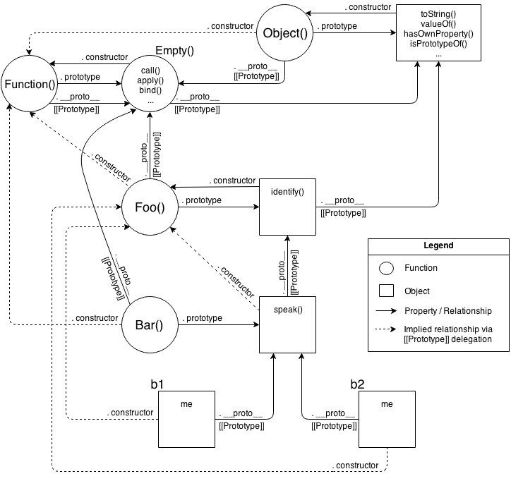

# You Don't Know JS: *this* & Object Prototypes
# Chapter 6: Behavior Delegation

In Chapter 5, we addressed the `[[Prototype]]` mechanism  in detail, and *why* it's confusing and inappropriate (despite countless attempts for nearly two decades) to describe it as "class" or "inheritance". We trudged through not only the fairly verbose syntax (`.prototype` littering the code), but the various gotchas (like surprising `.constructor` resolution or ugly pseudo-polymorphic syntax). We explored variations of the "mixin" approach, which many people use to attempt to smooth over such rough areas.

It's a common reaction at this point to wonder why it has to be so complex to do something seemingly so simple. Now that we've pulled back the curtain and seen just how dirty it all gets, it's not a surprise that most JS developers never dive this deep, and instead relegate such mess to a "class" library to handle it for them.

I hope by now you're not content to just gloss over and leave such details to a "black box" library. Let's now dig into how we *could and should be* thinking about the object `[[Prototype]]` mechanism in JS, in a **much simpler and more straightforward way** than the confusion of classes.

As a brief review of our conclusions from Chapter 5, the `[[Prototype]]` mechanism is an internal link that exists on one object which references another object.

This linkage is exercised when a property/method reference is made against the first object, and no such property/method exists. In that case, the `[[Prototype]]` linkage tells the engine to look for the property/method on the linked-to object. In turn, if that object cannot fulfill the look-up, its `[[Prototype]]` is followed, and so on. This series of links between objects forms what is called the "prototype chain".

In other words, the actual mechanism, the essence of what's important to the functionality we can leverage in JavaScript, is **all about objects being linked to other objects.**

That single observation is fundamental and critical to understanding the motivations and approaches for the rest of this chapter!

## Towards Delegation-Oriented Design

To properly focus our thoughts on how to use `[[Prototype]]` in the most straightforward way, we must recognize that it represents a fundamentally different design pattern from classes (see Chapter 4).

**Note:** *Some* principles of class-oriented design are still very valid, so don't toss out everything you know (just most of it!). For example, *encapsulation* is quite powerful, and is compatible (though not as common) with delegation.

We need to try to change our thinking from the class/inheritance design pattern to the behavior delegation design pattern. If you have done most or all of your programming in your education/career thinking in classes, this may be uncomfortable or feel unnatural. You may need to try this mental exercise quite a few times to get the hang of this very different way of thinking.

I'm going to walk you through some theoretical exercises first, then we'll look side-by-side at a more concrete example to give you practical context for your own code.

### Class Theory

Let's say we have several similar tasks ("XYZ", "ABC", etc) that we need to model in our software.

With classes, the way you design the scenario is: define a general parent (base) class like `Task`, defining shared behavior for all the "alike" tasks. Then, you define child classes `XYZ` and `ABC`, both of which inherit from `Task`, and each of which adds specialized behavior to handle their respective tasks.

**Importantly,** the class design pattern will encourage you that to get the most out of inheritance, you will want to employ method overriding (and polymorphism), where you override the definition of some general `Task` method in your `XYZ` task, perhaps even making use of `super` to call to the base version of that method while adding more behavior to it. **You'll likely find quite a few places** where you can "abstract" out general behavior to the parent class and specialize (override) it in your child classes.

Here's some loose pseudo-code for that scenario:

```js
class Task {
	id;

	// constructor `Task()`
	Task(ID) { id = ID; }
	outputTask() { output( id ); }
}

class XYZ inherits Task {
	label;

	// constructor `XYZ()`
	XYZ(ID,Label) { super( ID ); label = Label; }
	outputTask() { super(); output( label ); }
}

class ABC inherits Task {
	// ...
}
```

Now, you can instantiate one or more **copies** of the `XYZ` child class, and use those instance(s) to perform task "XYZ". These instances have **copies both** of the general `Task` defined behavior as well as the specific `XYZ` defined behavior. Likewise, instances of the `ABC` class would have copies of the `Task` behavior and the specific `ABC` behavior. After construction, you will generally only interact with these instances (and not the classes), as the instances each have copies of all the behavior you need to do the intended task.

### Delegation Theory

But now let's try to think about the same problem domain, but using *behavior delegation* instead of *classes*.

You will first define an **object** (not a class, nor a `function` as most JS'rs would lead you to believe) called `Task`, and it will have concrete behavior on it that includes utility methods that various tasks can use (read: *delegate to*!). Then, for each task ("XYZ", "ABC"), you define an **object** to hold that task-specific data/behavior. You **link** your task-specific object(s) to the `Task` utility object, allowing them to delegate to it when they need to.

Basically, you think about performing task "XYZ" as needing behaviors from two sibling/peer objects (`XYZ` and `Task`) to accomplish it. But rather than needing to compose them together, via class copies, we can keep them in their separate objects, and we can allow `XYZ` object to **delegate to** `Task` when needed.

Here's some simple code to suggest how you accomplish that:

```js
var Task = {
	setID: function(ID) { this.id = ID; },
	outputID: function() { console.log( this.id ); }
};

// make `XYZ` delegate to `Task`
var XYZ = Object.create( Task );

XYZ.prepareTask = function(ID,Label) {
	this.setID( ID );
	this.label = Label;
};

XYZ.outputTaskDetails = function() {
	this.outputID();
	console.log( this.label );
};

// ABC = Object.create( Task );
// ABC ... = ...
```

In this code, `Task` and `XYZ` are not classes (or functions), they're **just objects**. `XYZ` is set up via `Object.create(..)` to `[[Prototype]]` delegate to the `Task` object (see Chapter 5).

As compared to class-orientation (aka, OO -- object-oriented), I call this style of code **"OLOO"** (objects-linked-to-other-objects). All we *really* care about is that the `XYZ` object delegates to the `Task` object (as does the `ABC` object).

In JavaScript, the `[[Prototype]]` mechanism links **objects** to other **objects**. There are no abstract mechanisms like "classes", no matter how much you try to convince yourself otherwise. It's like paddling a canoe upstream: you *can* do it, but you're *choosing* to go against the natural current, so it's obviously **going to be harder to get where you're going.**

Some other differences to note with **OLOO style code**:

1. Both `id` and `label` data members from the previous class example are data properties directly on `XYZ` (neither is on `Task`). In general, with `[[Prototype]]` delegation involved, **you want state to be on the delegators** (`XYZ`, `ABC`), not on the delegate (`Task`).
2. With the class design pattern, we intentionally named `outputTask` the same on both parent (`Task`) and child (`XYZ`), so that we could take advantage of overriding (polymorphism). In behavior delegation, we do the opposite: **we avoid if at all possible naming things the same** at different levels of the `[[Prototype]]` chain (called shadowing -- see Chapter 5), because having those name collisions creates awkward/brittle syntax to disambiguate references (see Chapter 4), and we want to avoid that if we can.

   This design pattern calls for less of general method names which are prone to overriding and instead more of descriptive method names, *specific* to the type of behavior each object is doing. **This can actually create easier to understand/maintain code**, because the names of methods (not only at definition location but strewn throughout other code) are more obvious (self documenting).
3. `this.setID(ID);` inside of a method on the `XYZ` object first looks on `XYZ` for `setID(..)`, but since it doesn't find a method of that name on `XYZ`, `[[Prototype]]` *delegation* means it can follow the link to `Task` to look for `setID(..)`, which it of course finds. Moreover, because of implicit call-site `this` binding rules (see Chapter 2), when `setID(..)` runs, even though the method was found on `Task`, the `this` binding for that function call is `XYZ` exactly as we'd expect and want. We see the same thing with `this.outputID()` later in the code listing.

   In other words, the general utility methods that exist on `Task` are available to us while interacting with `XYZ`, because `XYZ` can delegate to `Task`.

**Behavior Delegation** means: let some object (`XYZ`) provide a delegation (to `Task`) for property or method references if not found on the object (`XYZ`).

This is an *extremely powerful* design pattern, very distinct from the idea of parent and child classes, inheritance, polymorphism, etc. Rather than organizing the objects in your mind vertically, with Parents flowing down to Children, think of objects side-by-side, as peers, with any direction of delegation links between the objects as necessary.

**Note:** Delegation is more properly used as an internal implementation detail rather than exposed directly in the API design. In the above example, we don't necessarily *intend* with our API design for developers to call `XYZ.setID()` (though we can, of course!). We sorta *hide* the delegation as an internal detail of our API, where `XYZ.prepareTask(..)` delegates to `Task.setID(..)`. See the "Links As Fallbacks?" discussion in Chapter 5 for more detail.

#### Mutual Delegation (Disallowed)

You cannot create a *cycle* where two or more objects are mutually delegated (bi-directionally) to each other. If you make `B` linked to `A`, and then try to link `A` to `B`, you will get an error.

It's a shame (not terribly surprising, but mildly annoying) that this is disallowed. If you made a reference to a property/method which didn't exist in either place, you'd have an infinite recursion on the `[[Prototype]]` loop. But if all references were strictly present, then `B` could delegate to `A`, and vice versa, and it *could* work. This would mean you could use either object to delegate to the other, for various tasks. There are a few niche use-cases where this might be helpful.

But it's disallowed because engine implementors have observed that it's more performant to check for (and reject!) the infinite circular reference once at set-time rather than needing to have the performance hit of that guard check every time you look-up a property on an object.

#### Debugged

We'll briefly cover a subtle detail that can be confusing to developers. In general, the JS specification does not control how browser developer tools should represent specific values/structures to a developer, so each browser/engine is free to interpret such things as they see fit. As such, browsers/tools *don't always agree*. Specifically, the behavior we will now examine is currently observed only in Chrome's Developer Tools.

Consider this traditional "class constructor" style JS code, as it would appear in the *console* of Chrome Developer Tools:

```js
function Foo() {}

var a1 = new Foo();

a1; // Foo {}
```

Let's look at the last line of that snippet: the output of evaluating the `a1` expression, which prints `Foo {}`. If you try this same code in Firefox, you will likely see `Object {}`. Why the difference? What do these outputs mean?

Chrome is essentially saying "{} is an empty object that was constructed by a function with name 'Foo'". Firefox is saying "{} is an empty object of general construction from Object". The subtle difference is that Chrome is actively tracking, as an *internal property*, the name of the actual function that did the construction, whereas other browsers don't track that additional information.

It would be tempting to attempt to explain this with JavaScript mechanisms:

```js
function Foo() {}

var a1 = new Foo();

a1.constructor; // Foo(){}
a1.constructor.name; // "Foo"
```

So, is that how Chrome is outputting "Foo", by simply examining the object's `.constructor.name`? Confusingly, the answer is both "yes" and "no".

Consider this code:

```js
function Foo() {}

var a1 = new Foo();

Foo.prototype.constructor = function Gotcha(){};

a1.constructor; // Gotcha(){}
a1.constructor.name; // "Gotcha"

a1; // Foo {}
```

Even though we change `a1.constructor.name` to legitimately be something else ("Gotcha"), Chrome's console still uses the "Foo" name.

So, it would appear the answer to previous question (does it use `.constructor.name`?) is **no**, it must track it somewhere else, internally.

But, Not so fast! Let's see how this kind of behavior works with OLOO-style code:

```js
var Foo = {};

var a1 = Object.create( Foo );

a1; // Object {}

Object.defineProperty( Foo, "constructor", {
	enumerable: false,
	value: function Gotcha(){}
});

a1; // Gotcha {}
```

Ah-ha! **Gotcha!** Here, Chrome's console **did** find and use the `.constructor.name`. Actually, while writing this book, this exact behavior was identified as a bug in Chrome, and by the time you're reading this, it may have already been fixed. So you may instead have seen the corrected `a1; // Object {}`.

Aside from that bug, the internal tracking (apparently only for debug output purposes) of the "constructor name" that Chrome does (shown in the earlier snippets) is an intentional Chrome-only extension of behavior beyond what the JS specification calls for.

If you don't use a "constructor" to make your objects, as we've discouraged with OLOO-style code here in this chapter, then you'll get objects that Chrome does *not* track an internal "constructor name" for, and such objects will correctly only be outputted as "Object {}", meaning "object generated from Object() construction".

**Don't think** this represents a drawback of OLOO-style coding. When you code with OLOO and behavior delegation as your design pattern, *who* "constructed" (that is, *which function* was called with `new`?) some object is an irrelevant detail. Chrome's specific internal "constructor name" tracking is really only useful if you're fully embracing "class-style" coding, but is moot if you're instead embracing OLOO delegation.

### Mental Models Compared

Now that you can see a difference between "class" and "delegation" design patterns, at least theoretically, let's see the implications these design patterns have on the mental models we use to reason about our code.

We'll examine some more theoretical ("Foo", "Bar") code, and compare both ways (OO vs. OLOO) of implementing the code. The first snippet uses the classical ("prototypal") OO style:

```js
function Foo(who) {
	this.me = who;
}
Foo.prototype.identify = function() {
	return "I am " + this.me;
};

function Bar(who) {
	Foo.call( this, who );
}
Bar.prototype = Object.create( Foo.prototype );

Bar.prototype.speak = function() {
	alert( "Hello, " + this.identify() + "." );
};

var b1 = new Bar( "b1" );
var b2 = new Bar( "b2" );

b1.speak();
b2.speak();
```

Parent class `Foo`, inherited by child class `Bar`, which is then instantiated twice as `b1` and `b2`. What we have is `b1` delegating to `Bar.prototype` which delegates to `Foo.prototype`. This should look fairly familiar to you, at this point. Nothing too ground-breaking going on.

Now, let's implement **the exact same functionality** using *OLOO* style code:

```js
var Foo = {
	init: function(who) {
		this.me = who;
	},
	identify: function() {
		return "I am " + this.me;
	}
};

var Bar = Object.create( Foo );

Bar.speak = function() {
	alert( "Hello, " + this.identify() + "." );
};

var b1 = Object.create( Bar );
b1.init( "b1" );
var b2 = Object.create( Bar );
b2.init( "b2" );

b1.speak();
b2.speak();
```

We take exactly the same advantage of `[[Prototype]]` delegation from `b1` to `Bar` to `Foo` as we did in the previous snippet between `b1`, `Bar.prototype`, and `Foo.prototype`. **We still have the same 3 objects linked together**.

But, importantly, we've greatly simplified *all the other stuff* going on, because now we just set up **objects** linked to each other, without needing all the cruft and confusion of things that look (but don't behave!) like classes, with constructors and prototypes and `new` calls.

Ask yourself: if I can get the same functionality with OLOO style code as I do with "class" style code, but OLOO is simpler and has less things to think about, **isn't OLOO better**?

Let's examine the mental models involved between these two snippets.

First, the class-style code snippet implies this mental model of entities and their relationships:



Actually, that's a little unfair/misleading, because it's showing a lot of extra detail that you don't *technically* need to know at all times (though you *do* need to understand it!). One take-away is that it's quite a complex series of relationships. But another take-away: if you spend the time to follow those relationship arrows around, **there's an amazing amount of internal consistency** in JS's mechanisms.

For instance, the ability of a JS function to access `call(..)`, `apply(..)`, and `bind(..)` (see Chapter 2) is because functions themselves are objects, and function-objects also have a `[[Prototype]]` linkage, to the `Function.prototype` object, which defines those default methods that any function-object can delegate to. JS can do those things, *and you can too!*.

OK, let's now look at a *slightly* simplified version of that diagram which is a little more "fair" for comparison -- it shows only the *relevant* entities and relationships.


Still pretty complex, eh? The dotted lines are depicting the implied relationships when you setup the "inheritance" between `Foo.prototype` and `Bar.prototype` and haven't yet *fixed* the **missing** `.constructor` property reference (see "Constructor Redux" in Chapter 5). Even with those dotted lines removed, the mental model is still an awful lot to juggle every time you work with object linkages.

Now, let's look at the mental model for OLOO-style code:


As you can see comparing them, it's quite obvious that OLOO-style code has *vastly less stuff* to worry about, because OLOO-style code embraces the **fact** that the only thing we ever really cared about was the **objects linked to other objects**.

All the other "class" cruft was a confusing and complex way of getting the same end result. Remove that stuff, and things get much simpler (without losing any capability).

## Classes vs. Objects

We've just seen various theoretical explorations and mental models of "classes" vs. "behavior delegation". But, let's now look at more concrete code scenarios to show how'd you actually use these ideas.

We'll first examine a typical scenario in front-end web dev: creating UI widgets (buttons, drop-downs, etc).

### Widget "Classes"

Because you're probably still so used to the OO design pattern, you'll likely immediately think of this problem domain in terms of a parent class (perhaps called `Widget`) with all the common base widget behavior, and then child derived classes for specific widget types (like `Button`).

**Note:** We're going to use jQuery here for DOM and CSS manipulation, only because it's a detail we don't really care about for the purposes of our current discussion. None of this code cares which JS framework (jQuery, Dojo, YUI, etc), if any, you might solve such mundane tasks with.

Let's examine how we'd implement the "class" design in classic-style pure JS without any "class" helper library or syntax:

```js
// Parent class
function Widget(width,height) {
	this.width = width || 50;
	this.height = height || 50;
	this.$elem = null;
}

Widget.prototype.render = function($where){
	if (this.$elem) {
		this.$elem.css( {
			width: this.width + "px",
			height: this.height + "px"
		} ).appendTo( $where );
	}
};

// Child class
function Button(width,height,label) {
	// "super" constructor call
	Widget.call( this, width, height );
	this.label = label || "Default";

	this.$elem = $( "<button>" ).text( this.label );
}

// make `Button` "inherit" from `Widget`
Button.prototype = Object.create( Widget.prototype );

// override base "inherited" `render(..)`
Button.prototype.render = function($where) {
	// "super" call
	Widget.prototype.render.call( this, $where );
	this.$elem.click( this.onClick.bind( this ) );
};

Button.prototype.onClick = function(evt) {
	console.log( "Button '" + this.label + "' clicked!" );
};

$( document ).ready( function(){
	var $body = $( document.body );
	var btn1 = new Button( 125, 30, "Hello" );
	var btn2 = new Button( 150, 40, "World" );

	btn1.render( $body );
	btn2.render( $body );
} );
```

OO design patterns tell us to declare a base `render(..)` in the parent class, then override it in our child class, but not to replace it per se, rather to augment the base functionality with button-specific behavior.

Notice the ugliness of *explicit pseudo-polymorphism* (see Chapter 4) with `Widget.call` and `Widget.prototype.render.call` references for faking "super" calls from the child "class" methods back up to the "parent" class base methods. Yuck.

#### ES6 `class` sugar

We cover ES6 `class` syntax sugar in detail in Appendix A, but let's briefly demonstrate how we'd implement the same code using `class`:

```js
class Widget {
	constructor(width,height) {
		this.width = width || 50;
		this.height = height || 50;
		this.$elem = null;
	}
	render($where){
		if (this.$elem) {
			this.$elem.css( {
				width: this.width + "px",
				height: this.height + "px"
			} ).appendTo( $where );
		}
	}
}

class Button extends Widget {
	constructor(width,height,label) {
		super( width, height );
		this.label = label || "Default";
		this.$elem = $( "<button>" ).text( this.label );
	}
	render($where) {
		super.render( $where );
		this.$elem.click( this.onClick.bind( this ) );
	}
	onClick(evt) {
		console.log( "Button '" + this.label + "' clicked!" );
	}
}

$( document ).ready( function(){
	var $body = $( document.body );
	var btn1 = new Button( 125, 30, "Hello" );
	var btn2 = new Button( 150, 40, "World" );

	btn1.render( $body );
	btn2.render( $body );
} );
```

Undoubtedly, a number of the syntax uglies of the previous classical approach have been smoothed over with ES6's `class`. The presence of a `super(..)` in particular seems quite nice (though when you dig into it, it's not all roses!).

Despite syntactic improvements, **these are not *real* classes**, as they still operate on top of the `[[Prototype]]` mechanism. They suffer from all the same mental-model mismatches we explored in Chapters 4, 5 and thus far in this chapter. Appendix A will expound on the ES6 `class` syntax and its implications in detail. We'll see why solving syntax hiccups doesn't substantially solve our class confusions in JS, though it makes a valiant effort masquerading as a solution!

Whether you use the classic prototypal syntax or the new ES6 sugar, you've still made a *choice* to model the problem domain (UI widgets) with "classes". And as the previous few chapters try to demonstrate, this *choice* in JavaScript is opting you into extra headaches and mental tax.

### Delegating Widget Objects

Here's our simpler `Widget` / `Button` example, using **OLOO style delegation**:

```js
var Widget = {
	init: function(width,height){
		this.width = width || 50;
		this.height = height || 50;
		this.$elem = null;
	},
	insert: function($where){
		if (this.$elem) {
			this.$elem.css( {
				width: this.width + "px",
				height: this.height + "px"
			} ).appendTo( $where );
		}
	}
};

var Button = Object.create( Widget );

Button.setup = function(width,height,label){
	// delegated call
	this.init( width, height );
	this.label = label || "Default";

	this.$elem = $( "<button>" ).text( this.label );
};
Button.build = function($where) {
	// delegated call
	this.insert( $where );
	this.$elem.click( this.onClick.bind( this ) );
};
Button.onClick = function(evt) {
	console.log( "Button '" + this.label + "' clicked!" );
};

$( document ).ready( function(){
	var $body = $( document.body );

	var btn1 = Object.create( Button );
	btn1.setup( 125, 30, "Hello" );

	var btn2 = Object.create( Button );
	btn2.setup( 150, 40, "World" );

	btn1.build( $body );
	btn2.build( $body );
} );
```

With this OLOO-style approach, we don't think of `Widget` as a parent and `Button` as a child. Rather, `Widget` **is just an object** and is sort of a utility collection that any specific type of widget might want to delegate to, and `Button` **is also just a stand-alone object** (with a delegation link to `Widget`, of course!).

From a design pattern perspective, we **didn't** share the same method name `render(..)` in both objects, the way classes suggest, but instead we chose different names (`insert(..)` and `build(..)`) that were more descriptive of what task each does specifically. The *initialization* methods are called `init(..)` and `setup(..)`, respectively, for the same reasons.

Not only does this delegation design pattern suggest different and more descriptive names (rather than shared and more generic names), but doing so with OLOO happens to avoid the ugliness of the explicit pseudo-polymorphic calls (`Widget.call` and `Widget.prototype.render.call`), as you can see by the simple, relative, delegated calls to `this.init(..)` and `this.insert(..)`.

Syntactically, we also don't have any constructors, `.prototype` or `new` present, as they are, in fact, just unnecessary cruft.

Now, if you're paying close attention, you may notice that what was previously just one call (`var btn1 = new Button(..)`) is now two calls (`var btn1 = Object.create(Button)` and `btn1.setup(..)`). Initially this may seem like a drawback (more code).

However, even this is something that's **a pro of OLOO style code** as compared to classical prototype style code. How?

With class constructors, you are "forced" (not really, but strongly suggested) to do both construction and initialization in the same step. However, there are many cases where being able to do these two steps separately (as you do with OLOO!) is more flexible.

For example, let's say you create all your instances in a pool at the beginning of your program, but you wait to initialize them with specific setup until they are pulled from the pool and used. We showed the two calls happening right next to each other, but of course they can happen at very different times and in very different parts of our code, as needed.

**OLOO** supports *better* the principle of separation of concerns, where creation and initialization are not necessarily conflated into the same operation.

## Simpler Design

In addition to OLOO providing ostensibly simpler (and more flexible!) code, behavior delegation as a pattern can actually lead to simpler code architecture. Let's examine one last example that illustrates how OLOO simplifies your overall design.

The scenario we'll examine is two controller objects, one for handling the login form of a web page, and another for actually handling the authentication (communication) with the server.

We'll need a utility helper for making the Ajax communication to the server. We'll use jQuery (though any framework would do fine), since it handles not only the Ajax for us, but it returns a promise-like answer so that we can listen for the response in our calling code with `.then(..)`.

**Note:** We don't cover Promises here, but we will cover them in a future title of the *"You Don't Know JS"* series.

Following the typical class design pattern, we'll break up the task into base functionality in a class called `Controller`, and then we'll derive two child classes, `LoginController` and `AuthController`, which both inherit from `Controller` and specialize some of those base behaviors.

```js
// Parent class
function Controller() {
	this.errors = [];
}
Controller.prototype.showDialog = function(title,msg) {
	// display title & message to user in dialog
};
Controller.prototype.success = function(msg) {
	this.showDialog( "Success", msg );
};
Controller.prototype.failure = function(err) {
	this.errors.push( err );
	this.showDialog( "Error", err );
};
```

```js
// Child class
function LoginController() {
	Controller.call( this );
}
// Link child class to parent
LoginController.prototype = Object.create( Controller.prototype );
LoginController.prototype.getUser = function() {
	return document.getElementById( "login_username" ).value;
};
LoginController.prototype.getPassword = function() {
	return document.getElementById( "login_password" ).value;
};
LoginController.prototype.validateEntry = function(user,pw) {
	user = user || this.getUser();
	pw = pw || this.getPassword();

	if (!(user && pw)) {
		return this.failure( "Please enter a username & password!" );
	}
	else if (pw.length < 5) {
		return this.failure( "Password must be 5+ characters!" );
	}

	// got here? validated!
	return true;
};
// Override to extend base `failure()`
LoginController.prototype.failure = function(err) {
	// "super" call
	Controller.prototype.failure.call( this, "Login invalid: " + err );
};
```

```js
// Child class
function AuthController(login) {
	Controller.call( this );
	// in addition to inheritance, we also need composition
	this.login = login;
}
// Link child class to parent
AuthController.prototype = Object.create( Controller.prototype );
AuthController.prototype.server = function(url,data) {
	return $.ajax( {
		url: url,
		data: data
	} );
};
AuthController.prototype.checkAuth = function() {
	var user = this.login.getUser();
	var pw = this.login.getPassword();

	if (this.login.validateEntry( user, pw )) {
		this.server( "/check-auth",{
			user: user,
			pw: pw
		} )
		.then( this.success.bind( this ) )
		.fail( this.failure.bind( this ) );
	}
};
// Override to extend base `success()`
AuthController.prototype.success = function() {
	// "super" call
	Controller.prototype.success.call( this, "Authenticated!" );
};
// Override to extend base `failure()`
AuthController.prototype.failure = function(err) {
	// "super" call
	Controller.prototype.failure.call( this, "Auth Failed: " + err );
};
```

```js
var auth = new AuthController(
	// in addition to inheritance, we also need composition
	new LoginController()
);
auth.checkAuth();
```

We have base behaviors that all controllers share, which are `success(..)`, `failure(..)` and `showDialog(..)`. Our child classes `LoginController` and `AuthController` override `failure(..)` and `success(..)` to augment the default base class behavior. Also note that `AuthController` needs an instance of `LoginController` to interact with the login form, so that becomes a member data property.

The other thing to mention is that we chose some *composition* to sprinkle in on top of the inheritance. `AuthController` needs to know about `LoginController`, so we instantiate it (`new LoginController()`) and keep a class member property called `this.login` to reference it, so that `AuthController` can invoke behavior on `LoginController`.

**Note:** There *might* have been a slight temptation to make `AuthController` inherit from `LoginController`, or vice versa, such that we had *virtual composition* through the inheritance chain. But this is a strongly clear example of what's wrong with class inheritance as *the* model for the problem domain, because neither `AuthController` nor `LoginController` are specializing base behavior of the other, so inheritance between them makes little sense except if classes are your only design pattern. Instead, we layered in some simple *composition* and now they can cooperate, while still both benefiting from the inheritance from the parent base `Controller`.

If you're familiar with class-oriented (OO) design, this should all look pretty familiar and natural.

### De-class-ified

But, **do we really need to model this problem** with a parent `Controller` class, two child classes, **and some composition**? Is there a way to take advantage of OLOO-style behavior delegation and have a *much* simpler design? **Yes!**

```js
var LoginController = {
	errors: [],
	getUser: function() {
		return document.getElementById( "login_username" ).value;
	},
	getPassword: function() {
		return document.getElementById( "login_password" ).value;
	},
	validateEntry: function(user,pw) {
		user = user || this.getUser();
		pw = pw || this.getPassword();

		if (!(user && pw)) {
			return this.failure( "Please enter a username & password!" );
		}
		else if (pw.length < 5) {
			return this.failure( "Password must be 5+ characters!" );
		}

		// got here? validated!
		return true;
	},
	showDialog: function(title,msg) {
		// display success message to user in dialog
	},
	failure: function(err) {
		this.errors.push( err );
		this.showDialog( "Error", "Login invalid: " + err );
	}
};
```

```js
// Link `AuthController` to delegate to `LoginController`
var AuthController = Object.create( LoginController );

AuthController.errors = [];
AuthController.checkAuth = function() {
	var user = this.getUser();
	var pw = this.getPassword();

	if (this.validateEntry( user, pw )) {
		this.server( "/check-auth",{
			user: user,
			pw: pw
		} )
		.then( this.accepted.bind( this ) )
		.fail( this.rejected.bind( this ) );
	}
};
AuthController.server = function(url,data) {
	return $.ajax( {
		url: url,
		data: data
	} );
};
AuthController.accepted = function() {
	this.showDialog( "Success", "Authenticated!" )
};
AuthController.rejected = function(err) {
	this.failure( "Auth Failed: " + err );
};
```

Since `AuthController` is just an object (so is `LoginController`), we don't need to instantiate (like `new AuthController()`) to perform our task. All we need to do is:

```js
AuthController.checkAuth();
```

Of course, with OLOO, if you do need to create one or more additional objects in the delegation chain, that's easy, and still doesn't require anything like class instantiation:

```js
var controller1 = Object.create( AuthController );
var controller2 = Object.create( AuthController );
```

With behavior delegation, `AuthController` and `LoginController` are **just objects**, *horizontal* peers of each other, and are not arranged or related as parents and children in class-orientation. We somewhat arbitrarily chose to have `AuthController` delegate to `LoginController` -- it would have been just as valid for the delegation to go the reverse direction.

The main takeaway from this second code listing is that we only have two entities (`LoginController` and `AuthController`), **not three** as before.

We didn't need a base `Controller` class to "share" behavior between the two, because delegation is a powerful enough mechanism to give us the functionality we need. We also, as noted before, don't need to instantiate our classes to work with them, because there are no classes, **just the objects themselves.** Furthermore, there's no need for *composition* as delegation gives the two objects the ability to cooperate *differentially* as needed.

Lastly, we avoided the polymorphism pitfalls of class-oriented design by not having the names `success(..)` and `failure(..)` be the same on both objects, which would have required ugly explicit pseudopolymorphism. Instead, we called them `accepted()` and `rejected(..)` on `AuthController` -- slightly more descriptive names for their specific tasks.

**Bottom line**: we end up with the same capability, but a (significantly) simpler design. That's the power of OLOO-style code and the power of the *behavior delegation* design pattern.

## Nicer Syntax

One of the nicer things that makes ES6's `class` so deceptively attractive (see Appendix A on why to avoid it!) is the short-hand syntax for declaring class methods:

```js
class Foo {
	methodName() { /* .. */ }
}
```

We get to drop the word `function` from the declaration, which makes JS developers everywhere cheer!

And you may have noticed and been frustrated that the suggested OLOO syntax above has lots of `function` appearances, which seems like a bit of a detractor to the goal of OLOO simplification. **But it doesn't have to be that way!**

As of ES6, we can use *concise method declarations* in any object literal, so an object in OLOO style can be declared this way (same short-hand sugar as with `class` body syntax):

```js
var LoginController = {
	errors: [],
	getUser() { // Look ma, no `function`!
		// ...
	},
	getPassword() {
		// ...
	}
	// ...
};
```

About the only difference is that object literals will still require `,` comma separators between elements whereas `class` syntax doesn't. Pretty minor concession in the whole scheme of things.

Moreover, as of ES6, the clunkier syntax you use (like for the `AuthController` definition), where you're assigning properties individually and not using an object literal, can be re-written using an object literal (so that you can use concise methods), and you can just modify that object's `[[Prototype]]` with `Object.setPrototypeOf(..)`, like this:

```js
// use nicer object literal syntax w/ concise methods!
var AuthController = {
	errors: [],
	checkAuth() {
		// ...
	},
	server(url,data) {
		// ...
	}
	// ...
};

// NOW, link `AuthController` to delegate to `LoginController`
Object.setPrototypeOf( AuthController, LoginController );
```

OLOO-style as of ES6, with concise methods, **is a lot friendlier** than it was before (and even then, it was much simpler and nicer than classical prototype-style code). **You don't have to opt for class** (complexity) to get nice clean object syntax!

### Unlexical

There *is* one drawback to concise methods that's subtle but important to note. Consider this code:

```js
var Foo = {
	bar() { /*..*/ },
	baz: function baz() { /*..*/ }
};
```

Here's the syntactic de-sugaring that expresses how that code will operate:

```js
var Foo = {
	bar: function() { /*..*/ },
	baz: function baz() { /*..*/ }
};
```

See the difference? The `bar()` short-hand became an *anonymous function expression* (`function()..`) attached to the `bar` property, because the function object itself has no name identifier. Compare that to the manually specified *named function expression* (`function baz()..`) which has a lexical name identifier `baz` in addition to being attached to a `.baz` property.

So what? In the *"Scope & Closures"* title of this *"You Don't Know JS"* book series, we cover the three main downsides of *anonymous function expressions* in detail. We'll just briefly repeat them so we can compare to the concise method short-hand.

Lack of a `name` identifier on an anonymous function:

1. makes debugging stack traces harder
2. makes self-referencing (recursion, event (un)binding, etc) harder
3. makes code (a little bit) harder to understand

Items 1 and 3 don't apply to concise methods.

Even though the de-sugaring uses an *anonymous function expression* which normally would have no `name` in stack traces, concise methods are specified to set the internal `name` property of the function object accordingly, so stack traces should be able to use it (though that's implementation dependent so not guaranteed).

Item 2 is, unfortunately, **still a drawback to concise methods**. They will not have a lexical identifier to use as a self-reference. Consider:

```js
var Foo = {
	bar: function(x) {
		if (x < 10) {
			return Foo.bar( x * 2 );
		}
		return x;
	},
	baz: function baz(x) {
		if (x < 10) {
			return baz( x * 2 );
		}
		return x;
	}
};
```

The manual `Foo.bar(x*2)` reference above kind of suffices in this example, but there are many cases where a function wouldn't necessarily be able to do that, such as cases where the function is being shared in delegation across different objects, using `this` binding, etc. You would want to use a real self-reference, and the function object's `name` identifier is the best way to accomplish that.

Just be aware of this caveat for concise methods, and if you run into such issues with lack of self-reference, make sure to forgo the concise method syntax **just for that declaration** in favor of the manual *named function expression* declaration form: `baz: function baz(){..}`.

## Introspection

If you've spent much time with class oriented programming (either in JS or other languages), you're probably familiar with *type introspection*: inspecting an instance to find out what *kind* of object it is. The primary goal of *type introspection* with class instances is to reason about the structure/capabilities of the object based on *how it was created*.

Consider this code which uses `instanceof` (see Chapter 5) for introspecting on an object `a1` to infer its capability:

```js
function Foo() {
	// ...
}
Foo.prototype.something = function(){
	// ...
}

var a1 = new Foo();

// later

if (a1 instanceof Foo) {
	a1.something();
}
```

Because `Foo.prototype` (not `Foo`!) is in the `[[Prototype]]` chain (see Chapter 5) of `a1`, the `instanceof` operator (confusingly) pretends to tell us that `a1` is an instance of the `Foo` "class". With this knowledge, we then assume that `a1` has the capabilities described by the `Foo` "class".

Of course, there is no `Foo` class, only a plain old normal function `Foo`, which happens to have a reference to an arbitrary object (`Foo.prototype`) that `a1` happens to be delegation-linked to. By its syntax, `instanceof` pretends to be inspecting the relationship between `a1` and `Foo`, but it's actually telling us whether `a1` and (the arbitrary object referenced by) `Foo.prototype` are related.

The semantic confusion (and indirection) of `instanceof` syntax means that to use `instanceof`-based introspection to ask if object `a1` is related to the capabilities object in question, you *have to* have a function that holds a reference to that object -- you can't just directly ask if the two objects are related.

Recall the abstract `Foo` / `Bar` / `b1` example from earlier in this chapter, which we'll abbreviate here:

```js
function Foo() { /* .. */ }
Foo.prototype...

function Bar() { /* .. */ }
Bar.prototype = Object.create( Foo.prototype );

var b1 = new Bar( "b1" );
```

For *type introspection* purposes on the entities in that example, using `instanceof` and `.prototype` semantics, here are the various checks you might need to perform:

```js
// relating `Foo` and `Bar` to each other
Bar.prototype instanceof Foo; // true
Object.getPrototypeOf( Bar.prototype ) === Foo.prototype; // true
Foo.prototype.isPrototypeOf( Bar.prototype ); // true

// relating `b1` to both `Foo` and `Bar`
b1 instanceof Foo; // true
b1 instanceof Bar; // true
Object.getPrototypeOf( b1 ) === Bar.prototype; // true
Foo.prototype.isPrototypeOf( b1 ); // true
Bar.prototype.isPrototypeOf( b1 ); // true
```

It's fair to say that some of that kinda sucks. For instance, intuitively (with classes) you might want to be able to say something like `Bar instanceof Foo` (because it's easy to mix up what "instance" means to think it includes "inheritance"), but that's not a sensible comparison in JS. You have to do `Bar.prototype instanceof Foo` instead.

Another common, but perhaps less robust, pattern for *type introspection*, which many devs seem to prefer over `instanceof`, is called "duck typing". This term comes from the adage, "if it looks like a duck, and it quacks like a duck, it must be a duck".

Example:

```js
if (a1.something) {
	a1.something();
}
```

Rather than inspecting for a relationship between `a1` and an object that holds the delegatable `something()` function, we assume that the test for `a1.something` passing means `a1` has the capability to call `.something()` (regardless of if it found the method directly on `a1` or delegated to some other object). In and of itself, that assumption isn't so risky.

But "duck typing" is often extended to make **other assumptions about the object's capabilities** besides what's being tested, which of course introduces more risk (aka, brittle design) into the test.

One notable example of "duck typing" comes with ES6 Promises (which as an earlier note explained are not being covered in this book).

For various reasons, there's a need to determine if any arbitrary object reference *is a Promise*, but the way that test is done is to check if the object happens to have a `then()` function present on it. In other words, **if any object** happens to have a `then()` method, ES6 Promises will assume unconditionally that the object **is a "thenable"** and therefore will expect it to behave conformantly to all standard behaviors of Promises.

If you have any non-Promise object that happens for whatever reason to have a `then()` method on it, you are strongly advised to keep it far away from the ES6 Promise mechanism to avoid broken assumptions.

That example clearly illustrates the perils of "duck typing". You should only use such approaches sparingly and in controlled conditions.

Turning our attention once again back to OLOO-style code as presented here in this chapter, *type introspection* turns out to be much cleaner. Let's recall (and abbreviate) the `Foo` / `Bar` / `b1` OLOO example from earlier in the chapter:

```js
var Foo = { /* .. */ };

var Bar = Object.create( Foo );
Bar...

var b1 = Object.create( Bar );
```

Using this OLOO approach, where all we have are plain objects that are related via `[[Prototype]]` delegation, here's the quite simplified *type introspection* we might use:

```js
// relating `Foo` and `Bar` to each other
Foo.isPrototypeOf( Bar ); // true
Object.getPrototypeOf( Bar ) === Foo; // true

// relating `b1` to both `Foo` and `Bar`
Foo.isPrototypeOf( b1 ); // true
Bar.isPrototypeOf( b1 ); // true
Object.getPrototypeOf( b1 ) === Bar; // true
```

We're not using `instanceof` anymore, because it's confusingly pretending to have something to do with classes. Now, we just ask the (informally stated) question, "are you *a* prototype of me?" There's no more indirection necessary with stuff like `Foo.prototype` or the painfully verbose `Foo.prototype.isPrototypeOf(..)`.

I think it's fair to say these checks are significantly less complicated/confusing than the previous set of introspection checks. **Yet again, we see that OLOO is simpler than (but with all the same power of) class-style coding in JavaScript.**

## Review (TL;DR)

Classes and inheritance are a design pattern you can *choose*, or *not choose*, in your software architecture. Most developers take for granted that classes are the only (proper) way to organize code, but here we've seen there's another less-commonly talked about pattern that's actually quite powerful: **behavior delegation**.

Behavior delegation suggests objects as peers of each other, which delegate amongst themselves, rather than parent and child class relationships. JavaScript's `[[Prototype]]` mechanism is, by its very designed nature, a behavior delegation mechanism. That means we can either choose to struggle to implement class mechanics on top of JS (see Chapters 4 and 5), or we can just embrace the natural state of `[[Prototype]]` as a delegation mechanism.

When you design code with objects only, not only does it simplify the syntax you use, but it can actually lead to simpler code architecture design.

**OLOO** (objects-linked-to-other-objects) is a code style which creates and relates objects directly without the abstraction of classes. OLOO quite naturally implements `[[Prototype]]`-based behavior delegation.
