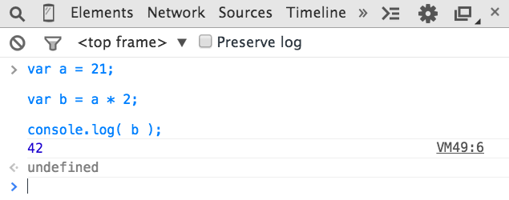
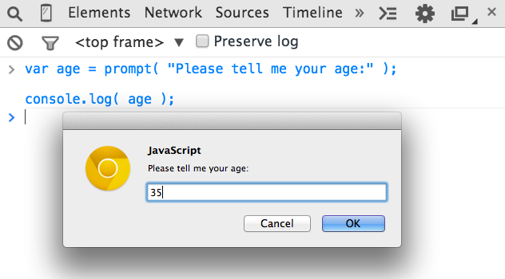
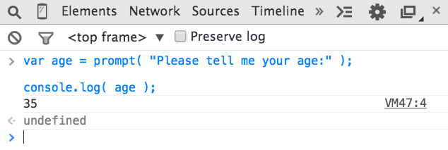

# 你不懂JS：入门与进阶
# 第一章：进入编程

欢迎来到 *你不懂JS*（*YDKJS*）系列。

*入门与进阶* 是一个对几种编程基本概念的介绍 —— 当然我们是特别倾向于JavaScript（经常略称为JS）的 —— 以及如何看待与理解本系列的其他书目。特别是如果你刚刚接触编程和/或JavaScript，这本书将简要地探索你需要什么来 *入门与进阶*。

这本书从很高的角度来解释编程的基本原则开始。它基本上假定你是在没有或很少的编程经验的情况下开始阅读 *YDKJS* 的，而且你期待这些书可以透过JavaScript的镜头帮助你开启一条理解编程的道路。

第一章应当作为一个快速的概览来阅读，它讲述为了 *进入编程* 你将想要多加学习和实践的东西。有许多其他精彩的编程介绍资源可以帮你在这个话题上走得更远，而且我鼓励你学习它们来作为这一章的补充。

一旦你对一般的编程基础感到适应了，第二章将指引你熟悉JavaScript风格的编程。第二章介绍了JavaScript是什么，但是同样的，它不是一个全面的指引 —— 那是其他 *YDKJS* 书目的任务！

如果你已经相当熟悉JavaScript，那么就首先看一下第三章作为 *YDKJS* 内容的简要一瞥，然后一头扎进去吧！

## 代码

让我们从头开始。

一个程序，经常被称为 *源代码* 或者只是 *代码*，是一组告诉计算机要执行什么任务的特殊指令。代码通常保存在文本文件中，虽然你也可以使用JavaScript在一个浏览器的开发者控制台中直接键入代码 —— 我们一会儿就会讲解。

合法的格式与指令的组合规则被称为一种 *计算机语言*，有时被称作它的 *语法*，这和英语教你如何拼写单词，和如何使用单词与标点创建合法的句子差不多是相同的。

### 语句

在一门计算机语言中，一组单词，数字，和执行一种具体任务的操作符构成了一个 *语句*。在JavaScript中，一个语句可能看起来像下面这样：

```js
a = b * 2;
```

字符`a`和`b`被称为 *变量*（参见“变量”），它们就像简单的盒子，你可以把任何东西存储在其中。在程序中，变量持有将被程序使用的值（比如数字`42`）。可以认为它们就是值本身的标志占位符。

相比之下，`2`本身只是一个值，称为一个 *字面值*，因为它没有被存入一个变量，是独立的。

字符`=`和`*`是 *操作符*（见“操作符”） —— 它们使用值和变量实施动作，比如赋值和数学乘法。

在JavaScript中大多数语句都以末尾的分号（`;`）结束。

语句`a = b * 2;`告诉计算机，大致上，去取得当前存储在变量`b`中的值，将这个值乘以`2`，然后将结果存回到另一个我们称为`a`变量里面。

程序只是许多这样的语句的集合，它们一起描述为了执行你的程序的意图所要采取的所有步骤。

### 表达式

语句是由一个或多个 *表达式* 组成的。一个表达式是一个引用，指向变量或值，或者一组用操作符组合的变量和值。

例如：

```js
a = b * 2;
```

这个语句中有四个表达式：

* `2`是一个 *字面量表达式*
* `b`是一个 *变量表达式*，它意味着取出它的当前值
* `b * 2`是一个 *算数表达式*，它意味着执行乘法
* `a = b * 2`是一个 *赋值表达式*，它意味着将表达式`b * 2`的结果赋值给变量`a`（稍后有更多关于赋值的内容）

一个独立的普通表达式也被称为一个 *表达式语句*，比如下面的：

```js
b * 2;
```

这种风格的表达式语句不是很常见也没什么用，因为一般来说它不会对程序的运行有任何影响 —— 它将取得`b`的值并乘以`2`，但是之后不会对结果做任何事情。

一种更常见的表达式语句是 *调用表达式* 语句（见“函数”），因为整个语句本身是一个函数调用表达式：

```js
alert( a );
```

### 执行一个程序

这些程序语句的集合如何告诉计算机要做什么？这个程序需要被 *执行*，也称为 *运行这个程序*。

在开发者们阅读与编写时，像`a = b * 2`这样的语句很有帮助，但是它实际上不是计算机可以直接理解的形式。所以一个计算机上的特殊工具（不是一个 *解释器* 就是一个 *编译器*）被用于将你编写的代码翻译为计算机可以理解的命令。

对于某些计算机语言，这种命令的翻译经常是在每次程序运行时从上向下，一行接一行完成的，这通常成为代码的 *解释*。

对于另一些语言，这种翻译是提前完成的，称为代码的 *编译*，所以当程序稍后 *运行* 时，实际上运行的东西已经是编译好，随时可以运行的计算机指令了。

JavaScript通常被断言为是 *解释型* 的，因为你的JavaScript源代码在它每次运行时都被处理。但这并不是完全准确的。JavaScript引擎实际上在即时地 *编译* 程序然后立即运行编译好的代码。

**注意：** 更多关于JavaScript编译的信息，参见本系列的 *作用域与闭包* 的前两章。

## 亲自尝试

这一章将用简单的代码段来介绍每一个编程概念，它们都是用JavaScript写的（当然！）。

有一件事情怎么强调都不过分：在你通读本章时 —— 而且你可能需要花时间读好几遍 —— 你应当通过自己编写代码来实践这些概念中的每一个。最简单的方法就是打开你手边的浏览器（Firefox，Chrome，IE，等等）的开发者工具控制台。

**提示：** 一般来说，你可以使用快捷键或者菜单选项来启动开发者控制台。更多关于启动和使用你最喜欢的浏览器的控制台的细节，参见“精通开发者工具控制台”（http://blog.teamtreehouse.com/mastering-developer-tools-console）。要在控制台中一次键入多行，可以使用`<shift> + <enter>` 来移动到下一行。一旦你敲击 `<enter>`，控制台将运行你刚刚键入的任何东西。

让我们熟悉一下在控制台中运行代码的过程。首先，我建议你在浏览器中打开一个新的标签页。我喜欢在地址栏中键入`about:blank`来这么做。然后，确认你的开发者控制台是打开的，就像我们刚刚提到的那样。

现在，键入如下代码看看它是怎么运行的：

```js
a = 21;

b = a * 2;

console.log( b );
```

在Chrome的控制台中键入前面的代码应该会产生如下的东西：



继续，试试吧。学习编程的最佳方式就是开始编码！

### 输出

在前一个代码段中，我们使用了`console.log(..)`。让我们简单地看看这一行代码在做什么。

你也许已经猜到了，它正是我们如何在开发者控制台中打印文本（也就是向用户 *输出*）的方法。这个语句有两个性质，我们应当解释一下。

首先，`log( b )`部分被称为一个函数调用（见“函数”）。这里发生的事情是，我们将变量`b`交给这个函数，它向变量`b`要来它的值，并在控制台中打印。

第二，`console.`部分是一个对象引用，这个对象就是找到`log(..)`函数的地方。我们会在第二章中详细讲解对象和它们的属性。

另一种创建你可以看到的输出的方式是运行`alert(..)`语句。例如：

```js
alert( b );
```

如果你运行它，你会注意到它不会打印输出到控制台，而是显示一个内容为变量`b`的“OK”弹出框。但是，一般来说与使用`alert(..)`相比，使用`console.log(..)`会使学习编码和在控制台运行你的程序更简单一些，因为你可以一次输出许多值，而不必干扰浏览器的界面。

在这本书中，我们将使用`console.log(..)`来输出。

### 输入

虽然我们在讨论输出，你也许还想知道 *输入*（例如，从用户那里获得信息）。

对于HTML网页来说，输入发生的最常见的方式是向用户显示一个他们可以键入的form元素，然后使用JS将这些值读入你程序的变量中。

但是为了单纯的学习和展示的目的 —— 也就是你在这本书中将通篇看到的 —— 有一个获取输入的更简单的方法。使用`prompt(..)`函数：

```js
age = prompt( "Please tell me your age:" );

console.log( age );
```

正如你可能已经猜到的，你传递给`prompt(..)`的消息 —— 在这个例子中，`"Please tell me your age:"` —— 被打印在弹出框中。

它应当和下面的东西很相似：



一旦你点击“OK”提交输入的文本，你将会看到你输入的值被存储在变量`age`中，然后我们使用`console.log(..)`把它 *输出*：



为了让我们在学习基本编程概念时使事情保持简单，本书中的例子不要求输入。但是现在你已经看到了如何使用`prompt(..)`，如果你想挑战一下自己，你可以试着在探索这些例子时使用输入。

## 操作符

操作符是我们如何在变量和值上实施操作的方式。我们已经见到了两种JavaScript操作符，`=`和`*`。

`*`操作符实施数学乘法。够简单的，对吧？

`=`操作符用于 *赋值* —— 我们首先计算`=` *右手边* 的值（源值）然后将它放进我们在 *左手边* 指定的变量中（目标变量）。

**警告：** 对于指定赋值，这看起来像是一种奇怪的倒置。与`a = 42`不同，一些人喜欢把顺序反转过来，于是源值在左而目标变量在右，就像`42 -> a`（这不是合法的JavaScript！）。不幸的是，`a = 42`顺序的形式，和与其相似的变种，在现代编程语言中是十分流行的。如果它让你觉得不自然，那么就花些时间在脑中演练这个顺序并习惯它。

考虑如下代码：

```js
a = 2;
b = a + 1;
```

这里，我们将值`2`赋值给变量`a`。然后，我们取得变量`a`的值（还是`2`），把它加`1`得到值`3`，然后将这个值存储到变量`b`中。

虽然在技术上说`var`不是一个操作符，但是你将在每一个程序中都需要这个关键字，因为它是你 *声明*（也就是 *创建*）变量（见“变量”）的主要方式。

你应当总是在使用变量前用名称声明它。但是对于每个 *作用域*（见“作用域”）你只需要声明变量一次；它可以根据需要使用任意多次。例如：

```js
var a = 20;

a = a + 1;
a = a * 2;

console.log( a );	// 42
```

这里是一些在JavaScript中最常见的操作符：

* 赋值：比如`a = 2`中的`=`。
* 数学：`+`（加法），`-`（减法），`*`（乘法），和`/`（除法），比如`a * 3`。
* 复合赋值：`+=`，`-=`，`*=`，和`/=`都是复合操作符，它们组合了数学操作和赋值，比如`a += 2`（与`a = a + 2`相同）。
* 递增/递减：`++`（递增），`--`（递减），比如`a++`（和`a = a + 1`很相似）。
* 对象属性访问：比如`console.log()`的`.`。

   对象是一种值，它可以在被称为属性的，被具体命名的位置上持有其他的值。`obj.a`意味着一个称为`obj`的对象值有一个名为`a`的属性。属性可以用`obj["a"]`这种替代的方式访问。参见第二章。
* 等价性：`==`（宽松等价），`===`（严格等价），`!=`（宽松不等价），`!==`（严格不等价），比如`a == b`。

   参见“值与类型”和第二章。
* 比较：`<`（小于），`>`（大于），`<=`（小于或宽松等价），`>=`（大于或宽松等价），比如`a <= b`。

   参见“值与类型”和第二章。
* 逻辑：`&&`（与），`||`（或），比如`a || b`它选择`a`*或*`b`中的一个。

   这些操作符用于表达复合的条件（见“条件”），比如如果`a`*或者*`b`成立。

**注意：** 更多细节，以及在此没有提到的其他操作符，可以参见Mozilla开发者网络（MDN）的“表达式与操作符”(https://developer.mozilla.org/en-US/docs/Web/JavaScript/Guide/Expressions_and_Operators)。

## 值与类型

如果你问一个手机店的店员一种特定手机的价格，而他们说“九十九块九毛九”（即，$99.99），他们给了你一个实际的美元数字来表示你需要花多少钱才能买到它。如果你想两部这种手机，你可以很容易地心算这个值的两倍来得到你需要花费的$199.98。

如果同一个店员拿起另一部相似的手机说它是“免费的”（也许在用手比划引号），那么他们就不是在给你一个数字，而是你的花费（$0.00）的另一种表达形式 —— “免费”这个词。

当你稍后问到这个手机是否带充电器时，回答可能仅仅是“是”或者“不”。

以同样的方式，当你在程序中表达一个值时，你根据你打算对这些值做什么来选择不同的表达形式。

在编程术语中值的这些不同的表达形式称为 *类型*。JavaScript中对这些所谓的 *基本类型* 值都有内建的类型：

* 当你需要做数学计算时，你需要一个`number`。
* 当你需要在屏幕上打印一个值时，你需要一个`string`（一个或多个字符，单词，句子）。
* 当你需要在你的程序中做决定时，你需要一个`boolean`（`true`或`false`）。

在源代码中直接包含的值称为 *字面量*。`string`字面量被双引号`"..."`或单引号（`'...'`）包围 —— 唯一的区别是风格上的偏好。`number`和`boolean`字面量用它们本身来表示（即，`42`，`true`，等等）。

考虑如下代码：

```js
"I am a string";
'I am also a string';

42;

true;
false;
```

在`string`/`number`/`boolean`值的类型以外，编程语言通常会提供 *数组*，*对象*，*函数* 等更多的类型。我们会在本章和下一章中讲解更多关于值和类型的内容。

### 类型间转换

如果你有一个`number`但需要将它打印在屏幕上，那么你就需要将这个值转换为一个`string`，在JavaScript中这种转换称为“强制转换”。类似地，如果某些人在一个电商网页的form中输入一系列数字，那么它是一个`string`，但是如果你需要使用这个值去做数学运算，那么你就需要将它 *强制转换* 为一个`number`。

为了在 *类型* 之间强制转换，JavaScript提供了几种不同的工具。例如：

```js
var a = "42";
var b = Number( a );

console.log( a );	// "42"
console.log( b );	// 42
```

使用上面展示的`Number(..)`（一个内建函数）是一种从任意其他类型到`number`类型的 *明确的* 强制转换。这应当是相当直白的。

但是一个具有争议的话题是，当你试着比较两个还不是相同类型的值时发生的事情，它需要 *隐含的* 强制转换。

当比较字符串`"99.99"`和数字`99.99`时，大多数人同意它们是等价的。但是他们不完全相同，不是吗？它们是相同的值的两种不同表现形式，两个不同的 *类型*。你可以说它们是“宽松地等价”的，不是吗？

为了在这些常见情况下帮助你，JavaScript有时会启动 *隐含的* 强制转换来把值转换为匹配的类型。

所以如果你使用`==`宽松等价操作符来进行`"99.99" == 99.99`比较，JavaScript会将左手边的`"99.99"`转换为它的`number`等价物`99.99`。所以比较就变成了`99.99 == 99.99`，这当然是成立的。

虽然隐含强制转换是为了帮助你而设计，但是它也可能把你搞糊涂，如果你没有花时间去学习控制它行为的规则。大多数开发者从没有这么做，所以常见的感觉是隐含的强制转换是令人困惑的，并且会产生意外的bug危害程序，因此应当避免使用。有时它甚至被称为这种语言中的设计缺陷。

然而，隐含强制转换是一种 *可以被学习* 的机制，而且是一种 *应当* 被所有想要认真对待JavaScript编程的人学习的机制。一旦你学习了这些规则，它不仅是消除了困惑，而且它实际上是你的程序变得更好！这种努力是值得的。

**注意：** 关于强制转换的更多信息，参见本书第二章和本系列 *类型与文法* 的第四章。

## 代码注释

手机店店员可能会写下一些笔记，记下新出的手机的特性或者他们公司推出的新套餐。这些笔记仅仅是给店员使用的 —— 他们不是给顾客读的。不管怎样，通过记录下为什么和如何告诉顾客他应当说的东西，这些笔记帮助店员更好的工作。

关于编写代码你要学的最重要的课程之一，就是它不仅仅是写给计算机的。代码的每一个字节都和写给编译器一样，也是写给开发者的。

你的计算机只关心机器码，一系列源自 *编译* 的0和1。你几乎可以写出无限多种可以产生相同0和1序列的代码。所以你对如何编写程序作出的决定很重要 —— 不仅是对你，也对你的团队中的其他成员，甚至是你未来的自己。

你不仅应当努力去编写可以正确工作的程序，而且应当努力编写检视起来有道理的程序。你可以通过给变量（见“变量”）和函数（见“函数”）起一个好名字在这条路上走很远。

但另外一个重要的部分是代码注释。它们纯粹是为了向人类解释一些事情而在你的程序中插入的一点儿文本。解释器/编译器将总是忽略这些注释。

关于什么是良好注释的代码有许多意见；我们不能真正地定义绝对统一的规则。但是一些意见和指导是十分有用的：

* 没有注释的代码是次优的。
* 过多的注释（比如，每行都有注释）可能是代码编写的很烂的标志。
* 注释应当解释 *为什么*，而不是 *是什么*。它们可以选择性地解释 *如何做*，如果代码特别令人困惑的话。

在JavaScript中，有两种可能的注释类型：单行注释和多行注释

考虑如下代码：

```js
// 这是一个单行注释

/* 而这是
       一个多行
             注释。
                      */
```

如果你想在一个语句的正上方，或者甚至是在行的末尾加一个注释，`//`单行注释是很合适的。这一行上`//`之后的所有东西都将被视为注释（因此被编译器忽略），一直到行的末尾。在单行注释内部可以出现的内容没有限制。

考虑：

```js
var a = 42;		// 生命的意义是 42
```

如果你想在注释中用好几行来解释一些事情，`/* .. */`多行注释就很合适。

这是多行注释的一个常见用法：

```js
/* 使用下面的值是因为
   它回答了
   全宇宙中所有的问题。 */
var a = 42;
```

它还可以出现在一行中的任意位置，甚至是一行的中间，因为`*/`终结了它。例如：

```js
var a = /* 随机值 */ 42;

console.log( a );	// 42
```

在多行注释中唯一不能出现的就是`*/`，因为这将干扰注释的结尾。

你绝对会希望通过养成注释代码的习惯来开始学习编程。在本书剩余的部分中，你将看到我使用注释来解释事情，请也在你自己的实践中这么做。相信我，所有阅读你的代码的人都会感谢你！

## 变量

大多数有用的程序都需要在程序运行整个过程中，追踪由于你的程序所意图的任务被调用的底层不同的操作而发生的值的变化。

要这样做的最简单的方法是将一个值赋予一个符号容器，称为一个 *变量* —— 因为在这个容器中的值可以根据需要不时 *变化* 而得名。

在某些编程语言中，你可以声明一个变量（容器）来持有特定类型的值，比如`number`或`string`。因为防止了意外的类型转换，*静态类型*，也被称为 *类型强制*，通常被认为是对程序正确性有好处的。

另一些语言在值上强调类型而非在变量上。*弱类型*，也被称为 *动态类型*，允许变量在任意时刻持有任意类型的值。因为它允许一个变量在程序逻辑流程中代表一个值，而不论这个值在任意给定的时刻是什么类型，所以它被认为是对程序灵活性有好处的。

JavaScript使用的是后者，*动态类型*，这意味着变量可以持有任意 *类型* 的值而没有任何 *类型* 强制约束。

正如我们刚才提到的，我们使用`var`语句来声明一个变量 —— 注意在这种声明中没有其他的 *类型* 信息。考虑这段简单的代码：

```js
var amount = 99.99;

amount = amount * 2;

console.log( amount );		// 199.98

// 将 `amount` 转换为一个字符串，
// 并在开头加一个 "$"
amount = "$" + String( amount );

console.log( amount );		// "$199.98"
```

变量`amount`开始时持有数字`99.99`，然后持有`amount * 2`的`number`结果，也就是`199.98`。

第一个`console.log(..)`命令不得不 *隐含地* 将这个`number`值强制转换为一个`string`才能够打印出来。

然后语句`amount = "$" + String(amount)` *明确地* 将值`199.98`强制转换为一个`string`并且在开头加入一个`"$"`字符。这时，`amount`现在就持有这个`string`值`$199.98`，所以第二个`console.log(..)`语句无需强制转换就可以把它打印出来。

JavaScript开发者将会注意到为值`99.99`，`199.98`，和`"$199.98"`都使用变量`amount`的灵活性。静态类型的拥护者们将偏好于使用一个分离的变量，比如`amountStr`来持有这个值最后的`"$199.98"`表达形式，因为它是一个不同的类型。

不管哪种方式，你将会注意到`amount`持有一个在程序运行过程中不断变化的值，这展示了变量的主要目地：管理程序 *状态*。

换句话说，在你程序运行的过程中 *状态* 追踪着值的改变。

变量的另一种常见用法是将值的设定集中化。当你为一个在程序中通篇不打算改变的值声明了一个变量时，它更一般地被称为 *常量*。

你经常会在程序的顶部声明这些 *常量*，这样提供了一种方便：如果你需要改变一个值时你可以到唯一的地方去寻找。根据惯例，用做常量的JavaScript变量通常是大写的，在多个单词之间使用下划线`_`连接。

这里是一个呆萌的例子：

```js
var TAX_RATE = 0.08;	// 8% sales tax

var amount = 99.99;

amount = amount * 2;

amount = amount + (amount * TAX_RATE);

console.log( amount );				// 215.9784
console.log( amount.toFixed( 2 ) );	// "215.98"
```

**注意：** `console.log(..)`是一个函数`log(..)`作为一个在值`console`上的对象属性被访问，与此类似，这里的`toFixed(..)`是一个可以在值`number`上被访问的函数。JavaScript `number`不会被自动地格式化为美元 —— 引擎不知道你的意图，而且也没有通货类型。`toFixed(..)`让我们指明四舍五入到小数点后多少位，而且它如我们需要的那样产生一个`string`。

变量`TAX_RATE`只是因为惯例才是一个 *常量* —— 在这个程序中没有什么特殊的东西可以防止它被改变。但是如果这座城市将它的消费税增至9%，我们仍然可以很容地通过在一个地方将`TAX_RATE`被赋予的值改为`0.09`来更新我们的程序，而不是在程序通篇中寻找许多值`0.08`出现的地方然后更新它们全部。

在写作本书时，最新版本的JavaScript（通常称为“ES6”）引入了一个声明常量的新方法，用`const`代替`var`:

```js
// 在ES6中：
const TAX_RATE = 0.08;

var amount = 99.99;

// ..
```

常量就像带有不变的值的变量一样有用，常量还防止在初始设置之后的某些地方意外地改变它的值。如果你试着在第一个声明之后给`TAX_RATE`赋予一个不同的值，你的程序将会拒绝这个改变（而且在Strict模式下，会产生一个错误 —— 见第二章的“Strict模式”）。

顺带一提，这种防止编程错误的“保护”与静态类型的类型强制很类似，所以你可以看到为什么在其他语言中的静态类型很吸引人。

**注意：** 更多关于如何在你程序的变量中使用不同的值，参见本系列的 *类型与文法*。

## 块儿

在你买你的新手机时，手机店店员必须走过一系列步骤才能完成结算。

相似地，在代码中我们经常需要将一系列语句一起分为一组，这就是我们常说的 *块儿*。在JavaScript中，一个块儿被定义为包围在一个大括号`{ .. }`中的一个或多个语句。考虑如下代码：

```js
var amount = 99.99;

// 一个普通的块儿
{
	amount = amount * 2;
	console.log( amount );	// 199.98
}
```

这种独立的`{ .. }`块儿是合法的，但是在JS程序中并不常见。一般来说，块儿是添附在一些其他的控制语句后面的，比如一个`if`语句（见“条件”）或者一个循环（见“循环”）。例如：

```js
var amount = 99.99;

// 数值够大吗？
if (amount > 10) {			// <-- 添附在`if`上的块儿
	amount = amount * 2;
	console.log( amount );	// 199.98
}
```

我们将在下一节讲解`if`语句，但是如你所见，`{ .. }`块儿带着它的两个语句被添附在`if (amount > 10)`后面；块儿中的语句将会仅在条件成立时被处理。

**注意：** 与其他大多数语句不同（比如`console.log(amount);`），一个块儿语句不需要分号（`;`）来终结它。

## 条件

“你想来一个额外的屏幕贴膜吗？只要$9.99。” 热心的手机店店员请你做个决定。而你也许需要首先咨询一下钱包或银行帐号的 *状态* 才能回答这个问题。但很明显，这只是一个简单的“是与否”的问题。

在我们的程序中有好几种方式可以表达 *条件*（也就是决定）。

最常见的一个就是`if`语句。实质上，你在说，“*如果* 这个条件成立，做后面的……”。例如：

```js
var bank_balance = 302.13;
var amount = 99.99;

if (amount < bank_balance) {
	console.log( "I want to buy this phone!" );
}
```

`if`语句在括号`( )`之间需要一个表达式，它不是被视作`true`就是被视作`false`。在这个程序中，我们提供了表达式`amount < bank_balance`，它确实会根据变量`bank_balance`中的值被求值为`true`或`false`。

如果条件不成立，你甚至可以提供一个另外的选择，称为`else`子句。考虑下面的代码：

```js
const ACCESSORY_PRICE = 9.99;

var bank_balance = 302.13;
var amount = 99.99;

amount = amount * 2;

// 我们买得起配件吗？
if ( amount < bank_balance ) {
	console.log( "I'll take the accessory!" );
	amount = amount + ACCESSORY_PRICE;
}
// 否则：
else {
	console.log( "No, thanks." );
}
```

在这里，如果`amount < bank_balance`是`true`，我们将打印出`"I'll take the accessory!"`并在我们的变量`amount`上加`9.99`。否则，`else`子句说我们将礼貌地回应`"No, thanks."`，并保持`amount`不变。

正如我们在早先的“值与类型”中讨论的，一个还不是所期望类型的值经常会被强制转换为那种类型。`if`语句期待一个`boolean`，但如果你传给它某些还不是`boolean`的东西，强制转换就会发生。

JavaScript定义了一组特定的被认为是“falsy”的值，因为在强制转换为`boolean`时，它们将变为`false` —— 这些值包括`0`和`""`。任何不再这个`falsy`列表中的值都自动是“truthy” —— 当强制转换为`boolean`时它们变为`true`。truthy值包括`99.99`和`"free"`这样的东西。更多信息参见第二章的“Truthy与Falsy”。

除了`if` *条件* 还以其他形式存在。例如，`switch`语句可以被用作一系列`if..else`语句的缩写（见第二章）。循环（见“循环”）使用一个 *条件* 来决定循环是否应当继续或停止。

**注意：** 关于在 *条件* 的测试表达式中可能发生的隐含强制转换的更深层的信息，参见本系列的 *类型与文法* 的第四章。

## 循环

在繁忙的时候，有一张排队单，上面记载着需要和手机店店员谈话的顾客。虽然排队单上还有许多人，但是她只需要持续服务下一位顾客就好了。

重复一组动作直到特定的条件失败 —— 换句话说，仅在条件成立时重复 —— 就是程序循环的工作；循环可以有不同的形式，但是它们都符合这种基本行为。

一个循环包含测试条件和一个块儿（通常是`{ .. }`）。每次循环块儿执行，都称为一次 *迭代*。

例如，`while`循环和`do..while`循环形式就说明了这种概念 —— 重复一块儿语句直到一个条件不再求值得`true`：

```js
while (numOfCustomers > 0) {
	console.log( "How may I help you?" );

	// 服务顾客……

	numOfCustomers = numOfCustomers - 1;
}

// 与

do {
	console.log( "How may I help you?" );

	// 服务顾客……

	numOfCustomers = numOfCustomers - 1;
} while (numOfCustomers > 0);
```

这些循环之间唯一的实际区别是，条件是在第一次迭代之前（`while`）还是之后（`do..while`）被测试。

在这两种形式中，如果条件测试得`false`，那么下一次迭代就不会运行。这意味着如果条件初始时就是`false`，那么`while`循环就永远不会运行，但是一个`do..while`循环将仅运行一次。

有时你会为了计数一组特定的数字来进行循环，比如从`0`到`9`（十个数）。你可以通过设定一个值为`0`的循环迭代变量，比如`i`，并在每次迭代时将它递增`1`。

**警告：** 由于种种历史原因，编程语言几乎总是用从零开始的方式来计数的，这意味着计数开始于`0`而不是`1`。如果你不熟悉这种思维模式，一开始它可能十分令人困惑。为了更适应它，花些时间练习从`0`开始数数吧！

条件在每次迭代时都会被测试，好像在循环内部有一个隐含的`if`语句一样。

你可以使用JavaScript的`break`语句来停止一个循环。另外，我们可以看到如果没有`break`机制，就会极其容易地创造一个永远运行的循环。

让我们展示一下：

```js
var i = 0;

// 一个 `while..true` 循环将会永远运行，对吧？
while (true) {
	// 停止循环？
	if ((i <= 9) === false) {
		break;
	}

	console.log( i );
	i = i + 1;
}
// 0 1 2 3 4 5 6 7 8 9
```

**警告：** 这未必是你想在你的循环中使用的实际形式。它是仅为了说明的目的才出现在这里的。

虽然一个`while`（或`do..while`）可以手动完成任务，但是为了同样的目的，还有一种称为`for`循环的语法形式：

```js
for (var i = 0; i <= 9; i = i + 1) {
	console.log( i );
}
// 0 1 2 3 4 5 6 7 8 9
```

如你所见，对于这两种循环形式来说，前10次迭代（`i`的值从`0`到`9`）的条件`i <= 9`都是`true`，而且一旦`i`值为`10`就变为`false`。

`for`循环有三个子句：初始化子句（`var i=0`），条件测试子句（`i <= 9`），和更新子句（`i = i + 1`）。所以如果你想要使用循环迭代来计数，`for`是一个更紧凑而且更易理解和编写的形式。

还有一些意在迭代特定的值的特殊循环形式，比如迭代一个对象的属性（见第二章），它隐含的测试条件是所有的属性是否都被处理过了。无论循环是何种形式，“循环直到条件失败”的概念是它们共有的。

## 函数

手机店的店员可能不会拿着一个计算器到处走，用它来搞清税费和最终的购物款。这是一个她需要定义一次然后一遍又一遍地重用的任务。很有可能的是，公司有一个带有内建这些“功能”的收银机（电脑，平板电脑，等等）。

相似地，几乎可以肯定你的程序想要将代码的任务分割成可以重用的片段，而不是频繁地多次重复自己。这么做的方法是定义一个`function`。

一个函数一般来说是一段被命名的代码，它可以使用名称来被“调用”，而每次调用它内部的代码就会运行。考虑如下代码：

```js
function printAmount() {
	console.log( amount.toFixed( 2 ) );
}

var amount = 99.99;

printAmount(); // "99.99"

amount = amount * 2;

printAmount(); // "199.98"
```

函数可以选择性地接收参数值（也就是参数）—— 你传入的值。而且它们还可以选择性地返回一个值。

```js
function printAmount(amt) {
	console.log( amt.toFixed( 2 ) );
}

function formatAmount() {
	return "$" + amount.toFixed( 2 );
}

var amount = 99.99;

printAmount( amount * 2 );		// "199.98"

amount = formatAmount();
console.log( amount );			// "$99.99"
```

函数`printAmount(..)`接收一个参数，我们称之为`amt`。函数`formatAmount()`返回一个值。当然，你也可以在同一个函数中组合这两种技术。

函数经常被用于你打算多次调用的代码，但它们对于仅将有关联的代码组织在一个命名的集合中也很有用，即便你只打算调用它们一次。

考虑如下代码：

```js
const TAX_RATE = 0.08;

function calculateFinalPurchaseAmount(amt) {
	// 计算带有税费的新费用
	amt = amt + (amt * TAX_RATE);

	// 返回新费用
	return amt;
}

var amount = 99.99;

amount = calculateFinalPurchaseAmount( amount );

console.log( amount.toFixed( 2 ) );		// "107.99"
```

虽然`calculateFinalPurchaseAmount(..)`只被调用了一次，但是将它的行为组织进一个分离的带名称的函数，让使用它逻辑的代码（`amount = calculateFinal...`语句）更干净。如果函数中拥有更多的语句，这种好处将会更加明显。

### 作用域

如果你向手机店的店员询问一款她们店里没有的手机，那么她就不能卖给你你想要的。她只能访问她们店库房里的手机。你不得不到另外一家店里去看看能不能找到你想要的手机。

编程对这种概念有一个术语：*作用域*（技术上讲称为 *词法作用域*）。在JavaScript中，每个函数都有自己的作用域。作用域基本上就是变量的集合，也是如何使用名称访问这些变量的规则。只有在这个函数内部的代码才能访问这个函数 *作用域内* 的变量。

在同一个作用域内变量名必须是唯一的 —— 不能有两个不同的变量`a`并排出现。但是相同的变量名`a`可以出现在不同的作用域中。

```js
function one() {
	// 这个 `a` 仅属于函数 `one()`
	var a = 1;
	console.log( a );
}

function two() {
	// 这个 `a` 仅属于函数 `two()`
	var a = 2;
	console.log( a );
}

one();		// 1
two();		// 2
```

另外，一个作用域可以嵌套在另一个作用域中，就像生日Party上的小丑在一个气球的里面吹另一个气球一样。如果一个作用域嵌套在另一个中，那么在内部作用域中的代码就可以访问这两个作用域中的变量。

考虑如下代码：

```js
function outer() {
	var a = 1;

	function inner() {
		var b = 2;

		// 我们可以在这里同时访问 `a` 和 `b`
		console.log( a + b );	// 3
	}

	inner();

	// 我们在这里只能访问 `a`
	console.log( a );			// 1
}

outer();
```

词法作用域规则说，在一个作用域中的代码既可以访问这个作用域中的变量，又可以访问任何在它外面的作用域的变量。

所以，在函数`inner()`内部的代码可以同时访问变量`a`和`b`，但是仅在`outer()`中的代码只能访问`a` —— 它不能访问`b`因为这个变量仅存在于`inner()`内部。

回忆一下先前的这个代码段：

```js
const TAX_RATE = 0.08;

function calculateFinalPurchaseAmount(amt) {
	// 计算带有税费的新费用
	amt = amt + (amt * TAX_RATE);

	// 返回新费用
	return amt;
}
```

因为词法作用域，常数`TAX_RATE`（变量）可以从`calculateFinalPurchaseAmount(..)`函数中访问，即便它没有被传入这个函数。

**注意：** 关于词法作用域的更多信息，参见本系列的 *作用域与闭包* 的前三章。

## 练习

在编程的学习中绝对没有什么可以替代练习。我写的再好也不可能使你成为一个程序员。

带着这样的意识，让我们试着练习一下我们在本章学到的一些概念。我将给出“需求”，而你首先试着实现它。然后参考下面的代码清单来看看我是怎么处理它的。
* 写一个程序来计算你购买手机的总价。你将不停地购买手机直到你的银行账户上的钱都用光（提示：循环！）。你还将为每个手机购买配件，只要你的花费低于你心理预算。
* 在你计算完购买总价之后，加入税费，然后用合适的格式打印出计算好的购买总价。
* 最后，将总价与你银行账户上的余额作比较，来看看那你是否买的起。
* 你应当为“税率”，“手机价格”，“配件价格”和“花费预算”设置一些常数，也为你的“银行账户余额”设置一个变量。
* 你应当为税费的计算和价格的格式化 —— 使用一个“$”并四舍五入到小数点后两位 —— 定义函数。
* **加分挑战：** 试着在这个程序中利用输入，也许是使用在前面的“输入”中讲过的`prompt(..)`。比如，你可能会提示用户输入它们的银行账户余额。发挥创造力好好玩儿吧！

好的，去吧。试试看。在你自己实践过之前不要偷看我的代码清单！

**注意：** 因为这是一本JavaScript书，很明显我将使用JavaScript解决这个联系。但是目前你可使用其他的语言，如果你感觉更适应的话。

对于这个练习，这是我的JavaScript解决方案：

```js
const SPENDING_THRESHOLD = 200;
const TAX_RATE = 0.08;
const PHONE_PRICE = 99.99;
const ACCESSORY_PRICE = 9.99;

var bank_balance = 303.91;
var amount = 0;

function calculateTax(amount) {
	return amount * TAX_RATE;
}

function formatAmount(amount) {
	return "$" + amount.toFixed( 2 );
}

// 只要你还有钱就不停地买手机
while (amount < bank_balance) {
	// 买个新手机
	amount = amount + PHONE_PRICE;

	// 还买得起配件吗？
	if (amount < SPENDING_THRESHOLD) {
		amount = amount + ACCESSORY_PRICE;
	}
}

// 也别忘了给政府交钱
amount = amount + calculateTax( amount );

console.log(
	"Your purchase: " + formatAmount( amount )
);
// Your purchase: $334.76

// 你买的起吗？
if (amount > bank_balance) {
	console.log(
		"You can't afford this purchase. :("
	);
}
// 你买不起 :(
```

**注意：** 运行这个JavaScript程序的最简单的方法是将它键入到你手边的浏览器的开发者控制台中。

你做的怎么样？看了我的代码之后，现在再试一次也没什么不好。而且你可以改变某些常数来看看使用不同的值时这个程序运行的如何。

## 复习

学习编程不一定是个复杂而且巨大的过程。你只需要在脑中装进几个基本的概念。

它们就像构建块儿。要建一座高塔，你就要从堆砌构建块儿开始。编程也一样。这里是一些编程中必不可少的构建块儿：

* 你需要 *操作符* 来在值上实施动作。
* 你需要值和 *类型* 来试试不同种类的动作，比如在`number`上做数学，或者使用`string`输出。
* 你需要 *变量* 在你程序执行的过程中存储数据（也就是 *状态*）。
* 你需要 *条件*，比如`if`语句来做决定。
* 你需要 *循环* 来重复任务，直到一个条件不再成立。
* 你需要 *函数* 来将你的代码组织为有逻辑的和可复用的块儿。

代码注释是一种编写更好可读性代码的有效方法，它使你的代码更易理解，维护，而且如果稍后出现问题的话更易修改。

最后，不要忽视练习的力量。学习写代码的最好方法就是写代码。

现在，我很高兴看到你在学习编码的道路上走得很好！保持下去。不要忘了看看其他编程初学者的资源（书，博客，在线教学，等等）。这一章和这本书是一个很好的开始，但它们只是一个简要的介绍。

下一章将会复习许多本章中的概念，但是是从更加专门于JavaScript的视角，这将突出将在本系列的剩余部分将要深度剖析的大多数主要话题。
